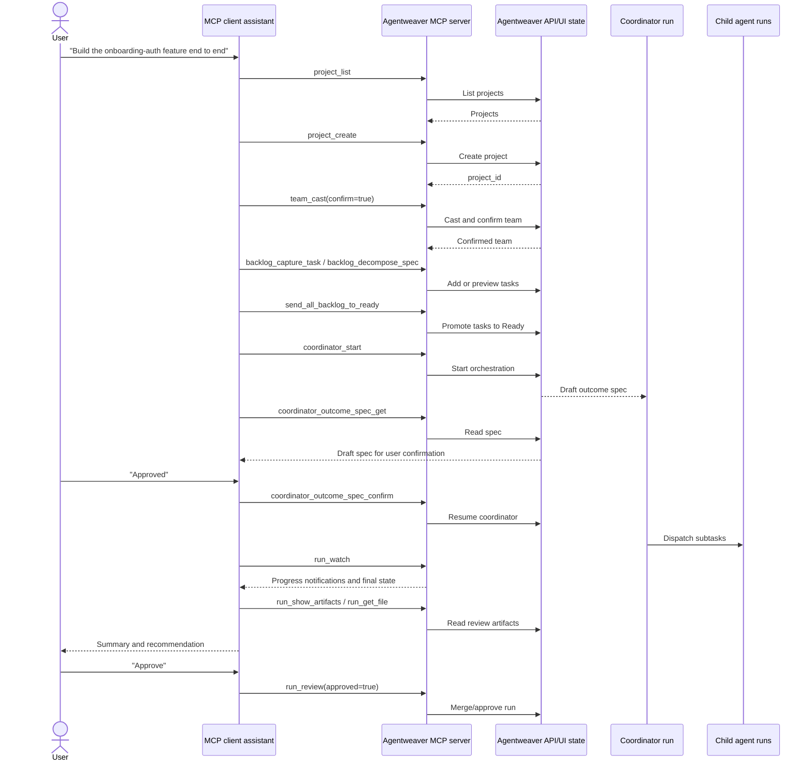

# End-to-end MCP client experience

Agentweaver's MCP server turns the whole product into tools an AI assistant can call for you. Instead of driving only the web UI, you can connect Claude Desktop, GitHub Copilot, or any MCP-capable assistant and ask it to create projects, cast teams, manage backlog, start coordinator work, watch runs, review artifacts, and approve outcomes. This doc explains the experience first, then gives a complete tool catalog for assistant-driven use.

Related context: [Overview](./00-overview.md), [Onboarding & auth](./onboarding-auth.md), [Projects](../guide/projects.md), [Teams](../guide/teams.md), [Board](../guide/board.md), [Runs](../guide/runs.md), [Review](../guide/review.md), [Workflows](../guide/workflows.md), [Coordinator reference](../reference/coordinator.md), [MCP reference](../reference/mcp.md), and [MCP OAuth](../mcp-oauth.md).

## Who this is for

This is for a user who wants an MCP client to operate Agentweaver on their behalf. The assistant becomes a product operator: it can discover the user's projects, inspect the workspace, configure a team, capture and promote work, ask the coordinator to plan a goal, observe execution, and bring the result back for human review.

The MCP server is the control surface. It does not replace the UI; it mirrors the same project, board, run, workflow, memory, and review state that the UI shows. A good MCP session feels like pair-operating Agentweaver with an assistant that can both talk and act.

## Connecting an MCP client

Agentweaver exposes the MCP server in two modes:

- **STDIO transport** for local MCP clients that launch the server as a command. The command starts the `Agentweaver.Mcp` app with `--stdio`; the server forwards tool calls to the Agentweaver API configured by `AGENTWEAVER_API_URL`.
- **HTTP MCP transport** at `/mcp` for hosted or shared clients. The HTTP transport runs statelessly so the caller's inbound bearer token is available during each tool invocation and can be forwarded to the backend API.

A client configuration is conceptually one of these shapes:

| Client mode | What the client points at | Auth shape |
|---|---|---|
| Local STDIO | A command such as `dotnet run --project apps/Agentweaver.Mcp -- --stdio` | Environment includes `AGENTWEAVER_API_URL`; when no per-request token exists, `AGENTWEAVER_API_KEY` is the backend bearer token. |
| Hosted HTTP | The MCP server URL ending in `/mcp` | Each request sends `Authorization: Bearer <token>`. The server validates it, stores the resolved caller identity, and forwards the same bearer token to the Agentweaver API. |

The HTTP server also exposes:

- `GET /healthz` for unauthenticated liveness checks.
- `GET /.well-known/oauth-protected-resource` and `GET /.well-known/oauth-protected-resource/mcp` so interactive MCP clients can discover the authorization server, resource value, supported bearer method, and `mcp:invoke` scope.

For the complete interactive setup flow, see [Onboarding & auth](./onboarding-auth.md).

### Authentication experience

The user sees a normal bearer-token experience, with three accepted token paths:

1. **Automation keys.** CI, local scripts, and controlled automation can use an Agentweaver API key. The MCP server checks it through the API-key registry first because it is the fastest path and does not require external validation.
2. **Agentweaver JWTs.** Interactive clients can discover the OAuth resource metadata, run the OAuth authorization-code flow with PKCE through Agentweaver, and receive a short-lived Agentweaver access token. The MCP server validates this JWT offline against the authorization server JWKS, requiring the expected issuer, audience (`<issuer>/mcp` unless configured otherwise), expiry, and RS256 signature.
3. **Transitional raw GitHub tokens.** When enabled, the MCP server can validate a raw GitHub bearer token by calling GitHub's user API and caching the result briefly. This keeps older client setups working while interactive clients move to Agentweaver-minted tokens.

If a hosted MCP request has no bearer token, the server returns `401` with a `WWW-Authenticate` challenge that advertises the OAuth protected-resource metadata URL. If a token is present but invalid, the challenge includes `invalid_token`. Health and OAuth metadata discovery stay reachable without a bearer token.

## What an MCP-driven session feels like

The user starts with an intent, not a form:

> "Set up this repository in Agentweaver, create a team for the onboarding-auth feature, break the work into backlog tasks, run the coordinator, and bring me the review."

The assistant turns that into a sequence of concrete tool calls and narrates the results in natural language.

1. **Find or create the project.** It calls `project_list` to see whether the repository is already registered. If not, it calls `project_create` with the local working directory, optionally applying a blueprint. The returned project ID becomes the anchor for the rest of the session.
2. **Shape the team.** It calls `catalog_list_roles` or `catalog_list_scenarios` when it needs role context, then `team_cast` with the goal. If the user wants to inspect the proposed cast, the assistant leaves `confirm=false`; if the instruction is clear, it can use `confirm=true` to create and confirm in one step. It can then call `team_get` and `team_member_get_charter` to explain who will do what.
3. **Capture work.** It calls `backlog_capture_task` for individual tasks, or `backlog_decompose_spec` to preview tasks from a workspace markdown spec. When the list looks right, it calls `send_all_backlog_to_ready` or `backlog_move_to_ready` so the board reflects what is ready to be claimed.
4. **Start the coordinator.** It calls `coordinator_start` with a plain-language goal. This starts a coordinator run, but the coordinator does not dispatch child work immediately. It drafts an outcome spec and stops at a confirmation gate.
5. **Confirm or revise the outcome.** The assistant calls `run_watch` or `coordinator_outcome_spec_get` to surface the draft. If the user asks for changes, it calls `coordinator_outcome_spec_revise`; when the user accepts, it calls `coordinator_outcome_spec_confirm`. Only then does the coordinator resume and dispatch subagents.
6. **Watch execution.** It calls `run_watch` on the coordinator run. Progress notifications stream agent messages, tool calls, tool results, run status changes, review requests, coordinator topology, subtask events, and steering events. For point-in-time views, it can call `coordinator_work_plan_get`, `coordinator_children_get`, or `orchestration_topology`.
7. **Review the result.** When the run reaches review, the assistant calls `run_show_artifacts` and `run_get_file` for changed files, summarizes the diff, and asks for an approve/decline decision. It calls `run_review` only when the user approves or explicitly asks it to reject.
8. **Persist context.** If useful, it calls `decision_inbox_submit`, `decision_inbox_merge`, `memory_record`, or `session_update` so future agents inherit what was learned.

The user sees the same objects the UI sees: a project appears in the project list, backlog cards move across board columns, coordinator child runs show up under the orchestration, and completed runs await review until approved or rejected.

### Assistant operating pattern

An effective MCP client does not call tools randomly. It keeps a small mental model of Agentweaver state and moves through it deliberately:

| Moment | Assistant behavior | Useful tools |
|---|---|---|
| Orientation | Establish the project, repository path, team, board, and recent runs before changing anything. | `project_list`, `project_get`, `team_get`, `backlog_get_board`, `project_list_runs` |
| Design | Ask Agentweaver to propose structure, then explain the proposal in user language. | `team_cast`, `blueprint_generate`, `workflow_generate`, `backlog_decompose_spec` |
| Commitment | Make the smallest durable state change that matches the user's intent. | `project_create`, `team_cast`, `workflow_save`, `backlog_capture_task`, `send_all_backlog_to_ready` |
| Orchestration | Start a coordinator run, wait for the outcome spec, and stop for confirmation. | `coordinator_start`, `run_watch`, `coordinator_outcome_spec_get`, `coordinator_outcome_spec_confirm` |
| Supervision | Watch long work, inspect topology, and steer only when the user or state calls for it. | `run_watch`, `orchestration_topology`, `coordinator_children_get`, `coordinator_steer` |
| Review | Show changed files and summarize impact before approval. | `run_show_artifacts`, `run_get_file`, `run_review` |
| Memory | Save decisions and learnings that should survive the session. | `decision_inbox_submit`, `decision_inbox_merge`, `memory_record`, `session_update` |

The best user experience is conversational but auditable: the assistant says what it is about to do, calls the relevant tool, summarizes the returned state, and links the next action to a visible Agentweaver concept such as a project, board card, coordinator gate, child run, or review.

## Safety, idempotency, and confirmations

- **Coordinator runs are confirmation-gated.** `coordinator_start` drafts an outcome spec and suspends. Subagent work waits for `coordinator_outcome_spec_confirm`; `coordinator_outcome_spec_revise` loops the draft back through the gate.
- **Review is explicit.** `run_review` approves or rejects a run that is awaiting review. The assistant should summarize artifacts before invoking it.
- **Streaming is long-running.** `run_watch` stays open while it consumes the API run stream, reports MCP progress notifications, reconnects at the API SSE layer, and returns the final run state when complete.
- **Backlog bulk promotion is safe to repeat.** `send_all_backlog_to_ready` is idempotent: it appends backlog tasks after existing Ready tasks, preserves order, and returns "No backlog tasks to promote" on an empty backlog.
- **Claimed work is protected.** `backlog_delete_task` fails with `409` if the task has already been claimed. `backlog_archive_task` is the board-safe way to move a task out of active projections, including linked coordinator cards for claimed tasks.
- **Heartbeat pickup has bounded settings.** `backlog_set_settings` requires `max_ready_per_heartbeat` between 1 and 20. Autopilot can answer child clarifying questions during unattended coordinator runs, and auto-approval only applies to allow-with-approval tools; it does not bypass the destructive-action safety floor.
- **Generation tools preview before persistence.** `blueprint_generate` returns a generated blueprint for inspection. `workflow_generate` returns YAML draft only; `workflow_save` validates and persists it. `backlog_decompose_spec` defaults to preview and creates tasks only with `confirm=true`.
- **Errors surface as tool errors.** API failures become MCP tool errors with the HTTP status and a human-readable message. Common user-actionable errors include `400` validation failures, `401` invalid bearer token, `404` missing project/run/file, and `409` state conflicts such as no pending coordinator gate or a claimed backlog task.

Scope limit: the MCP server exposes Agentweaver operations as tools; file edits and code changes happen inside Agentweaver runs or through the client itself, not by the MCP server silently editing arbitrary files.

## Tool catalog

The catalog below is grouped by the 13 MCP tool domains. Each tool name is the real MCP tool name exposed by the server.

### Projects

Purpose: create, find, configure, relink, delete, and inspect Agentweaver projects and their run lists.

| Tool | What it does for the user |
|---|---|
| `project_list` | Lists all Agentweaver projects the caller can see. |
| `project_get` | Gets one project by ID. |
| `project_create` | Creates a project from a local working directory; can apply either a predefined `blueprint_id` or an inline `blueprint`, and can carry generated workflow YAML. |
| `project_rename` | Renames an existing project. |
| `project_relink` | Points a project at a new local working directory path after a repository moves. |
| `project_delete` | Deletes a project by ID with confirmation handled by the API call. |
| `project_configure` | Updates the project's default model provider and provider-specific model IDs. |
| `project_list_runs` | Lists all runs for a project. |

### Team

Purpose: build and manage the project roster that runs work.

| Tool | What it does for the user |
|---|---|
| `team_get` | Shows the current team composition for a project. |
| `team_cast` | Creates a team-casting proposal, confirms an existing proposal, or creates and confirms in one step; supports free-text, scenario, analysis, and manual casting modes. |
| `team_member_add` | Adds one member with a catalog role and optional model override. |
| `team_member_retire` | Retires a member from the project team. |
| `team_member_get_charter` | Gets a member's charter document so the assistant can explain their responsibilities. |

### Catalog

Purpose: discover the available building blocks for team casting.

| Tool | What it does for the user |
|---|---|
| `catalog_list_roles` | Lists available agent roles from the catalog. |
| `catalog_list_scenarios` | Lists casting scenario templates. |

### Blueprints

Purpose: inspect, generate, and validate reusable project blueprints before project creation.

| Tool | What it does for the user |
|---|---|
| `list_blueprints` | Lists predefined blueprints, including team roster, workflow, review policy, and sandbox profile. |
| `validate_blueprint` | Validates a blueprint object against schema and role constraints, returning `valid:true` or validation errors. |
| `blueprint_generate` | Generates a blueprint from a natural-language team and goal description for inspection before project creation. |

### Backlog

Purpose: manage the project's Kanban-style work intake and pickup settings.

| Tool | What it does for the user |
|---|---|
| `backlog_capture_task` | Captures a new task into the project backlog. |
| `backlog_edit_task` | Edits a task title and/or description. |
| `backlog_delete_task` | Deletes a backlog task; fails with `409` if it has already been claimed. |
| `backlog_move_to_ready` | Moves a task from Backlog to Ready, optionally at a zero-based Ready position. |
| `backlog_move_to_backlog` | Moves a task from Ready back to Backlog, optionally at a zero-based Backlog position. |
| `backlog_reorder_task` | Reorders a task within its current Backlog or Ready bucket. |
| `backlog_get_board` | Gets the full board: Backlog, Ready, Problems, Human Review, Active, and Done. |
| `backlog_archive_task` | Archives a task off the active board; claimed tasks also archive their linked coordinator run card. |
| `backlog_get_workflow_stages` | Gets the ordered canonical run-bucket definitions for Problems, Human Review, Active, and Done. |
| `backlog_get_settings` | Reads backlog pickup settings: `max_ready_per_heartbeat`, `pickup_autopilot`, and `pickup_auto_approve_tools`. |
| `send_all_backlog_to_ready` | Atomically promotes all Backlog tasks to Ready, preserving order and safely doing nothing when Backlog is empty. |
| `backlog_set_settings` | Sets pickup settings; `max_ready_per_heartbeat` must be 1-20. |
| `backlog_decompose_spec` | Reads a workspace markdown spec, uses AI to propose backlog items, previews by default, creates with `confirm=true`, and caps results at 50 items. |

### Coordinator

Purpose: run multi-agent orchestration with an explicit outcome-spec confirmation gate.

| Tool | What it does for the user |
|---|---|
| `coordinator_start` | Starts a coordinator orchestration from a plain-language goal; drafts an outcome spec and suspends before dispatch. |
| `coordinator_outcome_spec_get` | Reads the current persisted outcome spec for a coordinator run. |
| `coordinator_outcome_spec_confirm` | Confirms the drafted outcome spec and resumes the coordinator past the gate. |
| `coordinator_outcome_spec_revise` | Sends revision guidance so the coordinator re-drafts and re-suspends at the gate. |
| `coordinator_work_plan_get` | Gets subtasks, assigned agents, selected models, statuses, child run IDs, and dependency edges; returns `null` before a plan exists. |
| `coordinator_children_get` | Lists dispatched child runs with subtask status, assigned agent, selected model, and child run status. |
| `coordinator_steer` | Steers active work: `stop` cancels active subagents, `redirect` or `amend` injects guidance at the next turn boundary, and recovery verbs reset blocked/failed/parked subtasks; omit target to broadcast. |
| `orchestration_topology` | Gets a one-shot topology snapshot combining work plan, dependency edges, and dispatched children; use `run_watch` for the live graph. |

### Runs

Purpose: submit, observe, inspect, retry, archive, and approve or reject agent runs.

| Tool | What it does for the user |
|---|---|
| `run_submit` | Starts a new agent run for a project, optionally targeting an agent, base branch, or model source. |
| `run_status` | Gets the current status and details for a run. |
| `run_watch` | Streams live progress until completion, then returns final run state. It reports agent messages, tool calls/results, status updates, completion, and review requests. |
| `run_review` | Approves or rejects a run that is awaiting review. |
| `run_show_artifacts` | Lists files changed by a run. |
| `run_get_file` | Gets the content or diff for a specific file changed by a run. |
| `run_retry` | Creates a fresh run from a failed run's original inputs. |
| `run_archive` | Archives a run off active project board/list projections. |

### Workspace

Purpose: browse the git-backed project workspace from the base branch or active run worktrees.

| Tool | What it does for the user |
|---|---|
| `list_project_workspace_refs` | Lists browsable refs: the base branch and active run worktrees. |
| `list_project_workspace` | Lists the flat file tree at a ref, defaulting to the base branch. |
| `get_project_workspace_file` | Gets the content of a file at a ref, defaulting to the base branch. |

### Workflows

Purpose: discover, generate, validate, save, and refresh project workflow definitions.

| Tool | What it does for the user |
|---|---|
| `workflows_list` | Lists discovered workflow definitions, validation status, and the effective default. |
| `workflow_get` | Gets one workflow's full definition, including nodes, edges, and trigger. |
| `workflows_sync` | Re-reads workflow definitions from disk and refreshes the registry. |
| `workflow_generate` | Generates workflow YAML from natural language as an inspectable draft; nothing is saved until `workflow_save`. |
| `workflow_save` | Saves workflow YAML to the workspace after validation and dry-run binding, returning the parsed workflow definition. |

### Memory

Purpose: preserve decisions, inbox items, agent memory, session context, and file interoperability state.

| Tool | What it does for the user |
|---|---|
| `decision_inbox_submit` | Submits a decision or learning to the agent inbox with an idempotency slug. |
| `decision_inbox_list` | Lists inbox entries, optionally filtered by agent, type, or status. |
| `decision_inbox_merge` | Merges a pending inbox entry into team decisions. |
| `decision_inbox_reject` | Rejects a pending inbox entry while preserving the audit trail. |
| `decision_create` | Creates a team decision directly, usually from coordinator or Scribe-style flows. |
| `squad_decide` | Submits a team decision to the decision inbox from a squad agent. |
| `decision_list` | Lists team decisions for a project, optionally filtered by type or agent. |
| `decision_update` | Updates a decision's status, content, rationale, or superseding decision link. |
| `memory_record` | Adds a memory entry for an agent with type, importance, tags, and optional session ID. |
| `memory_list` | Lists memory entries for a specific agent, optionally filtered by type or importance. |
| `memory_get` | Gets one memory entry. |
| `memory_search` | Searches memory across all agents in a project, optionally by type or OR-style tags. |
| `session_start` | Starts a work session for a project with focus, active issues, summary, and optional serialized state. |
| `session_current` | Gets the current open session for a project. |
| `session_update` | Updates the current session's focus, active issues, summary, serialized state, or ends it. |
| `memory_export` | Exports project memory to `.squad/` and `.agentweaver/context/` files. |
| `memory_import` | Imports `.squad/decisions/inbox/*.md` files into the project memory database. |

### GitHub authentication

Purpose: manage the GitHub sign-in state used by Agentweaver features that need GitHub identity.

| Tool | What it does for the user |
|---|---|
| `github_status` | Checks the current GitHub authentication status. |
| `github_signin` | Starts GitHub device-flow sign-in, returns a user code and verification URL, reports polling progress, and completes when the browser step succeeds. |
| `github_signout` | Signs out of GitHub authentication. |

### Sandbox policy

Purpose: view and change whether agent runs have shell access for a repository.

| Tool | What it does for the user |
|---|---|
| `sandbox_policy_get` | Gets the sandbox policy for a repository path, or the resolved default when omitted. |
| `sandbox_policy_set` | Sets whether shell access is enabled for agent runs in a repository. |

### Diagnostics

Purpose: inspect the health of the running Agentweaver system and coordinator heartbeat.

| Tool | What it does for the user |
|---|---|
| `diagnostics_get` | Gets a real-time snapshot: API version, uptime, project/run counts, heartbeat state, and checkpoint GC state. |
| `heartbeat_status` | Gets coordinator heartbeat status: enabled flag, interval, last tick, and service state. |

## How results map back to the UI

Every successful tool call writes or reads the same state that the UI renders:

- Project tools update the project list and project settings.
- Team tools update the roster, role assignments, and charters shown in team views.
- Backlog tools update board columns and card positions.
- Coordinator tools update the orchestration panel, outcome spec, work plan, child runs, and topology.
- Run tools update run status, streamed logs, review state, artifacts, and merge/decline outcomes.
- Workflow tools update the workflow registry and the definitions available to the coordinator.
- Memory tools update decisions, inbox, agent memory, session context, and exported context files.
- Diagnostics tools reflect server-side state rather than user project state.

The practical pattern is simple: let the assistant use tools for state changes, let `run_watch` keep the conversation live during long operations, and use the UI whenever the user wants a visual board, topology, or review surface alongside the assistant's summary.
