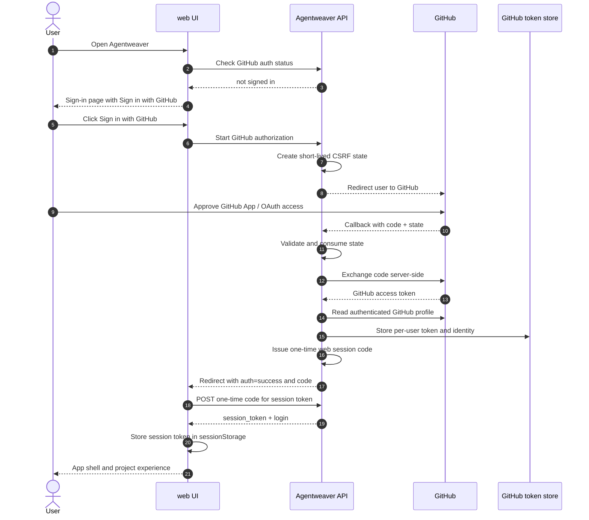
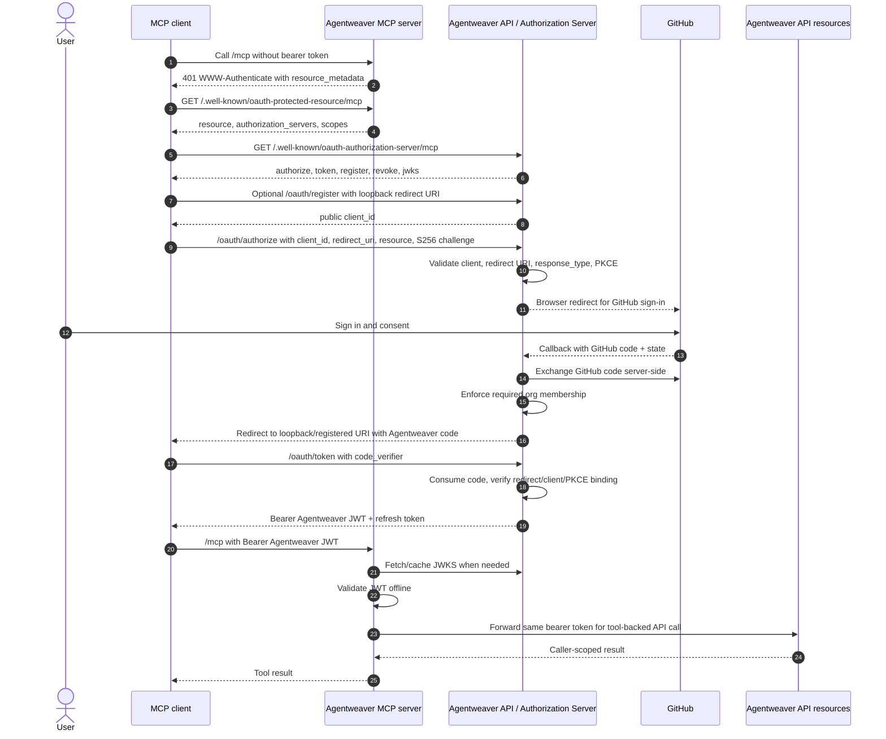

# Onboarding & authentication experience

Agentweaver starts with GitHub identity and then carries that identity consistently through the web UI, the API, and the MCP server. The user sees a simple **Sign in with GitHub** button in the browser and a standards-based OAuth consent flow in MCP clients, while Agentweaver keeps GitHub secrets server-side and uses bearer tokens for every protected call.

Scope: this page covers sign-in, sign-out, MCP client connection, MCP bearer authentication, and GitHub auth tools; it does not cover provider-specific model credentials beyond the GitHub sign-in relationship.

See also: [Overview](./00-overview.md), [Projects](./projects.md), [MCP client experience](./mcp-client.md), [Authentication guide](../guide/authentication.md), [MCP OAuth](../mcp-oauth.md), and [Auth & security deep dive](../deep-dive/auth-security.md).

## Mental model

Agentweaver has two user-facing authentication surfaces:

- **The web UI** is browser-first. A user opens Agentweaver, signs in with GitHub, and then works with projects, runs, teams, memory, and reviews inside the shell.
- **The MCP server** is client-first. An MCP client such as Claude Desktop, GitHub Copilot, or another assistant connects to Agentweaver, obtains or presents a bearer token, and invokes Agentweaver tools on the user's behalf.

Both surfaces converge on the same principle: a protected action must map to a real caller. The caller can be a signed-in GitHub user, an Agentweaver OAuth identity represented by an Agentweaver JWT, or a configured automation identity represented by an automation key. The MCP server forwards the accepted bearer token to the API, so downstream project and run operations are attributed to the caller instead of to a generic service account.

GitHub remains the human identity provider. Agentweaver is the product boundary: it starts GitHub sign-in, stores server-side GitHub credentials, enforces organization access where configured, mints its own OAuth tokens for MCP clients, validates those tokens, and exposes the current signed-in state through the UI and tools.

## First-run web UI experience

When an unauthenticated user opens the web UI, Agentweaver first checks whether a usable session exists. While that check is running, the user sees a full-page loading state with a spinner. If the check succeeds, the normal app shell appears. If the check fails, expires, or finds no signed-in GitHub identity, the user lands on the sign-in page.

The sign-in page is intentionally sparse:

> 📸 **Screenshot — `signin-page.png`**
> *Shows:* the unauthenticated sign-in page with the `/agentweaver.png` logo, the **Agentweaver** title, the tagline **Build workflows from specialized agents**, and the single dark **Sign in with GitHub** button (the button navigates to `/auth/github/authorize` on click).
> *Path:* Open Agentweaver while signed out → the `SignInPage` renders at `/`.

- the Agentweaver logo;
- the title **Agentweaver**;
- the tagline **Build workflows from specialized agents**;
- one primary action: **Sign in with GitHub**.

If GitHub redirects back with an error, the same page shows the error text below the button. The button starts the GitHub authorization flow by navigating to Agentweaver's GitHub authorization endpoint. The browser does not ask for an API key and does not ask the user to paste a token.

## What GitHub sign-in grants

The web sign-in uses the configured GitHub App user-to-server / OAuth flow. The user approves Agentweaver in GitHub, and Agentweaver exchanges the returned authorization code from the server using its configured client secret. The browser never receives the GitHub client secret.

The default GitHub scopes support the product experience:

- repository access for creating projects from GitHub and listing repositories;
- user profile access so Agentweaver can show the GitHub login and avatar;
- organization visibility so Agentweaver can enforce required organization membership when that policy is configured.

After the GitHub exchange, Agentweaver reads the authenticated GitHub profile and stores the resulting token and identity server-side in the authenticated user's scope. In AKS, each user's GitHub OAuth token is stored in Azure Key Vault under a per-user key (`ghtok-user--{base32(userId)}`) and is never written to shared storage. Local development uses OS credential storage on Windows or scoped token files under the developer data area on other platforms.

A successful web sign-in also creates a short-lived one-time web session code. The frontend receives only that opaque code in the redirect URL, then immediately redeems it with a POST request. The actual session bearer is returned in the POST response body and stored in browser `sessionStorage` under Agentweaver's session keys. Agentweaver strips the `auth` and `code` query parameters after the exchange so they do not remain in the address bar.

The important user-facing result is simple: after sign-in, the user is returned to Agentweaver, the shell loads, and API calls include `Authorization: Bearer <session token>` automatically.

## Carrying identity through the web UI

The web UI carries identity in two layers:

1. **GitHub auth status** answers whether the server has a signed-in GitHub token for the current caller and, when signed in, returns the login and avatar URL.
2. **Session bearer storage** lets the frontend attach `Authorization: Bearer ...` to API calls during the browser tab's session.

On startup, the app performs the one-time-code exchange when `auth=success` and `code=...` are present. It then calls the GitHub auth status endpoint. If the server says the user is signed in, the UI binds the returned login to the current browser session. If the stored login conflicts with the server identity, the UI clears local session auth and returns to the sign-in state instead of silently mixing identities.

Every API request made by the web client asks the session token provider for the current token. When present, the request includes the bearer header. If the token is absent, expired, revoked, or no longer maps to a valid server-side identity, protected API calls fail with `401`, and auth-aware views offer a sign-in path.

### Signed-in shell

Once signed in, the user sees the normal Agentweaver shell: left navigation, top bar, project switcher, status dot, and the GitHub account trigger. The GitHub account trigger shows the user's avatar and login. Opening it reveals **Sign out**.

> 📸 **Screenshot — `signed-in-topbar.png`**
> *Shows:* the shell top bar with the `Alpha` badge, the project switcher, the API status dot, and the GitHub account trigger opened to reveal the avatar, login, and the **Sign out** action.
> *Path:* Sign in → click the GitHub account trigger in the top-right of the top bar.

The project gallery becomes the first practical onboarding step. If projects exist, the gallery shows project cards and creation actions. If no projects exist, it says:

> No projects yet. Create one to get started.

The primary onboarding choices are **Create blank project** and **Create from GitHub**. GitHub-backed creation uses the signed-in user's GitHub token to load organizations and repositories. If repository listing cannot authenticate, the **Create project from GitHub** dialog shows:

> Connect your GitHub account to list repositories, or type owner/repo manually.

The action is **Connect GitHub**. The user can connect and browse, or type `owner/repo` manually when they already know the repository name.

### Sign-out

The signed-in account menu includes **Sign out**. Signing out calls the GitHub sign-out endpoint for the current caller's token scope, records that the user intentionally signed out, and returns the browser to `/`. On reload, the startup auth check no longer finds a signed-in GitHub identity, so the user sees the sign-in page again.

Sign-out affects future authenticated calls. It does not retroactively cancel server-side runs that are already in progress; those runs continue according to their own run lifecycle and review state.

## MCP client connection experience

An MCP client connects to Agentweaver either locally or over HTTP:

| Client mode | What the user points at | What authenticates the call |
|---|---|---|
| Local STDIO | A command that starts the Agentweaver MCP app with `--stdio` | The process forwards to the configured Agentweaver API; when no per-request bearer exists, it can use the configured `AGENTWEAVER_API_KEY`. |
| Hosted HTTP | The Agentweaver MCP URL ending in `/mcp` | Each request sends `Authorization: Bearer <token>` and the MCP server validates it before invoking tools. |

For a hosted MCP client, the user experience is normally discovery-driven. The user adds the Agentweaver MCP server URL to the client. The client tries to call `/mcp`. If it has no bearer token, the server responds with `401` and a `WWW-Authenticate` challenge that points to OAuth Protected Resource metadata. The client fetches that metadata, learns the MCP resource and authorization server issuer, fetches Authorization Server metadata, then runs a PKCE authorization-code flow.

The OAuth-capable client may also dynamically register its redirect URI. Local native clients usually register or use loopback redirect URIs such as `http://127.0.0.1:<port>/callback` or `http://localhost:<port>/callback`. Agentweaver allows loopback HTTP redirect URIs for native clients and HTTPS redirect URIs that match configured allowlisted prefixes. It rejects fragments and embedded user info.

For loopback redirect URIs, registered URI matching ignores the port when the scheme, host, and path match. This follows RFC 8252: native clients often bind a fresh local port for each sign-in attempt. Token redemption still binds to the exact redirect URI used in the authorization request, so the authorization code cannot be moved to a different redirect target.

## MCP OAuth and bearer-token flow

The MCP OAuth flow has four visible phases:

1. **Discovery.** The client learns that `/mcp` is protected, discovers the protected-resource metadata, then discovers Agentweaver's Authorization Server metadata and JWKS URI.
2. **Consent.** The client opens a browser to Agentweaver's OAuth authorize endpoint. Agentweaver redirects the human to GitHub. The user signs in and approves the GitHub App / OAuth request.
3. **Token issuance.** Agentweaver enforces organization membership when configured, redirects an Agentweaver authorization code back to the MCP client's redirect URI, and exchanges that code plus the PKCE verifier for an Agentweaver JWT and rotating refresh token.
4. **Tool use.** The client calls `/mcp` with `Authorization: Bearer <Agentweaver JWT>`. The MCP server validates the JWT offline using JWKS, then forwards the same bearer token to the API during tool calls.

The Agentweaver JWT is short-lived, signed with RS256, and bound to the MCP resource audience. It carries the issuer, audience, subject, GitHub login, scope `mcp:invoke`, optional organization claim, lifetime claims, and a JWT ID used for revocation. The MCP server validates signature, issuer, audience, lifetime, and algorithm using cached JWKS. The API validates again when the token is forwarded and checks revocation state for the token ID.

Refresh tokens are opaque to the client and stored by Agentweaver as hashes. Refresh is rotating: each successful refresh consumes the presented token and issues a successor in the same chain. Reusing a consumed or revoked refresh token revokes the chain.

## MCP bearer acceptance order

The hosted MCP server accepts bearer tokens in this order:

1. **Automation keys.** Configured automation keys are checked first through the MCP API-key registry. They support machine-to-machine callers such as CI, scripts, and controlled service integrations. The registry maps each key to an accountable configured user.
2. **Agentweaver JWTs.** If the bearer looks like an Agentweaver OAuth access token, the MCP server validates it offline through the Authorization Server JWKS. The token must have the expected issuer, audience, expiry, and RS256 signature.
3. **Raw GitHub tokens while enabled.** As a transition path, the MCP server can validate a raw GitHub bearer token by calling GitHub's user API and caching the result briefly. This path is controlled by configuration and can be turned off once clients use Agentweaver OAuth.

If no token is supplied, the MCP server returns a bearer challenge that advertises the protected-resource metadata URL. If a token is supplied but fails all accepted paths, it returns `401` with `invalid_token`. The health check and OAuth protected-resource metadata remain unauthenticated so clients and operators can discover how to authenticate.

Once a bearer token is accepted, the MCP server stores both the resolved identity and the original bearer for the request. Tool implementations then call the backend API with that same bearer token. This keeps the backend authorization model honest: the API sees the user's Agentweaver JWT or GitHub token, not just the MCP process identity. In local STDIO mode, when there is no inbound HTTP request context, the MCP client falls back to its configured API key for backend calls.

Downstream resource authorization remains ownership-based. A valid bearer token and allowed org membership let the caller reach protected APIs, but project, team, run, backlog, workflow, workspace, and memory operations still require the caller to own the target resource. Agentweaver does not assign superuser privileges from GitHub usernames, including `admin`.

## GitHub auth tools in MCP

The MCP server exposes three GitHub auth tools for agents that need to check or repair GitHub connectivity during an assistant-driven session:

| Tool | User-facing purpose | What the user sees |
|---|---|---|
| `github_status` | Check whether the current caller has a stored GitHub sign-in. | A JSON status such as signed in, signed out, or never signed in, plus login and avatar when available. |
| `github_signin` | Start GitHub device-flow sign-in for environments where the assistant cannot drive the web UI sign-in button. | A progress message: **Open {verification URL} and enter code: {user code}**, followed by waiting updates until success or timeout. |
| `github_signout` | Clear the stored GitHub sign-in for the current caller. | The message **Signed out of GitHub successfully.** |

An agent uses `github_status` before trying GitHub-backed actions such as listing repositories. If the status is not signed in and the task needs GitHub repository access, the agent can call `github_signin`. The device flow keeps the device code server-side; the user receives only the verification URL and user code. Agentweaver polls GitHub until the user approves, denies, the code expires, or the operation times out. On success, the token is stored under the caller's token scope and future GitHub-backed tools can proceed.

`github_signout` is useful when the wrong GitHub account is connected, when a user wants to reset access, or when troubleshooting stale credentials. After sign-out, `github_status` reports a non-signed-in state and GitHub-backed actions require sign-in again.

## Troubleshooting and edge cases

### The web UI shows the sign-in page again

The startup auth gate clears local session auth when the server does not confirm a signed-in GitHub identity. This happens when the browser tab has no session token, the token is invalid, the server-side GitHub token was signed out, or the session identity no longer matches the stored login. Click **Sign in with GitHub** again.

### The sign-in page shows an error

GitHub callback errors appear below **Sign in with GitHub**. Common causes are a denied GitHub authorization, a missing callback parameter, an expired state, interrupted code exchange, or required organization membership not being proven. Retrying usually fixes interrupted flows. If the error is about organization membership, the GitHub account must be added to the required organization or given access through the relevant SAML / team policy.

> 📸 **Screenshot — `signin-error.png`**
> *Shows:* the sign-in page with red error text rendered below the **Sign in with GitHub** button, sourced from the `auth=error&reason=...` query parameters after a failed GitHub callback.
> *Path:* Open `/?auth=error&reason=Authentication%20failed.` (or return from GitHub with a denied/expired authorization).

### The GitHub project picker asks to connect

In **Create project from GitHub**, a `401` while loading accounts shows **Connect your GitHub account to list repositories, or type owner/repo manually.** Use **Connect GitHub** to refresh the GitHub sign-in. If browsing is blocked but the repository name is known, type `owner/repo` manually in **Source repository**.

### MCP client gets `Bearer token required`

The MCP client called hosted `/mcp` without a bearer token. OAuth-aware clients should follow the `WWW-Authenticate` challenge to the protected-resource metadata, discover the Authorization Server, and run the OAuth flow. Non-interactive clients should be configured with an automation key.

### MCP client gets `invalid_token`

The bearer token was present but failed every accepted path. For Agentweaver JWTs, check that the MCP URL, issuer, and audience all describe the same public host and resource, and that the token has not expired or been revoked. For raw GitHub tokens, check that the transition path is enabled and that GitHub still accepts the token. For automation keys, check that the key is configured in the MCP server's accepted key registry.

### Local MCP redirect fails on loopback

Use a loopback HTTP redirect URI such as `http://127.0.0.1:<port>/callback`, `http://localhost:<port>/callback`, or `http://[::1]:<port>/callback`. Agentweaver accepts loopback redirect URIs for native clients and matches registered loopback redirects while ignoring port when scheme, host, and path are the same. The client must still redeem the authorization code with the exact redirect URI from the authorization request.

### Organization access is denied

Agentweaver can require membership in a configured GitHub organization, and some deployments also restrict by team. GitHub SAML enforcement can make a valid member look unverifiable if the token has not been authorized for that organization. The safe outcome is denial or retry rather than allowing an unproven caller. Re-authorize GitHub with the required organization access, ensure SAML SSO is approved for the token, and confirm the account is in the required org or team.

### Token expires during an MCP session

Agentweaver JWT access tokens are intentionally short-lived. OAuth-capable clients should use the refresh token grant to rotate the refresh token and receive a new access token. If refresh fails because the refresh token expired, was reused, was revoked, or no longer matches the client, reconnect the MCP client and repeat the OAuth consent flow.

### GitHub auth tools time out

`github_signin` follows GitHub's device-flow timing. If the user does not enter the code before expiry, the tool reports a timeout or expired status. Run `github_signin` again to get a fresh user code and verification URL.

## Experience guardrails

- The web UI never asks users to paste a GitHub token.
- GitHub client secrets and GitHub access-token exchanges happen server-side.
- Browser redirects carry one-time codes, not long-lived GitHub tokens.
- OAuth bootstrap and discovery routes are public because clients need them before they have a token.
- Protected web API and MCP tool calls use bearer tokens.
- MCP validates Agentweaver JWTs offline via JWKS, then forwards the caller's bearer token to the API.
- Organization membership is enforced at issuance for MCP OAuth and on protected API access where configured.
- Automation keys are accepted for controlled machine-to-machine use, not as an interactive user sign-in replacement.

The intended experience is that humans sign in once with GitHub, MCP clients consent once through OAuth, and every subsequent project, run, and tool action stays tied to the caller Agentweaver can validate.
