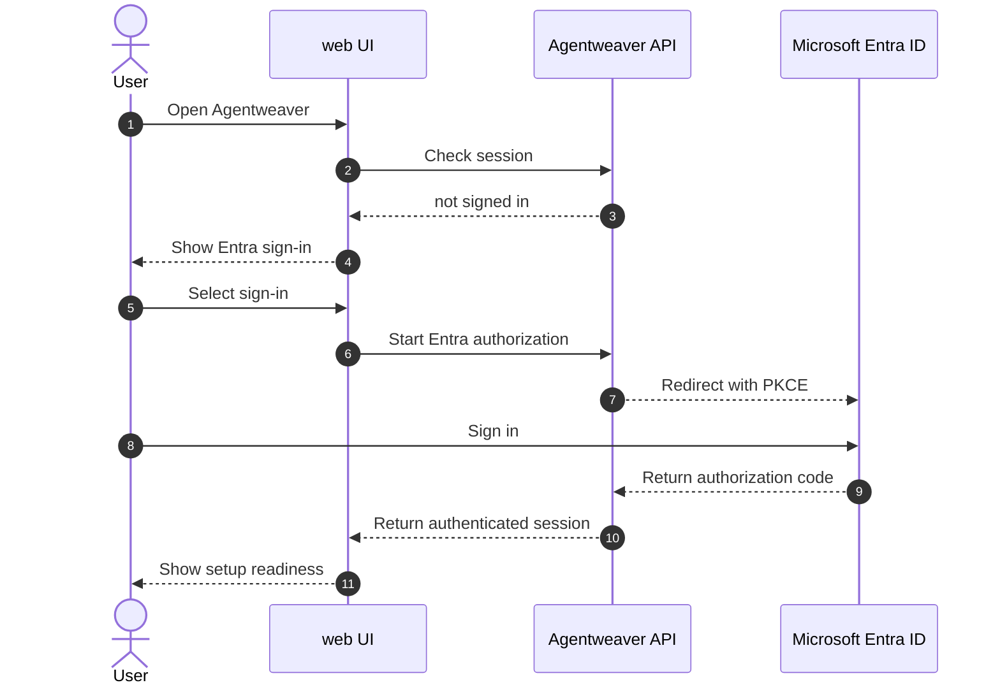
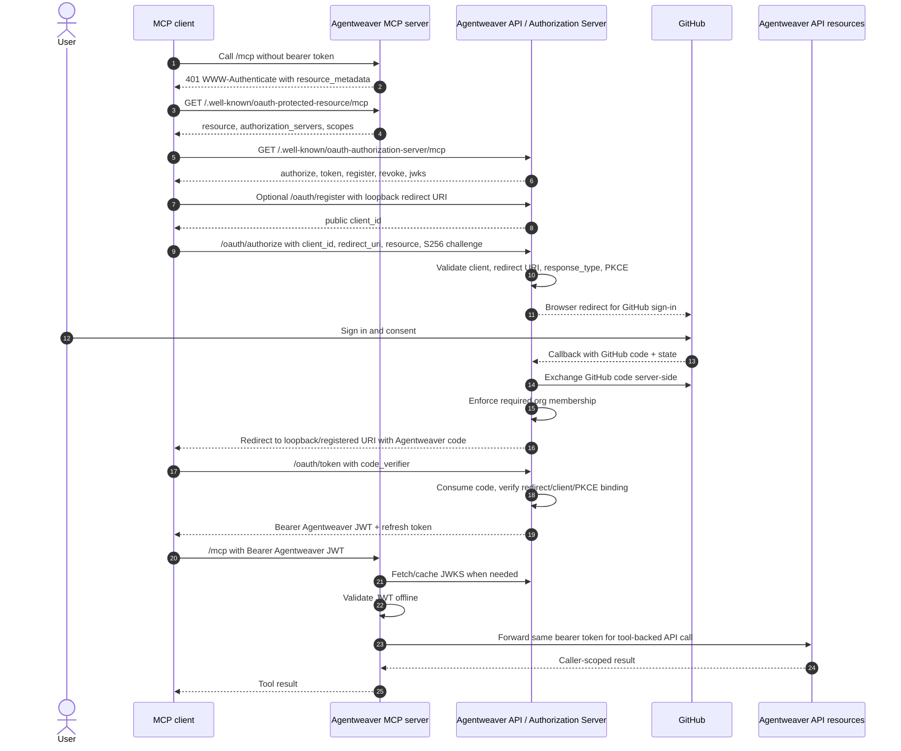

# Onboarding and authentication experience

Agentweaver uses Microsoft Entra ID for browser sign-in. GitHub Apps provide separate capabilities after sign-in.

Scope: this page covers sign-in, setup readiness, GitHub capabilities, sign-out, and MCP authentication.

See also: [Overview](./00-overview.md), [Projects](./projects.md), [MCP client experience](./mcp-client.md), [Authentication guide](../guide/authentication.md), [MCP OAuth](../mcp-oauth.md), and [Auth & security deep dive](../deep-dive/auth-security.md).

## Mental model

The web UI and MCP server identify each caller.

- The web UI uses Microsoft Entra ID.
- The MCP server accepts its configured bearer-token methods.
- The GitHub Copilot App provides model-provider access.
- The GitHub Repo App provides repository access.

Each protected action maps to one caller. Agentweaver applies platform roles and project assignments to that caller.

## First-run web UI experience

Agentweaver checks the browser session before it shows the app shell. The loading state names this operation.

If no session exists, the page shows **Sign in with Microsoft Entra ID**. This action opens the configured Entra authorization endpoint.

The browser returns through `/auth/entra/callback`. Agentweaver keeps authorization details on the server.

```mermaid
sequenceDiagram
    autonumber
    actor User
    participant Web as web UI
    participant API as Agentweaver API
    participant Entra as Microsoft Entra ID

    User->>Web: Open Agentweaver
    Web->>API: Check session
    API-->>Web: not signed in
    Web-->>User: Show Entra sign-in
    User->>Web: Select sign-in
    Web->>API: Start Entra authorization
    API-->>Entra: Redirect with PKCE
    User->>Entra: Sign in
    Entra-->>API: Return authorization code
    API-->>Web: Return authenticated session
    Web-->>User: Show setup readiness
```

## Setup readiness

A ready model provider is the first useful milestone. Agentweaver blocks AI work until this required row is ready.

A Platform Admin can authorize GitHub Copilot or activate a custom-key provider. Other users see **Unavailable to you** with recovery guidance.

- The completed row identifies the provider and its project or platform scope.
- Repository access is optional.
- Local agent work can continue without a GitHub repository.
- Pull-request publishing requires repository access.

During required setup, the Platform Admin can add and manage all supported model providers.
The administrator must choose one active provider.

When the provider is ready, select **Continue to Agentweaver**.
Agentweaver opens the app shell and starts a three-step product tour.

The tour introduces **Projects**, **Sessions**, and **Start task**.
The administrator can skip the tour or press Escape.
Agentweaver stores the completed tour for the signed-in user.

To start the tour again, open the settings menu and select **Take product tour**.

The setup pattern also shows loading, error, permission, and success states with text labels.

## GitHub capabilities

The two GitHub Apps have separate purposes:

- GitHub Copilot supplies AI access.
- The Repo App supplies repository access.

Authorize GitHub Copilot from Platform settings or Project settings. The effective status identifies the provider and scope.

Connect the GitHub Repo App from Account settings, or authorize repository access from a repository action elsewhere in the product. Agentweaver returns to the current task after the browser handoff.

GitHub authorization does not replace Entra identity. It does not grant an Agentweaver role or project membership.

### Signed-in shell

After required setup, Agentweaver shows the normal shell. The project gallery offers local and GitHub-backed project creation.

The blank-project path does not require repository access. The GitHub-backed path requests repository access before it loads repositories.

### Sign-out

The signed-in account menu includes **Sign out**. This action ends the Agentweaver session and returns the browser to `/`.

Sign-out affects future authenticated calls. It does not retroactively cancel server-side runs that are already in progress; those runs continue according to their own run lifecycle and review state.

## MCP client connection experience

An MCP client connects to Agentweaver either locally or over HTTP:

| Client mode | What the user points at | What authenticates the call |
|---|---|---|
| Local STDIO | A command that starts the Agentweaver MCP app with `--stdio` | The process requires `AGENTWEAVER_TOKEN` to contain an Agentweaver broker token for the exact MCP resource and `mcp:invoke`; the API validates it again and enforces project authorization. |
| Hosted HTTP | The Agentweaver MCP URL ending in `/mcp` | Each request sends `Authorization: Bearer <token>` and the MCP server validates it before invoking tools. |

For a hosted MCP client, the user experience is normally discovery-driven. The user adds the Agentweaver MCP server URL to the client. The client tries to call `/mcp`. If it has no bearer token, the server responds with `401` and a `WWW-Authenticate` challenge that points to OAuth Protected Resource metadata. The client fetches that metadata, learns the MCP resource and authorization server issuer, fetches Authorization Server metadata, then runs a PKCE authorization-code flow.

The OAuth-capable client may also dynamically register its redirect URI. Local native clients use
literal loopback redirect URIs such as `http://127.0.0.1:<port>/callback` or
`http://[::1]:<port>/callback`. Agentweaver rejects hostnames, fragments, and embedded user info.

For loopback redirect URIs, registered URI matching ignores the port when the scheme, host, and path match. This follows RFC 8252: native clients often bind a fresh local port for each sign-in attempt. Token redemption still binds to the exact redirect URI used in the authorization request, so the authorization code cannot be moved to a different redirect target.

## MCP OAuth and bearer-token flow

The MCP OAuth flow has four visible phases:

1. **Discovery.** The client learns that `/mcp` is protected, discovers the protected-resource metadata, then discovers Agentweaver's Authorization Server metadata and JWKS URI.
2. **Consent.** The client opens a browser to Agentweaver's OAuth authorize endpoint. Agentweaver redirects the human to GitHub. The user signs in and approves the GitHub App / OAuth request.
3. **Token issuance.** Agentweaver enforces organization membership when configured, redirects an Agentweaver authorization code back to the MCP client's redirect URI, and exchanges that code plus the PKCE verifier for an Agentweaver JWT and rotating refresh token.
4. **Tool use.** The client calls `/mcp` with `Authorization: Bearer <Agentweaver JWT>`. The MCP server validates the JWT offline using JWKS, then forwards the same bearer token to the API during tool calls.

```mermaid
sequenceDiagram
    autonumber
    actor User
    participant Client as MCP client
    participant MCP as Agentweaver MCP server
    participant AS as Agentweaver API / Authorization Server
    participant GitHub
    participant API as Agentweaver API resources

    Client->>MCP: Call /mcp without bearer token
    MCP-->>Client: 401 WWW-Authenticate with resource_metadata
    Client->>MCP: GET /.well-known/oauth-protected-resource/mcp
    MCP-->>Client: resource, authorization_servers, scopes
    Client->>AS: GET /.well-known/oauth-authorization-server/mcp
    AS-->>Client: authorize, token, register, revoke, jwks
    Client->>AS: Optional /oauth/register with loopback redirect URI
    AS-->>Client: public client_id
    Client->>AS: /oauth/authorize with client_id, redirect_uri, resource, S256 challenge
    AS->>AS: Validate client, redirect URI, response_type, PKCE
    AS-->>GitHub: Browser redirect for GitHub sign-in
    User->>GitHub: Sign in and consent
    GitHub-->>AS: Callback with GitHub code + state
    AS->>GitHub: Exchange GitHub code server-side
    AS->>AS: Enforce required org membership
    AS-->>Client: Redirect to loopback/registered URI with Agentweaver code
    Client->>AS: /oauth/token with code_verifier
    AS->>AS: Consume code, verify redirect/client/PKCE binding
    AS-->>Client: Bearer Agentweaver JWT + refresh token
    Client->>MCP: /mcp with Bearer Agentweaver JWT
    MCP->>AS: Fetch/cache JWKS when needed
    MCP->>MCP: Validate JWT offline
    MCP->>API: Forward same bearer token for tool-backed API call
    API-->>MCP: Caller-scoped result
    MCP-->>Client: Tool result
```

The Agentweaver JWT is short-lived, signed with RS256, and bound to the MCP resource audience. It carries the issuer, audience, subject, GitHub login, scope `mcp:invoke`, optional organization claim, lifetime claims, and a JWT ID used for revocation. The MCP server validates signature, issuer, audience, lifetime, and algorithm using cached JWKS. The API validates again when the token is forwarded and checks revocation state for the token ID.

Refresh tokens are opaque to the client and stored by Agentweaver as hashes. Refresh is rotating: each successful refresh consumes the presented token and issues a successor in the same chain. Reusing a consumed or revoked refresh token revokes the chain.

## MCP bearer acceptance order

The hosted MCP server accepts bearer tokens in this order:

1. **Automation keys.** Configured automation keys are checked first through the MCP API-key registry. They support machine-to-machine callers such as CI, scripts, and controlled service integrations. The registry maps each key to an accountable configured user.
2. **Agentweaver JWTs.** If the bearer looks like an Agentweaver OAuth access token, the MCP server validates it offline through the Authorization Server JWKS. The token must have the expected issuer, audience, expiry, and RS256 signature.
3. **Raw GitHub tokens while enabled.** As a transition path, the MCP server can validate a raw GitHub bearer token by calling GitHub's user API and caching the result briefly. This path is controlled by configuration and can be turned off once clients use Agentweaver OAuth.

If no token is supplied, the MCP server returns a bearer challenge that advertises the protected-resource metadata URL. If a token is supplied but fails all accepted paths, it returns `401` with `invalid_token`. The health check and OAuth protected-resource metadata remain unauthenticated so clients and operators can discover how to authenticate.

Once a bearer token is accepted, the MCP server stores both the resolved identity and the original bearer for the request. Tool implementations then call the backend API with that same bearer token. This keeps the backend authorization model honest: the API sees the user's Agentweaver JWT or GitHub token, not just the MCP process identity. In local STDIO mode, when there is no inbound HTTP request context, the MCP client falls back to its configured API key for backend calls.

Downstream resource authorization remains ownership-based. A valid bearer token and allowed org membership let the caller reach protected APIs, but project, team, run, backlog, workflow, workspace, and memory operations still require the caller to own the target resource. Agentweaver does not assign superuser privileges from GitHub usernames, including `admin`.

## GitHub capability tools in MCP

The MCP server exposes two explicit GitHub App capabilities for assistant-driven sessions. The Repo App is caller-scoped; the Copilot App is project-scoped and can only be connected by a Project Owner:

| Tool | User-facing purpose | What the user sees |
|---|---|---|
| `github_repo_app_connect` | Start a Repo App browser handoff for the current caller. | An opaque transaction ID, browser URL, and expiry. Open the URL in a browser to continue GitHub authorization. |
| `github_repo_app_authorization_status` | Poll the caller's Repo App authorization. | A redacted lifecycle state and expiry; no token, installation, repository, or permission data. |
| `github_repo_app_disconnect` | Remove the caller's Repo App connection. | A de-privileging confirmation. |
| `project_copilot_app_connect` | Start a project-pinned Copilot App browser handoff. | An opaque transaction ID, browser URL, and expiry for an authorized Project Owner. |
| `project_copilot_app_authorization_status` | Poll the project's Copilot App authorization. | A redacted lifecycle state and expiry, scoped to the initiating caller and project. |
| `project_copilot_app_disconnect` | Remove a project's Copilot App connection. | A de-privileging confirmation for an authorized Project Owner. |
| `project_github_capability_status` | Inspect unattended GitHub readiness for a project. | Server-derived, redacted capability readiness only. |

Before GitHub-backed work, an agent calls `github_repo_app_connect`, asks the user to open the returned browser URL, then polls `github_repo_app_authorization_status`. The API transfers the callback cookie directly to the browser through a one-time opaque handoff; OAuth state, callback cookies, tokens, installation details, repository data, and permissions never enter MCP output.

For unattended project work, a Project Owner repeats that browser flow with `project_copilot_app_connect`, polls its authorization status, and checks `project_github_capability_status`. Disconnect tools intentionally remove authority rather than exposing or transferring it.

## Troubleshooting and edge cases

### The web UI shows the sign-in page again

The startup gate shows the sign-in page when no valid Entra session exists. Select **Sign in with Microsoft Entra ID**.

### The sign-in page shows an error

The page shows Entra callback and session errors near the sign-in action. Start a new sign-in attempt.

### The GitHub project picker requires repository access

In **Create project from GitHub**, select **Authorize repository access**. If authorization fails to start, try the action again.

### MCP client gets `Bearer token required`

The MCP client called hosted `/mcp` without a bearer token. OAuth-aware clients should follow the
`WWW-Authenticate` challenge to protected-resource metadata, discover the Authorization Server,
and run the OAuth flow. Stdio clients must be configured with an Agentweaver broker token.

### MCP client gets `invalid_token`

The bearer token is not a valid Agentweaver broker token. Check the exact issuer and
`<public-origin>/mcp` audience, keyed RS256 signature, lifetime, subject, and `mcp:invoke` scope.
Raw Entra, GitHub, and API-key credentials are not accepted.

### Local MCP redirect fails on loopback

Use a literal loopback HTTP redirect URI such as `http://127.0.0.1:<port>/callback` or
`http://[::1]:<port>/callback`. The client must redeem the authorization code with the exact
redirect URI from the authorization request.

### Organization access is denied

Agentweaver can require membership in a configured GitHub organization, and some deployments also restrict by team. GitHub SAML enforcement can make a valid member look unverifiable if the token has not been authorized for that organization. The safe outcome is denial or retry rather than allowing an unproven caller. Re-authorize GitHub with the required organization access, ensure SAML SSO is approved for the token, and confirm the account is in the required org or team.

### Token expires during an MCP session

Agentweaver JWT access tokens are intentionally short-lived. OAuth-capable clients should use the refresh token grant to rotate the refresh token and receive a new access token. If refresh fails because the refresh token expired, was reused, was revoked, or no longer matches the client, reconnect the MCP client and repeat the OAuth consent flow.

### GitHub capability handoffs expire

If the browser handoff expires before the user completes GitHub authorization, start a fresh Repo App or project Copilot App connection. The old opaque transaction cannot be reused.

## Experience guardrails

- The web UI uses Microsoft Entra ID for human sign-in.
- GitHub Apps provide model-provider and repository capabilities only.
- The web UI never asks users to paste a GitHub token.
- GitHub client secrets and GitHub access-token exchanges happen server-side.
- Browser redirects carry one-time codes, not long-lived GitHub tokens.
- OAuth bootstrap and discovery routes are public because clients need them before they have a token.
- Protected web API and MCP tool calls use bearer tokens.
- MCP validates Agentweaver JWTs offline via JWKS, then forwards the caller's bearer token to the API.
- Organization membership is enforced at issuance for MCP OAuth and on protected API access where configured.
- Automation keys are accepted for controlled machine-to-machine use, not as an interactive user sign-in replacement.

Humans sign in with Entra. They authorize each GitHub capability only when the current task requires it.
