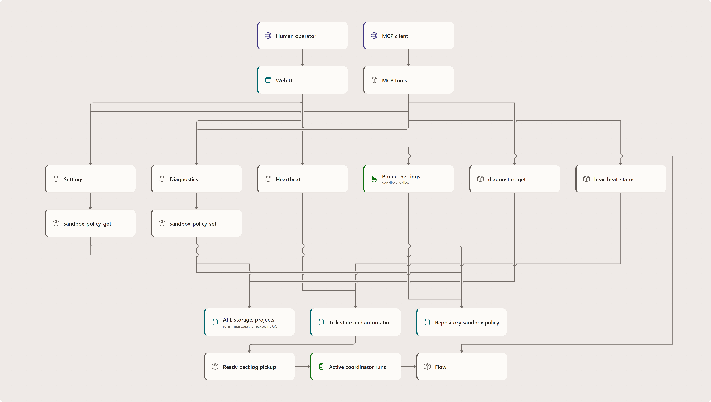

# Operations experience

Operations is where Agentweaver users answer one practical question: **is the system ready to keep agents moving safely?** Diagnostics, Heartbeat, Flow, Cluster, and Observability provide inspection. Account, platform, and project settings have distinct configuration scopes. MCP exposes selected operations through focused tools.

Scope: this page covers operations surfaces that exist today; it does not describe unsupported cost metrics, hidden telemetry, or deployment settings that are not exposed in the product.

Related context: [Overview](./00-overview.md), [Projects](./projects.md), [Workflows & backlog](./workflows-backlog.md), [MCP client experience](./mcp-client.md), [Configuration](../guide/configuration.md), [Events & observability](../deep-dive/events-observability.md), [Sandbox](../deep-dive/sandbox.md), and [Infrastructure & deployment](../deep-dive/infra-deployment.md).

## Mental model

Agentweaver operations is a control room, not a general admin console. A user usually comes here to:

1. confirm that the backend is healthy;
2. confirm that heartbeat is ticking and picking up Ready work;
3. see which agents are active, queued, blocked, or done;
4. inspect or change a repository sandbox policy;
5. separate project configuration from system health.

The backend remains the source of truth. The web UI renders snapshots, badges, cards, and empty states. MCP tools return the same operational facts as structured results an assistant can summarize or act on.

<!-- Editable source: ../diagrams/drawio/generated/experience-operations-fig1.drawio.
     Published PNG path is stable; visual validation belongs to the diagram owner. -->

The important operating rule is: Agentweaver shows real state. Diagnostics can warn or fail. Heartbeat can be `running`, `waiting_first_tick`, or `disabled`. Flow can be empty. Sandbox policy can prevent shell execution even when the project itself is available.

## Operations surfaces at a glance

| Surface | Where the user goes | What it answers | MCP parity |
|---|---|---|---|
| **Account settings** | Account menu → **Account settings** | Authentication, personal AI access, GitHub connections, and MCP client setup | No single equivalent tool |
| **Platform settings** | **Platform settings** (`/platform-settings`) | Deployment model-provider configuration, subject to platform permissions | No dedicated operations tool |
| **Project Settings** | Project **Settings** → **Sandbox policy** | Which sandbox policy applies to this project's working directory? | `sandbox_policy_get`, partially `sandbox_policy_set` |
| **Diagnostics** | Project **Diagnostics** page | Is the system or project healthy enough to operate? | `diagnostics_get` for global diagnostics |
| **Heartbeat** | Project **Heartbeat** page | Is background automation enabled, ticking, and acting? | `heartbeat_status` |
| **Flow** | Project **Flow** page | What is each agent working on right now? | Indirect through board/run/coordinator tools |
| **Cluster** | Project **Cluster** page (SYSTEM section) | Are claims binding, are resources healthy, and are pods orphaned? | No dedicated MCP tool; REST: `GET /api/diagnostics/cluster` |
| **Observability** | Project **Observability**, **Traces**, and **Agents** | What usage, performance, and recorded trace data is available? | No dedicated MCP tool; traces REST: `GET /api/metrics/runs/{runId}/traces` |

Use **Diagnostics** when something feels broken. Use **Heartbeat** when Ready work is not being claimed.
Use **Flow** during active multi-agent work, project **Settings** for command policy, and **Cluster**
when runs are slow to schedule or pods are accumulating.

## Settings experience

Settings have three distinct scopes:

- **Account settings** for the signed-in user's authentication, personal AI access, repository access,
  and MCP clients;
- **Platform settings** for model providers and deployment-level provider configuration;
- project **Settings** for one project's repository, execution/provider choices, review and sandbox
  policy, and lifecycle actions.

For project management and MCP `project_configure`, see [Projects](./projects.md). Account settings is
not a repository-path sandbox editor, and it cannot grant or revoke Microsoft Entra platform roles.

### Account and platform settings

**Account settings** shows **Authentication**, **AI Access**, **GitHub connections**, and **MCP clients**.
Personal session-chat AI access is separate from project Copilot connections. Entra role assignments
are displayed, not changed on this page.

**Platform settings** manages model-provider entries. It is separate from project provider selection and
repository sandbox policy; access depends on the user's platform permissions.

### Project Settings sandbox policy

Project **Settings** has an in-page rail. The operations-relevant section is **Sandbox policy**, described as **Control how agent commands execute and what they may reach.** It loads from the project's working directory, so the user does not type a path.

The section shows shell, sandbox, and outbound-network switches plus read-only allowed roots and
blocked patterns. It saves with **Save** and reports success or an inline API error. Preview approval
timeout and lifetime are configured here too; both default to 1440 minutes (24 hours).

Use project **Settings** for an active project's policy. MCP `sandbox_policy_get` can inspect a
repository path, while `sandbox_policy_set` changes only shell enablement.

### What Settings does not expose

Account settings is not a general deployment console. Database/workspace paths, CORS, Kubernetes
routing, and Key Vault delivery remain runtime/infrastructure concerns. Platform provider controls
are a separate surface; see [Configuration](../guide/configuration.md) and
[Infrastructure & deployment](../deep-dive/infra-deployment.md).

## Diagnostics experience

Diagnostics answers: **is Agentweaver healthy enough to operate right now?** It is read-only and runs real checks over live state.

The page title is **Diagnostics** with subtitle **System and project health checks.** It provides:

- **Global** and **This project** tabs;
- **Auto-refresh** switch;
- **Re-run** button;
- **Updated** timestamp;
- summary cards;
- check cards with `pass`, `warn`, or `fail` badges and durations.

Global diagnostics show **API version**, **Uptime**, **Total projects**, **Total runs**, and **Active runs**. Project diagnostics show **Project** and **Checks**. The check section reads **Checks (n) · duration ms**. Each card shows name, status, detail, and elapsed milliseconds. If no rows are returned, the page says **No checks reported.**

### When to use Diagnostics

Open **Diagnostics** when:

- the API is reachable but a page behaves unexpectedly;
- a project cannot be opened, synced, or run;
- GitHub-dependent actions warn or fail;
- board state does not reflect expected work;
- heartbeat needs broader context;
- an operator wants a before/after health check around deployment or configuration changes.

Global diagnostics are process-wide. Project diagnostics are workspace- and project-specific. The API can be healthy while one project workspace is unavailable.

### MCP diagnostics

MCP exposes global diagnostics with `diagnostics_get`. The tool returns a real-time system snapshot: API version, process uptime, project and run counts, heartbeat state, and checkpoint GC state.

Use `diagnostics_get` when an assistant needs to answer “is Agentweaver healthy?”, “how long has the API been up?”, “how many runs are active?”, or “what does the backend report about heartbeat and checkpoint GC?” It is read-only.

### Checkpoint GC

Checkpoint GC appears as operational state inside diagnostics. The Diagnostics page reports checkpoint GC health; it does not tune checkpoint cleanup.

## Heartbeat experience

Heartbeat answers: **is background automation ticking, and did it act?** The coordinator heartbeat service runs on an interval and drives backlog pickup from Ready into active coordinator work.

<!-- Editable source: ../diagrams/drawio/generated/experience-workflows-backlog-fig3.drawio.
     Shared Ready-pickup sequence; do not restore the duplicate operations figure. -->

Pickup is not just a timer-to-run arrow. The task must remain eligible, its project must be available,
and the atomic claim must win before a coordinator run is reserved. A lost claim starts no duplicate
run; an unavailable project is not treated as a successful pickup. Automation status and recent ticks
explain whether this path ran; Flow separately projects the resulting work.

The page title is **Heartbeat** with subtitle **Background automation status and recent ticks.** It provides:

- **Auto-refresh** switch;
- **Refresh** button;
- service status badge;
- enabled flag and interval;
- last tick time;
- last error, when present;
- **Automations** cards;
- **Recent activity** table.

### Service status

The status badge can be:

- `running` — enabled and has ticked;
- `waiting_first_tick` — enabled but no completed tick yet;
- `disabled` — background automation is off.

The row also shows **Enabled** or **Disabled**, **interval Ns**, and **Last tick**. If there is no tick time, it shows **—**.

`waiting_first_tick` is normal shortly after startup. If it persists beyond the interval, refresh the page and then check **Diagnostics**. `disabled` means Ready backlog pickup will not run through heartbeat.

### Automations and recent activity

The **Automations** section shows the real automation catalog, including Coordinator Heartbeat and Checkpoint GC. Each card shows name, status, description, **Cadence: every Ns**, **Last run**, and last acted count when available.

The **Recent activity** table shows completed ticks:

- **Automation** (first column) — which background automation produced the tick record (e.g. **Coordinator Heartbeat** or **Checkpoint GC**)
- **When**
- **Acted**
- **Errors**
- **Duration**
- **Error**

If no ticks exist, the page says **No ticks recorded yet.** That is expected before the first tick, after process start, or when heartbeat is disabled.

### MCP heartbeat

MCP exposes heartbeat with `heartbeat_status`. The tool returns enabled flag, interval, last tick time, and service state (`running`, `waiting_first_tick`, or `disabled`).

Use `heartbeat_status` when an assistant needs to answer whether backlog pickup is running, when the last tick occurred, or whether heartbeat is disabled versus waiting for its first tick. The tool is read-only.

## Flow experience

Flow answers: **what is each agent working on right now?** It is the live agent activity view for a project.

The page title is **Flow**. The default subtitle is **What each agent is working on right now.** With an agent filter, it becomes **Live work and terminal-run archive for {agent}.** Flow auto-refreshes every five seconds and also provides **Refresh**.

Flow reads the project board's `agent_queues` projection and sorts agents by operational pressure: active work first, then queued work, then blocked work.

### Agent cards

Each agent card shows:

- agent avatar and name;
- active, queued, blocked, and done badges;
- **Idle** when there is no active, queued, or blocked work;
- orchestration groups when the agent has work across coordinator runs;
- sample subtask titles;
- **View orchestration** links.

An orchestration group shows the title when present, otherwise a shortened orchestration id. It then shows that agent's counts inside the orchestration and links to the orchestration detail page.

Flow is not a full run timeline. It is the team-load view: who is busy, who is waiting, who is blocked, and which orchestration deserves attention.

### Agent filter and archive

When opened with an agent filter, Flow shows an **Agent filter** badge, the agent name, and **Clear filter**.
It also shows **Previous work archive** for terminal runs: completed, merged, assemble-ready, declined,
failed, and merge-failed work. Archive links open the relevant run/orchestration context; there is no
standalone Execution page. Entries show status, timestamp, and model id when available.

### Empty states

Flow states are explicit:

- **No active agents** — no current agent queue projection; the page says to start an orchestration to see live activity.
- **No active work for {agent}** — that agent has no current in-flight subtasks; completed work remains in the archive.
- **No terminal runs found for this agent.** — the selected agent has no terminal archive entries.

An empty Flow page is not automatically a system failure. Check the board for Ready work, Heartbeat for pickup, and Diagnostics for backend health.

## Sandbox policy experience

Sandbox policy answers: **what may agent commands do for this repository?** It is repository-scoped,
available from project **Settings** and the narrower MCP tools, not Account settings.

At a user level, the policy controls:

- whether shell execution is available;
- whether commands run in a sandbox or directly on the host;
- whether outbound network is enabled when sandboxing is on;
- which repository roots are allowed;
- which destructive command patterns are blocked or require stronger handling.

The deeper model is layered: governance, filesystem containment, execution isolation, network boundaries, and bounded/redacted output. See [Sandbox](../deep-dive/sandbox.md).

### UI policy fields

| UI label | User meaning |
|---|---|
| **Shell execution** | Enables or disables agent shell commands for the repository. |
| **Sandbox enabled** | Chooses sandboxed execution versus **Off — no isolation layer** direct host execution. |
| **Outbound network** | Enables or blocks network access for sandboxed commands; disabled when sandboxing is off. |
| **Allowed repository roots** | Shows recognized repository roots; the UI displays this list but does not edit it. |
| **Blocked command patterns** | Shows destructive command patterns; the UI displays this list but does not edit it. |

The UI saves the full loaded policy so list fields are preserved even when the user only toggles a switch.

### MCP sandbox policy tools

| Tool | What it does |
|---|---|
| `sandbox_policy_get` | Gets the sandbox policy for a repository. The repository path is optional. |
| `sandbox_policy_set` | Sets shell access for a repository by `repository_path` and `shell_enabled`, then returns **Sandbox policy updated successfully.** |

The MCP setter is narrower than the web UI. It changes shell enablement; it does not expose every policy field the UI can round-trip. Use the web UI when reviewing sandbox mode, network posture, allowed roots, and blocked patterns together.

### Direct mode and network mode

When **Sandbox enabled** is off, commands run directly on the host with no isolation layer. Direct mode is not sandbox isolation and should be limited to trusted or disposable environments.

When sandboxing is on, **Outbound network** controls sandboxed command network access. In production, cluster network policy and sandbox infrastructure also enforce the lower-level boundary.

## Web and MCP parity

- Web **Diagnostics** and MCP `diagnostics_get` report live diagnostics facts. The web page adds project scope, cards, durations, and auto-refresh.
- Web **Heartbeat** and MCP `heartbeat_status` report heartbeat state. The web page adds automation cards, recent tick history, error display, and auto-refresh.
- Web project **Settings** and MCP `sandbox_policy_get`/`sandbox_policy_set` touch repository sandbox policy.
  The web UI exposes the full displayed policy; the MCP setter changes shell enablement.
- Web **Flow** has no dedicated MCP tool. MCP clients inspect board, run, and orchestration state through backlog, run, and coordinator tools.

Humans get visual scanning and judgment points. Assistants get compact tools for reporting and narrow safe mutations.

## Edge cases and how to read them

### Heartbeat disabled

If Heartbeat shows `disabled`, background pickup is off. Ready tasks remain ready until work starts another way or heartbeat is enabled in runtime configuration. Diagnostics, Flow, and Settings remain usable.

### Waiting for first tick

`waiting_first_tick` means heartbeat is enabled but has not completed a tick in this process lifetime. It is expected immediately after startup. If it persists beyond the interval, check **Last error** and then **Diagnostics**.

### No ticks recorded yet

**No ticks recorded yet.** usually means first tick has not completed, the API process recently started, or heartbeat is disabled.

### Empty diagnostics

**No checks reported.** means the selected diagnostics response contained no check rows. Treat it as a visible source gap, not a hidden success. Re-run, switch scope, and compare with MCP `diagnostics_get` if needed.

### Diagnostics warn or fail

Warnings and failures are normal operational outputs. A missing GitHub CLI auth state can warn. An unreadable workspace or failed active workflow can fail at project scope. Read the check detail before changing settings.

### No active agents in Flow

**No active agents** means there is no current agent queue projection. It can mean no active coordinator runs, heartbeat has not claimed Ready work yet, all work is complete, or the project has no current subtask projection.

### Selected agent has no active work

**No active work for {agent}** means that agent has no current in-flight subtasks. Clear the filter to see other agents, or use the archive for terminal work.

### Sandbox policy cannot load or save

Policy errors appear inline as API errors. Check the repository path, project working directory, caller authorization, and backend workspace access.

### Network switch disabled

**Outbound network** is disabled when **Sandbox enabled** is off because network policy applies to sandboxed execution, not direct host execution.

## Practical playbooks

### Ready work is not starting

1. Confirm work is in **Ready** on the board.
2. Open **Heartbeat** and check status, interval, last tick, and recent activity.
3. If status is `waiting_first_tick`, wait one interval or select **Refresh**.
4. If status is `disabled`, heartbeat pickup is not running.
5. If ticks happen with zero acted count, review backlog settings and task eligibility in [Workflows & backlog](./workflows-backlog.md).
6. Open **Diagnostics** for storage, configuration, heartbeat, and project checks.

### Agents are active but work feels stuck

1. Open **Flow**.
2. Look for blocked counts or one agent with a large queued load.
3. Select **View orchestration** from the relevant card.
4. Inspect topology, child runs, timeline, questions, approvals, RAI flags, failures, and review gates.
5. Use the agent filter and **Previous work archive** when the same agent repeatedly fails or declines work.

### A command should not be allowed

1. Open project **Settings** → **Sandbox policy**.
2. Confirm **Shell execution** is correct.
3. Keep **Sandbox enabled** on unless the environment is explicitly trusted.
4. Set **Outbound network** to blocked when network is not needed.
5. Review **Blocked command patterns**.
6. Use `sandbox_policy_get` when an assistant needs to report policy before acting.

### Assistant-driven operations check

A good MCP sequence is:

1. `diagnostics_get` for system health;
2. `heartbeat_status` for background automation;
3. `sandbox_policy_get` for the target repository when command execution matters;
4. summarize pass/warn/fail checks, heartbeat state, interval, last tick, and shell enablement;
5. call `sandbox_policy_set` only when the user specifically wants shell execution changed for that repository.

## Limits and source of truth

Operations pages are snapshots and projections over backend state. They do not replace deployment configuration, cluster telemetry, source-control review, or lower-level sandbox enforcement. The backend API remains authoritative; the web UI renders it, and MCP tools forward structured operations to it.

## Cluster page experience

The **Cluster** page is the SYSTEM-section operations view for Kubernetes cluster health. It is available under the **Cluster** nav item (Server24Regular icon) at `/projects/:projectId/cluster`.

The page provides:

- **KPI cards** — Orphaned pods, Pending capacity, Checks healthy, and Warm pool ready when pool data exists
- **Resource topology** — Runtime by default, with optional networking, workloads, storage, autoscaling,
  and availability layers. There are no CPU/memory quota bars or separate active-pod table.
- **Component health table** — 5 checks: Postgres, Azure Key Vault, agent-pod quota headroom, warm-pool, Kubernetes API server
- **Sandbox claims** and **Warm pools** — bound/pending claims and ready/desired pool capacity
- **Orphaned agent pods table** — pods with no matching active run (will be reaped on the next sweep)
- **Pending-capacity runs table** — historical `PendingCapacity` records, not the current Kubernetes
  scheduling queue. A zero count does not prove every live claim has bound.

Kubernetes owns scheduling. Namespace quota bounds pod/claim/PVC counts and storage, not CPU/memory;
current claim state and `sandbox.provisioning_pending` events explain a live scheduling wait.

The page auto-refreshes every 30 seconds by default. When the API is not deployed on AKS (or the cluster diagnostics endpoint returns `404`), the page falls back gracefully and shows a message indicating cluster diagnostics are unavailable.

> **Full user guide:** see [Cluster page guide](./cluster-page.md) for a walkthrough of each KPI and how to interpret quota warnings.
> **API reference:** see [Cluster diagnostics reference](../reference/cluster-diagnostics.md) for the full response schema.

## See also

- [Token usage monitoring](./token-usage-monitoring.md) — project and app-level AI Credit dashboards, part of the broader operations picture.

<!-- diagram-context:experience-operations-fig1:start -->

Diagram details and constraints

<table><thead><tr><th>Element</th><th>Contract</th></tr></thead><tbody>
<tr><td>title</td><td>Choose the right operations surface</td></tr>
<tr><td>takeaway</td><td>Inspection and configuration have different scopes; MCP parity is intentionally partial.</td></tr>
<tr><td>group-title-0</td><td>INSPECT CURRENT STATE</td></tr>
<tr><td>group-title-1</td><td>CONFIGURE WITH THE RIGHT AUTHORITY</td></tr>
<tr><td>Diagnostics</td><td>Diagnostics</td></tr>
<tr><td>Diagnostics</td><td>Health and checks</td></tr>
<tr><td>Diagnostics</td><td>diagnostics_get</td></tr>
<tr><td>Diagnostics</td><td>Inspect explicit failures and unknown timed-out checks.</td></tr>
<tr><td>Heartbeat + Flow</td><td>Heartbeat + Flow</td></tr>
<tr><td>Heartbeat + Flow</td><td>Pickup and orchestration</td></tr>
<tr><td>Heartbeat + Flow</td><td>heartbeat_status</td></tr>
<tr><td>Heartbeat + Flow</td><td>Automation reports pickup; Flow shows ongoing work.</td></tr>
<tr><td>Cluster + traces</td><td>Cluster + traces</td></tr>
<tr><td>Cluster + traces</td><td>Capacity and observability</td></tr>
<tr><td>Cluster + traces</td><td>REST-backed UI views</td></tr>
<tr><td>Cluster + traces</td><td>No dedicated Cluster or Observability MCP tools.</td></tr>
<tr><td>Account settings</td><td>Account settings</td></tr>
<tr><td>Account settings</td><td>Authentication / AI access</td></tr>
<tr><td>Account settings</td><td>GitHub / MCP clients</td></tr>
<tr><td>Account settings</td><td>Not a repository-path sandbox-policy editor.</td></tr>
<tr><td>Platform settings</td><td>Platform settings</td></tr>
<tr><td>Platform settings</td><td>Model provider controls</td></tr>
<tr><td>Platform settings</td><td>platform administrator</td></tr>
<tr><td>Platform settings</td><td>Global provider configuration requires admin authority.</td></tr>
<tr><td>Project settings</td><td>Project settings</td></tr>
<tr><td>Project settings</td><td>Repository / sandbox</td></tr>
<tr><td>Project settings</td><td>project-scoped policy</td></tr>
<tr><td>Project settings</td><td>Preview approval and lifetime; MCP setter is narrower.</td></tr>
<tr><td>note</td><td>All surfaces use authorized API operations. sandbox_policy_set changes repository shell_enabled only.</td></tr>
<tr><td>n0</td><td>Inspect explicit failures and
unknown timed-out checks.</td></tr>
<tr><td>n1</td><td>Automation reports pickup;
Flow shows ongoing work.</td></tr>
<tr><td>n2</td><td>No dedicated Cluster or
Observability MCP tools.</td></tr>
<tr><td>n3</td><td>Not a repository-path
sandbox-policy editor.</td></tr>
<tr><td>n4</td><td>Global provider configuration
requires admin authority.</td></tr>
<tr><td>n5</td><td>Preview approval and lifetime;
MCP setter is narrower.</td></tr>
<tr><td>groups</td><td>INSPECT CURRENT STATE; CONFIGURE WITH THE RIGHT AUTHORITY</td></tr>
</tbody></table>

<!-- diagram-context:experience-operations-fig1:end -->

<!-- diagram-context:experience-workflows-backlog-fig3:start -->

Diagram details and constraints

<table><thead><tr><th>Element</th><th>Contract</th></tr></thead><tbody>
<tr><td>title</td><td>One won claim, one reserved run</td></tr>
<tr><td>takeaway</td><td>Ready pickup commits claim and reservation before activation; other outcomes do not launch.</td></tr>
<tr><td>group-title-0</td><td>SELECTION AND ATOMIC RESERVATION</td></tr>
<tr><td>group-title-1</td><td>POST-CLAIM OUTCOMES</td></tr>
<tr><td>Ranked Ready tasks</td><td>Ranked Ready tasks</td></tr>
<tr><td>Ranked Ready tasks</td><td>Heartbeat candidates</td></tr>
<tr><td>Ranked Ready tasks</td><td>eligible project + workspace</td></tr>
<tr><td>Ranked Ready tasks</td><td>Top-N limits candidates per tick, not total concurrency.</td></tr>
<tr><td>Atomic transaction</td><td>Atomic transaction</td></tr>
<tr><td>Atomic transaction</td><td>Claim + run + policy</td></tr>
<tr><td>Atomic transaction</td><td>task-scoped reservation</td></tr>
<tr><td>Atomic transaction</td><td>Commit all together; no orphan losing run.</td></tr>
<tr><td>Activate winner</td><td>Activate winner</td></tr>
<tr><td>Activate winner</td><td>Use reserved run ID</td></tr>
<tr><td>Activate winner</td><td>post-commit activation</td></tr>
<tr><td>Activate winner</td><td>Schedule unattended confirm attributed to CapturedBy.</td></tr>
<tr><td>Lost / unavailable</td><td>Lost / unavailable</td></tr>
<tr><td>Lost / unavailable</td><td>No launch by this pickup</td></tr>
<tr><td>Lost / unavailable</td><td>rollback / preserve rank</td></tr>
<tr><td>Lost / unavailable</td><td>A winner may own a lost claim; unavailable leaves Ready.</td></tr>
<tr><td>Claimed failed run</td><td>Claimed failed run</td></tr>
<tr><td>Claimed failed run</td><td>Visible failure reason</td></tr>
<tr><td>Claimed failed run</td><td>preflight / activation failure</td></tr>
<tr><td>Claimed failed run</td><td>Do not silently requeue. Terminalization may log failure.</td></tr>
<tr><td>Coordinator work</td><td>Coordinator work</td></tr>
<tr><td>Coordinator work</td><td>Unattended execution</td></tr>
<tr><td>Coordinator work</td><td>claim-time policy snapshot</td></tr>
<tr><td>Coordinator work</td><td>No second manual start for the same captured goal.</td></tr>
<tr><td>e0</td><td>attempt</td></tr>
<tr><td>e1</td><td>won</td></tr>
<tr><td>e2</td><td>not won</td></tr>
<tr><td>e3</td><td>activate</td></tr>
<tr><td>e4</td><td>failure</td></tr>
<tr><td>note</td><td>A won preflight-failure reservation also stays Claimed/Failed. Claim-once is not tool-execution-once.</td></tr>
<tr><td>n0</td><td>Top-N limits candidates per
tick, not total concurrency.</td></tr>
<tr><td>n1</td><td>Commit all together;
no orphan losing run.</td></tr>
<tr><td>n2</td><td>Schedule unattended confirm
attributed to CapturedBy.</td></tr>
<tr><td>n3</td><td>A winner may own a lost claim;
unavailable leaves Ready.</td></tr>
<tr><td>n4</td><td>Do not silently requeue.
Terminalization may log failure.</td></tr>
<tr><td>n5</td><td>No second manual start for
the same captured goal.</td></tr>
<tr><td>groups</td><td>SELECTION AND ATOMIC RESERVATION; POST-CLAIM OUTCOMES</td></tr>
</tbody></table>

<!-- diagram-context:experience-workflows-backlog-fig3:end -->
