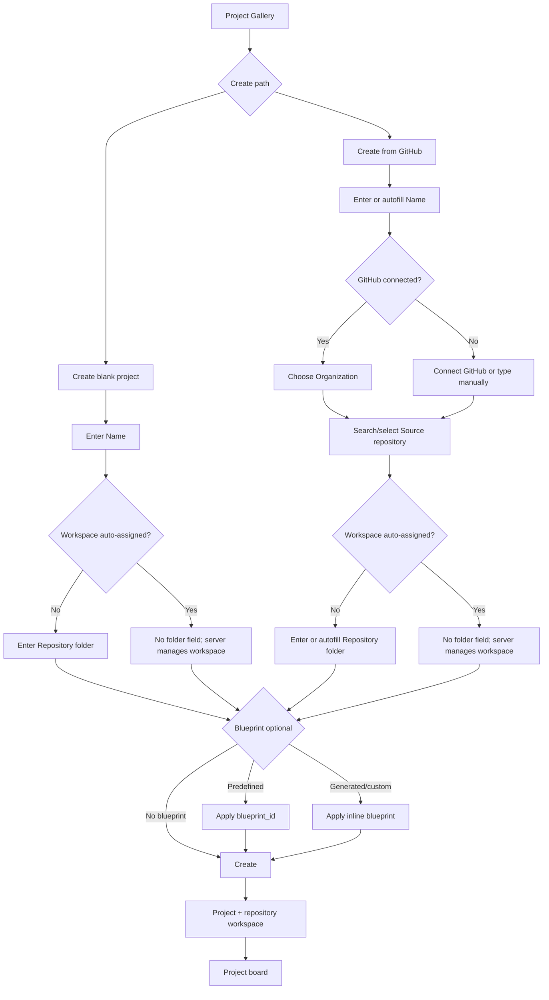

# Projects experience

Projects are the front door to Agentweaver. A project names the work, anchors it to a repository workspace, and carries the defaults that shape every run in that repository.

Scope: this page covers creating, switching, summarizing, configuring, recovering, and deleting projects across the web UI and current MCP tools.

See also: [Overview](./00-overview.md), [Runs & board](./runs-board-watch.md), [Team & casting](./team-casting-memory.md), [Working with Projects](../guide/projects.md), and [Projects & Workspaces](../deep-dive/projects.md).

## Mental model

An Agentweaver **project** is a durable container around a repository and Agentweaver's work against it. It answers five user-facing questions:

- **What am I working on?** The project has a user-facing name and stable project id.
- **Where is the repository?** The project points at a working directory on the Agentweaver server, or at a server-managed workspace.
- **Where did it come from?** The origin is **blank** or **GitHub**.
- **Which defaults apply?** The project carries model provider settings plus blueprint-applied team, workflow, review, and sandbox choices.
- **Can Agentweaver use it now?** The `available` state reflects whether the workspace can be reached.

The project record and the workspace are separate. Renaming changes the record, not the repository path. Relinking changes the path, not the project identity. Deleting removes the Agentweaver project record and run history from the app experience; repository files are treated as workspace state, not casually destroyed from the gallery.

## Project Gallery

The **Project Gallery** is the landing page. The page title is **Projects** with the subtitle **Your Agentweaver projects.** It is where users scan work, create projects, and switch projects.

When projects exist, the toolbar shows:

- **Create blank project**
- **Create from GitHub**

Each project card shows:

- Project name
- Source repository, when present
- Working directory path
- Availability badge
- **Open** action

The availability badge is direct:

- **Available** means Agentweaver can access the working directory.
- **Unavailable** means the project record exists, but the local directory or mounted workspace is missing or inaccessible.

Unavailable projects remain visible because the recovery action is still available: open the project, follow the warning, and relink it in Settings.

### Switching projects

Click **Open** on a card to enter that project. The user switches by choosing the visible card; Agentweaver routes by stable project id behind the scenes, so later renames do not change project identity.

### Empty and auth states

If no projects exist, the gallery says:

> No projects yet. Create one to get started.

The same **Create blank project** and **Create from GitHub** actions appear in the empty state, so first-run setup uses the normal creation flow.

If GitHub sign-in is required to list projects, the gallery says:

> Sign in with GitHub to see your projects.

The action is **Sign in with GitHub**. This is not the same as an unavailable project: sign-in controls whether projects can be listed; availability controls whether a listed workspace can be used.

## Creating a project in the web UI

Creation starts from the gallery. Users choose a blank repository or a GitHub-backed repository, then optionally apply a blueprint. Both create dialogs use the same shape: project and repository fields on the left, blueprint selection and generation on the right.

### Create blank project

**Create blank project** starts a new Git repository under Agentweaver's control. The dialog title is **Create blank project**.

Required fields:

- **Name** with placeholder **My project**
- **Repository folder**, unless the workspace is auto-assigned

The **Repository folder** hint adapts to server mode. If the server has a data directory, the field asks for a folder name inside that directory and displays the directory prefix. If not, it asks for an absolute path to a Git repository on the machine running the Agentweaver server. If workspaces are auto-assigned, the field is hidden because the server controls the final workspace path.

The **Create** button enables only when required values are present. During submission it reads **Creating** and shows a spinner.

Creation is for a new controlled workspace. The target directory must be empty or not yet exist. If the user wants to reconnect existing content, the correct action is **Relink repository** in Settings.

### Create from GitHub

**Create from GitHub** clones a repository and records its GitHub origin. The dialog title is **Create project from GitHub**.

Required fields:

- **Name**
- **Organization**, when GitHub accounts are loaded
- **Source repository**
- **Repository folder**, unless the workspace is auto-assigned

The **Organization** picker lists GitHub accounts and organizations, including avatars and an **Org** badge for organizations. The first account is selected automatically when accounts load.

The **Source repository** field is searchable and freeform. Its placeholder reflects the current state:

- **Loading...** while accounts load
- **Select an account first** before an organization is selected
- **Loading repositories...** while repositories load
- **Search or enter owner/repo** when ready

If GitHub is not connected, the dialog says:

> Connect your GitHub account to list repositories, or type owner/repo manually.

The action is **Connect GitHub**. Users can still type a repository manually.

### Autofilled but overridable fields

Agentweaver speeds up setup without locking the user in.

For a blank project:

- Typing **Name** slugifies the name into the repository folder.
- If the user edits **Repository folder**, Agentweaver stops replacing it from the name.
- In auto-assigned workspace mode, the folder field is hidden; the server owns the final path.

For a GitHub project:

- Selecting a repository fills **Source repository**.
- If **Name** is empty, the repository slug becomes a title-cased project name.
- The repository slug fills **Repository folder** unless the user already edited that field.
- In auto-assigned workspace mode, the folder field is hidden and the final path is server-managed.

This makes the common path fast while preserving explicit control before **Create**.

## Blueprints as the starting point

A **blueprint** is the fastest way to turn a repository into a working Agentweaver environment. It bundles:

- **Team roster** — the roles available in the project
- **Workflow** — the run flow Agentweaver should use
- **Review policy** — the gates that review or approve work
- **Sandbox profile** — the command and network posture for agent execution

The creation dialogs show **Blueprint (optional)** with **No blueprint** selected by default. Predefined blueprint options show the blueprint name, description, and roster chips. The generation path has the label **Or describe the work Agentweaver should run**, a text area, and **Generate blueprint**.

Generated blueprints configure Agentweaver agents, workflow, review policy, and sandbox posture for operating the use case. When generation succeeds, Agentweaver auto-selects the generated blueprint and shows a preview with the name, description, roster, workflow, review policy, and sandbox profile.

The same model exists in MCP: predefined blueprints are applied by `blueprint_id`; generated or custom blueprints are applied inline. A create request must provide `blueprint_id` **or** inline `blueprint`, not both.

## MCP project creation and management

Use MCP when an agent or script needs to manage projects without the web UI.

Current scope note: the web UI is the complete GitHub repository-linking create flow; current MCP `project_create` accepts origin and workspace fields plus blueprint fields, but does not expose a `source_repository` argument.

### Project tools

| Tool | User outcome |
|---|---|
| `project_list` | List all Agentweaver projects. |
| `project_get` | Get one project by id, including name, origin, working directory, provider settings, state, and availability. |
| `project_create` | Create a project with name, working directory, optional origin, and optional blueprint. |
| `project_rename` | Rename the project display name. |
| `project_relink` | Point the project at a new working directory after a move or mount change. |
| `project_delete` | Delete the project record. |
| `project_configure` | Configure default model provider settings. |
| `project_list_runs` | List all runs for a project. |

### Blueprint and catalog tools

| Tool | User outcome |
|---|---|
| `list_blueprints` | List predefined blueprints, each with team roster, workflow, review policy, and sandbox profile. |
| `validate_blueprint` | Validate an inline blueprint object against schema and role constraints. |
| `blueprint_generate` | Generate a blueprint from a natural-language description of team and goals. |
| `catalog_list_roles` | List available agent roles from the catalog. |
| `catalog_list_scenarios` | List available casting scenario templates. |

### MCP create patterns

For a predefined blueprint:

1. Call `list_blueprints`.
2. Pick a blueprint id.
3. Call `project_create` with `name`, `working_directory`, `origin`, and `blueprint_id`.

For a generated blueprint:

1. Call `blueprint_generate` with a natural-language description.
2. Inspect the returned blueprint and generated workflow YAML.
3. Call `project_create` with `name`, `working_directory`, `origin`, inline `blueprint`, and `generated_workflow_yaml`.

For a custom inline blueprint:

1. Use `catalog_list_roles` and `catalog_list_scenarios` to understand available roles and patterns.
2. Build the inline blueprint.
3. Call `validate_blueprint`.
4. Call `project_create` with the inline `blueprint`.

The mutual exclusivity rule is intentional. If both `blueprint_id` and `blueprint` are supplied, Agentweaver rejects the request rather than guessing which starting point should win.

## Project board home

Clicking **Open** lands on the project board home. This is the day-to-day work surface, not the metrics dashboard.

The page title is the project name. The subtitle is:

> Backlog, Ready, and in-flight work.

If the project is unavailable, the page warns:

> This project is unavailable. The working directory may have moved. Go to settings to relink it.

The warning links to project Settings.

The main content is the board, followed by **Runs**. The runs list shows status, task text, start time, and navigation into execution details. Normal runs have **Workflow**. Coordinator orchestrations have **Topology**. Non-terminal runs can show **Abandon**. Terminal runs can be deleted from the list.

When there are no runs, the page says:

> No runs yet. Start one above.

The board home answers, "What is happening in this project right now?" The dashboard answers, "How is this project performing?"

## Project Dashboard

The project Dashboard summarizes delivery metrics. The title is **Dashboard** and the subtitle is:

> Delivery metrics and the agent leaderboard.

It refreshes every 30 seconds and includes **Refresh**. When data is loaded, the header shows the last updated time and a refresh countdown.

Summary cards show:

- **Runs this week**
- **Active agents**
- **Active runs**
- **Runs total**
- **Tasks done (7d)**

The **Throughput (last 30 days)** chart has **Created** and **Done** series. If there is no data, it says:

> No throughput data yet.

The **Agent leaderboard** shows agent, role, runs this week, runs total, success rate, and average duration. The UI defines success rate as:

> Success rate = successful terminal runs / terminal runs (queued, waiting-review, and in-progress excluded).

If no agent activity exists, it says:

> No agent activity yet.

The Agent name links into a filtered project flow view, so the dashboard works as both a summary and a path to investigation.

## Project Settings

Project Settings changes the project record and project policies. The title is **Project settings** with subtitle:

> Project configuration and pickup behavior.

The left rail sections are:

- **General** — project name, repository link, and default model
- **Sandbox policy** — command execution and reachability
- **Review policy** — review gates for project work
- **Danger Zone** — irreversible project action

The selected section is deep-linked through the URL query.

### General

#### Rename project

**Rename project** changes the display name only. It does not move the workspace, change the project id, or rewrite the repository. The field is **Name**, the action is **Save**, and success shows **Project renamed.**

MCP equivalent: `project_rename`.

#### Relink repository

**Relink repository** updates the server-side path when the repository has moved. The explanatory text is:

> Update the server-side path if the repository has moved on the Agentweaver server.

The field is **Repository path**. The hint either references the server data folder or asks for an absolute path to a Git repository on the server machine. Success shows **Project relinked.**

MCP equivalent: `project_relink`.

Use relink when a local checkout moved, a mount path changed, or the project shows **Unavailable**. Relinking preserves the project id, history, and defaults while changing where Agentweaver finds the base repository.

#### Default model

**Default model** sets the model used by default for future runs. In the web UI, the field is **GitHub Copilot model** with placeholder **e.g. gpt-4o**. Success shows **Model settings saved.**

MCP equivalent: `project_configure`.

The MCP tool can set `default_provider`, `default_model_github_copilot`, and `default_model_microsoft_foundry`. The user-facing meaning is simple: future runs inherit these defaults unless a run chooses another model.

### Sandbox policy

**Sandbox policy** controls how agent commands execute and what they may reach. The section shows:

- **Shell execution**
- **Sandbox enabled**
- **Outbound network**
- **Allowed repository roots**
- **Blocked command patterns**

The action is **Save** and success shows **Sandbox policy saved.** Blueprint selection can set the initial sandbox posture; Settings is where users inspect and adjust it later.

### Review policy

**Review policy** chooses which review steps gate project work. The section includes **Sync**, the active policy summary, and policy cards.

Cards can show **Active**, **Built-in**, **Custom**, **Valid**, and **Invalid** badges, plus policy description, review step chips such as **Rubberduck**, **RAI**, and **Human review**, source, validation errors, and **Set as active** for valid inactive policies.

If none are found, the page says:

> No review policies found. Sync to load from .agentweaver/review-policies/.

Blueprints can choose the initial review policy. Settings controls the active policy after creation.

### Danger Zone

**Danger Zone** contains **Delete project**. The text says:

> This action cannot be undone. The project and all its run history will be permanently removed.

The user must check **I understand this is permanent** before **Delete project** enables. While the action runs, the button reads **Deleting**.

MCP equivalent: `project_delete`.

Use delete for an unwanted project record. Use relink for a moved repository.

## Edge cases

### Project is unavailable

A project shows **Unavailable** when the workspace cannot be reached. On the board, Agentweaver tells the user the working directory may have moved and links to Settings.

Recovery path:

1. Find the correct repository path on the Agentweaver server.
2. Open Settings.
3. Use **Relink repository**.
4. Return to the project.

MCP path: call `project_get`, then `project_relink`, then `project_get` again to confirm availability.

### Repository moved after creation

Do not create a second project just because files moved. Relink keeps the same project id, run history, dashboard history, and defaults.

### Autofill chose the wrong folder

Before creation, edit **Repository folder**; Agentweaver stops overwriting it. After creation, use **Relink repository**.

### GitHub repositories do not load

The dialog shows **Retry** for load failures. If GitHub is not connected, it shows **Connect GitHub** and still permits manual repository entry.

### Blueprint load or generation fails

Creation can continue with **No blueprint** if predefined blueprints do not load. Generation errors appear inside the blueprint column. In MCP, use `validate_blueprint` before `project_create` for hand-built or modified inline blueprints.

### Delete confirmation blocks the button

This is expected. **Delete project** stays disabled until **I understand this is permanent** is checked.

## Choosing the right action

| User intent | Web action | MCP tool |
|---|---|---|
| Start empty | **Create blank project** | `project_create` |
| Start from GitHub | **Create from GitHub** | Use web UI for current full repository-linking flow |
| Apply a ready operating model | Select predefined **Blueprint** | `list_blueprints`, then `project_create` with `blueprint_id` |
| Generate an operating model | **Generate blueprint** | `blueprint_generate`, then `project_create` with inline `blueprint` |
| See projects | Project Gallery | `project_list` |
| Inspect one project | **Open** / project pages | `project_get` |
| Rename | Settings → **Rename project** | `project_rename` |
| Recover moved repo | Settings → **Relink repository** | `project_relink` |
| Change model defaults | Settings → **Default model** | `project_configure` |
| See runs | Board **Runs** | `project_list_runs` |
| Remove project record | Danger Zone → **Delete project** | `project_delete` |

## Experience principles

Projects work when Agentweaver keeps three promises:

1. **Make the repository boundary visible.** Cards, settings, and MCP all surface the working directory or repository identity.
2. **Recover instead of hiding.** Unavailable projects stay visible because relink is the right next action.
3. **Start with an operating model.** Blueprints make team roster, workflow, review policy, sandbox, and model defaults part of project setup instead of scattered follow-up tasks.

The result is a concrete project experience: named repositories with visible status, quick creation paths, recoverable workspace links, and repeatable defaults for every run.
