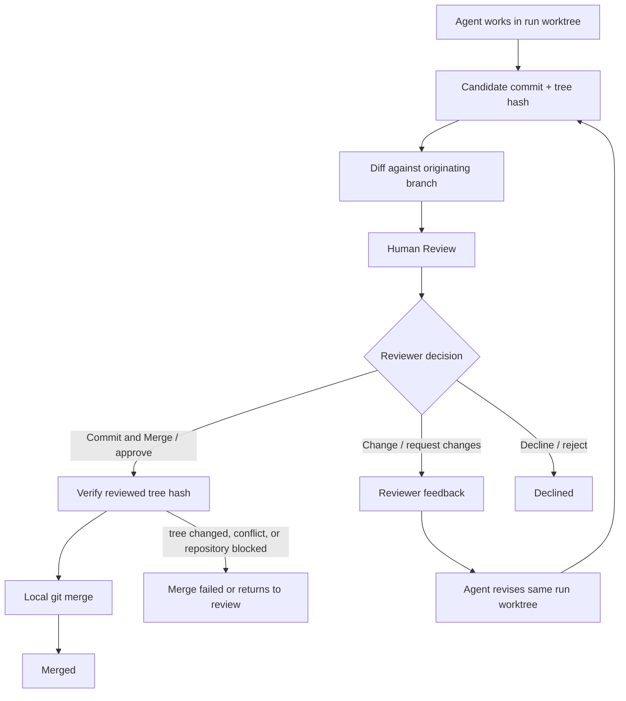
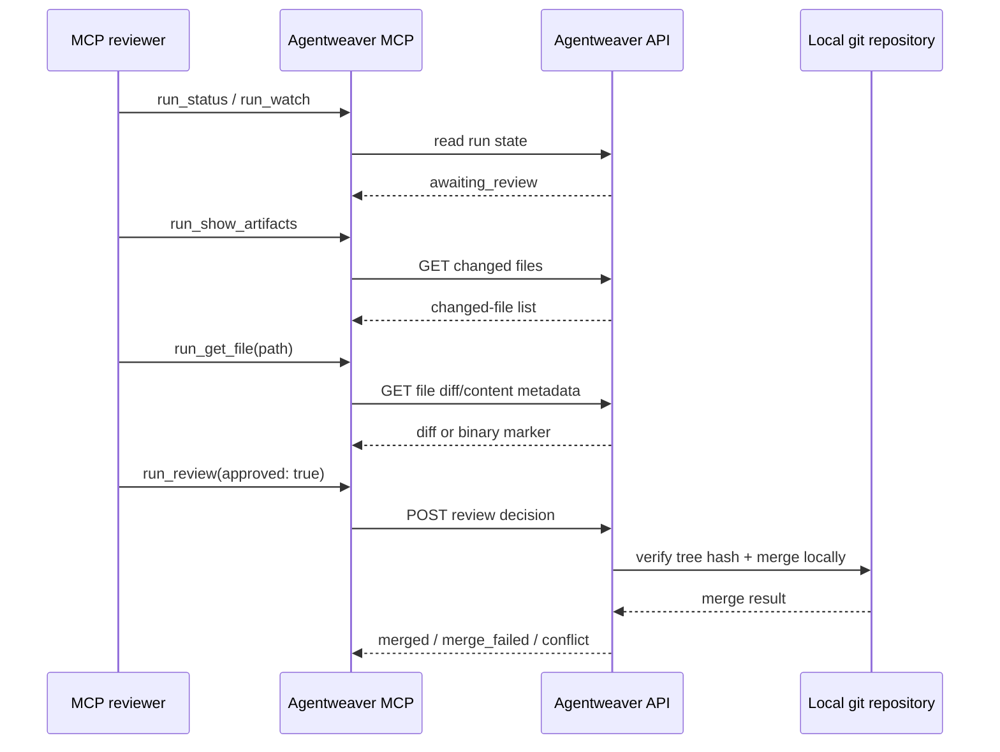
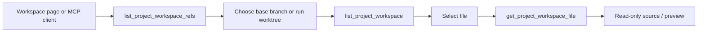

# Review, Workspace & Merge Experience

Agentweaver makes agent work reviewable before it becomes repository history. The web UI gives reviewers a file-by-file review surface, a read-only workspace browser, and explicit **Commit and Merge**, **Change**, and **Decline** actions; MCP exposes the same core artifacts and local repository operations through named tools. This page explains what users see, what each decision means, and why Agentweaver treats the reviewed tree hash as the boundary between proposed work and merged work.

Related docs: [Overview](./00-overview.md), [Runs & board](./runs-board-watch.md), [Coordinator & orchestration](./coordinator-orchestration.md), [Reviewing and Merging](../guide/review.md), [Review & Merge deep dive](../deep-dive/review-merge.md), and [Git Integration deep dive](../deep-dive/git-integration.md).

## The mental model

A run is not a hidden edit to the project checkout. Agentweaver creates a run branch and worktree, lets the agent work there, commits the candidate result, computes a diff against the originating branch, and pauses at review. The reviewer sees the proposed tree, the changed files, and the run timeline before deciding whether the work should merge, revise, or stop.

The review surface is intentionally local-first. Agentweaver can complete review and merge without a remote, so blank projects and local-only repositories have the same experience as cloned projects. Pushing run branches and opening remote pull requests are out of scope; remote PRs can be useful outside Agentweaver, but they are not the authoritative review surface.

The most important product contract is: **approval binds to content, not to a mutable branch name**. The reviewed tree hash identifies the candidate filesystem. Merge checks that the candidate branch still matches that tree hash before advancing the originating branch.

## Human Review in the web UI

When a run reaches **Human Review**, its status becomes `awaiting_review` and the run detail page opens the left file rail. The center of the page remains the run timeline, so the reviewer can read the agent messages and tool history while inspecting files. The left rail is the action surface: it contains the file tabs and the review controls.

The reviewer sees:

- a **Changes** tab with the changed-file list and line counts;
- a **Files** tab with the full run worktree browser;
- the proposed commit message when one is available;
- **Commit and Merge**, **Change**, and **Decline** controls while the run is awaiting review;
- processing spinners and inline errors when a review, request-changes, or merge action is in flight;
- result badges after an action is accepted, such as `merged`, `declined`, or `changes_requested`.

The file rail automatically expands when the run enters review. That matters for the experience: the user does not have to discover a separate page or remote PR. The candidate work, timeline, and decision buttons are together.

### Approve: Commit and Merge

**Commit and Merge** is the primary approval action in the web UI. It means: "I accept this candidate tree and authorize Agentweaver to merge it to the originating branch." Approval does not ask the agent to make more edits. It moves the run from review toward guarded local merge.

After the reviewer clicks **Commit and Merge**, Agentweaver starts the merge path. The UI shows a pending state, then updates the run as merge events arrive. If the merge succeeds, the originating branch contains exactly the reviewed changes and the run reaches a merged terminal state. If the repository cannot accept the merge safely, the run reports the problem instead of silently changing the reviewed content.

Approval is a content decision. The merge executor still verifies the candidate tree hash, serializes repository updates, and checks that the run branch and originating branch are in a safe state. A reviewer approves the diff; Agentweaver proves the repository can accept it.

### Request changes: Change

**Change** is the revision path. The reviewer clicks **Change**, types feedback into **Describe what the agent should change**, and clicks **Send**. **Cancel** closes the feedback box without changing the run.

A request-changes decision does not merge the current tree. Agentweaver records the feedback, marks the review step as revise, clears stale run-scoped approvals, abandons the paused review workflow, and starts a new revision cycle on the same run worktree. The agent receives the original task plus the reviewer feedback as untrusted review data and applies the requested changes in the existing worktree.

When the revision finishes, the run returns to **Human Review** with a new candidate tree and diff. The review bar appears again even if an earlier request-changes result is still visible in local UI state. The reviewer then makes a fresh decision on the revised output.

### Reject: Decline

**Decline** is the terminal rejection path in the web UI. It means the reviewer does not want this run's current work to continue. The run becomes declined, the originating branch stays unchanged, and the reviewer should submit a new run if they want a different attempt.

Use **Decline** when the work is not worth revising in place, when the task is obsolete, or when the reviewer wants to discard the candidate. Use **Change** when the direction is right but the output needs specific fixes.

### Reviewer lockout at the UX level

Reviewer lockout means the producer path and the approval path are separate. The agent that produced the revision cannot approve or merge its own output; it can only produce, revise, and wait at the review gate. A human reviewer action is required to leave **Human Review** through approval or rejection.

Agentweaver records the reviewer identity on review and merge-related transitions when it is known. The pending review request is consumed at most once, so a double click, replayed request, or competing client does not create two decisions. If one decision moves the run out of `awaiting_review`, later attempts see conflict-style behavior instead of racing the merge.

This is not a remote pull-request ownership model. The product lockout is between the agent-produced candidate and the human review decision inside Agentweaver. Remote PR authorship and branch protection are outside this review surface.

## MCP review tools

MCP clients use named tools instead of buttons, but the same run state is being inspected.

### `run_review`

`run_review` submits a binary review decision for a run that is awaiting review:

- `approved: true` approves the run and sends it toward merge;
- `approved: false` rejects/declines the run.

The MCP tool is intentionally simple: it maps to approve or reject. The web **Change** flow is the feedback-bearing request-changes path; the current MCP `run_review` tool does not carry a reviewer comment or start the dedicated request-changes revision endpoint. For MCP-driven review, inspect artifacts first, then call `run_review` only when the decision is approve or reject.

### `run_status` and `run_watch`

`run_status` shows the current state of a run, including whether it is awaiting review, merged, declined, failed, or merge-failed. `run_watch` streams progress and reports review-related transitions such as **Run awaiting review**. Together they let an MCP client know when the review gate is ready and when a decision has completed.

## Artifact and diff experience

The Artifact Browser is the reviewer's file-focused lens on a run. It appears as the left rail in the run layout and as a combined browser/diff component in contexts that render both panes together. It has two tabs: **Changes** and **Files**.

### Changes tab

The **Changes** tab is the default review tab. It shows **Branch Changes** with total added and removed line counts, then a flat changed-file list. Each changed file row shows:

- the file name;
- added and removed line counts, such as `+12` and `-3`;
- a status badge: `A` for added, `M` for modified, `D` for deleted;
- a status-colored icon: green for added, marigold/orange for modified, red for deleted.

Clicking a row opens the file viewer modal. For changed files, the modal defaults to **Diff**. Markdown files also offer **Preview**, so reviewers can inspect rendered documentation while still reviewing the exact diff.

The changed-file list is optimized for review. It answers: "What would this run add, modify, or delete on the originating branch?" The diff is computed against the originating branch, not merely against the last commit, so the reviewer sees the full candidate contribution.

### Files tab

The **Files** tab shows the full run workspace tree. It is useful when the reviewer needs context around changed files: neighboring files, generated files, docs, or project structure. Folders expand and collapse in a tree. Files are sorted with folders first, and file icons reflect common file types such as Markdown, code, JSON, stylesheets, images, PDFs, lockfiles, and generic documents.

Clicking a file in **Files** opens the same file viewer modal, but unchanged files are treated as source/preview content rather than diffs. Markdown opens in rendered **Preview** by default; other files open as syntax-highlighted **Source** with line numbers.

### File viewer modal

The modal is the focused reading surface. It opens at a large viewport size, has a **Close** button, and preserves the distinction between changed and unchanged files.

Changed files show:

- **Diff** for the patch view;
- **Preview** for Markdown content when available;
- `Binary file — diff not available` for binary changed files.

Unchanged or workspace files show:

- **Source** for syntax-highlighted file content;
- **Preview** for Markdown files;
- `Binary file` for binary content;
- `File too large to display` when the content endpoint reports that the file is too large for inline display.

This gives reviewers a practical path through common cases. Code changes are reviewed as diffs, documentation can be reviewed both as Markdown source and rendered output, and binary or oversized content is clearly identified instead of rendered incorrectly.

### Large diffs and binary assets

Large diffs and binary assets are edge cases by design. Agentweaver does not pretend every file is readable inline.

For binary changed files, the diff viewer displays `Binary file — diff not available`. The file remains visible in the changed-file list with its added/modified/deleted status, so the reviewer knows the asset changed even though there is no textual patch.

For large source files in content view, the file viewer displays `File too large to display`. The reviewer can still use the changed-file metadata, the diff when available, the run timeline, and local repository tools to inspect the content outside the browser. The UI favors a truthful empty/too-large state over freezing the review surface.

### No-change runs

A run can reach a review-related surface with no changed files. The **Changes** tab handles this explicitly. At a review gate, an empty list becomes: **This run produced no changes to review.** The UI adds that agents may have written output outside the repository or that there was nothing to change. In coordinator contexts, it can also list subtasks that produced no changes.

This is important because Agentweaver avoids empty candidate commits. A zero-diff run should not look like shipped work. The reviewer sees that there are no repository changes and can decide whether to decline, request changes through the web flow, or submit a new task.

### Historical artifact state

After terminal states such as merged, declined, merge failed, or failed, the Artifact Browser treats the view as historical. It displays the artifact state at run completion and fixes the active filter to all changed files. This helps post-review inspection: the user is not editing the run, but they can still understand what was proposed or merged.

## MCP artifact tools

MCP mirrors the artifact experience with two review-oriented tools.

### `run_show_artifacts`

`run_show_artifacts` lists the files changed by a run. It is the MCP equivalent of opening the **Changes** tab. The response is the changed-file inventory: paths, statuses, and line-count metadata used by the UI to present added, modified, and deleted files.

Use it first when reviewing from an MCP client. It answers which files need attention before you fetch any individual content or diff.

### `run_get_file`

`run_get_file` fetches one changed file by run id and path. It is the MCP equivalent of selecting a file in the Artifact Browser. For changed files, the response can include the diff and file metadata, including whether the file is binary. For content-oriented inspection, the related file content endpoints are what the web modal uses to show **Source** and **Preview**.

Paths are relative to the run workspace. The tool accepts normal workspace paths and encodes them safely for the API. Reviewers should pass the path exactly as returned by `run_show_artifacts`.

A typical MCP review loop is:

1. `run_status` or `run_watch` until the run is awaiting review.
2. `run_show_artifacts` to list changed files.
3. `run_get_file` for each file that needs detailed inspection.
4. `run_review` with `approved: true` to approve or `approved: false` to reject.

## Workspace experience in the web UI

The **Workspace** page is a project-scoped, read-only file browser. It is not the review decision surface and it does not expose commit or merge controls. It exists so users can browse the project repository and active run worktrees without leaving Agentweaver.

The page header says **Workspace** and the subtitle explains the scope: **Browse the project repository and active run worktrees, read-only.** The breadcrumb leads from **Projects** to the project and then to **Workspace**. The toolbar shows the current branch with a branch icon and a **Branch or worktree** dropdown.

The dropdown contains the base project ref and any browsable run worktrees or coordinator assembly refs. Non-base refs can show a run-status badge, such as running, dispatched, completed, merged, failed, merge_failed, blocked, or parked. Selecting a different ref reloads the file tree and clears the open file.

### Browsing files

The Workspace page has two panes:

- the left pane is the file tree;
- the right pane is the read-only file viewer.

The tree uses the same underlying file-tree experience as the run **Files** tab. Folders expand and collapse. Selecting a file opens it in the right pane. If nothing is selected, the right pane says **Select a file to view its contents.** If the selected branch has no files, it says **No files in this branch yet.**

The file viewer uses the same **Source** and **Preview** behavior as the run file viewer. Markdown files can be rendered as preview; other text files are syntax-highlighted with line numbers; binary and oversized files display clear non-rendered states.

### Import to backlog

When the selected workspace file is Markdown, the page shows **Import to backlog**. This is a workspace-specific action for turning a spec-like Markdown file into backlog items. It does not change the review or merge model. The file browser remains read-only with respect to repository content.

### Workspace file picker

The `WorkspaceFilePicker` component is a smaller file-selection experience used where a dialog or form needs the user to pick a workspace file. It loads workspace files, shows **Loading workspace files...** while fetching, displays **No files found in workspace.** when empty, and shows **Selected: path** after the user picks a file. It shares the same read-only intent: choose a file, do not edit it.

## MCP workspace tools

MCP exposes the workspace browser as three tools. These tools are read-only and project-scoped.

### `list_project_workspace_refs`

`list_project_workspace_refs` lists the browsable refs for a project workspace. The response includes the base branch and active run worktrees. This is the MCP equivalent of opening the **Branch or worktree** dropdown on the Workspace page.

Use it when you need to know what can be browsed: the current project branch, a run branch, or a worktree associated with an active run.

### `list_project_workspace`

`list_project_workspace` lists the flat file tree for a project workspace at a given ref. If the ref is omitted, it defaults to the base branch. This is the MCP equivalent of loading the left file tree on the Workspace page.

The tool returns paths and file/folder metadata. MCP clients can use the flat list to construct a tree, search for likely files, or present a picker.

### `get_project_workspace_file`

`get_project_workspace_file` returns the content of one file in a project workspace at a given ref. If the ref is omitted, it defaults to the base branch. This is the MCP equivalent of selecting a file in the Workspace page and reading it in the right pane.

The path is relative to the workspace and should use forward slashes, such as `src/main.cs`. The response includes content metadata, including binary or too-large signals, so an MCP client can avoid rendering content that is not suitable for inline display.

## Merge experience

Merge starts only after approval. In the web UI, approval is **Commit and Merge**. In MCP, approval is `run_review` with `approved: true`. Both feed the same local merge model.

Agentweaver merges locally. It does not require a remote, does not push the run branch, and does not open a pull request. This is deliberate: the reviewed artifact is the local candidate tree hash and diff, and the merge target is the local originating branch. Local-first merge lets Agentweaver support blank repositories, local projects, and cloned projects with one review model.

The trade-off is plain: remote PRs are not the authoritative review surface in Agentweaver. If a team also wants a remote PR, that workflow belongs outside the current API boundary.

### What merge checks

Before it advances the originating branch, Agentweaver checks the repository state. The merge path verifies that the run branch exists, the originating branch exists, and the run branch tree still equals the approved tree hash. It serializes repository updates so two approvals for the same repository do not race each other.

If the target branch can be fast-forwarded, Agentweaver can advance it directly. If a merge commit is needed, Agentweaver performs a local git merge. If the base workspace has unrelated uncommitted changes, Agentweaver can use a ref-only merge path that advances the branch ref without overwriting local files. In that case, the checked-out files may not visibly change until the user synchronizes the workspace.

### Merge success

On success, the run reaches merged state. The originating branch contains the approved changes. Successful normal merges clean up the run worktree and branch, because the candidate content is now represented by the originating branch history.

The reviewer does not need a remote to complete this. A local blank project can be reviewed and merged end to end.

### Merge conflicts and merge failed

If the originating branch has diverged and the candidate no longer applies cleanly, Agentweaver does not invent a resolution. The run becomes `merge_failed`, conflict information is stored where available, and the worktree is preserved for inspection. This is a safety feature: the reviewer approved a specific tree, not an unreviewed conflict resolution.

A merge can also fail if the approved tree hash no longer matches the run branch. That protects against manual mutation of the worktree or branch after review. Approval is tied to the tree hash, so a changed candidate must go through review again.

### Repository busy or interrupted merge

Repository updates are serialized. If another merge is already operating on the same repository, a merge can return a retriable conflict instead of racing. If the process is interrupted, recovery prefers a retryable review state when possible.

## Re-review after requested changes

Requesting changes creates a new review loop, not a side comment on the old diff. The current candidate is rejected for merge, feedback is stored, and the same run worktree is reused for revision. The agent works from the existing files, applies feedback, and produces a new candidate commit and tree hash.

When the revised run returns to **Human Review**, the reviewer should treat it as a fresh decision:

1. Read the updated timeline to see what the agent changed.
2. Open **Changes** and review the new branch diff.
3. Use **Files** or **Workspace** when context is needed.
4. Click **Commit and Merge** if the revised tree is acceptable.
5. Click **Change** again if more targeted feedback is needed.
6. Click **Decline** if the run should stop.

There is no fixed number of review loops in the UI experience. The server enforces its configured revision cap, and the UI reports an error if the cap is reached.

## How to choose the right surface

Use the run review surface when deciding whether a candidate should merge. It has the changed-file list, diff modal, timeline, and review actions in one place.

Use the Workspace page for read-only context across the project repository or active run worktrees. Use MCP when the reviewer is an assistant, script, or terminal client that needs refs, workspace files, artifacts, diffs, and approve/reject decisions.

| User goal | Web surface | MCP tool |
|---|---|---|
| See whether a run is waiting for review | Run detail / timeline | `run_status`, `run_watch` |
| List changed files for a run | **Changes** tab | `run_show_artifacts` |
| Inspect one changed file | File viewer modal **Diff** | `run_get_file` |
| Browse the full run worktree | **Files** tab | `list_project_workspace` for a run ref, or run workspace-backed APIs |
| Browse project refs and worktrees | **Workspace** page dropdown | `list_project_workspace_refs` |
| Read a workspace file | Workspace file viewer | `get_project_workspace_file` |
| Approve and merge | **Commit and Merge** | `run_review` with `approved: true` |
| Request revision feedback | **Change** → **Send** | Web review action; current MCP `run_review` is binary |
| Reject the run | **Decline** | `run_review` with `approved: false` |

## Edge cases reviewers should expect

### Large text files

The file viewer can decline to render very large file content inline and show **File too large to display**. Review the diff when available, use the changed-file metadata to understand scope, and inspect locally if necessary.

### Binary assets

Binary files appear in the changed-file list with status and counts, but textual diffs are not available. The modal shows **Binary file — diff not available** for changed binaries and **Binary file** for source/content viewing.

### Runs with no changes

The **Changes** tab says **This run produced no changes to review.** This usually means there was nothing to change or the agent wrote outside the repository. Agentweaver avoids empty commits, so no-change work is represented honestly.

### Requested changes followed by another review

After **Change** → **Send**, the run goes back into progress and later returns to review. The reviewer should inspect the new diff, not rely on the old one. The new tree hash is the candidate that approval binds to.

### Merge conflicts

A merge conflict turns approval into `merge_failed` rather than silently editing the result. The worktree is preserved for inspection. A reviewer or operator can inspect the conflict, decide how to proceed, and submit a new run or resolve outside the automated merge path.

### Tree hash mismatch

If the candidate branch changes after review, merge refuses it. The approved content identity no longer matches the branch. The safe path is another review over the new tree.

## Summary

The REVIEW, WORKSPACE, and MERGE experiences are one local-first flow. Runs create candidate worktrees; reviewers inspect artifacts and diffs; workspace browsing provides read-only context; approval merges the reviewed tree locally; request changes loops the run back through revision; rejection stops it. MCP exposes the same core inspection and binary approve/reject decisions for terminal clients, while the web UI provides the richer feedback loop for re-review.

