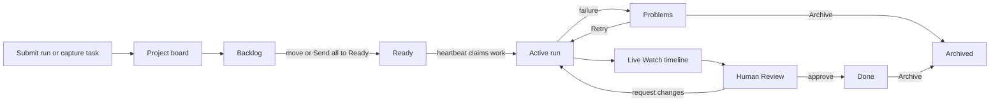
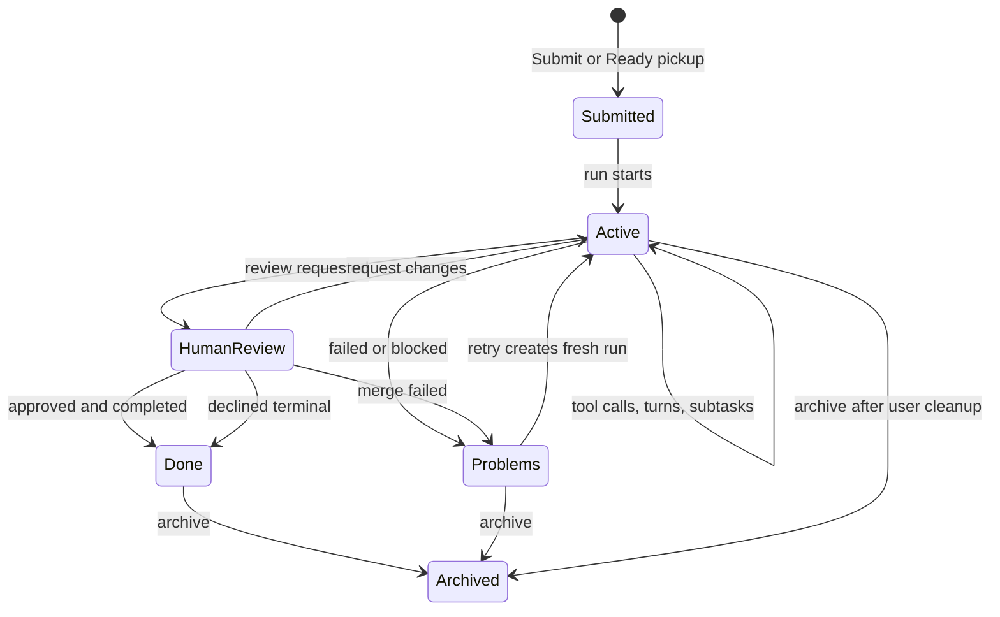

# Runs, Board, and Live Watch

A run is the visible unit of work in Agentweaver: you submit an outcome, watch the coordinator and agents execute it, review the result, and keep the project board clean as work moves from idea to done. The web UI and MCP tools expose the same experience at different distances: the UI gives you a live workspace and Kanban board, while MCP lets another assistant submit, inspect, stream, retry, and archive runs without leaving its conversation. This guide follows the user journey from submission to board tracking to live watch.

Scope: this page describes the run submission, board, and live watch experience; detailed review, workspace browsing, and merge decisions live in [Review, workspace & merge](./review-workspace-merge.md).

## The mental model

Agentweaver separates **work intake** from **run execution**.

- A **task** is an item on the project board. It may sit in **Backlog** or **Ready** before the coordinator claims it.
- A **run** is active execution. It has a run id, status, event stream, timeline, artifacts, review state, and lifecycle history.
- The **board** is the shared operational view. It shows tasks that have not started and run cards that are moving through execution, review, and completion.
- The **watch page** is the live run view. It shows the event stream as turn groups, agent messages, tool calls, lifecycle cards, approvals, and terminal status.
- **MCP tools** provide parity for assistants and automations: submit with `run_submit`, inspect with `run_status`, stream with `run_watch`, manage intake with `backlog_*`, and clean up with `run_archive` or `backlog_archive_task`.

The product shape is intentionally simple: capture work, rank it, let the coordinator claim Ready work, watch live execution, review the result, then archive what no longer needs attention.



## Submitting work

Submitting work answers one question: **what outcome should Agentweaver produce, and where should it work?**

There are two web entry points:

1. a direct run submission form for a single run, and
2. the project board intake path, where you capture tasks into Backlog or Ready and let the coordinator heartbeat pick them up.

MCP mirrors both patterns. Use `run_submit` when you want a run now. Use `backlog_capture_task`, `backlog_move_to_ready`, and related board tools when you want queue discipline.

### Direct web submission

The direct submission form presents three required fields:

| Field | What the user provides | Why it matters |
| --- | --- | --- |
| **Repository path** | The local path to the repository where the agent should work. | This anchors the run workspace and tells Agentweaver which checkout to isolate. |
| **Originating branch** | The branch to base the run on, such as `main`. | This is the source branch for the run worktree and later review or merge context. |
| **Task description** | A natural-language prompt describing the work. | This becomes the agent's task. Clear outcomes create better execution and review artifacts. |

The **Submit** button stays unavailable until all required fields have content. When submission starts, the button reads **Submitting**. If the API rejects the request, the form shows an error message in place so the user can correct the path, branch, or task and submit again.

After a successful submission, the UI navigates to the watch route for the new run. The user's next screen is not a static confirmation page; it is the live execution surface.

Write the task as an outcome, not a command transcript:

> Add a settings page for project heartbeat limits, persist the setting, and include focused tests for the validation behavior.

That gives the run enough context to make decisions while leaving room for the agent to choose the implementation path.

### Project-board submission

Most day-to-day work starts on the project page. The page has the project title, a **Start task** action for starting coordinator work, the Kanban board, and a runs list below the board.

The board's capture bar says **Capture a task into Backlog**. Type a short title and select **Add** or press Enter. The task appears in **Backlog** as a draggable task card. You can then edit the card to add a longer **Description**, choose a workflow override, move it to **Ready**, or archive it if it no longer matters.

The board also supports quick add from each intake column:

- **Add to Backlog** captures a task directly into Backlog.
- **Add to Ready** captures a task and immediately promotes it to Ready.
- **Send all to Ready** bulk-promotes every Backlog task while preserving their relative order.

Use Backlog when work is still being shaped. Use Ready when the item is committed enough for the coordinator to claim.

### MCP submission with `run_submit`

`run_submit` submits a new agent run for a project. Its inputs are:

| Argument | Meaning |
| --- | --- |
| `project_id` | The Agentweaver project to run in. MCP uses the project id rather than a raw repository path. |
| `task` | The task description for the agent. This is the MCP equivalent of **Task description**. |
| `agent_name` | Optional agent selection. Omit it when the project default or coordinator selection should decide. |
| `base_branch` | Optional branch override. This corresponds to the branch context used for the run. |
| `model_source` | Optional model source override. |

Use `run_submit` for immediate work. Use the backlog tools for queued work. The practical distinction is the same as the UI distinction: direct submission starts a run, while backlog capture creates a board item that can be ranked before execution.

Example MCP-oriented flow:

1. call `run_submit` with the project id and task,
2. read the returned run id,
3. call `run_watch` to stream it to completion,
4. call `run_status` for a final snapshot,
5. if the run awaits review, hand off to [Review, workspace & merge](./review-workspace-merge.md).

## The board experience

The board is a six-column Kanban surface:

| Column | What the user sees | Who moves cards there |
| --- | --- | --- |
| **Backlog** | Captured work that is not yet committed. | The user. |
| **Ready** | Ranked work the coordinator may pick up next. | The user, then the heartbeat claims from it. |
| **Problems** | Failed, blocked, declined, or otherwise attention-needed runs. | The coordinator and run lifecycle. |
| **Human Review** | Runs waiting for a person to approve or request changes. | The coordinator and review flow. |
| **Active** | Runs currently moving through coordinator workflow. | The coordinator and heartbeat. |
| **Done** | Completed or merged work. | The coordinator, review, and merge flow. |

The UI presents the columns in that fixed order, with counts in each header and column descriptions beneath the labels:

- **Backlog** — "Captured but not yet committed to. Things you're considering."
- **Ready** — "Committed work that the coordinator and Ralph monitor may pick up next."
- **Problems** — "Blocked, failed, declined, or otherwise needs attention."
- **Human Review** — "Work waiting for a person to review or approve."
- **Active** — "Work currently moving through the coordinator workflow."
- **Done** — "Completed or merged work."

The board can be zoomed with the board controls or Ctrl+scroll so all workflow columns fit on screen. The Done column can hide older terminal history; **Show older** reveals collapsed completed cards, and **Show less** returns to the shorter view.

### Task cards in Backlog and Ready

Task cards show the work before it becomes a run. A card includes:

- the task title,
- optional description,
- the identity that captured it,
- a workflow menu,
- an edit action,
- an archive action.

The workflow menu lets you pin the task to a specific valid workflow or return it to **Use project default**. This is product-level steering before execution starts.

Users can drag task cards:

- within **Backlog** to rank work,
- within **Ready** to rank queued work,
- from **Backlog** to **Ready**,
- from **Ready** back to **Backlog**.

Dragging to **Problems**, **Human Review**, **Active**, or **Done** is rejected with **Only the coordinator moves work into the workflow.** Workflow columns reflect execution state, not manual placement.

### Run cards in workflow columns

Run cards appear once work is claimed or submitted as execution. They are read-only from a workflow-position perspective: the coordinator owns their movement across Problems, Human Review, Active, and Done.

A run card shows:

- the task or run title,
- a status badge,
- the current stage, assembly stage, or work-plan status,
- the agent name when a specific agent is attached, otherwise **Coordinator**,
- **Approval needed** when a pending tool approval exists,
- **Retry** when the run is failed or merge-failed,
- an archive button,
- a **Retried from** link when the run was created by retry.

Selecting a run card opens the coordinator run detail page for that run. From there, the user can inspect the topology, child progress, live timeline, and review path.

### Moving, reordering, and archiving

The board supports two kinds of user movement:

1. intake movement for task cards, and
2. cleanup movement through archive actions.

Intake movement is rank-sensitive. Reordering a task within Backlog or Ready changes its zero-based position in that column. Moving a task between Backlog and Ready can place it at a target position or append it to the end. Ready order matters because heartbeat pickup reads from the Ready queue.

Archive removes a task or run from active board projections. Archive is not review, rejection, or deletion; it is a visibility decision. Use it when the item should no longer occupy the board.

### Retry from a card

Failed and merge-failed run cards show **Retry**. Retry creates a fresh run from the original inputs and navigates to the new run's orchestration view. The new card records where it came from through **Retried from**, so the user can compare the old failure with the new attempt.

Retry is not "continue the same process." The failed run remains a complete record, and the retried run gets its own event stream and lifecycle.

### MCP board tools

MCP exposes the board with the same operational shape:

| Tool | What it does |
| --- | --- |
| `backlog_get_board` | Returns Backlog, Ready, Problems, Human Review, Active, and Done for a project. It can include terminal history when requested. |
| `backlog_capture_task` | Captures a new task into Backlog with a required title and optional description. |
| `backlog_edit_task` | Edits a task title and description before it is claimed. |
| `backlog_move_to_ready` | Moves a task from Backlog to Ready, optionally at a zero-based target position. |
| `backlog_move_to_backlog` | Moves a task from Ready back to Backlog, optionally at a zero-based target position. |
| `backlog_reorder_task` | Reorders a task within its current Backlog or Ready bucket. |
| `send_all_backlog_to_ready` | Bulk-promotes all Backlog tasks to Ready, preserving order and safely doing nothing when Backlog is empty. |
| `backlog_archive_task` | Archives a task off the active board; if the task is already claimed, its linked coordinator run card is archived too. |

Use `backlog_get_board` as the MCP snapshot equivalent of opening the web board. Use movement tools only for Backlog and Ready. For active runs, use run tools such as `run_status`, `run_watch`, `run_retry`, and `run_archive`.

## Watching a run live

The live watch experience answers: **what is the agent doing right now, what has it already done, and what needs my attention?**

The watch page shows:

- a breadcrumb back to the project and run workflow,
- a short execution id,
- a run header with **Connecting**, **Streaming**, **done**, or **error**,
- a left file-tree panel for run artifacts when the run has a workspace,
- a center timeline that updates as events arrive,
- review or merge resolution badges after terminal review events.

The watch surface auto-scrolls while the user stays near the bottom; if the user scrolls up, new events continue arriving without forcing the viewport down.

### The run header

The run header shows **Run** followed by the short run id. While the SSE connection is opening, the header says **Connecting**. Once events are flowing, it says **Streaming**. A terminal stream shows **done**. A stream failure shows **error** and the current error text, such as a reconnect notice or final failure message.

This header is stream status, not the entire lifecycle. A run can be **awaiting_review** while the stream is done; lifecycle cards provide the domain meaning.

### The timeline

The timeline is a projection of the run event stream. It is not a chat transcript and not a raw log dump. It groups related events into readable units:

- **turn groups** for agent turns,
- **agent message bubbles** for content the agent emits,
- **tool-call cards** for tools the agent uses,
- **lifecycle cards** for run, review, merge, sandbox, coordinator, and subtask events,
- **workflow step cards** for pipeline step transitions.

The timeline announces itself as **Run timeline** and behaves like a live log while the run is active. If the local buffer drops older entries during a very long run, the page shows how many older events are not currently shown.

### Turn groups

A turn begins when the agent starts a turn and ends when the turn-end event arrives. While a turn is active, tool calls appear inline and expanded so the user can see live progress. Once the turn completes, consecutive tool calls collapse into a compact **Used N tools** row unless errors make them important enough to expand by default.

This gives the page two useful modes: verbose while work is moving, compact when reviewing after completion.

Agent messages can stream as deltas before becoming a settled message. The UI shows the message bubble as streaming while deltas arrive, then settles it when the full message arrives. Intent annotations, such as report-intent style summaries, render as compact muted lines so tool clusters have a human-readable reason without taking over the page.

### Tool-call cards

A tool-call card answers what tool was called, whether it is pending or settled, what arguments were passed, and what result or error came back.

The card header uses a wrench icon, a status icon, and a human-readable title. Pending calls show a spinner. Successful calls show a check. Tool errors show an error badge. Sandbox violations show a warning style and a **sandbox** badge. A `run_command` result with a non-zero exit code also shows a warning, even when the tool call itself returned a result.

Selecting an expandable card reveals **args**, result output when it is more than a plain `ok`, and error or violation text. Large blocks are truncated with the total character count so the page stays responsive.

### Lifecycle cards

Lifecycle cards translate domain events into scannable milestones. Common cards include:

| Event family | What the user sees |
| --- | --- |
| Run completion | **run.completed** with a summary, or a warning if the agent reported the outcome was not achieved. |
| Run failure | **run.failed** with the failure message or summary. |
| Review | **review.requested**, **review.approved**, **review.declined**, **review.changes_requested**. |
| Revision | **revision.started** when requested changes send work back to the agent. |
| Merge | **merge.started**, **merge.completed**, **merge.failed**. |
| Sandbox | **sandbox.selected** and sandbox warnings. |
| Coordinator | outcome spec, work plan, subtask dispatch, children complete, assembly, RAI, review, merge, scribe, completion, failure, block, or decline. |

Tool approvals render as prominent cards labeled **Tool Approval Required**. They show the tool name, URL when relevant, intention text when provided, and actions such as **Allow once**, **Allow this run**, **Allow tool**, **Always allow (session)**, and deny. Once resolved, the approval collapses into a concise resolved line.

### Status transitions the user sees

Agentweaver uses both stream statuses and run lifecycle statuses. Users mostly see these run states:

| State | Meaning | Typical board location |
| --- | --- | --- |
| **Backlog** | A captured task is not yet ready for pickup. | Backlog |
| **Ready** | A task is ranked and available for coordinator pickup. | Ready |
| **Running** or **in_progress** | The run is actively executing. | Active |
| **Dispatching** | A coordinator run is selecting and starting child work. | Active |
| **Awaiting assembly** | Child runs are done and the coordinator is collecting results. | Active |
| **Assembling** | The coordinator is building the combined output. | Active |
| **Awaiting Review** or **In review** | Work is ready for human review. | Human Review |
| **Merging** | Approved work is being integrated. | Active or Human Review while it resolves |
| **Completed** | The run finished successfully. | Done |
| **Merged** | The reviewed result merged successfully. | Done |
| **No Changes** | The run completed but produced no file changes. | Done |
| **Failed** | Execution hit an unrecoverable failure. | Problems |
| **Merge Failed** | Execution completed, but integration failed. | Problems |
| **Declined** | A human rejected the changes. | Problems or Done depending on the workflow projection |
| **Blocked** | The coordinator cannot proceed without intervention. | Problems |
| **Archived** | The task or run is hidden from active board projections. | Not shown on the active board |

The board projects these statuses into the six columns. The watch page provides the detailed explanation through events.



## The event stream behind Watch

The live watch page is powered by the run event stream over SSE. Conceptually, every important run fact becomes an ordered event:

```text
sequence
type
payload
```

The SSE endpoint emits frames with the event sequence as `id`, the event type as `event`, and the JSON payload as `data`. When the stream is complete, it emits a final `done` event. The frontend uses a fetch-based SSE reader so it can attach authorization headers and send reconnect cursors.

The stream has two user-visible guarantees:

1. **Replay**: opening or refreshing a run can rebuild the timeline from persisted events.
2. **Tail**: while the run is active, new events arrive live without polling.

The backend writes events durably before live fan-out. Live channel delivery is a low-latency path, not the source of truth. If a browser disconnects, reconnects, or opens the run after completion, it can resume from the last sequence it saw.

### Reconnect and replay

When the UI reconnects, it sends `Last-Event-ID` with the highest sequence processed. The backend replays persisted events after that sequence, then tails live events. The frontend also ignores duplicates with old sequence values.

The user experience is:

- a temporary header message such as **Stream disconnected; reconnecting in 4s.**,
- automatic reconnect with increasing delays,
- missed events replayed into the same timeline,
- terminal events stopping the reconnect loop.

If the stream reconnects too many times without success, the header changes to **error**. The run history is still durable; a refresh or later reopen can replay persisted events when the API is reachable.

### MCP watch with `run_watch`

`run_watch` is the MCP equivalent of keeping the live watch page open. It connects to the same run stream and reports progress notifications:

- agent messages and message deltas become progress text,
- `tool.call` becomes **Tool call: \<name\>**,
- `tool.result` reports that a tool result was received,
- `run.completed` reports **Run completed**,
- `review.requested` reports **Run awaiting review**.

When streaming ends, `run_watch` fetches and returns the final run state. Use it when an assistant should stay attached until completion or review. Use `run_status` when you only need a point-in-time snapshot.

### Snapshot with `run_status`

`run_status` returns the current run detail. It is the right tool for:

- checking whether a known run is still active,
- confirming that a retry produced a new run,
- reading final state after `run_watch`,
- deciding whether to hand off to review, retry, or archive.

In the UI, the equivalent snapshot appears as run badges, board projection, and run detail state. In MCP, `run_status` is the compact source of truth for automation decisions.

## Retry and archive

Retry and archive are the two main run-management actions after something has happened.

### Retry

Use retry when the original intent is still valid but the attempt failed. `run_retry` creates a fresh run from the original inputs; the web card does the same with **Retry** on failed or merge-failed runs.

Retry behavior:

- creates a new run id,
- links the new run back to the failed source,
- preserves the old run timeline,
- starts a clean event stream for the new attempt,
- navigates the user to the new orchestration view in the web UI.

Retry is especially useful for transient failures, stale branches, merge failures after the target moved, or execution issues that are fixed by updated context.

### Archive

Archive removes a run from active board and list projections. The MCP tool is `run_archive`; task-level cleanup uses `backlog_archive_task`; task cards and run cards expose archive buttons.

Archive behavior:

- keeps the distinction between completed history and active board attention,
- hides items that no longer need action,
- can be applied to run cards directly,
- can archive a linked run card when archiving a claimed backlog task.

Archive is not retry and not review. Use it when the board should stop showing the item.

## Edge cases and attention states

### Failed runs

Failed runs move to **Problems**. The card shows a danger-colored status and may expose **Retry**. Open the run before retrying when the failure reason matters; the watch timeline shows the failed turn, the tool call or lifecycle card that explains the failure, and any coordinator assembly failure detail.

For MCP, call `run_status` for the snapshot and `run_watch` only if the run is still streaming. If the failure is terminal and the intent is still valid, use `run_retry`.

### Runs awaiting review

Runs awaiting review move to **Human Review** and show review lifecycle cards in the timeline. The run is no longer just "working"; it needs a person to inspect the output, approve it, decline it, or request changes.

Hand off detailed review behavior to [Review, workspace & merge](./review-workspace-merge.md). The important board rule is that **Human Review** is a queue for people, not an error column.

### Pending tool approvals

A run can pause while waiting for a tool approval. The board card can show **Approval needed**, and the watch timeline shows **Tool Approval Required** with allow and deny actions. Until approval resolves, the agent may not progress past that tool call.

Use the approval scope carefully: **Allow once** is narrowest, **Allow this run** applies within the current run, **Allow tool** covers that tool for the rest of the run, and **Always allow (session)** lasts for the current server session.

### Reconnects, refreshes, and late opens

Refreshing the watch page does not erase the run's explanation. The page reconnects to the SSE stream and replays persisted events after the last known sequence. Opening a completed run replays its persisted history and then completes cleanly.

If the browser was disconnected during a long run, the durable stream fills the gap on reconnect. If the local page buffer has dropped older items because the run produced many events, the UI tells the user how many older events are not shown in the current timeline.

### Empty or unavailable workflow columns

If workflow columns are unavailable, the board shows a warning that workflow buckets may be empty until the API recovers. Backlog and Ready remain the user's intake model; workflow columns become trustworthy again when the API can project run state.

### Long outputs

Tool-call details can be large. The watch page truncates very large argument or result blocks and shows the total character count. This protects the live page while still exposing enough context to understand the call.

## Related reading

- [Overview](./00-overview.md)
- [Coordinator & orchestration](./coordinator-orchestration.md)
- [Workflows & backlog](./workflows-backlog.md)
- [Review, workspace & merge](./review-workspace-merge.md)
- [Submitting and Watching Runs](../guide/runs.md)
- [Board and Backlog](../guide/board.md)
- [Run event stream](../run-event-stream.md)
- [Events & Observability](../deep-dive/events-observability.md)
- [Sandbox browser preview](./sandbox-browser-preview.md) — open a live HTTPS preview of a server an agent started inside its run's sandbox pod, from the run/watch view.
