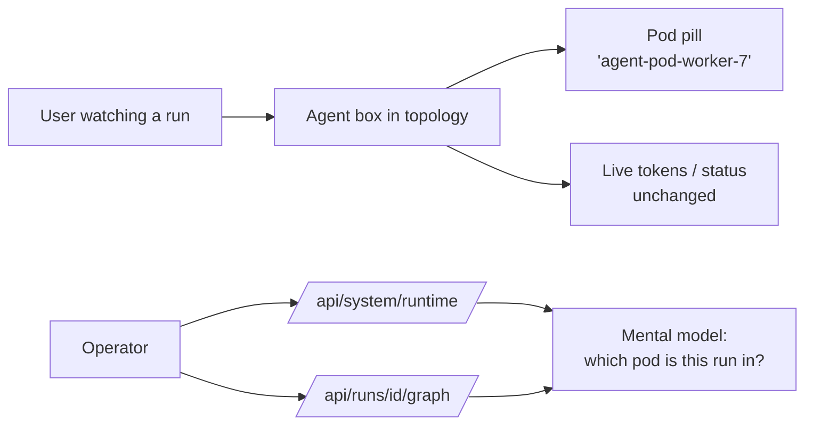
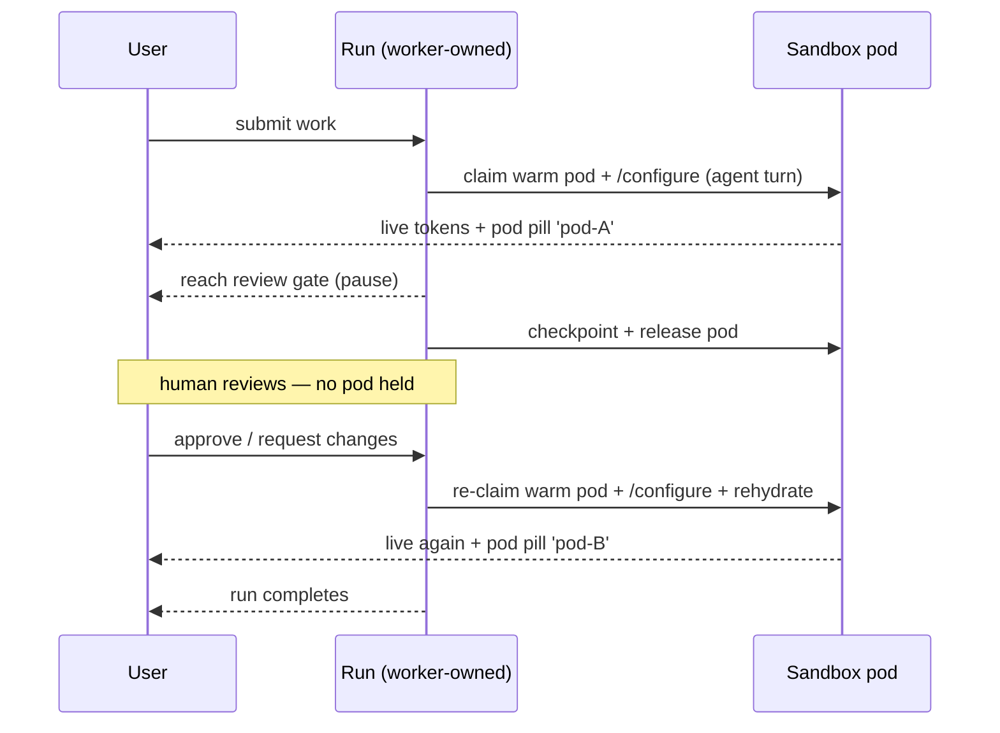

# Sandbox pod execution experience

This page is about what a person **sees and feels** when Agentweaver runs each agent in its own per-run
sandbox pod — both the user watching a run in the web UI and the operator reasoning about the cluster.
For the design logic see the [Sandbox pod execution deep dive](../deep-dive/sandbox-pod-execution.md);
for flags, identity, and the token mechanism see the
[Sandbox pods reference](../reference/sandbox-pods.md).

Related journeys: [Runs, board & watch](./runs-board-watch.md),
[Coordinator & orchestration](./coordinator-orchestration.md), [Operations](./operations.md),
and the [A2A distributed agents experience](./a2a-distributed-agents.md).

## Mental model

The most important thing to feel about pod-per-run is that **almost nothing changes in how a run looks**.
The board, the live timeline, the coordinator topology, the review gate — all behave exactly as before.
What changes is *where the work physically runs*: each run's agent now executes inside its own
Kata-isolated pod instead of inside the shared API process. The product surfaces that fact in exactly one
honest, low-key way — a **pod name** on the agent box — and otherwise stays out of the way.



A well-behaved run should make the user barely notice the sandbox. The pod pill is the one visible
signal; everything else is the same experience they already know.

## What the pod pill is

When the backend runs inside Kubernetes, each agent box in a run's topology shows a small **pod pill** —
a compact, monospace pill with a server icon and the executing pod's name (for example
`agentweaver-api-abc123` or `agent-pod-worker-7`). Hovering it shows the tooltip **"Executing in pod
{name}"**, and it is exposed to assistive technology with the same label.

What the user can take from it:

- **Where this agent is actually running.** Under pod-per-run, the pill on a node is *that run's* sandbox
  pod, so two concurrently-running agents can show two different pod names — a direct, visible cue that
  their work is isolated from each other.
- **That isolation is on at all.** Seeing distinct pod names per run is the everyday confirmation that
  each run has its own pod.

The pill is **Kubernetes-only and quiet by design**:

- on local/dev runs, or anywhere the backend is not in Kubernetes, **no pill is shown** — the UI stays
  clean and there is nothing to explain;
- if the pod name is not yet known (the claim has not bound), **no pill is shown** rather than a
  placeholder; and
- if the runtime probe fails, the UI **degrades silently** to no pill rather than erroring.

Where the value comes from: each agent node carries an `executionPodName` (its own pod), and the app
falls back to a global pod name from the runtime probe when a node has no per-node value. As the
pod-per-run rollout proceeds, nodes carry their true per-pod names automatically. The binding is persisted
in the shared run-event log, so the pill stays accurate after refresh and when served by another API replica. The
data behind it is in the [reference](../reference/sandbox-pods.md#pod-naming-and-the-executing-pod-surface).

## What happens during a run

From the user's side, submitting and watching a run feels identical to before:

1. They submit work (or a coordinator goal) and watch the board / topology as usual.
2. Agent boxes light up as **running**, stream tokens and status live, and — on Kubernetes — show their
   pod pill.
3. The live timeline, diffs, and events arrive exactly as they always have; the fact that tokens are
   being produced *inside a pod* and streamed back to the worker is invisible in the stream itself.
4. When the run completes, the box settles into its terminal state as usual.

Under the hood the heavy work — the model session, the tools, the shell — is happening in the pod, and
the worker is relaying its stream into the same timeline. The user does not have to know that; the only
new thing on screen is the pod name.

## Sandbox preview: reaching a server inside the pod

Sometimes an agent starts a **server inside its sandbox pod** — a dev server, a freshly built app, a
debug endpoint — and a person wants to actually *open it* and look. Because the pod is isolated, that
server is not reachable by default. The **sandbox preview port-forward** is the supported way to reach it:
a live preview/debug endpoint tunnelled from the run's pod, scoped to that one run.

A **Preview** button appears on the run/execution view (`WorkflowRunPage`) **only** when the run is using
the Kubernetes sandbox (`sandboxBackend === 'kubernetes-sandbox-claim'`, read from the run's
`sandbox.selected` event) **and** the run is still active. On local/dev backends, or after the run ends,
the button is not shown. The flow a user follows:

1. **Open the preview dialog** ("Sandbox Preview") and **pick a port** — the port the agent's server is
   listening on *inside* the pod (the field defaults to `3000`). The dialog notes that preview traffic is
   **proxied through the Agentweaver API server**.
2. **Start the preview.** The app calls `apiClient.startPortForward(runId, port)` →
   `POST /api/runs/{runId}/sandbox/port-forward` with that port, and a `kubectl port-forward` tunnel is
   opened from the run's sandbox pod to a loopback port on the API host.
3. **See it become active.** The dialog confirms with **"Preview active for port {target_port} on pod
   {pod_name}"** and shows the session id. If the API returned a proxied `preview_url`, the dialog embeds
   it in an iframe with an **"Open preview"** button; if it did not (the backend does not currently
   populate `preview_url`), the dialog honestly says *"The API server did not return a proxied preview
   URL."*
4. **Stop it when done.** Stopping the preview calls `apiClient.stopPortForward(runId, sessionId)` →
   `DELETE` on that session, tearing the tunnel down. You can run more than one preview at a time (up to a
   per-run cap), each its own port and entry, and stop them individually.

```mermaid
%%{init: {'theme':'base','themeVariables':{'fontFamily':'Segoe UI, system-ui, -apple-system, sans-serif','fontSize':'15px','primaryColor':'#E8EEF9','primaryBorderColor':'#0F6CBD','primaryTextColor':'#242424','lineColor':'#605E5C','clusterBkg':'#FAF9F8','clusterBorder':'#D2D0CE','edgeLabelBackground':'#FFFFFF'}}}%%
sequenceDiagram
    participant U as User
    participant UI as WorkflowRunPage (preview dialog)
    participant API as API
    participant Pod as Run's sandbox pod
    U->>UI: click Preview (K8s sandbox + active run), pick port
    UI->>API: POST /sandbox/port-forward { target_port }
    API->>Pod: kubectl port-forward :target_port
    API-->>UI: { session_id, local_port, target_port, pod_name, started_at }
    UI-->>U: "Preview active for port {target_port} on pod {pod_name}"
    Note over UI,U: iframe shown only if preview_url present;<br/>otherwise "no proxied preview URL"
    U->>UI: stop preview
    UI->>API: DELETE /sandbox/port-forward/{sessionId}
    API->>Pod: tear down tunnel
```

When to use it:

- **You want to look at what the agent built/ran** — a running web app, an API the agent stood up, a
  served artifact — without leaving the run view.
- **You're debugging inside the sandbox** and need a live endpoint into the pod for the moment.

What to expect:

- **Kubernetes-only.** Preview tunnels into the agent-sandbox controller's pod. On local/dev runs there is
  no claim pod to forward, so the button doesn't appear — the same "this is a cluster feature" boundary as
  the pod pill. (Local runs isolate commands with MXC, which has no pod to forward into.)
- **A loopback port, not a public URL.** The API returns a `local_port` it bound on the API host; whether a
  browser-openable preview appears depends on whether a proxied `preview_url` is returned (today it is not).
- **Scoped to this run's pod.** A preview reaches only the run's own sandbox pod, never another run's, and
  is capped (default 3 per run, 20 globally).
- **Tied to the live pod.** Because the hybrid lifecycle can release and re-claim a pod across a
  suspension, a preview is valid while the current pod is bound; after a release/resume you start a fresh
  preview against the re-claimed pod (the same reason the pod pill name can change). Sessions have no TTL
  and end on stop, run end, or API shutdown.

The endpoints and the `PortForwardSessionDto` fields behind the dialog are in the
[reference](../reference/sandbox-pods.md#sandbox-preview-port-forward-feature-017).

> **Dedicated pages:** see the [Sandbox browser preview User Guide](./sandbox-browser-preview.md) for the
> full step-by-step, the [Reference](../reference/sandbox-browser-preview.md) for the API, and the
> [Deep Dive](../deep-dive/sandbox-browser-preview.md) for how the tunnel works.

## Suspend and resume, from the user's view

Pod-per-run uses a **hybrid** lifecycle: the pod stays warm while an agent is actively reasoning, but it
is checkpointed and **released** when the run suspends on something external — most visibly, a
**human-review / confirmation gate**, or a coordinator waiting on its child runs.

What the user experiences across that boundary:

- **At a review/confirmation gate**, the run pauses for them exactly as it does today — the gate looks and
  behaves the same. Behind the scenes the pod has been released back to the warm pool while the human
  decides, so no compute is held hostage by a pending decision.
- **When they submit the decision**, the run resumes seamlessly: a warm pod is re-claimed and the run is
  rehydrated from its checkpoint. The worktree is already there (it lives on the shared workspace volume),
  and the resumed pod gets a **fresh** run-scoped credential.
- **The pod name may change after resume.** Because resume re-claims a (possibly different) warm pod, the
  pod pill on the agent box can show a **different name** than before the pause. That is expected and is
  the visible trace of release-and-rehydrate; the run, its history, and its workspace are continuous.

For a coordinator run, the same applies while the coordinator idles awaiting children: it does not sit on
a pod during the wait. Its **orchestration loop stays in the worker** the whole time — only its agent
turns ever occupy a pod — so the coordinator's timeline and steering controls are always live even when
no coordinator pod exists.



A debug/low-latency option exists for operators (`Sandbox:ReleasePodOnSuspend = false`) that keeps the
pod warm across a suspension; with it on, the pod name would stay stable across a pause, at the cost of
holding capacity. By default the pod is released, so a name change across a long pause is normal.

## The operator's mental model

An operator reasons about pod-per-run as **"each run rents a pod for its active bursts, and gives it
back when it's waiting."** Concretely:

- **Mode is a flag.** `Sandbox:AgentExecutionMode` decides whether agents run in-process (`in-api`,
  today's behavior and the rollback path) or in per-run pods (`pod-per-run`). If anything looks wrong —
  including instability in the experimental transport — flipping back to `in-api` restores in-process
  execution immediately, no redeploy. `Sandbox:ReleasePodOnSuspend` (default on) tunes whether pods are
  released during suspensions.
- **Capacity is AgentHost pool + quota.** More concurrent runs means more claimed AgentHost pods; the `agentweaver-agent-host` pool keeps 2 run pods pre-warmed, while the namespace `ResourceQuota` (pod count, CPU/memory, sandbox-claim count) bounds how many runs can execute at once. Heavier per-pod agent runtimes mean these caps must be raised deliberately in the
  manifests, not patched live. See [Operations](./operations.md) and the
  [reference](../reference/sandbox-pods.md#pod-identity-and-quota).
- **The isolation backend is chosen per host.** Independently of pod-per-run, every host selects one
  command-isolation backend at run start and announces it with a `sandbox.selected` event (`backend`,
  `isRealIsolation`, `reason`). In-cluster that backend is the Kata-isolated `kubernetes-sandbox-claim`,
  whose pods are provisioned by the upstream **agent-sandbox controller** (installed by
  `scripts/aks/10-create-cluster.sh`); local dev gets `processcontainer` (**MXC**, a different
  local-host runtime) on Windows or `linux-bwrap` on Linux, falling back to `direct`
  (no isolation, shell still runs) only when nothing else is available. The deep dive's
  [executor seam](../deep-dive/sandbox-pod-execution.md#the-executor-seam-how-commands-are-actually-isolated)
  and [agent-sandbox controller](../deep-dive/sandbox-pod-execution.md#the-agent-sandbox-controller-mxc-vs-the-controller)
  sections explain how these relate to pod-per-run; backend install/selection is in
  [Sandbox setup](../reference/sandbox-setup.md#sandbox-backends).
- **The pod is disposable.** Killing or losing a pod does not lose a run: durable state is in the shared
  workspace volume and the brokered checkpoint, and the run re-claims a fresh pod. Pods never persist past
  their run, and they hold only a short-lived, run-scoped credential.
- **Blast radius is small and visible.** Each pod is Kata-isolated, default-deny on egress (model +
  worker + git only, never the database), and holds no broker key. The pod pill in the UI is the
  operator's quick "which pod is this run in?" answer.

### Diagnostics surface (MCP and runtime)

The same facts are available outside the topology view:

- **`GET /api/system/runtime`** answers "are we in Kubernetes, and what is the host pod name?" — the
  source of the global pod-pill fallback.
- **`GET /api/runs/{id}/graph`** carries `executionPodName` per node — the authoritative "which pod is
  this run/node executing in?" for a specific run.
- **MCP operations tools** expose the same operational health an operator needs around runs (diagnostics,
  heartbeat, sandbox policy). The MCP surface mirrors the web operations surface fact-for-fact; see the
  [MCP client experience](./mcp-client.md) and [Operations](./operations.md). Pod naming itself is a
  presentation detail surfaced primarily in the web topology; the underlying run/pod state is the same
  the API exposes.

The transport that carries agent turns into the pod is the **A2A bridge**, which ships on an experimental
`-preview` package line. Operators should treat it as such — pinned and behind the rollback flag — and
read the [A2A distributed agents experience](./a2a-distributed-agents.md) for what that means in practice.

## Edge cases the user may notice

- **No pill at all.** Local/dev or non-Kubernetes backends never show the pod pill — expected, not a bug.
- **Pill appears slightly after a node starts.** The name is shown once the pod is bound and registered;
  a brief gap before the pill appears is normal.
- **Pill name changes after a pause.** Release-on-suspend re-claims a fresh pod on resume, so the name can
  change across a review gate or a coordinator wait. The run is continuous regardless.
- **Two runs, two pod names.** Concurrent runs showing different pod names is the visible proof of
  per-run isolation.

## Related reading

- [Sandbox pod execution deep dive](../deep-dive/sandbox-pod-execution.md) — the why and the logic.
- [Sandbox pods reference](../reference/sandbox-pods.md) — flags, identity/quota, token injection, naming.
- [Runs, board & watch](./runs-board-watch.md) and
  [Coordinator & orchestration](./coordinator-orchestration.md) — the journeys this annotates.
- [Operations](./operations.md) — health, heartbeat, and sandbox policy surfaces.
- [A2A distributed agents experience](./a2a-distributed-agents.md) — the `-preview` transport behind it.
