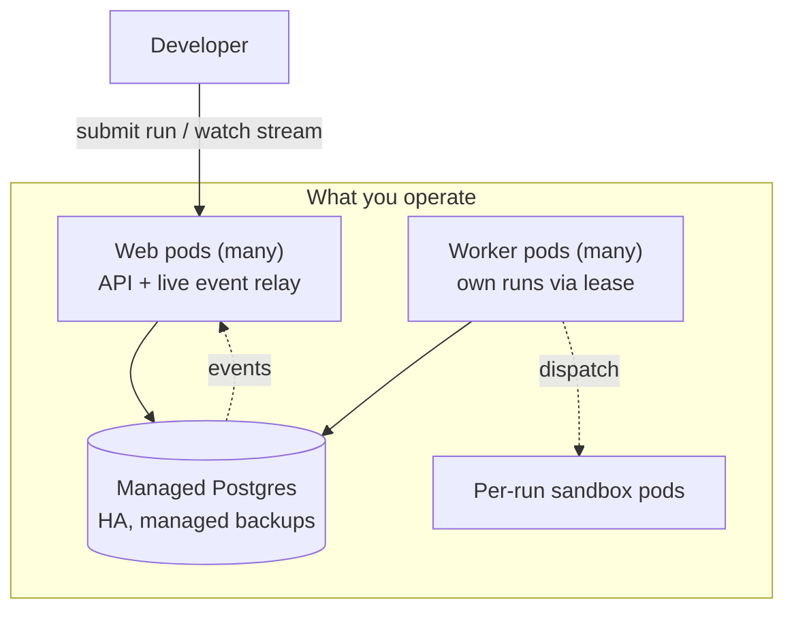
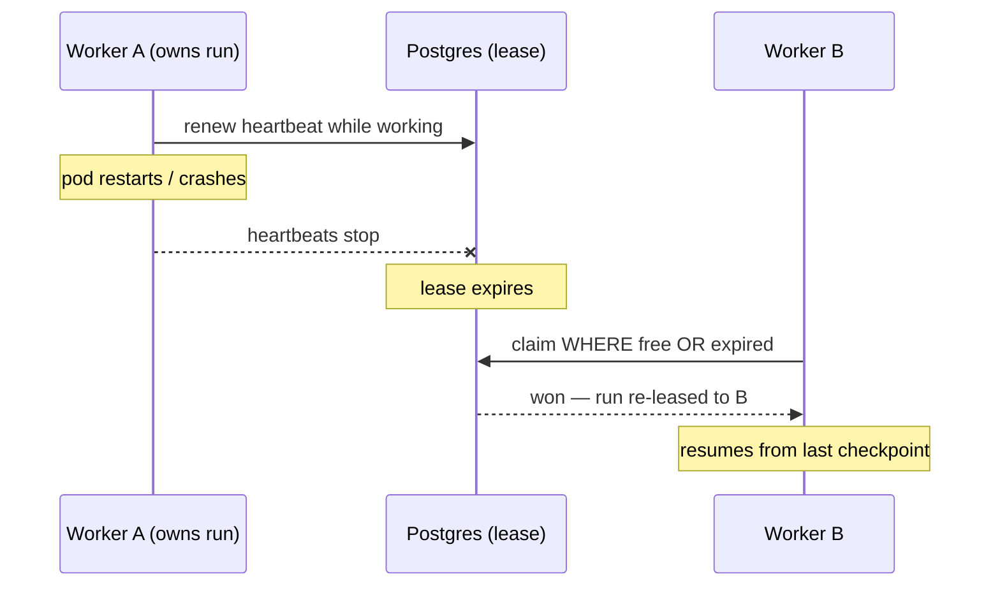
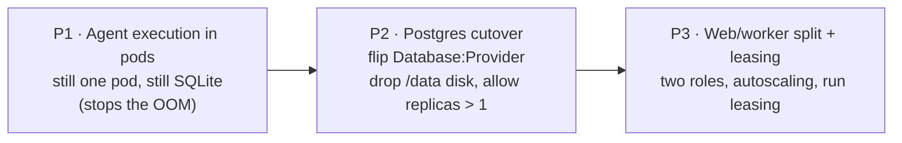

# Scaling Operations — Experience

This page is for the **operator** — the person who runs Agentweaver in a cluster and has to keep agents moving as load grows. Scaling is mostly invisible to end users: a developer submitting a run or watching it stream sees the same product before, during, and after a cutover. To the operator, though, scaling is very visible — more pods, two roles instead of one, a managed database instead of a file, and runs that survive a pod restart on their own. This page gives you the mental model and tells you what to expect in practice.

For the reasoning behind these mechanics see the [distributed execution & scaling deep dive](../deep-dive/distributed-execution-scaling.md); for the exhaustive schema, topology, and config details see the [scaling data layer reference](../reference/scaling-data-layer.md). Related operator context: [Operations experience](./operations.md), [Configuration](../guide/configuration.md), and the [AKS deployment guide](../guide/deployment-aks.md).

## The mental model

Before scaling, Agentweaver is one pod that does three jobs at once: it serves the API and the live event stream, it runs every run's orchestration, and it writes everything to a single SQLite file on a disk only it can hold. That single-writer file is the reason the deployment is pinned to one replica — you cannot simply add pods, because two of them cannot safely write the same file.

Scaling unwinds that pod into independent, repeatable pieces:

1. **A managed database** (Azure Database for PostgreSQL Flexible Server) replaces the SQLite file, so more than one process can write at once.
2. **Two pod roles** replace the one combined pod: a **web** tier that talks to clients, and a **worker** tier that owns the actual runs.
3. **A lease** lets many worker pods share the pool of runs without ever stepping on each other.
4. **Event fan-out** keeps a run watchable from any web pod, even when a different worker pod is executing it.

The operator's job after scaling is mostly about the second and third points: making sure enough web pods exist for request load, enough worker pods exist for run backlog, and that runs are being leased and renewed cleanly.

## What scaling looks like in practice

### More pods, in two roles

Instead of one Deployment you operate two, both built from the **same image** and told apart by a role flag:

- **Web pods** are stateless. They serve the REST API, authentication, and the live event stream. You scale them on request and connection load — more concurrent users or open streams means more web pods. Because they hold no run state, you can add or remove them freely; nothing is lost when one restarts.
- **Worker pods** own runs. A worker claims a run, drives its orchestration, dispatches the per-run sandbox pods that do the heavy execution, and writes the durable checkpoints and events. You scale them on **run backlog depth**, not CPU — the meaningful question is "how many runs are queued and unclaimed?", not "how busy is the processor?".

Autoscaling reflects this split: web scales on request load (a standard horizontal autoscaler), and worker scales on queued-run depth (preferably a KEDA scaler reading the backlog from Postgres, with scale-to-min so there is always at least one worker leasing and draining — never scale workers to zero).

### A managed database instead of a file

The SQLite file and its single-writer disk are gone. In their place is a managed Postgres Flexible Server reached privately from inside the cluster, with zone-redundant high availability and managed point-in-time backups. Two practical consequences for you:

- The old `/data` ReadWriteOnce disk and the SQLite backup CronJob are retired — backups are now the database's managed responsibility.
- The `/workspace` shared volume **stays**. It is multi-attach-safe and still holds the git worktrees that worker and sandbox pods share, so it is not a scaling bottleneck.

The database connection is passwordless: pods authenticate using the cluster's workload identity, so there is no DB password to store or rotate in a secret.

## What stays consistent for end users

This is the reassuring part. **Across and after the cutover, the product an end user sees does not change.** The run and review model is the same, the REST and event-stream contracts are the same, and a developer who submits a run or watches it stream cannot tell whether they are hitting a single combined pod or a fleet of web and worker pods.

> 📸 **Screenshot — `overview-active-projects.png`**
> *Shows:* the **Overview** page "Fleet activity at a glance." with the **Active workflow runs** and **Active projects** sections populated; the same view regardless of whether one combined pod or a web/worker fleet is serving it.
> *Path:* sign in → **Overview** in the left rail → `/overview`.

The one thing the system has to work to preserve is **live watching across pods**. A run executes on one worker pod, but a developer's browser may be connected to any web pod. The event stream makes this seamless: every event is durably written to the database before it is acknowledged, and each web pod is notified so it can relay events for runs it is not itself executing, with a steady catch-up read as a backstop. The net effect for the user is an unbroken live stream regardless of which pods are involved. As an operator you generally do not touch this — but it is why a run started before a web pod restarts is still fully watchable afterward.

## How runs survive replica restarts

This is the behavior that most changes the operator's day, and it is worth understanding well.

Every run is **leased** to exactly one worker. Leasing is what lets many workers share runs safely, and it is also what makes runs self-healing across restarts. A lease has three operative facts: who owns the run, when the lease expires, and a steadily refreshed heartbeat while the owner is alive and working.

Claiming is atomic. When a worker takes a run it does so with a single guarded database update that succeeds **only if** the run is currently free or its lease has expired. Exactly one worker can win; every other worker trying for the same run simply sees that it lost and moves on. That guarantee — one winner, always — is what prevents the same run from being picked up or dispatched twice.

Now the restart story:

- A worker pod is restarted, drained, or crashes.
- It stops renewing the heartbeats on the runs it held, so those leases lapse.
- Any other worker, on its normal claim cycle, finds those now-expired runs and re-claims them with the same atomic guarded update.
- The run continues from its last durable checkpoint on the new owner. No operator action is required.

A graceful shutdown is even cleaner: on a stop signal a worker stops claiming new runs, releases (or lets expire) the leases it holds, and finishes or checkpoints whatever is in flight before exiting — which is why worker disruption budgets favor draining one pod at a time.

A subtle but important guarantee sits underneath this: a former owner that was paused or stuck cannot wake up later and corrupt a run that has since been re-leased. Each acquisition carries a token that only moves forward, and a stale token's writes are rejected — so the new owner is always the only one whose work counts.

## The operator's mental checklist

When you operate a scaled Agentweaver, these are the things worth watching:

> 📸 **Screenshot — `diagnostics-global-health.png`**
> *Shows:* the **Diagnostics** page on the **Global** tab with the fleet metrics **API version**, **Uptime**, **Total projects**, **Total runs**, and **Active runs**, plus the check cards with `pass` / `warn` / `fail` badges — the operator's quick confirmation that a scaled deployment is healthy.
> *Path:* open any project → **Diagnostics** in the left rail → select the **Global** tab → `/projects/:projectId/diagnostics`.

1. **Web replica count vs request load.** Too few web pods shows up as slow API responses or refused connections, not as failed runs. Scale web on request/connection pressure.
2. **Worker replica count vs backlog.** The signal is queued, unleased run depth. A growing backlog with workers at their floor means scale up; an empty backlog means workers can scale toward their minimum (but not to zero).
3. **Leases are being renewed.** Healthy workers refresh heartbeats; runs whose leases keep expiring and getting re-claimed point at workers that are crashing, starved, or being killed too aggressively.
4. **Database health.** The managed Postgres is now the system's shared source of truth — its availability, connection headroom, and the pooling mode matter. (One specific gotcha: live cross-pod event delivery needs session-mode database connections; the wrong pooling mode degrades streaming to "merely slow," not "broken," so it is easy to miss.)
5. **Roll one worker at a time.** Worker disruption budgets and graceful drain are tuned so leases hand off cleanly; respect them during upgrades so in-flight runs checkpoint and migrate rather than restart.

## The rollout, from an operator's seat

You will not flip everything at once. The change arrives in phases, each reversible by a flag that defaults to today's behavior, so you can advance and roll back deliberately:

- **P1** moves the heavy per-run execution into sandbox pods. It runs on the existing single pod and SQLite, and its whole purpose is to stop the out-of-memory crashes. Rollback is the `Sandbox:AgentExecutionMode` flag back to in-process.
- **P2** cuts the data layer over to Postgres. Once reads and writes are verified you drop the single-writer disk, switch to a rolling update, and allow more than one replica. Rollback is the `Database:Provider` flag back to SQLite (take a backup first — this step is data-loss-aware).
- **P3** splits the tier into web and worker roles and turns on leasing and autoscaling. Rollback is scaling workers to zero and letting web fall back to the in-process path behind the role flag.

Every step lands as reviewed manifests applied through the normal deploy pipeline — never an ad-hoc live patch — and each is independently revertible. From the end user's side, none of these phases changes the product; from yours, each one adds a lever and removes a ceiling.

## Related reading

- [Distributed execution & scaling deep dive](../deep-dive/distributed-execution-scaling.md) — why the architecture looks this way.
- [Scaling data layer reference](../reference/scaling-data-layer.md) — the exhaustive schema, topology, and flags.
- [Operations experience](./operations.md) — day-to-day operational surfaces.
- [Configuration](../guide/configuration.md) and the [AKS deployment guide](../guide/deployment-aks.md) — the knobs and the cluster.
- [Sandbox pod execution](../deep-dive/sandbox-pod-execution.md) and [agent communication](../deep-dive/agent-communication.md) — where runs actually execute.
