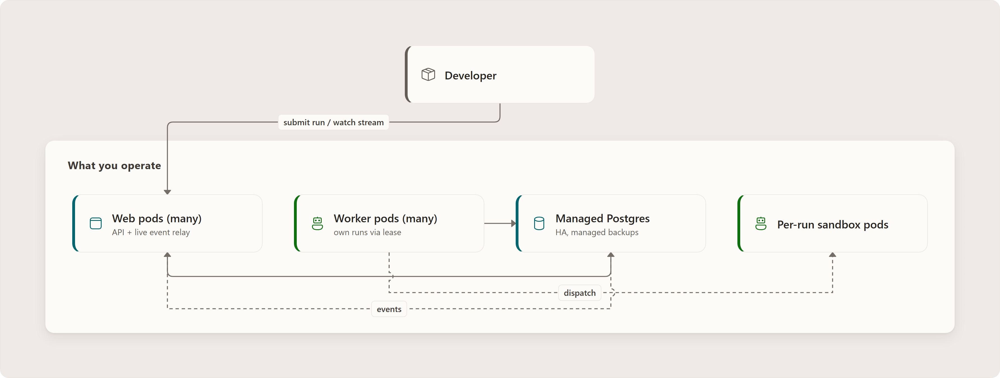
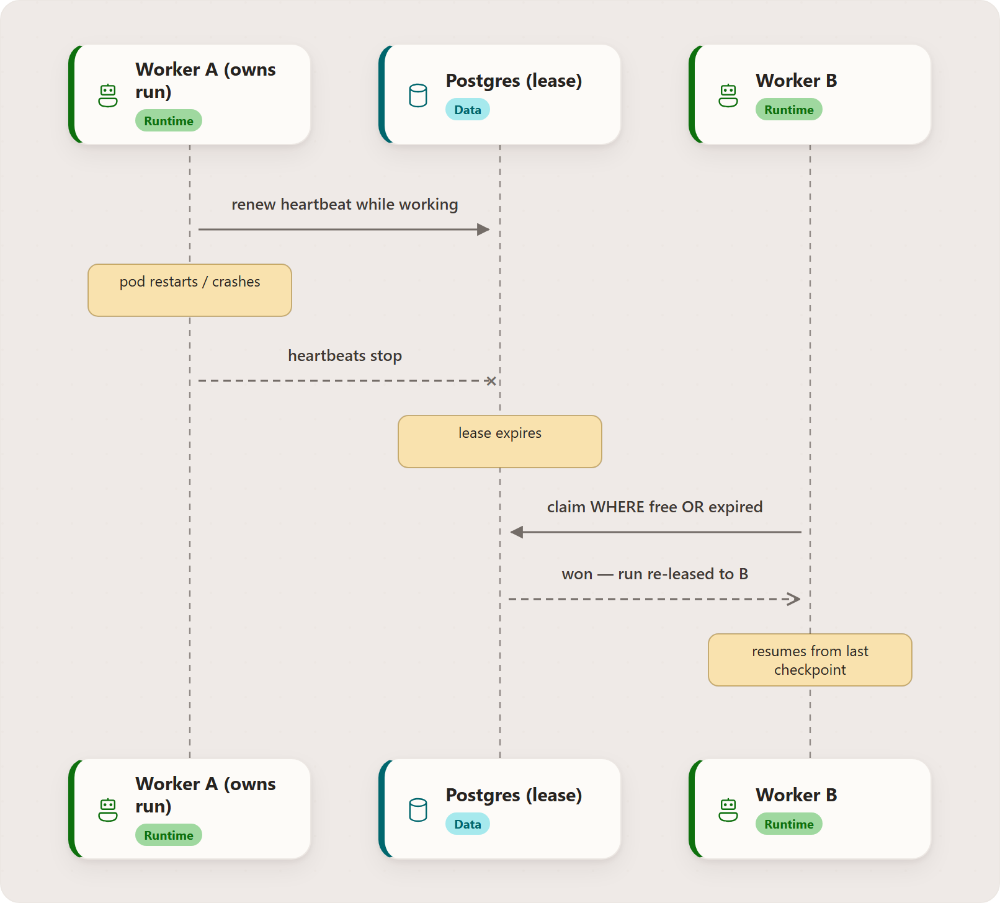

# Scaling Operations — Experience

This page is for the **operator** keeping Agentweaver moving as cluster load grows. The run and review
contracts remain familiar, but replica restarts can interrupt connections and remote turns. The current
checked-in deployment separates web and worker roles over Postgres; recovery uses leases and durable
checkpoints, not a guarantee that every interrupted action is replayed invisibly.

For the reasoning behind these mechanics see the [distributed execution & scaling deep dive](../deep-dive/distributed-execution-scaling.md); for the exhaustive schema, topology, and config details see the [scaling data layer reference](../reference/scaling-data-layer.md). Related operator context: [Operations experience](./operations.md), [Configuration](../guide/configuration.md), and the [AKS deployment guide](../guide/deployment-aks.md).

## The mental model

The historical single-pod design combined API serving, orchestration, and a local SQLite database.
That is context for the split, not the current Kubernetes deployment.

The current operator model separates:

1. **A managed database** (Azure Database for PostgreSQL Flexible Server) replaces the SQLite file, so more than one process can write at once.
2. **Two pod roles** replace the one combined pod: a **web** tier that talks to clients, and a **worker** tier that owns the actual runs.
3. **A lease** lets many worker pods share the pool of runs without ever stepping on each other.
4. **Durable event polling** keeps a run watchable from any web pod, even when a different worker pod
   is executing it.

The operator's job after scaling is mostly about the second and third points: making sure enough web pods exist for request load, enough worker pods exist for run backlog, and that runs are being leased and renewed cleanly.

<!-- Editable source: ../diagrams/drawio/generated/experience-scaling-operations-fig1.drawio.
     Published PNG path is stable; visual validation belongs to the diagram owner. -->

## What scaling looks like in practice

### More pods, in two roles

Instead of one Deployment you operate two, both built from the **same image** and told apart by a role flag:

- **Web pods** serve REST, authentication, and live event streams without owning durable run execution.
  The manifest starts with two replicas. Restarts can disconnect clients; persisted events support
  reconnect and catch-up.
- **Worker pods** claim runs, drive orchestration, dispatch sandbox leaf execution, and write durable
  checkpoints/events. The active HPA has **minimum 2, maximum 3**, with **CPU 70%** and **memory 80%**
  utilization targets. Backlog pressure is useful operational context, not the active HPA input.

`k8s/base/worker-hpa.yaml` contains a **commented future KEDA alternative** and a **commented web HPA
example**; neither is deployed by that file. The exported `agentweaver_run_queued` gauge counts eligible
Ready backlog tasks in active projects awaiting pickup. It is not the count of all leased or running
runs. Keep workers available; scaling them to zero does not make web-role pods take over execution.

### A managed database instead of a file

The SQLite file and its single-writer disk are gone. In their place is a managed Postgres Flexible Server reached privately from inside the cluster, with zone-redundant high availability and managed point-in-time backups. Two practical consequences for you:

- The old `/data` ReadWriteOnce disk and the SQLite backup CronJob are retired — backups are now the database's managed responsibility.
- The `/workspace` shared volume **stays**. It is multi-attach-safe and still holds the git worktrees that worker and sandbox pods share, so it is not a scaling bottleneck.

The database connection is passwordless: pods authenticate using the cluster's workload identity, so there is no DB password to store or rotate in a secret.

## What stays consistent for end users

The run/review model and REST/event-stream contracts do not change with replica count. This is contract
continuity, not a promise that users cannot notice reconnections, delayed scheduling, or failed turns.

The current Overview uses Recent projects, AI usage & performance, Activity feed, and Needs attention.
Those projections help users find work; they do not demonstrate lease or fencing guarantees.

**Live watching crosses replicas.** A run executes on a worker while the browser may connect to another
web replica. `EfRunEventStream` appends durably and subscribers poll the shared event table from their
cursor (a 250 ms polling interval). This is not a deployed LISTEN/NOTIFY relay. Connection loss can delay
delivery; reconnect/catch-up is distinct from replaying an interrupted model turn.

## How runs survive replica restarts

This is the behavior that most changes the operator's day, and it is worth understanding well.

An active workflow watcher claims a **lease** before processing its stream. Leasing lets workers
coordinate ownership; restart recovery separately decides what can resume. A lease records its owner,
expiry, fencing token, and heartbeat.

Claiming is atomic. A guarded database update succeeds only if a run is free or its lease has expired.
Competing claims have one winner; each successful acquisition advances the fencing token. This protects
ownership, not arbitrary external side effects from an interrupted turn.

Now the restart story:

- A worker pod is restarted, drained, or crashes.
- It stops renewing the heartbeats on the runs it held, so those leases lapse.
- A subsequent eligible watcher can claim a free or expired lease with the guarded update.
- Recovery depends on the run state: AwaitingReview can resume from a usable checkpoint; interrupted
  coordinator parents recover through their persisted work plan. Stranded in-progress child turns
  become retryable `a2a_transport_interrupted` failures for coordinator redispatch, while stranded root
  turns fail as `stranded_in_progress`. Lease expiry alone does not replay a model turn.

A graceful shutdown stops new claims and attempts to release owned leases. The worker disruption
budget keeps at least one worker available; it is not a guarantee that every in-flight turn finishes
before termination.

<!-- Editable source: ../diagrams/drawio/generated/experience-scaling-operations-fig3.drawio.
     Published PNG path is stable; visual validation belongs to the diagram owner. -->

Renewal and release match both owner and fencing token. Terminal handlers check current lease ownership
before updating run state, rejecting a stale owner's terminal outcome. Do not broaden those guards
into a claim that every filesystem, tool, or external side effect is fenced.

## The operator's mental checklist

When you operate a scaled Agentweaver, these are the things worth watching:

Open project **Diagnostics → Global** for health checks and counts, then **Cluster** for claims and
resource readiness. Interpret process uptime separately from fleet-wide persisted run counts.

1. **Web replicas vs request load.** Inspect request/connection pressure before changing the two-replica
   baseline; do not assume a web HPA is installed.
2. **Worker HPA and backlog.** Check CPU/memory targets and the 2–3 replica bounds alongside eligible
   Ready backlog depth. A growing backlog can also indicate unavailable projects or scheduling delays.
3. **Leases are being renewed.** Healthy workers refresh heartbeats; runs whose leases keep expiring and getting re-claimed point at workers that are crashing, starved, or being killed too aggressively.
4. **Database health.** Postgres is the shared source of truth. Watch availability, connection headroom,
   and event-read latency. The current cursor-polling relay does not depend on session-bound
   LISTEN/NOTIFY connections.
5. **Roll one worker at a time.** Worker disruption budgets and graceful drain are tuned so leases hand off cleanly; respect them during upgrades so in-flight runs checkpoint and migrate rather than restart.

## Historical rollout and rollback boundaries

The P1/P2/P3 plan explains how the architecture developed; it is not a pending rollout or a rollback runbook:

- **P1 — remote leaf execution:** moves heavyweight sessions into sandbox pods. `in-api` selects local
  execution when deployed, but does not migrate active remote turns.
- **P2 — shared Postgres:** removes the single-writer deployment constraint. Switching
  `Database:Provider` does not copy or reconcile data; rollback requires an explicit data restoration or
  migration plan plus compatible storage and replica settings.
- **P3 — web/worker roles and leases:** separates serving from execution. Web-role pods do not
  automatically become workers when worker replicas reach zero; a role/topology rollback must keep
  an execution owner available.

Apply reviewed configuration and manifests through the normal deployment process. Validate ownership,
checkpoint recovery, storage compatibility, and capacity before calling any rollback safe.

## Related reading

- [Distributed execution & scaling deep dive](../deep-dive/distributed-execution-scaling.md) — why the architecture looks this way.
- [Scaling data layer reference](../reference/scaling-data-layer.md) — the exhaustive schema, topology, and flags.
- [Operations experience](./operations.md) — day-to-day operational surfaces.
- [Configuration](../guide/configuration.md) and the [AKS deployment guide](../guide/deployment-aks.md) — the knobs and the cluster.
- [Sandbox pod execution](../deep-dive/sandbox-pod-execution.md) and [agent communication](../deep-dive/agent-communication.md) — where runs actually execute.

<!-- diagram-context:experience-scaling-operations-fig1:start -->

Diagram details and constraints

<table><thead><tr><th>Element</th><th>Contract</th></tr></thead><tbody>
<tr><td>title</td><td>Scale roles, keep state shared</td></tr>
<tr><td>takeaway</td><td>Web serves requests; workers execute; Postgres coordinates durable state; pods run leaves.</td></tr>
<tr><td>group-title-0</td><td>CONTROL-PLANE ROLES</td></tr>
<tr><td>group-title-1</td><td>SHARED STATE AND LEAF COMPUTE</td></tr>
<tr><td>Browser</td><td>Browser</td></tr>
<tr><td>Browser</td><td>REST and watch client</td></tr>
<tr><td>Browser</td><td>request / SSE response</td></tr>
<tr><td>Browser</td><td>Connects to web replicas; not a worker-local queue.</td></tr>
<tr><td>Web tier</td><td>Web tier</td></tr>
<tr><td>Web tier</td><td>Requests and event reads</td></tr>
<tr><td>Web tier</td><td>base: 2 replicas</td></tr>
<tr><td>Web tier</td><td>Uses shared durable state; reads event cursors.</td></tr>
<tr><td>Worker tier</td><td>Worker tier</td></tr>
<tr><td>Worker tier</td><td>Execution and ownership</td></tr>
<tr><td>Worker tier</td><td>HPA: 2-3 replicas</td></tr>
<tr><td>Worker tier</td><td>CPU 70% / memory 80%; leases and workflow state.</td></tr>
<tr><td>Current boundary</td><td>Current boundary</td></tr>
<tr><td>Current boundary</td><td>Configuration, not a probe</td></tr>
<tr><td>Current boundary</td><td>KEDA / web HPA: examples</td></tr>
<tr><td>Current boundary</td><td>Checked-in scaling settings are not live cluster evidence.</td></tr>
<tr><td>Postgres</td><td>Postgres</td></tr>
<tr><td>Postgres</td><td>Shared durable state</td></tr>
<tr><td>Postgres</td><td>events / leases / checkpoints</td></tr>
<tr><td>Postgres</td><td>Event relay polls the table; not LISTEN/NOTIFY.</td></tr>
<tr><td>Sandbox pods</td><td>Sandbox pods</td></tr>
<tr><td>Sandbox pods</td><td>Remote AgentHost leaves</td></tr>
<tr><td>Sandbox pods</td><td>run context + A2A</td></tr>
<tr><td>Sandbox pods</td><td>Return events to the worker; no direct pod DB access.</td></tr>
<tr><td>e0</td><td>requests</td></tr>
<tr><td>e1</td><td>state / events</td></tr>
<tr><td>e2</td><td>persist</td></tr>
<tr><td>e3</td><td>execute</td></tr>
<tr><td>e4</td><td>results</td></tr>
<tr><td>note</td><td>Worker HPA is active; KEDA and web HPA blocks are commented proposals. Kubernetes owns scheduling.</td></tr>
<tr><td>n0</td><td>Connects to web replicas;
not a worker-local queue.</td></tr>
<tr><td>n1</td><td>Uses shared durable state;
reads event cursors.</td></tr>
<tr><td>n2</td><td>CPU 70% / memory 80%;
leases and workflow state.</td></tr>
<tr><td>n3</td><td>Checked-in scaling settings
are not live cluster evidence.</td></tr>
<tr><td>n4</td><td>Event relay polls the table;
not LISTEN/NOTIFY.</td></tr>
<tr><td>n5</td><td>Return events to the worker;
no direct pod DB access.</td></tr>
<tr><td>groups</td><td>CONTROL-PLANE ROLES; SHARED STATE AND LEAF COMPUTE</td></tr>
</tbody></table>

<!-- diagram-context:experience-scaling-operations-fig1:end -->

<!-- diagram-context:experience-scaling-operations-fig3:start -->

Diagram details and constraints

<table><thead><tr><th>Element</th><th>Contract</th></tr></thead><tbody>
<tr><td>title</td><td>Lease transfer is not turn replay</td></tr>
<tr><td>takeaway</td><td>An expired owner can be replaced; continuation depends on the persisted run state.</td></tr>
<tr><td>group-title-0</td><td>LEASE OWNERSHIP</td></tr>
<tr><td>group-title-1</td><td>STATE-DEPENDENT RECOVERY</td></tr>
<tr><td>Worker A</td><td>Worker A</td></tr>
<tr><td>Worker A</td><td>Guarded lease claim</td></tr>
<tr><td>Worker A</td><td>owner A + token n</td></tr>
<tr><td>Worker A</td><td>Renewals must match both owner and fencing token.</td></tr>
<tr><td>Lease expires</td><td>Lease expires</td></tr>
<tr><td>Lease expires</td><td>Renewals cease</td></tr>
<tr><td>Lease expires</td><td>free / expired eligibility</td></tr>
<tr><td>Lease expires</td><td>Failure is not a message; expiry permits a later claim.</td></tr>
<tr><td>Worker B</td><td>Worker B</td></tr>
<tr><td>Worker B</td><td>Win eligible next claim</td></tr>
<tr><td>Worker B</td><td>owner B + token n+1</td></tr>
<tr><td>Worker B</td><td>Old-token terminal ownership checks reject stale results.</td></tr>
<tr><td>Visible failure</td><td>Visible failure</td></tr>
<tr><td>Visible failure</td><td>Stranded child / root</td></tr>
<tr><td>Visible failure</td><td>retryable child vs root</td></tr>
<tr><td>Visible failure</td><td>Child may be redispatched; no automatic mid-turn replay.</td></tr>
<tr><td>Inspect run state</td><td>Inspect run state</td></tr>
<tr><td>Inspect run state</td><td>Checkpoint or work plan</td></tr>
<tr><td>Inspect run state</td><td>recovery prerequisites</td></tr>
<tr><td>Inspect run state</td><td>AwaitingReview, coordinator, and stranded turns differ.</td></tr>
<tr><td>Durable recovery</td><td>Durable recovery</td></tr>
<tr><td>Durable recovery</td><td>Eligible saved state</td></tr>
<tr><td>Durable recovery</td><td>checkpoint / coordinator plan</td></tr>
<tr><td>Durable recovery</td><td>Recover only supported state; missing checkpoints surface.</td></tr>
<tr><td>e0</td><td>renewals stop</td></tr>
<tr><td>e1</td><td>next claim</td></tr>
<tr><td>e2</td><td>inspect</td></tr>
<tr><td>e3</td><td>stranded turn</td></tr>
<tr><td>e4</td><td>recoverable</td></tr>
<tr><td>note</td><td>Fencing protects guarded ownership operations, not every external tool side effect.</td></tr>
<tr><td>n0</td><td>Renewals must match both
owner and fencing token.</td></tr>
<tr><td>n1</td><td>Failure is not a message;
expiry permits a later claim.</td></tr>
<tr><td>n2</td><td>Old-token terminal ownership
checks reject stale results.</td></tr>
<tr><td>n3</td><td>Child may be redispatched;
no automatic mid-turn replay.</td></tr>
<tr><td>n4</td><td>AwaitingReview, coordinator,
and stranded turns differ.</td></tr>
<tr><td>n5</td><td>Recover only supported state;
missing checkpoints surface.</td></tr>
<tr><td>groups</td><td>LEASE OWNERSHIP; STATE-DEPENDENT RECOVERY</td></tr>
</tbody></table>

<!-- diagram-context:experience-scaling-operations-fig3:end -->
