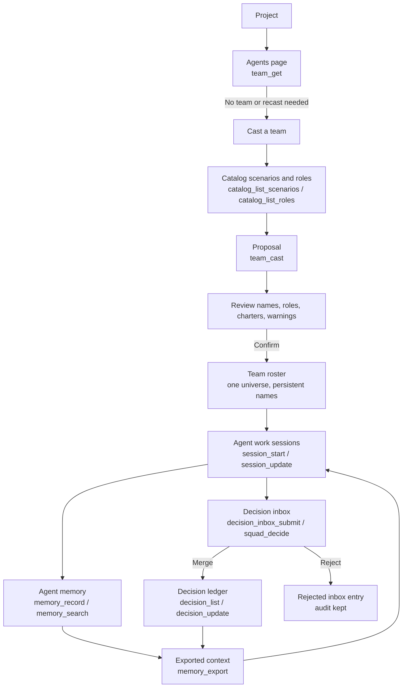

# Team, Casting & Memory Experience

Agentweaver turns a project into a named team with a shared operating record. The web UI gives users a visual path for casting agents, reading their charters, and reviewing what the team has learned; MCP exposes the same product surface as explicit tools such as `team_get`, `team_cast`, `memory_record`, and `decision_inbox_merge`.

This page explains what the user sees, what the team remembers, and why the experience is structured around a roster, a casting universe, agent memory, a decision inbox, a decision ledger, and a current session. Scope limit: this document describes the product and MCP experience, not workflow execution internals or source-code implementation details.

Related docs: [System overview](../deep-dive/00-system-overview.md), [Projects](../guide/projects.md), [Coordinator & orchestration](../deep-dive/orchestration.md), [Agent Teams & Blueprints](../guide/teams.md), [Team & Casting Engine](../deep-dive/team-casting.md), and [Memory & Decisions](../deep-dive/memory-decisions.md).

## The experience in one picture

The experience has two loops that reinforce each other:

1. **Casting loop**: the user chooses a scenario, roles, goal, or project analysis path; Agentweaver proposes named agents with charters; the user confirms; the roster becomes the team.
2. **Memory loop**: agents and coordinators record learnings and proposals; the decision inbox holds candidates; accepted entries become team decisions; exports mirror the state to `.squad/` and `.agentweaver/context/` files.

The user-facing promise is simple: cast a team once, refer to agents by stable names, and let the team carry forward accepted decisions and useful memory instead of restarting from blank context every run.

## Core concepts

- **Team**: the project squad shown on **Agents** and read with `team_get`. It has one universe and a roster of active, retired, project, and system agents.
- **Roster**: the set of members the user can filter by **All**, **Active**, and **Retired**.
- **Agent**: a named team member. The name is the durable identity used in memory, decisions, charters, and history.
- **Charter**: the readable operating contract for an agent. The UI shows it in the agent drawer; MCP reads it with `team_member_get_charter`.
- **Casting**: the proposal-and-confirmation flow that turns scenarios, goals, analysis, or selected roles into named agents. MCP uses `team_cast`, with catalog support from `catalog_list_scenarios` and `catalog_list_roles`.
- **Universe**: the single naming namespace for a team. Names are persistent identifiers, and the system chooses the universe deterministically from policy, history, optional override, and seed.
- **Memory**: reusable context recorded with `memory_record`, retrieved with `memory_list` and `memory_get`, and searched across agents with `memory_search`.
- **Decision inbox**: the review buffer for proposed knowledge. Agents submit with `decision_inbox_submit` or `squad_decide`; reviewers list, merge, or reject with `decision_inbox_list`, `decision_inbox_merge`, and `decision_inbox_reject`.
- **Decision ledger**: the accepted project-wide record managed with `decision_create`, `decision_list`, and `decision_update`.
- **Session**: the current work focus managed with `session_start`, `session_current`, and `session_update`.

Memory feels like a shared brain, but decisions are the authority layer. Memory helps an agent work; accepted decisions constrain what the whole team should respect.

## Agents page: viewing and shaping the roster

The project-level **Agents** page is the user's home for the team. It answers: "Who is working on this project, what are they responsible for, and can I trust their charter?"

> 📸 **Screenshot — `team-roster.png`**
> *Shows:* the **Agents** page titled "Agents" / "The cast working on this project." with roster cards (avatar, agent name, role title, active/retired indicator, and **System agent** / **Project agent** badge), the **All** / **Active** / **Retired** filters, and the **Add member**, **Sync**, and **Cast team** actions.
> *Path:* open a project → click **Agents** in the left rail → `/projects/:projectId/team`.

The page title is **Agents** with the subtitle **The cast working on this project.** Its primary actions are:

- **Add member**
- **Sync** / **Hide sync**
- **Cast team**

When there is no team yet, the page shows **No team yet** and explains: **Cast a team to get started. The casting wizard will help you pick roles and generate agent charters.** The primary action is **Cast team**.

### What `team_get` gives the user

In MCP, `team_get` is the read path for the same roster experience. It returns the team, universe, members, roles, statuses, system-agent flags, models, and charter paths as structured JSON for assistants and automation.

### Roster cards

Each roster card shows the avatar, agent name, role title, active or retired status indicator, and **System agent** or **Project agent** badge. The filters **All**, **Active**, and **Retired** show both current capacity and identity history.

### Agent detail drawer

Clicking a roster card opens a drawer for that agent. The drawer has three tabs: **Overview**, **Charter**, and **Capabilities**.

> 📸 **Screenshot — `team-member-detail.png`**
> *Shows:* the agent detail drawer (opened via `aria-label="Open details for {member.name}"`) with the **Overview**, **Charter**, and **Capabilities** tabs; the Overview tab shows **Model**, **Charter path**, and **Recent history**.
> *Path:* `/projects/:projectId/team` → click a roster card.

#### Overview

**Overview** shows **Model**, **Charter path**, and **Recent history**. If there is no history, it says **No history yet**. This makes the agent inspectable before the user assigns or interprets work.

#### Charter

**Charter** shows **Charter content**. Project agents can be edited with **Save charter**; built-in system agents show **Built-in system agent charters are read-only.** MCP reads this content with `team_member_get_charter`.

#### Capabilities

**Capabilities** repeats the role title and model, then states that capabilities are defined in the charter.

### Adding a member

The **Add member** action opens **Add team member**. The user selects a **Role**, reads the role summary, and clicks **Cast member**. In MCP, `team_member_add` adds a member by name, role ID, and optional model override. Adding a member preserves the team's universe.

### Retiring a member

The UI action is labeled **Remove**. It opens **Remove {agent}** and warns that the action cannot be undone. Product-wise, this is retirement, not identity deletion. In MCP, `team_member_retire` removes the member from active duty while preserving the name in registry and history. System agents cannot be removed or re-roled.

### Re-role and role continuity

The UI includes **Re-role** for project agents. The user selects **New role** and can provide **Custom role title (optional)**. The agent keeps the same name while receiving a new role and charter.

### Syncing team files

The **Sync** action opens the team sync surface so users can review `.squad/` changes separately from unrelated project work.

## Casting Wizard: creating the team

The **Casting Wizard** is reached from **Cast team**. Its page title is **Cast a team** and its breadcrumb ends with **Team / Cast**.

The wizard has three main steps:

1. **Cast**
2. **Review proposal**
3. **Confirm**

The experience keeps suggestion and commitment separate. Generating a proposal does not commit a team. Confirmation is the moment the roster becomes durable.

### Step 1: Cast

The **Cast** step offers three tabs:

> 📸 **Screenshot — `casting-wizard-cast.png`**
> *Shows:* the **Cast a team** wizard on step **1. Cast** with the **Formulate**, **Template**, and **Analyze** tabs, the **Team size** control, the **Roles** checkboxes from the catalog, the **Universe** accordion (defaulting to "Random (any universe)"), and the primary action (**Formulate →**, **Analyze →**, or **Review**).
> *Path:* `/projects/:projectId/team` → click **Cast team** → `/projects/:projectId/team/cast`.

- **Formulate**: plain-language casting. The UI says **Sketch the team in plain language; AI picks a universe, team size, and required roles.** The user enters a goal, chooses **Team size**, optionally checks roles, and clicks **Formulate →**. MCP uses `team_cast` with `mode` of `free_text`.
- **Template**: scenario casting. The wizard loads scenario templates, displays selectable cards, and selects the template's default roles. MCP discovers scenarios with `catalog_list_scenarios`, discovers roles with `catalog_list_roles`, and casts with `mode` of `scenario`.
- **Analyze**: project-aware casting. The UI says **The system will analyze your project and suggest roles.** The user chooses **Team size** and clicks **Analyze →**. MCP uses `team_cast` with `mode` of `analysis`.

If the user changes role checkboxes after choosing a template, the wizard treats the result as explicit role selection so the proposal reflects the exact selected set.

### Roles and catalog vocabulary

Below the tabs, the wizard shows **Roles** as checkboxes from the catalog. The catalog is the controlled vocabulary for team composition: model-assisted paths can choose from known roles, but committed agents are grounded in trusted role definitions and compiled charters. MCP exposes the same vocabulary with `catalog_list_roles` and `catalog_list_scenarios`.

### Universe selection

The wizard has a **Universe** accordion. Its dropdown defaults to **Random (any universe)** and can show explicit allowed universes. The visible contract is simple: names come from one universe, names are persistent identifiers, and Agentweaver chooses deterministically from policy, history, override, and seed when the user does not pick one.

### Review proposal

After **Review**, the wizard shows **Review proposal**. Each proposed member card includes proposed name, role title, optional justification, role summary, **View charter** / **Hide charter**, and **Remove**. Warnings appear as message bars, and the proposal can show **Why this team** when rationale is available.

> 📸 **Screenshot — `casting-wizard-review.png`**
> *Shows:* the **2. Review proposal** step heading "Review proposal" with proposed member cards (proposed name, role title, justification, **View charter** / **Hide charter**, **Remove**); when a team already exists, the **Augment — add new members to the existing team** vs **Recast — replace the existing team** choice; and the **Back** / **Cancel** / **Confirm** actions.
> *Path:* in the casting wizard → complete step 1 → click **Review**.

If a project already has a team, the wizard asks: **An existing team is present. How would you like to proceed?** The choices are:

- **Augment — add new members to the existing team**
- **Recast — replace the existing team**

This is an important safety moment. Agentweaver asks the user to choose whether the proposal adds to the team or becomes the new desired roster.

### Confirm

The final step is titled **Cast team**. It summarizes how many members will be created and whether the existing team will be replaced or augmented. The final action is **Cast team**.

Through MCP, `team_cast` can create a proposal, confirm an existing proposal, or create and confirm in one path. The UX principle remains the same: confirmation is the write boundary.

### What confirmation means

When the user confirms a cast, Agentweaver commits the roster, charters, built-in support agents, registry events, casting history, and initial memory/session seeding. The **Agents** page now shows the cast working on the project.

## Names, universes, and identity

Names carry product weight in Agentweaver. Users discuss agents by name, memory entries attach to agent names, charters are stored by agent identity, and decisions record who proposed or authored them.

### Names are persistent identifiers

A name is not just a display label. Once a name exists in a project, the registry remembers it. Retiring a member changes the status but does not free the name for a different identity.

This makes histories readable. If an agent was a QA engineer last month and is retired today, the team history still knows which named identity made which observations.

### One universe per assignment

A team uses one universe. Adding a member to an existing team reuses that universe. Recasting or creating a new team still respects the project's universe policy and history.

The UX benefit is coherence. Users see a team that feels intentionally cast rather than randomly generated one member at a time.

### Deterministic casting without overexposure

Casting can involve model-assisted role selection, especially for **Formulate** and **Analyze**. But the durable parts of casting are deterministic: role resolution, universe selection, name allocation, charter compilation, persistence, and event recording.

Users do not need to see every internal rule. They need to know that the proposal is reviewable, names are stable, the universe is consistent, and confirmation is deliberate.

## Memories page: the team as a shared brain

The **Team Memory** page is where the user reviews what the team has accepted and what agents have learned. The page title is **Team Memory** with the subtitle **Decisions and learnings the team has captured.**

It has two tabs:

- **Decisions**
- **Agent Memory**

The UI makes memory feel collaborative without making every note authoritative.

> 📸 **Screenshot — `memories-decisions.png`**
> *Shows:* the **Team Memory** page titled "Team Memory" with the **Decisions** / **Agent Memory** tabs, the **Decisions** tab active showing finalized decisions and the proposed-decisions inbox (`aria-label="Proposed decisions awaiting Coordinator"`) with the **Merge**, **Promote**, and **Reject** actions.
> *Path:* open a project → click **Memories** in the left rail → `/projects/:projectId/memories`.

### Agent Memory tab

The **Agent Memory** tab shows individual memory entries across the project. When there are no entries, it says **No agent memory recorded yet.** Each item shows agent name, importance, type, created time, content, and **Update**. The creation form is labeled **Create memory entry** and includes **Agent name**, **Type**, **Content**, and **Create memory**.

> 📸 **Screenshot — `memories-agent-memory.png`**
> *Shows:* the **Agent Memory** tab with project-wide memory entries (agent name, importance, type, created time, content, **Update**) and the **Create memory entry** form (`aria-label="Create memory entry"`) with **Agent name**, **Type**, **Content** fields and the **Create memory** button.
> *Path:* `/projects/:projectId/memories` → click the **Agent Memory** tab.

Through MCP, this maps to `memory_record`, `memory_list`, `memory_get`, and `memory_search`. The web page presents project-wide memory and edit flow; MCP adds precise retrieval by agent, type, tags, and entry ID.

### Memory types and importance

Memory entries can capture learnings, patterns, updates, and core context. Importance controls which memories should be treated as more prominent when context is selected for future work. Tags allow memory to be grouped or shared, including cross-agent use when appropriate.

The UX rule is: memory helps the team work better next time, but it does not override accepted decisions.

### Recording memory

`memory_record` is the MCP path for adding memory. A tool or agent provides project ID, agent name, type, content, and optional importance, tags, and related session ID. In the UI, the user creates memory from **Create memory entry**; the default agent name is **Coordinator** and the default type is **learning**.

### Searching memory

`memory_search` searches across the whole project. A user or agent does not need to know who captured the lesson; they can search by type or tags and find relevant memory across the team, even when the responsible agent changed, was re-roled, or retired.

### Updating memory

The UI allows an existing memory entry to be updated. The user clicks **Update**, edits **Type** and **Content**, then chooses **Save** or **Cancel**.

## Decisions page: inbox before ledger

The **Decisions** tab is the governance view. It shows accepted decisions and pending proposals in one place. When there are no active decisions and no pending proposals, it says **No decisions recorded yet.**

The page separates:

- finalized decisions — accepted entries in the decision ledger;
- proposed decisions — pending entries awaiting review.

This is how Agentweaver avoids turning every agent observation into policy.

### Finalized decisions

Finalized decisions show title, type, agent name, created time, content, and optional **Rationale**. Through MCP, the ledger is available through `decision_create`, `decision_list`, and `decision_update`.

Accepted decisions are higher priority than ordinary memory. Architectural and scope decisions act as team boundaries.

### Proposed decisions

Pending proposals appear under **Proposed — awaiting Coordinator** with the caption **Review pending proposals and merge, promote, or reject them.** Each proposal shows title, **Proposed** badge, type, agent name, created time, content, optional rationale, and **Merge**, **Promote**, **Reject** actions. Through MCP, the inbox model is `decision_inbox_submit`, `squad_decide`, `decision_inbox_list`, `decision_inbox_merge`, and `decision_inbox_reject`.

The web UI also exposes **Promote** as a visible acceptance action. In MCP, accepted inbox entries flow through `decision_inbox_merge`, and coordinator-authored decisions can be created directly with `decision_create`.

### Submit: proposals enter the inbox

Agents use `decision_inbox_submit` or `squad_decide` when they discover something that may matter beyond the current run. The submission includes agent name, unique slug, type, title, content, and optional rationale. The slug is a stable project-level handle for retries and exported inbox files.

### List: pending review

`decision_inbox_list` returns inbox entries and defaults to pending review when no status is specified. Users and coordinators can filter by agent, type, or status. This supports both focused review, such as "show Coordinator's architectural proposals," and broad review, such as "show everything pending."

### Merge: inbox to ledger

`decision_inbox_merge` accepts a pending entry. The entry becomes a canonical decision, the source inbox item is marked merged, and the audit link is retained.

Merging is the key authority transition. Before merge, the item is a proposal. After merge, it is part of the decision ledger and can shape future context.

### Reject: audit without authority

`decision_inbox_reject` rejects a pending entry. Rejection does not delete the entry. The team keeps an audit trail showing that the proposal existed and was reviewed, but it does not become policy.

This is important for trust. Users can say no without losing the evidence of what was proposed.

### Update: evolving decisions

`decision_update` changes the status, content, rationale, or supersession link of an accepted decision. Decisions can be active, superseded, or archived.

The experience is additive and explainable. Instead of erasing old guidance, the ledger can show that a decision was replaced by a newer one.

## Import, export, and file-native memory

Agentweaver memory is database-backed for filtering, status transitions, and transactional writes, but it mirrors important state to files for human and agent inspection.

### Export

`memory_export` exports project memory to `.squad/` and `.agentweaver/context/`: accepted decisions, pending inbox entries, agent histories, current session focus, architectural and scope boundaries, and reusable patterns. The product effect is transparency: users can inspect what future agents will see.

### Import

`memory_import` imports `.squad/decisions/inbox/*.md` files into the structured review flow. It creates missing pending inbox rows and leaves existing rows alone, preserving review history.

### Database authority, file transparency

The structured store is authoritative for API and MCP reads and writes. Files are the inspectable, git-friendly mirror.

## Sessions: the team's current work

Sessions give the team a clear "now." They are not long-term memory by themselves, but they are included in the context story because agents need to know the current focus.

### Starting a session

`session_start` starts a work session with session ID, focus area, optional active issues, optional summary, and optional serialized state. Starting a new session closes older open sessions for the same project, so there is one current "what we're doing."

### Reading the current session

`session_current` returns the current open session. Assistants use it to answer questions like "what is this team focused on right now?" or to compile context for the next agent turn.

If there is no open session, the user should treat that as a clean start and create one with `session_start`.

### Updating or ending a session

`session_update` changes focus, active issues, summary, or serialized state. It can also end the session.

At a UX level, this lets tools keep a lightweight work journal: what changed, what is still active, and when the work is done.

## Web UI and MCP: one model, two surfaces

The web UI is optimized for review, confidence, and visible control. MCP is optimized for agents, automation, and scripted workflows. They share the same concepts.

| Experience | Web UI | MCP tools |
| --- | --- | --- |
| View roster | **Agents** page | `team_get` |
| Cast team | **Cast team** wizard | `team_cast` |
| Choose scenarios | **Template** tab | `catalog_list_scenarios` |
| Choose roles | **Roles** checkboxes, **Add member** role picker | `catalog_list_roles`, `team_member_add` |
| Read charter | Agent drawer > **Charter** | `team_member_get_charter` |
| Retire member | **Remove** action | `team_member_retire` |
| Browse decisions | **Team Memory** > **Decisions** | `decision_list` |
| Review inbox | **Proposed — awaiting Coordinator** | `decision_inbox_list` |
| Accept proposal | **Merge** / **Promote** | `decision_inbox_merge`, `decision_create` |
| Reject proposal | **Reject** | `decision_inbox_reject` |
| Browse memory | **Team Memory** > **Agent Memory** | `memory_list`, `memory_search`, `memory_get` |
| Record memory | **Create memory entry** | `memory_record` |
| Work session | Current run context | `session_start`, `session_current`, `session_update` |
| File sync | memory and team files | `memory_export`, `memory_import` |

The important product consistency is terminology. Whether the user clicks through the web UI or an assistant calls MCP, they are working with a team, roster, agent, charter, casting, universe, scenario, memory, decision inbox, decision ledger, and session.

## Edge cases and how they should feel

### Empty team

When a project has no team, the **Agents** page shows **No team yet** and offers **Cast team**. This is a starting state, not an error. The casting wizard is the primary path forward.

MCP clients should treat a missing team as "cast before dispatch." They can use `catalog_list_scenarios`, `catalog_list_roles`, and `team_cast` to create the first roster.

### Retiring versus deleting

The UI says **Remove**, but the product concept is retire. Retiring takes an agent out of the active roster while preserving identity history. The name stays reserved.

This avoids confusing future memory and decisions. A new agent should not inherit an old agent's name and accidentally appear to have authored past entries.

### Built-in system agents

Built-in agents appear in the roster and have charters, but the UI prevents removal and re-role. Their charters are read-only in the drawer.

This keeps governance roles available for every team while still making them inspectable.

### Existing team during casting

If a team already exists, the wizard asks whether to **Augment** or **Recast**. Augment adds new members. Recast replaces the desired active roster and retires members that are no longer part of it.

This prevents accidental replacement and makes the user's intent explicit.

### Empty role or proposal selection

The wizard disables forward progress until the user has enough input. For example, **Formulate →** requires a goal, template casting requires a selected template or selected roles, and confirmation requires at least one proposed member.

The experience should feel guided, not punitive: the unavailable action explains that a choice is still missing.

### Decision conflicts and deduplication

Decision inbox slugs are unique per project. Same-agent retries on the same pending slug update the pending entry, which makes submission idempotent. Different agents using the same requested slug are de-conflicted by deriving a new slug, such as adding an agent segment and counter.

Merged or rejected entries stay closed. A retry should not reopen old history. This makes the inbox safe for concurrent agents and safe for exported files, where two identical slugs would otherwise collide.

### Rejecting proposals

Rejecting an inbox entry does not delete it. The entry loses authority but remains explainable. This preserves the review trail and helps the team understand why a suggestion did not become a decision.

### Superseding decisions

When guidance changes, the team should supersede or archive the old decision rather than erase it. The decision ledger remains a history of accepted thinking, not just the latest text blob.

### Import and export drift

Exports can make files lag or refresh from the authoritative database. Imports add missing pending inbox entries from files without destructively reconciling existing rows. Users should treat `.squad/` and `.agentweaver/context/` as transparent mirrors, while API and MCP reads reflect structured state.

## Recommended user journeys

### Cast the first team

Open **Agents**, click **Cast team**, choose **Template**, **Formulate**, or **Analyze**, then review the proposed names, roles, and charters. Confirm with **Cast team** only when the roster matches the assignment. MCP follows the same shape with `catalog_list_scenarios`, `catalog_list_roles`, and `team_cast`.

### Add or retire one agent

Use **Add member** when the team needs one more specialist. Use **Remove** when the member should leave active duty, then verify the agent under **Retired**. MCP uses `team_member_add`, `team_member_retire`, `team_get`, and `team_member_get_charter`.

### Capture and govern team knowledge

Use **Agent Memory** to create or update a helpful learning. Use **Decisions** to review **Proposed — awaiting Coordinator**, then **Merge**, **Promote**, or **Reject**. MCP uses `memory_record`, `memory_search`, `decision_inbox_list`, `decision_inbox_merge`, `decision_inbox_reject`, and `decision_list`.

### Keep file context current

Run `memory_export` when `.squad/` and `.agentweaver/context/` should reflect structured memory. Run `memory_import` when pending inbox markdown files should enter the review flow.

## Design principles for this experience

- **Review before authority**: agents can propose, but accepted decisions govern.
- **Identity before role**: names persist while roles and charters can change.
- **One coherent roster**: one universe keeps the team memorable and deterministic.
- **Memory helps; decisions bind**: memory informs future work, while the decision ledger sets boundaries.
- **Files are a product surface**: structured state gives reliability, and readable files give transparency.

