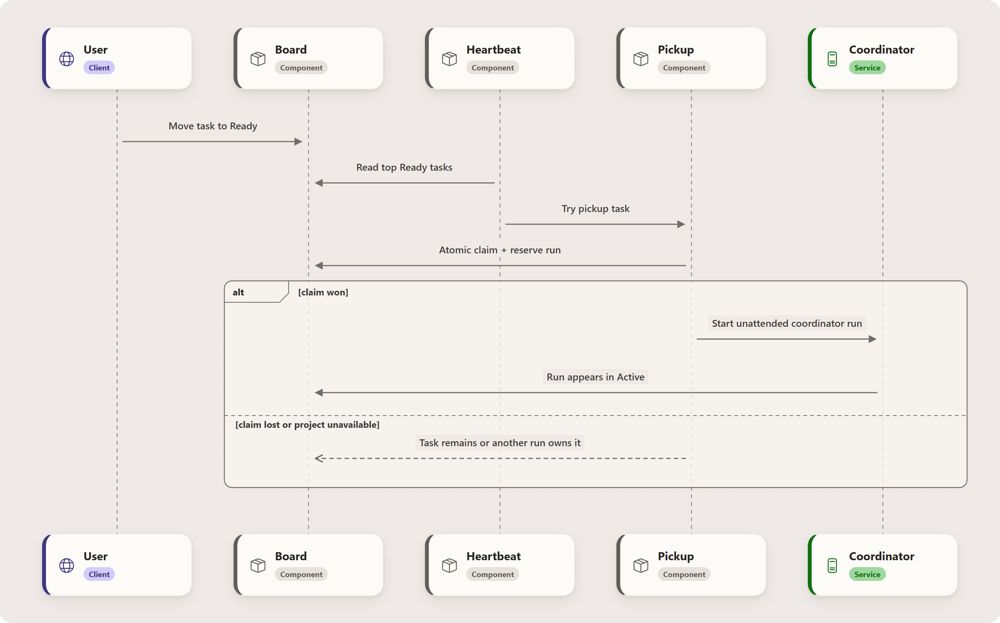

# Workflows and backlog experience

Workflows and backlog are the operating model for Agentweaver work. Workflows define how a run moves through nodes, edges, triggers, gates, and completion; backlog defines which tasks are not yet committed, which tasks are Ready, and what the coordinator heartbeat may pick up next. The web UI gives humans a visual control room, while MCP exposes the same state and actions as tools.

Scope: this page covers workflow definition management, backlog intake, Ready pickup, autopilot defaults, spec decomposition, board stages, and the MCP tools for those experiences.

Related docs: [Overview](./00-overview.md), [Runs & board](./runs-board-watch.md), [Coordinator & orchestration](./coordinator-orchestration.md), [Operations](./operations.md), [Workflow generation](../workflow-generation.md), [Workflow selection](../workflow-selection.md), [Workflow library](../workflow-library.md), [Workflow binder](../workflow-binder.md), and [Workflow engine](../deep-dive/workflow-engine.md).

<!-- Diagram source: ../diagrams/src/canonical-board-lifecycle.drawio.
     Shared canonical; changes belong to its owner. -->

## The mental model

Agentweaver separates **process definition** from **work intake**.

- A **workflow** is a reusable pipeline. It has an id, name, description, version, trigger, start node, nodes, edges, and optional stage definitions.
- A **node** is a step in the pipeline: agent work, peer review, RAI check, human review, merge, scribe, terminal, or another supported workflow shape.
- An **edge** connects nodes and may carry a verdict such as `approved`, `request-changes`, `declined`, `pass`, `fail`, `review`, or `revise`.
- A **trigger** describes how the workflow starts. The Workflows page shows it as **Trigger: event (...)**, **Trigger: manual**, or **Trigger: unknown**.
- A **default** workflow is the project fallback for new work when no better or explicit workflow is selected.
- A **backlog task** is work that has not been claimed yet. It sits in **Backlog** or **Ready**.
- A **pickup** is the coordinator heartbeat claiming a Ready task and turning it into an unattended coordinator run.
- The **board** has six logical buckets: Backlog, Ready, Problems, Human Review, Active, and Done. The UI renders Backlog → Ready → Active → Done as four main lanes, with Human Review and Problems in a separate **Needs attention / review** section.

The user-facing promise is simple: workflows answer **how should this run?** Backlog answers **what should run next?** The heartbeat connects them.

## Workflows in the web UI

The project **Workflows** page is reached from a project at **Workflows**. It is titled **Workflows** with the subtitle **Reusable pipeline definitions.** It shows discovered workflow definitions, validation status, source, trigger, and the effective default.

The page groups cards into three sections:

| Section | What the user sees | What it means |
|---|---|---|
| **Active workflow** | The workflow card marked **Active**. | This is the effective default for new project runs. |
| **Available workflows** | Valid workflows that can be chosen through **Set as default**. | These are runnable definitions discovered by the project registry. |
| **Invalid workflows** | Workflows marked **Invalid** with an error message. | These cannot run or become active until fixed. |

Each card shows the workflow name, id, badges, **Trigger**, and **Source**. Built-in workflows carry **Built-in**. Valid non-default workflows carry **Valid**. Invalid workflows carry **Invalid** and display the validation error. The active card carries **Active** because it is already the project default.

Page actions are operational:

- **New workflow** opens a YAML editor with a blank template.
- **Generate workflow** opens a plain-language generation dialog.
- **Set as default** opens a picker with **Project workflows**, **Built-in workflows**, and **Reset to built-in default**.
- **Sync** re-reads `.agentweaver/workflows/`.
- **View graph** expands an inline read-only graph for a valid workflow.
- **Edit** opens the YAML editor for project-authored workflows.
- **Edit visually** opens the visual workflow editor for project-authored workflows.

Built-in workflows are inspectable and selectable. Project workflows are editable because they live in the project's workspace.

### `workflows_list`: viewing discovered workflows

MCP mirrors the Workflows page with `workflows_list`. It returns the discovered workflow set for a project, including validation status and which workflow is the effective default.

Use `workflows_list` when an assistant needs to:

1. see every workflow the project can use,
2. identify the default,
3. avoid invalid workflows,
4. decide whether a task should use the default or an override,
5. explain why the UI shows a workflow as Active, Available, or Invalid.

The discovered set includes the built-in default, catalog library workflows allowed for the project, and project-authored YAML files from `.agentweaver/workflows/`. Discovery and validation are server-side. The UI and MCP render the result; they do not invent workflow validity.

### `workflow_get`: inspecting nodes, edges, and trigger

`workflow_get` returns a single workflow by id, including its nodes, edges, and trigger. It is the assistant equivalent of opening a workflow and reading the pipeline.

Use it to answer:

- which trigger starts the workflow,
- which node is first,
- which agents, reviews, checks, merges, and terminal paths exist,
- which edge sends failed review back to implementation,
- whether the workflow is event-driven, manual, or otherwise configured.

In the UI, **View graph** gives the human a compact structural preview. Nodes are laid out left to right. Forward edges show normal progression. Loopback edges show rework paths such as revise or request changes. Card shape follows node type: agent nodes read as main work, gates read as decisions, action nodes read as execution steps, and terminal nodes read as endpoints.

### Defaults, sync, and runtime readiness

**Set as default** changes the project default. Choosing a valid workflow makes it active. Choosing **Reset to built-in default** clears the project-specific default and returns the project to the built-in fallback.

Default selection is safe by design. A workflow must be valid and bindable before it can become default. Loader-valid definitions that cannot execute are rejected before they can become the project default.

**Sync** is explicit. It re-reads `.agentweaver/workflows/` and refreshes the registry. MCP uses `workflows_sync` for the same operation. Use it after a workflow file changes on disk. A successful UI sync shows a message like **Synced 3 workflows from .agentweaver/workflows/.**

If sync finds invalid workflows, they remain visible under **Invalid workflows** with errors. The experience turns broken definitions into visible operational work.

## Generating and saving workflows

Workflow generation is draft-first. The user clicks **Generate workflow**, describes the pipeline, and receives YAML for review. Nothing is saved to `.agentweaver/workflows/` until the user saves.

<!-- Shared stable figure: ../diagrams/canonical-workflow-authoring.png.
     Source migration and publication belong to its owner; no local fork. -->

### Web UI generation flow

The **Generate workflow** dialog has one field:

| UI label | Hint | User action |
|---|---|---|
| **Describe the workflow you need** | **A complete YAML draft will be generated for you to review and edit before saving.** | Describe the process and click **Generate**. |

While generation runs, the primary button reads **Generating…**. On success, the dialog closes and the editor opens with the YAML draft. The success message says **Workflow generated. Review and save the draft.** If the generator needed its one correction pass, the message says **Workflow generated (one correction pass applied). Review and save the draft.**

### MCP generation and save

`workflow_generate` takes `project_id` and `description`. It returns:

- `yaml` — the generated workflow YAML draft,
- `workflow_id` — the id declared or derived for the draft,
- `was_corrected` — whether one correction pass was needed.

The generated YAML is constrained to the project's castable roles when the project has a team, so generated agent roles stay aligned with the roster.

`workflow_save` persists YAML into the project workspace. It validates YAML, verifies the declared `id` matches the `workflow_id`, dry-run binds the definition to the runtime graph, writes it under `.agentweaver/workflows/`, syncs the registry, and returns the parsed workflow definition.

The boundary is deliberate: generation can be creative, editing can be iterative, and saving is strict. If validation or binding fails, the user sees an error instead of a half-saved workflow.

## Workflow selection during pickup

A Ready task may run with:

1. a task-specific workflow override,
2. the coordinator's best-fit selection among available workflows,
3. the project default as fallback.

The task card workflow menu is the human pre-run override. It opens from the flow icon on a task card and lists valid workflows. Selecting a workflow stores the override. Selecting **Use project default** clears it.

Once a task is claimed, the workflow override can no longer be changed. If a user or assistant races with pickup, the backend returns a conflict and the UI explains that the task was just claimed.

The coordinator selection model is process-fit oriented. It selects the workflow whose steps and outputs fit the task, not the workflow whose name shares words with the task. If selection fails, the default remains the safe fallback. See [Workflow selection](../workflow-selection.md) for the deeper selection contract.

## Workflow definition graph

The Workflows page can expand any valid workflow card with **View graph**. This is a definition graph, not a live run graph: it shows the reusable pipeline structure before the coordinator applies it to a specific run. Live status-carrying topology remains on the coordinator orchestration page.

Open `/projects/:projectId/workflows` and choose **View graph** on a valid definition. Use YAML or visual editing for project-authored definitions, then save explicitly; inspecting a graph does not execute it.

## The backlog board experience

The board is the user's work queue. It presents intake tasks and run cards in one place.

Open a project → **Board** to capture and rank intake tasks. Dragging is limited to Backlog and Ready; the coordinator owns progression after pickup.

| Logical bucket | Stage kind | Description shown in the UI | Who moves work there |
|---|---|---|---|
| **Backlog** | intake | **Captured but not yet committed to. Things you're considering.** | User or MCP client. |
| **Ready** | intake | **Committed work that the coordinator and Ralph monitor may pick up next.** | User or MCP client, then heartbeat. |
| **Problems** | workflow | **Blocked, failed, declined, or otherwise needs attention.** | Coordinator and run lifecycle. |
| **Human Review** | workflow | **Work waiting for a person to review or approve.** | Coordinator and review gates. |
| **Active** | workflow | **Work currently moving through the coordinator workflow.** | Heartbeat and coordinator. |
| **Done** | workflow | **Completed or merged work.** | Coordinator and terminal lifecycle. |

Backlog and Ready are intake columns. They contain draggable task cards. Problems, Human Review, Active, and Done are run-bucket stages. They contain run cards and are owned by the coordinator. Dragging a task into a workflow column is rejected with **Only the coordinator moves work into the workflow.**

### Capturing and editing tasks

The capture bar says **Capture a task into Backlog**. The user enters a title and clicks **Add** or presses Enter. Empty titles are blocked in the UI and by the backend.

MCP uses `backlog_capture_task` with `project_id`, required `title`, and optional `description`. Captured tasks start in Backlog. The card shows the title, optional description, captured-by identity, workflow menu, edit action, and archive action.

**Edit task** opens **Title** and **Description** fields with **Cancel** and **Save**. MCP uses `backlog_edit_task` for the same operation.

`backlog_delete_task` removes an unclaimed backlog task through MCP. If the task has already been claimed, deletion fails with 409 `task_claimed`. Once work becomes a run, the run is the accountable record.

**Archive task** and `backlog_archive_task` remove the task from the active board. If the task is claimed, archiving also archives the linked coordinator run card.

### Promoting Backlog to Ready

Ready is the commitment boundary. A task in Backlog is being considered. A task in Ready is eligible for heartbeat pickup.

The user can promote by dragging Backlog → Ready, using **Add to Ready**, or clicking **Send all to Ready** on a non-empty Backlog column.

| Tool | UI equivalent | Notes |
|---|---|---|
| `backlog_move_to_ready` | Drag Backlog → Ready. | Optional zero-based `target_index`; null appends. |
| `backlog_move_to_backlog` | Drag Ready → Backlog. | Optional zero-based `target_index`; null appends. |
| `backlog_reorder_task` | Drag within Backlog or Ready. | Reorders within the current intake bucket. |
| `send_all_backlog_to_ready` | **Send all to Ready**. | Bulk-promotes all Backlog tasks, preserving relative order and appending after existing Ready tasks. |

`send_all_backlog_to_ready` is idempotent. On an empty backlog, it returns **No backlog tasks to promote.** In the UI, the button only appears when Backlog has cards.

### Board snapshots and stages

`backlog_get_board` returns the full board: Backlog, Ready, Problems, Human Review, Active, and Done. It accepts `include_terminal_history`, which controls how much Done history appears.

The web board uses the same model. Done shows recent terminal cards by default and can reveal older cards with **Show older**. **Show less** collapses the terminal history again.

Run cards are read-only from a workflow-position perspective. They show title, status, current stage or work-plan status, coordinator or agent identity, **Approval needed** when tool approval is pending, **Retry** when failed or merge-failed, and archive.

`backlog_get_workflow_stages` returns the ordered canonical run buckets:

1. **Problems**
2. **Human Review**
3. **Active**
4. **Done**

These are board buckets, not necessarily workflow nodes. Failed, blocked, declined, or merge-failed work maps to Problems. Awaiting review maps to Human Review. In-progress planning, dispatch, and assembly maps to Active. Completed, merged, or assemble-ready runs map to Done. Terminal does not automatically mean Done: declined and failed runs still need attention.

## Pickup and automation

Pickup turns Ready tasks into coordinator runs. The heartbeat scans eligible projects and reads their top Ready candidates. **Task claim, coordinator run reservation, and approval-policy snapshot persist in one transaction**; only a won claim activates the reserved run unattended.

<!-- Diagram source: ../diagrams/src/experience-workflows-backlog-fig3.drawio.
     Published PNG path is stable; edit the draw.io source, not the raster. -->

A project is eligible when it is active and its workspace is available. Unavailable projects leave Ready tasks untouched with priority preserved. A lost claim (another claimant won or the task moved back to Backlog) makes no new reservation. A won claim prevents duplicate task-to-run reservations; it is not a blanket exactly-once guarantee for every later agent action.

After reservation commits, activation starts the coordinator and schedules unattended confirmation attributed to `CapturedBy`. If activation fails, the service attempts to terminalize the reserved run as **Failed** with `coordinator_start_failed`; the task remains **Claimed**, not silently requeued. Missing/invalid teams or unavailable model-provider authorization can also produce a claimed failed run before activation. Inspect Problems and the recorded reason rather than expecting another heartbeat to retry it automatically.

### Pickup settings

The board toolbar includes **Pickup settings**. The dialog has three controls:

| UI control | Backing setting | Meaning |
|---|---|---|
| **Max Ready items per heartbeat** | `max_ready_per_heartbeat` | How many Ready tasks the coordinator may claim per tick. |
| **Autopilot** | `pickup_autopilot` | Auto-answer coordinator clarifying questions for automatically picked-up runs. |
| **Auto-approve tools** | `pickup_auto_approve_tools` | Automatically approve tool calls for automatically picked-up runs, except sandbox-blocked tools. |

`max_ready_per_heartbeat` is bounded from 1 to 20. The UI spin button clamps values into range; the backend rejects out-of-range values. MCP uses `backlog_get_settings` and `backlog_set_settings` for the same state.

### Autopilot UX

Autopilot keeps unattended pickup runs moving through clarifying questions that the coordinator can answer from context. The help text says it auto-answers the coordinator's clarifying questions using the coordinator model so the run does not pause, while tool and permission approvals are still asked, and every auto-answer is logged in the timeline.

The UX contract is:

- Autopilot applies to heartbeat-picked runs and their child runs.
- It auto-answers clarifying questions using the coordinator model.
- It does not silently grant tool or permission approvals.
- Every auto-answer is visible in the run timeline.
- If **Auto-approve tools** is also enabled, only repository-defined safe tools may be auto-approved. Destructive, privileged, preview, secret, and other network approvals remain gated.

Use autopilot when Ready tasks are well-scoped and the user wants queue throughput. Leave it off when tasks require human judgment at the first clarification gate.

## Decomposing a spec into backlog tasks

Spec decomposition turns a markdown document in the project workspace into proposed backlog tasks. It is preview-first: the user sees proposed items before creation.

### Web UI flow

The board toolbar has **Import from workspace**. The user selects a workspace file and clicks **Preview tasks**. Agentweaver analyzes the markdown file and opens **Preview proposed backlog items**.

The same preview is reachable from **Workspace** by selecting a Markdown spec and choosing **Import to backlog**. Review proposed tasks before choosing **Create tasks**; merely opening the preview does not create intake items.

The preview dialog shows task titles, optional descriptions, **Already exists** badges for duplicates, a cap notice when extraction returns more than the cap, **No actionable items found in this file.** when empty, and **Create tasks** to confirm persistence.

When the user clicks **Create tasks**, Agentweaver creates non-duplicate items in Backlog, appends them after existing Backlog tasks, refreshes the board, and shows **Tasks imported successfully.**

### MCP flow with `backlog_decompose_spec`

`backlog_decompose_spec` takes `project_id`, workspace-relative `file_path`, and `confirm`. With `confirm=false`, it previews. With `confirm=true`, it creates tasks.

The response includes `proposed_items`, `was_capped`, and `total_found`. Each proposed item includes `title`, optional `description`, and `already_exists`.

Recommended MCP flow:

1. call `backlog_decompose_spec` with `confirm=false`,
2. inspect or present `proposed_items`,
3. call it again with `confirm=true` when creation is desired,
4. call `backlog_get_board` to show the new Backlog state.

Results are capped at 50 items. Duplicate detection is scoped to the same project and source file title, so repeated imports from the same spec are safe.

## Web UI and MCP parity

| Experience | Web UI | MCP tool |
|---|---|---|
| List workflows and default | **Workflows** page | `workflows_list` |
| Inspect one workflow | **View graph** and editor detail | `workflow_get` |
| Generate workflow draft | **Generate workflow** | `workflow_generate` |
| Save workflow YAML | Editor **Save** | `workflow_save` |
| Re-read workflows from disk | **Sync** | `workflows_sync` |
| Capture task | **Capture a task into Backlog** / **Add** | `backlog_capture_task` |
| Edit task | **Edit task** | `backlog_edit_task` |
| Delete task | MCP-only cleanup path | `backlog_delete_task` |
| Promote to Ready | Drag, quick-add, **Send all to Ready** | `backlog_move_to_ready`, `send_all_backlog_to_ready` |
| Move back to Backlog | Drag Ready → Backlog | `backlog_move_to_backlog` |
| Reorder intake | Drag within Backlog or Ready | `backlog_reorder_task` |
| Archive task | **Archive task** | `backlog_archive_task` |
| Read board | Board page | `backlog_get_board` |
| Read run buckets | Board columns | `backlog_get_workflow_stages` |
| Read pickup settings | **Pickup settings** | `backlog_get_settings` |
| Update pickup settings | **Pickup settings** → **Save** | `backlog_set_settings` |
| Decompose markdown spec | **Import from workspace** | `backlog_decompose_spec` |

## Edge cases and limits

- **Empty backlog**: Backlog can be empty. The UI shows a count of 0 and a drop zone. `send_all_backlog_to_ready` safely returns **No backlog tasks to promote.**
- **Empty workflow list**: The UI shows **No workflows found** and prompts **Sync**. In normal operation, the built-in default keeps a project from having no usable workflow.
- **Invalid workflows**: Invalid entries stay visible under **Invalid workflows** with errors and cannot become active until fixed.
- **Claimed task deletion**: `backlog_delete_task` returns 409 `task_claimed` for claimed tasks. Operate on the run card instead.
- **Claimed task movement**: moving back to Backlog, reordering, or changing workflow override conflicts after pickup wins the claim.
- **Settings bounds**: `max_ready_per_heartbeat` must be 1-20.
- **Project unavailable**: inactive projects or unavailable workspaces leave Ready tasks untouched for a later heartbeat.
- **Save versus sync**: `workflow_save` writes and refreshes the saved workflow; `workflows_sync` re-reads workflow files after out-of-band disk changes.

## Product principles

- **Preview before persistence**: workflow generation and spec decomposition return drafts or previews before saving or task creation.
- **Ready is explicit commitment**: heartbeat only picks up Ready tasks, never raw Backlog ideas.
- **The coordinator owns workflow movement**: humans rank intake; run lifecycle moves workflow-stage cards.
- **Defaults are visible**: the active workflow is explicit on the Workflows page and returned by `workflows_list`.
- **Automation is accountable**: pickup records the captured-by user, autopilot logs auto-answers, and tool approvals remain governed by sandbox policy.
- **Invalid state is visible**: invalid workflows, failed runs, blocked approvals, and problem cards are surfaced where users can act.

Workflows and backlog make Agentweaver predictable: define the process, queue the work, choose what is Ready, let the heartbeat pick up only committed tasks, and watch every run move through visible stages.

<!-- diagram-context:canonical-board-lifecycle:start -->

Diagram details and constraints

<table><thead><tr><th>Element</th><th>Contract</th></tr></thead><tbody>
<tr><td>title</td><td>The board is a projection</td></tr>
<tr><td>subtitle</td><td>Columns reflect persisted task and run state—not a separate workflow engine.</td></tr>
<tr><td>group-title0</td><td>Before and during execution</td></tr>
<tr><td>group-title1</td><td>Review / terminal outcomes</td></tr>
<tr><td>Backlog</td><td>Backlog</td></tr>
<tr><td>Backlog</td><td>Captured task; not queued</td></tr>
<tr><td>Backlog</td><td>task: backlog</td></tr>
<tr><td>Ready</td><td>Ready</td></tr>
<tr><td>Ready</td><td>Queued task</td></tr>
<tr><td>Ready</td><td>task: ready</td></tr>
<tr><td>Active</td><td>Active</td></tr>
<tr><td>Active</td><td>Work is in progress</td></tr>
<tr><td>Active</td><td>default non-review bucket</td></tr>
<tr><td>Problems</td><td>Problems</td></tr>
<tr><td>Problems</td><td>Failed / declined / merge failed</td></tr>
<tr><td>Problems</td><td>or assembly blocked / failed</td></tr>
<tr><td>Human Review</td><td>Human Review</td></tr>
<tr><td>Human Review</td><td>AwaitingReview / InReview</td></tr>
<tr><td>Human Review</td><td>or assembly stage: Review</td></tr>
<tr><td>Done</td><td>Done</td></tr>
<tr><td>Done</td><td>Completed / Merged / AssembleReady</td></tr>
<tr><td>Done</td><td>or plan Complete / stage Done</td></tr>
<tr><td>e1</td><td>queue</td></tr>
<tr><td>e2</td><td>claim + start</td></tr>
<tr><td>e3</td><td>await review</td></tr>
<tr><td>e4</td><td>finish</td></tr>
<tr><td>e5</td><td>problem</td></tr>
<tr><td>assurance-title</td><td>DEFAULT BUCKETS · NOT A NEW STATE MACHINE</td></tr>
<tr><td>assurance-line1</td><td>Configured workflow stages may replace the default run columns. Arrows summarize typical changes, not every path.</td></tr>
<tr><td>assurance-line2</td><td>The board polls persisted state. Ready tasks with unmet dependencies stay Ready; blocked is a flag.</td></tr>
<tr><td>Backlog</td><td>Entity</td></tr>
<tr><td>Backlog</td><td>BacklogTask</td></tr>
<tr><td>Backlog</td><td>State</td></tr>
<tr><td>Backlog</td><td>Run</td></tr>
<tr><td>Backlog</td><td>Not required</td></tr>
<tr><td>Backlog</td><td>Action</td></tr>
<tr><td>Backlog</td><td>Move to Ready</td></tr>
<tr><td>Ready</td><td>Blocked</td></tr>
<tr><td>Ready</td><td>Dependency metadata</td></tr>
<tr><td>Ready</td><td>Pickup</td></tr>
<tr><td>Ready</td><td>Atomic claim</td></tr>
<tr><td>Active</td><td>Input</td></tr>
<tr><td>Active</td><td>Coordinator run</td></tr>
<tr><td>Active</td><td>Status</td></tr>
<tr><td>Active</td><td>Non-review default</td></tr>
<tr><td>Active</td><td>Plan</td></tr>
<tr><td>Active</td><td>Dispatch / assembly</td></tr>
<tr><td>Active</td><td>Approval</td></tr>
<tr><td>Active</td><td>Separate pending flag</td></tr>
<tr><td>Problems</td><td>Failed / Declined</td></tr>
<tr><td>Problems</td><td>Merge</td></tr>
<tr><td>Problems</td><td>MergeFailed</td></tr>
<tr><td>Problems</td><td>Assembly</td></tr>
<tr><td>Problems</td><td>Blocked / Failed</td></tr>
<tr><td>Problems</td><td>Also</td></tr>
<tr><td>Problems</td><td>AssemblyDeclined</td></tr>
<tr><td>Human Review</td><td>AwaitingReview</td></tr>
<tr><td>Human Review</td><td>InReview</td></tr>
<tr><td>Human Review</td><td>Review stage</td></tr>
<tr><td>Human Review</td><td>Approve</td></tr>
<tr><td>Human Review</td><td>Resumes execution</td></tr>
<tr><td>Done</td><td>Completed / Merged</td></tr>
<tr><td>Done</td><td>AssembleReady</td></tr>
<tr><td>Done</td><td>Complete</td></tr>
<tr><td>Done</td><td>Done stage</td></tr>
<tr><td>backlog</td><td>No run is required yet; Move to Ready to queue work</td></tr>
<tr><td>ready</td><td>Unresolved dependencies stay here; Blocked is a flag, not a column</td></tr>
<tr><td>progress</td><td>Claimed tasks link to their run; Pending approval is a separate flag</td></tr>
<tr><td>failed</td><td>Blocked assembly is recoverable; Not every problem is terminal</td></tr>
<tr><td>review</td><td>Approval resumes the workflow; Approval alone is not Done</td></tr>
<tr><td>done</td><td>Persisted-state mapping; Not merely a clicked approval</td></tr>
<tr><td>notes</td><td>DEFAULT BUCKETS · NOT A NEW STATE MACHINE; Configured workflow stages may replace the default run columns. Arrows summarize typical changes, not every path.; The board polls persisted state. Ready tasks with unmet dependencies stay Ready; blocked is a flag.</td></tr>
<tr><td>groups</td><td>Before and during execution; Review and terminal outcomes</td></tr>
</tbody></table>

<!-- diagram-context:canonical-board-lifecycle:end -->

<!-- diagram-context:canonical-workflow-authoring:start -->

Diagram details and constraints

<table><thead><tr><th>Element</th><th>Contract</th></tr></thead><tbody>
<tr><td>title</td><td>Workflow authoring</td></tr>
<tr><td>takeaway</td><td>Generate a draft. Review it. Save deliberately.</td></tr>
<tr><td>generation-boundary</td><td>1 GENERATE + REVIEW / No workflow file is saved</td></tr>
<tr><td>persistence-boundary</td><td>2 EXPLICIT SAVE / Project workspace + registry</td></tr>
<tr><td>Authorize request</td><td>Authorize request</td></tr>
<tr><td>Authorize request</td><td>Project ownership + AI execution plan</td></tr>
<tr><td>Authorize request</td><td>POST …/workflows/generate</td></tr>
<tr><td>Authorize request</td><td>Description required</td></tr>
<tr><td>Prompt context</td><td>Prompt context</td></tr>
<tr><td>Prompt context</td><td>Roles, schema, examples</td></tr>
<tr><td>Prompt context</td><td>Project model override</td></tr>
<tr><td>Prompt context</td><td>Catalog fallback</td></tr>
<tr><td>Generate candidate</td><td>Generate candidate</td></tr>
<tr><td>Generate candidate</td><td>CopilotWorkflowGenerator</td></tr>
<tr><td>Generate candidate</td><td>Model returns YAML, not a saved file</td></tr>
<tr><td>Generate candidate</td><td>Create or edit</td></tr>
<tr><td>Validate candidate</td><td>Validate candidate</td></tr>
<tr><td>Validate candidate</td><td>WorkflowDefinitionLoader + binder dry-run</td></tr>
<tr><td>Validate candidate</td><td>Structure AND runtime bindability</td></tr>
<tr><td>Validate candidate</td><td>Strip fences; ensure id</td></tr>
<tr><td>One correction</td><td>One correction</td></tr>
<tr><td>One correction</td><td>Failed YAML + error</td></tr>
<tr><td>One correction</td><td>Re-run same checks</td></tr>
<tr><td>One correction</td><td>No third attempt</td></tr>
<tr><td>Explicit error</td><td>Explicit error</td></tr>
<tr><td>Explicit error</td><td>Second invalid result</td></tr>
<tr><td>Explicit error</td><td>400 · not persisted</td></tr>
<tr><td>Review &amp; edit draft</td><td>Review &amp; edit draft</td></tr>
<tr><td>Review &amp; edit draft</td><td>Human edits YAML or the visual graph</td></tr>
<tr><td>Review &amp; edit draft</td><td>Valid draft stays unsaved</td></tr>
<tr><td>Save: validate again</td><td>Save: validate again</td></tr>
<tr><td>Save: validate again</td><td>Parse + structure + route id + binder</td></tr>
<tr><td>Save: validate again</td><td>PUT …/workflows/{workflowId}</td></tr>
<tr><td>Save: validate again</td><td>Ownership required</td></tr>
<tr><td>Reject save</td><td>Reject save</td></tr>
<tr><td>Reject save</td><td>Parse / id / bind error</td></tr>
<tr><td>Reject save</td><td>400 or 422 · no write</td></tr>
<tr><td>Reject save</td><td>Fix the draft</td></tr>
<tr><td>Write project YAML</td><td>Write project YAML</td></tr>
<tr><td>Write project YAML</td><td>Resolve the path inside the workspace</td></tr>
<tr><td>Write project YAML</td><td>.agentweaver/workflows/{id}.yaml</td></tr>
<tr><td>Write project YAML</td><td>Contained-path guard</td></tr>
<tr><td>Write can fail</td><td>Write can fail</td></tr>
<tr><td>Write can fail</td><td>Path guard or file I/O</td></tr>
<tr><td>Write can fail</td><td>400 / 500 · stop here</td></tr>
<tr><td>Write can fail</td><td>No success response</td></tr>
<tr><td>Sync → definition</td><td>Sync → definition</td></tr>
<tr><td>Sync → definition</td><td>Extend allowed set if needed; reload</td></tr>
<tr><td>Sync → definition</td><td>Return saved detail on success</td></tr>
<tr><td>Reload failure</td><td>Reload failure</td></tr>
<tr><td>Reload failure</td><td>Written, not available</td></tr>
<tr><td>Reload failure</td><td>422 / 500 · file may exist</td></tr>
<tr><td>e01</td><td>permitted</td></tr>
<tr><td>e02</td><td>grounds prompt</td></tr>
<tr><td>e03</td><td>candidate YAML</td></tr>
<tr><td>e04</td><td>valid; unsaved</td></tr>
<tr><td>e05</td><td>first invalid</td></tr>
<tr><td>e06</td><td>one repair</td></tr>
<tr><td>e07</td><td>invalid again</td></tr>
<tr><td>e08</td><td>explicit Save</td></tr>
<tr><td>e09</td><td>invalid</td></tr>
<tr><td>e10</td><td>checks pass</td></tr>
<tr><td>e11</td><td>failure</td></tr>
<tr><td>e12</td><td>write succeeded</td></tr>
</tbody></table>

<!-- diagram-context:canonical-workflow-authoring:end -->

<!-- diagram-context:experience-workflows-backlog-fig3:start -->

Diagram details and constraints

<table><thead><tr><th>Element</th><th>Contract</th></tr></thead><tbody>
<tr><td>title</td><td>One won claim, one reserved run</td></tr>
<tr><td>takeaway</td><td>Ready pickup commits claim and reservation before activation; other outcomes do not launch.</td></tr>
<tr><td>group-title-0</td><td>SELECTION AND ATOMIC RESERVATION</td></tr>
<tr><td>group-title-1</td><td>POST-CLAIM OUTCOMES</td></tr>
<tr><td>Ranked Ready tasks</td><td>Ranked Ready tasks</td></tr>
<tr><td>Ranked Ready tasks</td><td>Heartbeat candidates</td></tr>
<tr><td>Ranked Ready tasks</td><td>eligible project + workspace</td></tr>
<tr><td>Ranked Ready tasks</td><td>Top-N limits candidates per tick, not total concurrency.</td></tr>
<tr><td>Atomic transaction</td><td>Atomic transaction</td></tr>
<tr><td>Atomic transaction</td><td>Claim + run + policy</td></tr>
<tr><td>Atomic transaction</td><td>task-scoped reservation</td></tr>
<tr><td>Atomic transaction</td><td>Commit all together; no orphan losing run.</td></tr>
<tr><td>Activate winner</td><td>Activate winner</td></tr>
<tr><td>Activate winner</td><td>Use reserved run ID</td></tr>
<tr><td>Activate winner</td><td>post-commit activation</td></tr>
<tr><td>Activate winner</td><td>Schedule unattended confirm attributed to CapturedBy.</td></tr>
<tr><td>Lost / unavailable</td><td>Lost / unavailable</td></tr>
<tr><td>Lost / unavailable</td><td>No launch by this pickup</td></tr>
<tr><td>Lost / unavailable</td><td>rollback / preserve rank</td></tr>
<tr><td>Lost / unavailable</td><td>A winner may own a lost claim; unavailable leaves Ready.</td></tr>
<tr><td>Claimed failed run</td><td>Claimed failed run</td></tr>
<tr><td>Claimed failed run</td><td>Visible failure reason</td></tr>
<tr><td>Claimed failed run</td><td>preflight / activation failure</td></tr>
<tr><td>Claimed failed run</td><td>Do not silently requeue. Terminalization may log failure.</td></tr>
<tr><td>Coordinator work</td><td>Coordinator work</td></tr>
<tr><td>Coordinator work</td><td>Unattended execution</td></tr>
<tr><td>Coordinator work</td><td>claim-time policy snapshot</td></tr>
<tr><td>Coordinator work</td><td>No second manual start for the same captured goal.</td></tr>
<tr><td>e0</td><td>attempt</td></tr>
<tr><td>e1</td><td>won</td></tr>
<tr><td>e2</td><td>not won</td></tr>
<tr><td>e3</td><td>activate</td></tr>
<tr><td>e4</td><td>failure</td></tr>
<tr><td>note</td><td>A won preflight-failure reservation also stays Claimed/Failed. Claim-once is not tool-execution-once.</td></tr>
<tr><td>n0</td><td>Top-N limits candidates per
tick, not total concurrency.</td></tr>
<tr><td>n1</td><td>Commit all together;
no orphan losing run.</td></tr>
<tr><td>n2</td><td>Schedule unattended confirm
attributed to CapturedBy.</td></tr>
<tr><td>n3</td><td>A winner may own a lost claim;
unavailable leaves Ready.</td></tr>
<tr><td>n4</td><td>Do not silently requeue.
Terminalization may log failure.</td></tr>
<tr><td>n5</td><td>No second manual start for
the same captured goal.</td></tr>
<tr><td>groups</td><td>SELECTION AND ATOMIC RESERVATION; POST-CLAIM OUTCOMES</td></tr>
</tbody></table>

<!-- diagram-context:experience-workflows-backlog-fig3:end -->
