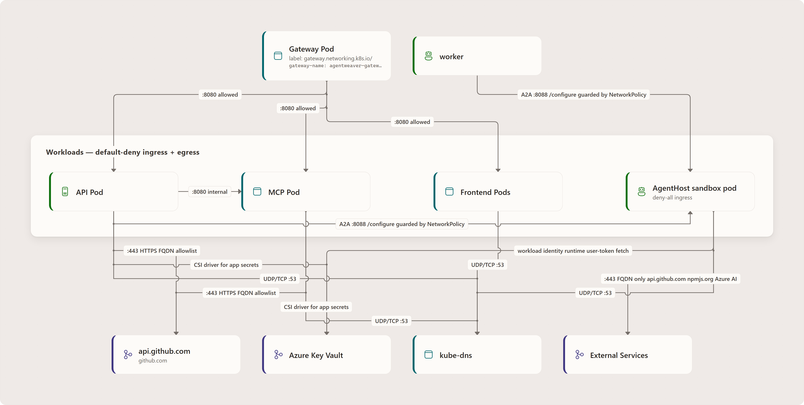

# AKS Architecture

This page describes the checked-in AKS deployment, not an attestation of a live cluster.
For provisioning and deployment commands, see [Deploy to AKS](/guide/deployment-aks).

## Deployed components

The application Gateway routes to Frontend, API, and MCP Services. Worker is a
background control-plane workload, not another public Gateway backend. Its configured
floor is two replicas; the HPA permits two to three using CPU 70% and memory 80%.
API and Worker both read and write the same EF-backed PostgreSQL stores and use the
shared workspace PVC. API/Worker use the privileged control-plane identity; AgentHost
has a separate identity without Key Vault roles, and MCP mounts no secrets.

Preview browser traffic uses a **separate preview Gateway**, not the application
Gateway or an API reverse proxy. The [network diagram](#inbound-request-path) and
[credential diagram](#secrets-management) below show these boundaries.

<!-- canonical-aks-components is shared-owned. Its legacy image is withheld until
     its owner corrects Worker, persistence, preview, and credential authority.
     Guide ownership does not authorize modifying that shared asset. -->

## AgentHost warm-pool lifecycle

Worker runs in `pod-per-run`: coordinator children execute in AgentHost pods rather
than in-process on Worker. The shared `agentweaver-agent-host` warm pool keeps two
pods pre-warmed (`k8s/base/sandbox-warmpool-agenthost.yaml`).

Warm pods boot without a `RunId` and enter standby. The executor creates a claim,
persists its identity, and waits for pod binding. It probes `/healthz` for **HTTP
reachability**: standby also returns 200. One-time `POST /configure` supplies run
identity, bounded credentials, purpose, and the workspace contract. Successful
configuration completes setup and marks `IsReady` before returning. A2A traffic is
gated by that ready state; there is no second post-configuration health poll.

Shared execution uses `/workspace`. Assembly Build/Test uses `LocalReadOnly`: fetch
an immutable source ref, verify base commit and tree, and check out detached into
the disk-backed `/local-workspace` emptyDir. Its preview uses the same verified
checkout. This mode forbids **write-back**, not local build output. Current Worker
configuration also enables pod-local implementation work; it is not just a future
seam. Assistant-purpose setup skips project checkout and ordinary agent setup.


<!-- Canonical editable source: ../diagrams/src/guide-architecture-aks-fig1.drawio.
     Export with pinned draw.io Desktop 31.4.5 using
     npm run docs:render-diagrams -- --spec guide-architecture-aks-fig1.
     Preserve the PNG, hash, and pitch/pass artifacts together. -->

The first valid `/configure` atomically binds the pod **before** setup finishes.
Later valid attempts return `409`, including after setup failure. Configuration
cannot require the turn bearer it delivers; subsequent streamed turns require that
per-run bearer. Network reachability and production mTLS are separate controls:
the preview Gateway's allowed port range also includes 8088.

A successful Assistant turn retains its configured pod and renews MCP authorization
separately for later turns. Failure/cancellation releases it. Ordinary release deletes
the claim and revokes/unregisters run capabilities; an active preview can defer cleanup.
Turn completion therefore does not always mean claim deletion.

The executor uses `AgentHostWarmPoolRef` (default `agentweaver-agent-host`), not per-run
templates or warm pools. Grounding: `KubernetesSandboxExecutor.cs` claim/configuration
and release paths, `AgentHostReadinessProbe.cs`, `AgentHostStartupService.cs`, and
`RemoteOperatorAssistantAgent.cs`; detailed citations accompany the diagram review.

## Networking flow

### Inbound request path



<!-- Canonical editable source: ../diagrams/src/canonical-aks-network.drawio.
     Export with pinned draw.io Desktop 31.4.5 using
     npm run docs:render-diagrams -- --spec canonical-aks-network.
     Preserve the PNG, hash, and pitch/pass artifacts together. -->

Both TLS Gateways listen on 443 using `approuting-istio`. Each **Gateway → HTTPRoute →
Service → pod** chain is explicit. API manages preview resources but is not a browser
traffic hop. Exact paths and longer prefixes win over the frontend `/` catch-all.

| Route | Matches | Service → pod |
| --- | --- | --- |
| API | Prefix `/api`, `/auth`, `/openapi`; exact `/.well-known/oauth-authorization-server`, `/.well-known/openid-configuration`, `/oauth/authorize`, `/oauth/token`, `/oauth/register`, `/oauth/resume`, `/oauth/revoke`, `/oauth/jwks` | `agentweaver-api:8080` → API:8080 |
| MCP | Prefix `/mcp`; exact `/.well-known/oauth-protected-resource` and `/.well-known/oauth-protected-resource/mcp` | `agentweaver-mcp:8080` → MCP:8080 |
| MCP health | Exact `/mcp/health`, rewritten to `/healthz` | `agentweaver-mcp:8080` → MCP:8080 |
| Frontend | Prefix `/` | `agentweaver-frontend:80` → Frontend:8080 |
| Preview | Dynamic `{token}-preview.{zone}` hostname on the separate Gateway; upstream hostname rewritten to `localhost` | `preview-{token}:80` → run-labeled AgentHost target port |

There is no blanket `/oauth` prefix route. The same diagram covers the effective
policy boundaries below; a second traffic diagram is unnecessary.

## Security model

### Network security — Cilium NetworkPolicy

The cluster uses Azure CNI Overlay and Cilium (`--network-dataplane cilium`).
Application Routing uses an Istio-based **gateway** data plane; this does not mean
workload pods have Istio sidecars or an ambient service mesh.

#### NetworkPolicy rules

| Boundary | Selector / permitted source | Effect |
| --- | --- | --- |
| Application ingress | Application Gateway pods or `aks-istio-ingress` namespace | API, MCP, Frontend pod TCP 8080 |
| Application egress | API, MCP, Frontend | Deny by default, with explicit DNS/internal/external rules |
| AgentHost default | `app=agentweaver-agent-host` | Deny ingress except additive allows |
| A2A ingress | Same-namespace API or Worker pods | TCP 8088 to AgentHost |
| Preview ingress | Same-namespace pods labeled `gateway.networking.k8s.io/gateway-name=agentweaver-preview-gateway` | TCP 3000–9000 inclusive to AgentHost |
| AgentHost internal egress | Destination `app=agentweaver-api` or `app=agentweaver-mcp` | TCP 8080 using pod selectors |
| AgentHost DNS | `kube-system` + `k8s-app=kube-dns`, or `10.0.0.10/32` | UDP/TCP 53 |
| AgentHost public-address HTTPS | IPv4/IPv6 CIDR rules below | TCP 443, not a GitHub-only CIDR |

#### Sandbox isolation

The selected policies are **additive allows**, not intersecting restrictions.
The preview range includes **8088**, so network policy does not make API/Worker the
only sources able to reach the A2A listener. Production mTLS/client-certificate
authentication is a separate control.

API ingress requires both `app=agentweaver-agent-host` and
`agentweaver.dev/sandbox=true`; MCP ingress requires
`app.kubernetes.io/component=agent-host`. The template carries these labels.
Destination pod selectors permit API/MCP access without granting broad private
network access. Under the documented Cilium path, CIDR/world permission does not
replace cluster-pod identity permission.

Public-address HTTPS permits `0.0.0.0/0` except `10.0.0.0/8`, `172.16.0.0/12`,
`192.168.0.0/16`, `169.254.0.0/16`, and `::/0` except `fc00::/7`, `fe80::/10`.
These are the actual exclusions, not every nonpublic range: `100.64.0.0/10` is not
listed. The manifests document the Kata DNS-hook limitation and explicit IP/port
fallback. A narrower-looking FQDN policy does **not** make this effective union
FQDN-only. HTTPS reachability does not grant Key Vault authorization.

Agent execution uses Kata VM-isolated pods (`runtimeClassName: kata-vm-isolation`)
claimed through `SandboxClaim` (`extensions.agents.x-k8s.io/v1beta1`). The in-cluster
API selects `KubernetesSandboxExecutor` when `KUBERNETES_SERVICE_HOST` is present.
See [Sandbox verification](/guide/deployment-aks#verify).

### Non-root containers

API and Frontend run as UID 1000 with `runAsNonRoot: true` and dropped capabilities.
API also sets `allowPrivilegeEscalation: false`.

### Secrets management

**Azure Workload Identity** lets API/Worker use Key Vault without embedded Azure
credentials. The trusted control-plane broker redeems a run's purpose-bound capability
snapshot and fences authority before and after retrieval. It supplies `copilotCredential`
through one-time `/configure`, or supplies the selected BYOK configuration.
Repository credentials, A2A turn tokens, and Assistant MCP tokens remain separate.
AgentHost does not resolve an ambient user's token or read Key Vault.


<!-- Canonical editable source: ../diagrams/src/guide-architecture-aks-fig5.drawio.
     Export with pinned draw.io Desktop 31.4.5 using
     npm run docs:render-diagrams -- --spec guide-architecture-aks-fig5.
     Preserve the PNG, hash, and pitch/pass artifacts together. -->

API and Worker ServiceAccounts federate through AKS OIDC to `agentweaver-api-identity`,
which has Key Vault **Secrets User and Secrets Officer** grants. Their Kubernetes RBAC
remains distinct; Worker does not inherit API preview-management permissions.
`agentweaver-agent-host` federates to **`agentweaver-agenthost-identity`, with no Key
Vault roles**. Provisioning removes its legacy federation to the privileged identity.
The broker is trusted API/Worker application code, not a separate public service.

One static `SecretProviderClass`, **`agentweaver-secrets`**, configures CSI app-secret
delivery for **API and Worker**. It is not the vault itself. It mounts files and syncs
a Kubernetes Secret. The manifest includes the internal API key, provider-key signing
key, telemetry connection string, and Repo/Copilot App configuration.

| Value | Consumption |
| --- | --- |
| `mcp-api-key` | Startup wrapper reads `/mnt/secrets-store/mcp-api-key` for internal API authentication; not a hosted MCP bearer key |
| `ai-execution-provider-key-signing-key` | Synchronized Kubernetes `secretKeyRef` supplies `AiExecution__ProviderKeySigningKey` |
| OAuth signing/encryption certificate families | API runtime `SecretClient` loads usable Key Vault versions with active/previous overlap; not CSI delivery |

The CSI mount triggers synchronization; do not describe all values as file-only.
MCP mounts **no secrets** and accepts only Agentweaver-minted broker JWTs for the exact
`/mcp` audience and `mcp:invoke` scope. Worker does not host the API OAuth certificate
loading path.

CSI app-secret rotation polling is two minutes. Create the provider-key signing key
once with high-entropy material and rotate only with a coordinated API rollout:
serving replicas must agree, and rotation invalidates prepared execution contexts.
AgentHost receives no OAuth-client-secret mount. See [Configuration](./configuration)
for credential import, migration, and recovery procedures.

## Authentication

**Microsoft Entra ID** provides browser identity; end users are not issued API keys.

1. The user selects **Sign in with Microsoft Entra ID**.
2. API redirects to the configured Entra application.
3. Entra returns to `https://<host>/auth/entra/callback`; API establishes platform identity and roles.
4. Repository discovery and GitHub project creation use a separate Repo App handoff and opaque selection code.
5. Model access follows the [project versus personal provider hierarchy](./authentication#provider-hierarchy).

The renderer derives `Auth__Entra__RedirectUri` and `Auth__Entra__FrontendUrl` from the
public host, without localhost fallback. Register the exact callback under the Entra
app's `publicClient` platform; `npm run azure:setup-entra-app -- --redirect-uri
https://<host>/auth/entra/callback` prepares registration. Do not change a production
identity registration without its owner's approval.

### MCP authentication

MCP forwards authorized caller context to API at `http://agentweaver-api:8080`.
MCP OAuth, repository authorization, and model capabilities are separate boundaries.
See [MCP connection](./mcp-cli) and [Authentication](./authentication).

### External dependencies

| Service | Purpose | Boundary |
| --- | --- | --- |
| GitHub APIs | App capability and permitted repository operations | Control-plane HTTPS; AgentHost public-address HTTPS is not FQDN-only |
| GitHub browser origin | Repo/Copilot consent handoffs | Browser connectivity, not pod network authorization |
| Azure Key Vault | CSI and trusted runtime credentials/certificates | Reachability plus privileged workload identity; no AgentHost vault grant |
| Azure Container Registry | Image pulls | Kubelet/cluster ACR authorization, not pod credential delivery |
| PostgreSQL | Durable application state | TCP 5432; private subnet or rendered public-access FQDN policy according to deployment |
| Telemetry endpoint | Monitoring export | Deployment-specific telemetry configuration; see [Operations](./operations) |

## Storage model

### PostgreSQL (primary data store)

API and Worker use **EF-backed application stores** via `MemoryDbContext`, including
projects, runs, revisions, workflow state, memory, decisions, OAuth state, and durable
events. This is neither an API-read/Worker-write split nor a production Dapper/EF partition.
Provisioning stores connection configuration in `agentweaver-postgres`, not in images.

| Connection string key | Precedence | Used by |
| --- | --- | --- |
| `ConnectionStrings__Postgres` | First | Shared EF stores |
| `ConnectionStrings__MemoryDb` | Fallback | Same EF stores |
| `Database__ConnectionString` | Final fallback | Same EF stores |

PostgreSQL supports multiple API replicas with `RollingUpdate`, without SQLite's
single-writer deployment constraint.

### Workspace volume

The shared `agentweaver-workspace` PVC is **50 GiB RWX Azure Files**, with StorageClass
`azurefile-csi-premium-uid1000`, mounted at `/workspace`. AgentHost separately mounts
an **8 GiB disk-backed `execution-scratch` emptyDir** at `/local-workspace`; it is not
durable shared state.

```text
PVC: agentweaver-workspace (Azure Files, RWX)
  storageClass: azurefile-csi-premium-uid1000
  mountPath: /workspace
  |
  +-- .home/                (shared app/runtime state; no GitHub token mirror)
  +-- worktrees/            (git worktrees per run)
  +-- <project workspaces>  (project working directories)
```

### EF Core migrations

API and Worker init containers (`migrate-memory-db`) run
`/app/efbundle --verbose -- --postgres-migrations` before their main containers start.
They use the API image and injected `ConnectionStrings__MemoryDb` /
`ConnectionStrings__Postgres` from `agentweaver-postgres`. No connection string is
embedded in the image or manifest. Local design-time commands default to SQLite;
use `--postgres-migrations` only with configured PostgreSQL credentials.

### Ephemeral storage for testing

For throwaway SQLite testing, set `Database__Provider=Sqlite` and replace the shared
workspace volume with:

```yaml
volumes:
  - name: workspace
    emptyDir: {}
```

Data is lost on pod restart. SQLite requires one replica and `Recreate` strategy to
avoid write contention; this is not a production storage migration procedure.

<!-- diagram-context:canonical-aks-network:start -->
<details id="diagram-context-canonical-aks-network" v-pre>
<summary>Diagram details and constraints</summary>
<table><thead><tr><th>Element</th><th>Contract</th></tr></thead><tbody>
<tr><td>title</td><td>AKS network: two ingress planes</td></tr>
<tr><td>takeaway</td><td>Routes select Services; additive policies bound AgentHost access, not a vault credential path.</td></tr>
<tr><td>n-app-title</td><td>APPLICATION ORIGIN • EXACT MATCHES / LONGER PREFIXES BEAT /</td></tr>
<tr><td>n-preview-title</td><td>PREVIEW ORIGIN • API MANAGES RESOURCES, NOT BROWSER TRAFFIC</td></tr>
<tr><td>n-egress-title</td><td>EFFECTIVE AGENTHOST POLICY UNION</td></tr>
<tr><td>Client</td><td>Client</td></tr>
<tr><td>Client</td><td>Browser / MCP</td></tr>
<tr><td>Client</td><td>Public app origin</td></tr>
<tr><td>App Gateway</td><td>App Gateway</td></tr>
<tr><td>App Gateway</td><td>agentweaver-gateway</td></tr>
<tr><td>App Gateway</td><td>TLS :443</td></tr>
<tr><td>HTTPRoutes</td><td>HTTPRoutes</td></tr>
<tr><td>HTTPRoutes</td><td>API / MCP / /</td></tr>
<tr><td>HTTPRoutes</td><td>Exact OAuth routes below</td></tr>
<tr><td>Services</td><td>Services</td></tr>
<tr><td>Services</td><td>API/MCP :8080</td></tr>
<tr><td>Services</td><td>Frontend :80</td></tr>
<tr><td>App pods</td><td>App pods</td></tr>
<tr><td>App pods</td><td>API / MCP / web</td></tr>
<tr><td>App pods</td><td>All target :8080</td></tr>
<tr><td>Browser</td><td>Browser</td></tr>
<tr><td>Browser</td><td>{token}-preview</td></tr>
<tr><td>Browser</td><td>Separate hostname</td></tr>
<tr><td>Preview GW</td><td>Preview GW</td></tr>
<tr><td>Preview GW</td><td>preview-gateway</td></tr>
<tr><td>HTTPRoute</td><td>HTTPRoute</td></tr>
<tr><td>HTTPRoute</td><td>preview-{token}</td></tr>
<tr><td>HTTPRoute</td><td>Host rewrite: localhost</td></tr>
<tr><td>Service</td><td>Service</td></tr>
<tr><td>Service</td><td>preview-{token}:80</td></tr>
<tr><td>Service</td><td>Run-label selector</td></tr>
<tr><td>AgentHost</td><td>AgentHost</td></tr>
<tr><td>AgentHost</td><td>Preview target port</td></tr>
<tr><td>AgentHost</td><td>Gateway: 3000–9000</td></tr>
<tr><td>API / MCP</td><td>API / MCP</td></tr>
<tr><td>API / MCP</td><td>Selector-based TCP 8080</td></tr>
<tr><td>API / MCP</td><td>DNS: UDP/TCP 53 separately</td></tr>
<tr><td>Public HTTPS</td><td>Public HTTPS</td></tr>
<tr><td>Public HTTPS</td><td>TCP 443, IPv4 + IPv6</td></tr>
<tr><td>Public HTTPS</td><td>Private/link-local exclusions</td></tr>
<tr><td>Additive allows</td><td>Additive allows</td></tr>
<tr><td>Additive allows</td><td>API/Worker → A2A :8088</td></tr>
<tr><td>Additive allows</td><td>Preview range includes 8088</td></tr>
<tr><td>n-internal</td><td>TCP 8080</td></tr>
<tr><td>n-public</td><td>TCP 443</td></tr>
<tr><td>n-routes-heading</td><td>APP ROUTES</td></tr>
<tr><td>n-routes-body</td><td>API: /api, /auth, /openapi + exact OAuth/discovery. MCP: /mcp + resource metadata; /mcp/health → /healthz.</td></tr>
<tr><td>n-exclusions-heading</td><td>EGRESS EXCLUSIONS</td></tr>
<tr><td>n-exclusions-body</td><td>10/8, 172.16/12, 192.168/16, 169.254/16; fc00::/7, fe80::/10. Not FQDN-only; no vault authority implied.</td></tr>
<tr><td>notes</td><td>[object Object]; [object Object]</td></tr>
<tr><td>groups</td><td>[object Object]; [object Object]; [object Object]</td></tr>
</tbody></table>
</details>
<!-- diagram-context:canonical-aks-network:end -->

<!-- diagram-context:guide-architecture-aks-fig1:start -->
<details id="diagram-context-guide-architecture-aks-fig1" v-pre>
<summary>Diagram details and constraints</summary>
<table><thead><tr><th>Element</th><th>Contract</th></tr></thead><tbody>
<tr><td>title</td><td>AgentHost: bind once, serve ready</td></tr>
<tr><td>takeaway</td><td>HTTP reachability is not setup readiness; claim lifetime can span Assistant turns.</td></tr>
<tr><td>l-launch-title</td><td>01 CONTROL-PLANE LAUNCH</td></tr>
<tr><td>l-setup-title</td><td>02 PURPOSE-BOUND SETUP</td></tr>
<tr><td>l-turns-title</td><td>03 TURN AND CLAIM LIFETIME</td></tr>
<tr><td>Claim warm pod</td><td>Claim warm pod</td></tr>
<tr><td>Claim warm pod</td><td>Persist claim; wait for binding</td></tr>
<tr><td>Claim warm pod</td><td>Shared pool: 2 warm pods</td></tr>
<tr><td>Probe listener</td><td>Probe listener</td></tr>
<tr><td>Probe listener</td><td>/healthz success: reachable</td></tr>
<tr><td>Probe listener</td><td>200 can mean standby</td></tr>
<tr><td>Configure once</td><td>Configure once</td></tr>
<tr><td>Configure once</td><td>Run, purpose and capabilities</td></tr>
<tr><td>Configure once</td><td>POST /configure</td></tr>
<tr><td>Select workspace</td><td>Select workspace</td></tr>
<tr><td>Select workspace</td><td>Shared or verified local checkout</td></tr>
<tr><td>Select workspace</td><td>LocalReadOnly: no write-back</td></tr>
<tr><td>Finish setup</td><td>Finish setup</td></tr>
<tr><td>Finish setup</td><td>Assistant skips project checkout</td></tr>
<tr><td>Finish setup</td><td>Accepted binding stays consumed</td></tr>
<tr><td>Ready for A2A</td><td>Ready for A2A</td></tr>
<tr><td>Ready for A2A</td><td>Setup finished before response</td></tr>
<tr><td>Ready for A2A</td><td>IsReady gates traffic</td></tr>
<tr><td>Stream a turn</td><td>Stream a turn</td></tr>
<tr><td>Stream a turn</td><td>Run-bound bearer authentication</td></tr>
<tr><td>Stream a turn</td><td>message:stream</td></tr>
<tr><td>Retain Assistant</td><td>Retain Assistant</td></tr>
<tr><td>Retain Assistant</td><td>Successful turn keeps its pod</td></tr>
<tr><td>Retain Assistant</td><td>Renew MCP token, not configure</td></tr>
<tr><td>Release claim</td><td>Release claim</td></tr>
<tr><td>Release claim</td><td>Unregister and revoke capabilities</td></tr>
<tr><td>Release claim</td><td>Active preview defers cleanup</td></tr>
<tr><td>l1</td><td>bound</td></tr>
<tr><td>l2</td><td>reachable</td></tr>
<tr><td>l3</td><td>accepted</td></tr>
<tr><td>l4</td><td>prepare</td></tr>
<tr><td>l5</td><td>complete</td></tr>
<tr><td>l6</td><td>dispatch</td></tr>
<tr><td>l7</td><td>success</td></tr>
<tr><td>l8</td><td>next turn</td></tr>
<tr><td>l9</td><td>run ends / failure</td></tr>
<tr><td>l-409-heading</td><td>CONFIGURATION BOUNDARY</td></tr>
<tr><td>l-409-body</td><td>Later valid configure attempts return 409, even after accepted setup fails.</td></tr>
<tr><td>notes</td><td>[object Object]</td></tr>
<tr><td>groups</td><td>[object Object]; [object Object]; [object Object]</td></tr>
</tbody></table>
</details>
<!-- diagram-context:guide-architecture-aks-fig1:end -->

<!-- diagram-context:guide-architecture-aks-fig5:start -->
<details id="diagram-context-guide-architecture-aks-fig5" v-pre>
<summary>Diagram details and constraints</summary>
<table><thead><tr><th>Element</th><th>Contract</th></tr></thead><tbody>
<tr><td>title</td><td>Credentials: authority stays in the control plane</td></tr>
<tr><td>takeaway</td><td>Separate Azure identities; separate Copilot, repository, turn and MCP capabilities.</td></tr>
<tr><td>s-control-title</td><td>TRUSTED CONTROL PLANE</td></tr>
<tr><td>s-host-title</td><td>ISOLATED AGENTHOST</td></tr>
<tr><td>s-delivery-title</td><td>DISTINCT DELIVERY CHANNELS</td></tr>
<tr><td>API + Worker SAs</td><td>API + Worker SAs</td></tr>
<tr><td>API + Worker SAs</td><td>Separate Kubernetes RBAC</td></tr>
<tr><td>API + Worker SAs</td><td>AKS OIDC federation</td></tr>
<tr><td>API managed identity</td><td>API managed identity</td></tr>
<tr><td>API managed identity</td><td>Secrets User + Secrets Officer</td></tr>
<tr><td>API managed identity</td><td>agentweaver-api-identity</td></tr>
<tr><td>Azure Key Vault</td><td>Azure Key Vault</td></tr>
<tr><td>Azure Key Vault</td><td>Credential and app-secret authority</td></tr>
<tr><td>Azure Key Vault</td><td>Runtime and CSI consumers</td></tr>
<tr><td>Capability broker</td><td>Capability broker</td></tr>
<tr><td>Capability broker</td><td>Fence run + purpose before/after read</td></tr>
<tr><td>Capability broker</td><td>No ambient user-token lookup</td></tr>
<tr><td>AgentHost identity</td><td>AgentHost identity</td></tr>
<tr><td>AgentHost identity</td><td>Separate ServiceAccount federation</td></tr>
<tr><td>AgentHost identity</td><td>No Key Vault role assignments</td></tr>
<tr><td>AgentHost runtime</td><td>AgentHost runtime</td></tr>
<tr><td>AgentHost runtime</td><td>One-time /configure delivery</td></tr>
<tr><td>AgentHost runtime</td><td>Copilot or BYOK; repo separate</td></tr>
<tr><td>CSI app secrets</td><td>CSI app secrets</td></tr>
<tr><td>CSI app secrets</td><td>SecretProviderClass configuration</td></tr>
<tr><td>CSI app secrets</td><td>Files + synced secretKeyRef</td></tr>
<tr><td>OAuth certificates</td><td>OAuth certificates</td></tr>
<tr><td>OAuth certificates</td><td>API runtime SecretClient</td></tr>
<tr><td>OAuth certificates</td><td>Usable active / previous versions</td></tr>
<tr><td>MCP resource server</td><td>MCP resource server</td></tr>
<tr><td>MCP resource server</td><td>Agentweaver broker JWT only</td></tr>
<tr><td>MCP resource server</td><td>Exact /mcp + mcp:invoke</td></tr>
<tr><td>s1</td><td>federate</td></tr>
<tr><td>s2</td><td>authorize</td></tr>
<tr><td>s3</td><td>credential</td></tr>
<tr><td>s4</td><td>configure</td></tr>
<tr><td>s5</td><td>pod identity</td></tr>
<tr><td>s6</td><td>app secrets</td></tr>
<tr><td>s7</td><td>cert versions</td></tr>
<tr><td>s8</td><td>Assistant JWT</td></tr>
<tr><td>s-separation-heading</td><td>NO AGENTHOST → VAULT EDGE</td></tr>
<tr><td>s-separation-body</td><td>Network reachability is not authorization. Repository, A2A and MCP tokens are not Copilot credentials.</td></tr>
<tr><td>notes</td><td>[object Object]</td></tr>
<tr><td>groups</td><td>[object Object]; [object Object]; [object Object]</td></tr>
</tbody></table>
</details>
<!-- diagram-context:guide-architecture-aks-fig5:end -->
