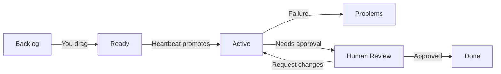

# Board and Backlog

Every Agentweaver project has a **Kanban board** — a six-column view of all work in the project. You use it to capture tasks, rank your backlog, and monitor what the coordinator and agents are doing. The board is the primary day-to-day view for software engineers, tech leads, and product managers working with Agentweaver.

## The six columns

| Column | Who controls it | What belongs here |
|---|---|---|
| **Backlog** | You | Tasks captured but not yet ready to run |
| **Ready** | You | Tasks ranked and ready for the coordinator to pick up |
| **Problems** | Coordinator | Runs that failed, with the failure reason surfaced |
| **Human Review** | Coordinator | Runs awaiting your approval |
| **Active** | Coordinator | Coordinator runs currently in progress |
| **Done** | Coordinator | Completed, merged runs |

::: tip You own Backlog and Ready
You can only drag tasks between **Backlog** and **Ready**. The coordinator owns every other column transition. Dragging a task back from Ready to Backlog pulls it out of the queue before the heartbeat picks it up.
:::

## Capturing tasks

The **Backlog** column has a capture bar at the top. Type a short task title and press **Enter** or click **Add**.

To add more detail after creating a task, hover the card and click the **Edit** icon. The edit form has both a **Title** and **Description** field — use the description to give the coordinator full context: the goal, expected outcome, and any constraints.

Good descriptions lead to sharper OutcomeSpecs. You can also set a **workflow override** per task card by clicking the workflow menu on the card — this pins that task to a specific workflow instead of letting the coordinator auto-select one.

::: tip Import from Markdown
From the **Workspace** page, you can browse the project repository and import Markdown files directly as backlog tasks — useful for turning spec files, PRDs, or issue descriptions into queued work.
:::

## Ranking the backlog

Drag tasks within the Backlog column to rank them. The coordinator picks up Ready tasks in order, so ranking determines priority. Move your highest-priority tasks to the top of the Backlog, then drag them to Ready when you're ready for the coordinator to act on them.

## The heartbeat

A **heartbeat** runs automatically on a configurable schedule. Each time it fires, it:

1. Looks at the Ready column for tasks the coordinator hasn't claimed yet
2. Claims tasks up to the concurrency limit (default 3, maximum 20)
3. Starts a coordinator orchestration run for each claimed task
4. Moves the task card to the Active column

You can view and configure the heartbeat from the **Heartbeat** page in the project sidebar. You can also trigger a heartbeat manually.

### Pickup settings

Each project has three pickup-level settings, visible in the **Pickup settings** dialog on the board toolbar:

| Setting | What it controls |
|---|---|
| **Max Ready items per heartbeat** | How many Ready tasks the coordinator claims per tick (1–20, default 3) |
| **Autopilot** | For automatically picked-up runs: auto-answers the coordinator's clarifying questions using the coordinator model, and auto-confirms the outcome spec so the run proceeds without waiting for manual confirmation. Tool and permission approvals are still required, and every auto-answer is logged in the timeline. Defaults to on. |
| **Auto-approve tools** | Automatically approves tool calls for picked-up runs, except tools blocked by sandbox policy |

When **Autopilot** is off, a pickup run pauses at the outcome-spec confirmation gate and waits for a human to confirm before any work begins. When it is on, the spec is confirmed automatically on behalf of the accountable human captured on the backlog item. This setting does not apply to runs you start manually — those always pause at the confirmation gate regardless.

::: warning Concurrency limit
The heartbeat will not start more than the configured maximum of concurrent active runs. Tasks stay in Ready until a slot opens. Increase the limit in Heartbeat settings if your team handles higher throughput.
:::

## Handling problems

When a run fails mid-execution, its task card moves to the **Problems** column. The card shows:

- The failure reason (coordinator status reason)
- Which subtask or agent failed
- A link to the full run detail for the complete event trace

From Problems, you can:

- Open the run to read the full trace and understand what went wrong
- Edit the task description to give the coordinator better context
- Drag the card back to **Ready** to re-queue it for the heartbeat

## Human Review column

When all agents finish and the assembled result is ready for your approval, the task card moves to **Human Review**. This is your signal to review.

Click the card to open the run and see the diff. After you approve or decline, the card moves to **Done** (approved) or back to the coordinator for revision (requested changes) or to **Done** as declined.

→ [Reviewing and Merging](./review)

## Decomposing a spec into tasks

If you have a specification file (a PRD, a design doc, a feature spec), the coordinator can read it and decompose it into individual backlog tasks automatically.

From the **Workspace** page, browse to the spec file and click **Decompose into tasks**. The coordinator produces a set of task cards and adds them to the Backlog. Review and adjust before dragging them to Ready.

## Monitoring active runs

The **Active** column shows every coordinator orchestration currently in progress. Each card shows:

- The task title
- The coordinator status (Dispatching, Awaiting assembly, Assembling, In review)
- A **Topology** button to open the live run graph

Click **Topology** to watch the orchestration in real time — the dependency graph, each agent's progress, and the live event stream.

→ [Submitting and Watching Runs](./runs)

## Board for different personas

**Software Engineers** use the board to submit tasks, track active work, and pick up Human Review items.

**Tech Leads** use it to manage the queue — ranking the backlog, adjusting the concurrency limit, and monitoring the Problems column for anything that needs attention.

**Product Managers** use it to capture pm-discovery tasks, track what's in flight, and review the Done column to see completed outcomes.
