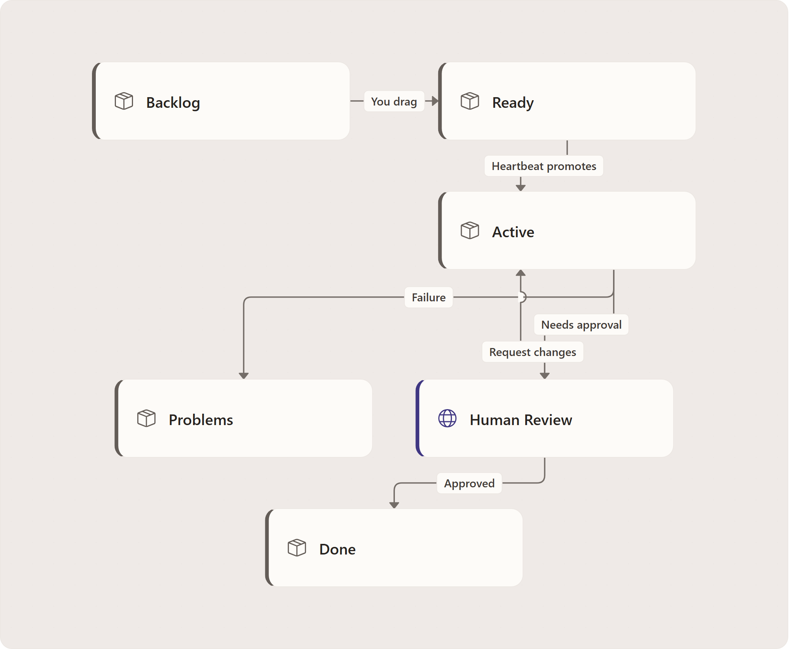

# Board and Backlog

Every Agentweaver project has a **Kanban board** with six semantic buckets. The main row
shows **Backlog**, **Ready**, **Active**, and **Done**; a separate attention section shows
**Human Review** and **Problems**. Use it to capture tasks, rank your backlog, and monitor
the coordinator and agents.

## The six columns

<!-- Generated from ../diagrams/src/canonical-board-lifecycle.drawio as editable draw.io XML,
     then exported by the official draw.io Desktop CLI, replacing a Mermaid flowchart.
     Edit the JSON, then run `npm run docs:render-diagrams` and commit the
     regenerated PNG + .hash.txt. -->

| Column | Who controls it | What belongs here |
|---|---|---|
| **Backlog** | You | Tasks captured but not yet ready to run |
| **Ready** | You | Tasks ranked and ready for the coordinator to pick up |
| **Problems** | Coordinator | Runs that failed, with the failure reason surfaced |
| **Human Review** | Coordinator | Runs awaiting your approval |
| **Active** | Coordinator | Coordinator runs currently in progress |
| **Done** | Coordinator | Completed, merged runs |

::: tip You own Backlog and Ready
You can only drag tasks between **Backlog** and **Ready**. The coordinator owns every other column transition. Dragging a task back from Ready to Backlog pulls it out of the queue before the heartbeat picks it up.
:::

## Capturing tasks

The **Backlog** column has a capture bar at the top. Type a short task title and press **Enter** or click **Add**.

To add more detail after creating a task, hover the card and click the **Edit** icon. The edit form has both a **Title** and **Description** field — use the description to give the coordinator full context: the goal, expected outcome, and any constraints.

Good descriptions lead to sharper OutcomeSpecs. You can also set a **workflow override** per task card by clicking the workflow menu on the card — this pins that task to a specific workflow instead of letting the coordinator auto-select one.

::: tip Import from Markdown
From the **Workspace** page, you can browse the project repository and import Markdown files directly as backlog tasks — useful for turning spec files, PRDs, or issue descriptions into queued work.
:::

## Ranking the backlog

Drag tasks within the Backlog column to rank them. The coordinator picks up Ready tasks in order, so ranking determines priority. Move your highest-priority tasks to the top of the Backlog, then drag them to Ready when you're ready for the coordinator to act on them.

## The heartbeat

A **heartbeat** runs automatically on a configurable schedule. Each time it fires, it:

1. Looks at the Ready column for tasks the coordinator hasn't claimed yet
2. Claims tasks up to the concurrency limit (default 3, maximum 20)
3. Starts a coordinator orchestration run for each claimed task
4. Moves the task card to the Active column

You can view and configure the heartbeat from the **Heartbeat** page in the project sidebar. You can also trigger a heartbeat manually.

### Pickup settings

Each project has three pickup-level settings, visible in the **Pickup settings** dialog on the board toolbar:

| Setting | What it controls |
|---|---|
| **Max Ready items per heartbeat** | How many Ready tasks the coordinator claims per tick (1–20, default 3) |
| **Autopilot** | For automatically picked-up runs: auto-answers the coordinator's clarifying questions using the coordinator model, and auto-confirms the outcome spec so the run proceeds without waiting for manual confirmation. Tool and permission approvals are still required, every auto-answer is logged in the timeline, and the setting is persisted in the run event log so any API replica can honor it. Defaults to on. |
| **Auto-approve tools** | Automatically approves eligible safe tools for picked-up runs; it does not override sandbox blocks or every permission gate. The setting is persisted per run so a resumed worker or another API replica sees the same value. |

When **Autopilot** is off, a pickup run pauses at outcome-spec confirmation. When it is
on, the spec is confirmed on behalf of the accountable human captured on the backlog
item. Pickup settings are not manual-launch defaults: explicit per-run autopilot can
auto-confirm a define-outcome submission, while direct mode skips outcome drafting.
Tool approval and collective human review remain separate gates.

::: warning Concurrency limit
The heartbeat will not start more than the configured maximum of concurrent active runs. Tasks stay in Ready until a slot opens. Increase the limit in Heartbeat settings if your team handles higher throughput.
:::

## Handling problems

When a run fails mid-execution, its task card moves to the **Problems** column. The card shows:

- The failure reason (coordinator status reason)
- Which subtask or agent failed
- A link to the full run detail for the complete event trace

From Problems, you can:

- Open the run to read the full trace and understand what went wrong
- Use the run's explicit retry or recovery controls after inspecting the failure
- Capture revised work separately when a new task is needed; Problems cards cannot be dragged to Ready

## Human Review column

When all agents finish and the assembled result is ready for your approval, the task card moves to **Human Review**. This is your signal to review.

Click the card to open the run and see the diff. After you approve or decline, the card moves to **Done** (approved) or back to the coordinator for revision (requested changes) or to **Done** as declined.

→ [Reviewing and Merging](./review)

## Decomposing a spec into tasks

If you have a specification file (a PRD, a design doc, a feature spec), the coordinator can read it and decompose it into individual backlog tasks automatically.

From the **Workspace** page, browse to the spec file and click **Decompose into tasks**.
First review the proposed tasks and duplicate indicators. Only explicit confirmation
(`confirm: true` for API/MCP) persists new tasks in Backlog. Then edit and rank the saved
tasks before moving them to Ready.

::: tip Model provider
Spec decomposition requires a ready model provider. If setup is required, select **Authorize GitHub Copilot**. Then start the decomposition again.
:::

## Monitoring active runs

The **Active** column shows every coordinator orchestration currently in progress. Each card shows:

- The task title
- The coordinator status (Dispatching, Awaiting assembly, Assembling, In review)
- A **Topology** button to open the live run graph

Click **Topology** to watch the orchestration in real time — the dependency graph, each agent's progress, and the live event stream.

→ [Submitting and Watching Runs](./runs)

## Board for different personas

**Software Engineers** use the board to submit tasks, track active work, and pick up Human Review items.

**Tech Leads** use it to manage the queue — ranking the backlog, adjusting the concurrency limit, and monitoring the Problems column for anything that needs attention.

**Product Managers** use it to capture pm-discovery tasks, track what's in flight, and review the Done column to see completed outcomes.

<!-- diagram-context:canonical-board-lifecycle:start -->

Diagram details and constraints

<table><thead><tr><th>Element</th><th>Contract</th></tr></thead><tbody>
<tr><td>title</td><td>The board is a projection</td></tr>
<tr><td>subtitle</td><td>Columns reflect persisted task and run state—not a separate workflow engine.</td></tr>
<tr><td>group-title0</td><td>Before and during execution</td></tr>
<tr><td>group-title1</td><td>Review / terminal outcomes</td></tr>
<tr><td>Backlog</td><td>Backlog</td></tr>
<tr><td>Backlog</td><td>Captured task; not queued</td></tr>
<tr><td>Backlog</td><td>task: backlog</td></tr>
<tr><td>Ready</td><td>Ready</td></tr>
<tr><td>Ready</td><td>Queued task</td></tr>
<tr><td>Ready</td><td>task: ready</td></tr>
<tr><td>Active</td><td>Active</td></tr>
<tr><td>Active</td><td>Work is in progress</td></tr>
<tr><td>Active</td><td>default non-review bucket</td></tr>
<tr><td>Problems</td><td>Problems</td></tr>
<tr><td>Problems</td><td>Failed / declined / merge failed</td></tr>
<tr><td>Problems</td><td>or assembly blocked / failed</td></tr>
<tr><td>Human Review</td><td>Human Review</td></tr>
<tr><td>Human Review</td><td>AwaitingReview / InReview</td></tr>
<tr><td>Human Review</td><td>or assembly stage: Review</td></tr>
<tr><td>Done</td><td>Done</td></tr>
<tr><td>Done</td><td>Completed / Merged / AssembleReady</td></tr>
<tr><td>Done</td><td>or plan Complete / stage Done</td></tr>
<tr><td>e1</td><td>queue</td></tr>
<tr><td>e2</td><td>claim + start</td></tr>
<tr><td>e3</td><td>await review</td></tr>
<tr><td>e4</td><td>finish</td></tr>
<tr><td>e5</td><td>problem</td></tr>
<tr><td>assurance-title</td><td>DEFAULT BUCKETS · NOT A NEW STATE MACHINE</td></tr>
<tr><td>assurance-line1</td><td>Configured workflow stages may replace the default run columns. Arrows summarize typical changes, not every path.</td></tr>
<tr><td>assurance-line2</td><td>The board polls persisted state. Ready tasks with unmet dependencies stay Ready; blocked is a flag.</td></tr>
<tr><td>Backlog</td><td>Entity</td></tr>
<tr><td>Backlog</td><td>BacklogTask</td></tr>
<tr><td>Backlog</td><td>State</td></tr>
<tr><td>Backlog</td><td>Run</td></tr>
<tr><td>Backlog</td><td>Not required</td></tr>
<tr><td>Backlog</td><td>Action</td></tr>
<tr><td>Backlog</td><td>Move to Ready</td></tr>
<tr><td>Ready</td><td>Blocked</td></tr>
<tr><td>Ready</td><td>Dependency metadata</td></tr>
<tr><td>Ready</td><td>Pickup</td></tr>
<tr><td>Ready</td><td>Atomic claim</td></tr>
<tr><td>Active</td><td>Input</td></tr>
<tr><td>Active</td><td>Coordinator run</td></tr>
<tr><td>Active</td><td>Status</td></tr>
<tr><td>Active</td><td>Non-review default</td></tr>
<tr><td>Active</td><td>Plan</td></tr>
<tr><td>Active</td><td>Dispatch / assembly</td></tr>
<tr><td>Active</td><td>Approval</td></tr>
<tr><td>Active</td><td>Separate pending flag</td></tr>
<tr><td>Problems</td><td>Failed / Declined</td></tr>
<tr><td>Problems</td><td>Merge</td></tr>
<tr><td>Problems</td><td>MergeFailed</td></tr>
<tr><td>Problems</td><td>Assembly</td></tr>
<tr><td>Problems</td><td>Blocked / Failed</td></tr>
<tr><td>Problems</td><td>Also</td></tr>
<tr><td>Problems</td><td>AssemblyDeclined</td></tr>
<tr><td>Human Review</td><td>AwaitingReview</td></tr>
<tr><td>Human Review</td><td>InReview</td></tr>
<tr><td>Human Review</td><td>Review stage</td></tr>
<tr><td>Human Review</td><td>Approve</td></tr>
<tr><td>Human Review</td><td>Resumes execution</td></tr>
<tr><td>Done</td><td>Completed / Merged</td></tr>
<tr><td>Done</td><td>AssembleReady</td></tr>
<tr><td>Done</td><td>Complete</td></tr>
<tr><td>Done</td><td>Done stage</td></tr>
<tr><td>backlog</td><td>No run is required yet; Move to Ready to queue work</td></tr>
<tr><td>ready</td><td>Unresolved dependencies stay here; Blocked is a flag, not a column</td></tr>
<tr><td>progress</td><td>Claimed tasks link to their run; Pending approval is a separate flag</td></tr>
<tr><td>failed</td><td>Blocked assembly is recoverable; Not every problem is terminal</td></tr>
<tr><td>review</td><td>Approval resumes the workflow; Approval alone is not Done</td></tr>
<tr><td>done</td><td>Persisted-state mapping; Not merely a clicked approval</td></tr>
<tr><td>notes</td><td>DEFAULT BUCKETS · NOT A NEW STATE MACHINE; Configured workflow stages may replace the default run columns. Arrows summarize typical changes, not every path.; The board polls persisted state. Ready tasks with unmet dependencies stay Ready; blocked is a flag.</td></tr>
<tr><td>groups</td><td>Before and during execution; Review and terminal outcomes</td></tr>
</tbody></table>

<!-- diagram-context:canonical-board-lifecycle:end -->
