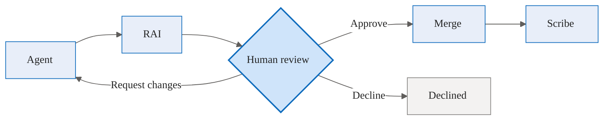
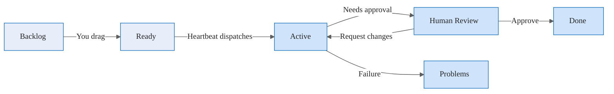

# Example scenarios

This page walks through complete, end-to-end scenarios using Agentweaver — from creating a project to merging reviewed work. Each scenario is grounded in the actual web UI and API behavior. Every run passes through the same default pipeline:

```
agent → rai → review → merge → scribe
```



For coordinator child runs (the subtasks of an orchestration), the trimmed pipeline is `agent → rai → assemble-ready`. The `review → merge → scribe` stages run **once** over the assembled output of all children, not per subtask.

---

## Scenario 1 — Create a project, cast a team, run the default workflow, review and merge

This is the canonical end-to-end flow for software delivery.

### 1. Create a project

From the **Project Gallery** (`/projects`), choose a creation path:

- **Create blank project** — enter a name and a repository folder. Agentweaver initializes an empty git repository (`POST /api/projects` with `origin: blank`).
- **Create from GitHub** — enter a name, pick `owner/repo`, and a folder. Agentweaver clones the repository (`POST /api/projects` with `origin: github` and a `source_repository`).

You land on the project **Dashboard** (`/projects/{id}`).

### 2. Cast a team

Open **Team → Cast** (the Casting Wizard at `/projects/{id}/team/cast`). The wizard offers three strategies:

| Strategy (UI tab) | What it does | API |
|---|---|---|
| **Formulate** | Describe the goal in plain language; the wizard proposes a roster | `POST /api/projects/{id}/casting/proposals` (`mode: free_text`, `goal`) |
| **Template** | Pick a predefined team template (e.g. Quick Software Development) | `GET /api/casting/templates`, then `POST .../casting/proposals` (`mode: scenario`, `template_id`) |
| **Analyze** | The wizard reads the project files and suggests a best-fit team | `POST .../casting/proposals` (`mode: analysis`) |

(A `manual` mode also exists, which takes an explicit `role_ids` list.)

Review the proposed members, amend if needed (`PATCH .../casting/proposals/{proposalId}`), then **Confirm** (`POST .../casting/proposals/{proposalId}/confirm`). The casting algorithm assigns named personas from a thematic universe (The Matrix, Star Wars, and others) to each role, and the team is recorded. See [Agent Teams & Blueprints](./teams).

### 3. Start the orchestration

From the project **Board** (`/projects/{id}/board`), click **Start orchestration** and enter a goal:

> "Add input validation to the signup form and cover it with unit tests."

This calls `POST /api/projects/{id}/orchestrations` and takes you to the coordinator run page (`/projects/{id}/orchestrations/{runId}`).

### 4. Confirm the OutcomeSpec

The coordinator drafts an **OutcomeSpec** — goal, desired outcome, scope, and assumptions — and emits a `coordinator.outcome_spec` event. **No agent work starts until you confirm it.**

- Confirm: `POST /api/runs/{runId}/outcome-spec/confirm`
- Revise with feedback: `POST /api/runs/{runId}/outcome-spec/revise`

### 5. Watch the WorkPlan and topology

On confirmation, the coordinator decomposes the spec into a **WorkPlan** (`coordinator.work_plan`) — a dependency graph of subtasks. It dispatches independent subtasks in parallel, each in its own isolated git worktree. The topology view streams live over SSE (`GET /api/runs/{runId}/stream`); you can also fetch the plan (`GET /api/runs/{runId}/work-plan`) and child runs (`GET /api/runs/{runId}/children`).

Each child emits `subtask.dispatched → subtask.running → subtask.assemble_ready`. While the orchestration is active you can **steer** it (`POST /api/runs/{runId}/steer`) — send a directive, redirect a child, or stop the run.

### 6. Review and merge the assembled diff

When all children reach assemble-ready, the coordinator runs assembly (RAI over the combined output) and moves the run to **Human Review**. Open the file panel:

- **Changes** lists modified files (`GET /api/runs/{runId}/files`); click any file for a diff (`GET /api/runs/{runId}/files/{path}`).
- **Commit and Merge** approves and merges to the originating branch: `POST /api/runs/{runId}/review` with `approved: true` (or `POST /api/runs/{runId}/commit`).
- **Change** requests a revision: `POST /api/runs/{runId}/review` with `request_changes` and `feedback` — the run loops back to the agents.
- **Decline** discards the work: `POST /api/runs/{runId}/review` with `approved: false`.

If the target branch has moved, the merge may report conflicting files (`merge.conflicted`); the worktree is preserved for manual resolution.

### 7. Scribe records what the team learned

After a successful merge, a **Scribe** pass runs automatically. It auto-merges `learning`, `pattern`, and `update` inbox entries into the team's decisions ledger, leaves `architectural`/`scope` entries for coordinator review, writes a session log, and exports memory to `.squad/` and `.agentweaver/context/`. New entries appear on the **Team Memory** page (`/projects/{id}/memories`). See [Team Memory](./teams#team-memory).

---

## Scenario 2 — Single-agent run

For a focused task that doesn't need a full team, run a single named agent.

1. Submit a run scoped to one agent: `POST /api/projects/{id}/runs` with a `task` and an `agent_name` (or, outside a project, `POST /api/runs` with a `task`, `model_source`, and `repository_path`).
2. Watch the execution view stream live over SSE. The full pipeline applies: `agent → rai → review → merge → scribe`.
3. Answer any questions the agent raises at the question gate (`POST /api/runs/{runId}/questions/{requestId}/answer`).
4. Approve tool calls if the sandbox policy requires it (`POST /api/runs/{runId}/tool-approvals` / `.../tool-denials`), or toggle **Auto-approve tools** (`POST /api/runs/{runId}/auto-approve`).
5. Review and merge exactly as in Scenario 1.

The originating branch is never touched until you approve and the merge step completes.

---

## Scenario 3 — Pick up a backlog task with the board and heartbeat

Use the Kanban board to queue work and let the heartbeat dispatch it.



1. **Capture a task** in the Backlog column (`POST /api/projects/{id}/backlog/tasks`). Add a description for context — sharper descriptions produce sharper OutcomeSpecs.
2. **Rank** the backlog by dragging cards (`POST .../backlog/tasks/{taskId}/reorder`), and optionally pin a workflow per card (`PUT .../backlog/tasks/{taskId}/workflow-override`).
3. **Move to Ready** when the task is ready to run (`POST .../backlog/tasks/{taskId}/ready`), or send everything at once (`POST .../backlog/ready-all`).
4. The **heartbeat** claims Ready tasks up to the concurrency limit and starts a coordinator orchestration for each, moving the card to **Active**. Inspect status on the **Heartbeat** page (`GET /api/diagnostics/heartbeat`).
5. When a run needs approval the card moves to **Human Review** — open it and review as in Scenario 1. Failed runs land in **Problems** with the failure reason; drag them back to **Ready** to re-queue.

See [Board and Backlog](./board).

---

## Scenario 4 — Decompose a specification into backlog tasks

Turn a PRD, design doc, or feature spec already in the repository into queued work.

1. Open the **Workspace** page (`/projects/{id}/workspace`) and browse the repository (`GET /api/projects/{id}/workspace`, `GET /api/projects/{id}/workspace/files`).
2. Select a Markdown spec file and choose **Decompose into tasks** (`POST /api/projects/{id}/backlog/decompose` with the `file_path`). The response lists proposed backlog items (and flags any that already exist).
3. The proposed items are added to the **Backlog**. Review and edit them (`PATCH .../backlog/tasks/{taskId}`), then move the ones you want to **Ready** to let the heartbeat pick them up (Scenario 3).

---

## Scenario 5 — Drive the full lifecycle from an MCP client (Copilot CLI)

Everything above is available programmatically through the [MCP server](/reference/mcp). Any MCP-compatible client can run the complete lifecycle. The tool names below are exact.

1. **Authenticate** — `github_signin` (device flow), check with `github_status`.
2. **Create a project** — `project_create`; list with `project_list`.
3. **Cast a team** — `catalog_list_roles` / `catalog_list_scenarios`, then `team_cast`; inspect with `team_get`.
4. **Capture and queue work** — `backlog_capture_task`, then `backlog_move_to_ready` (or `send_all_backlog_to_ready`); view the board with `backlog_get_board`.
5. **Start an orchestration** — `coordinator_start`, then gate the spec with `coordinator_outcome_spec_get` and `coordinator_outcome_spec_confirm` (or `coordinator_outcome_spec_revise`).
6. **Observe and steer** — `coordinator_work_plan_get`, `coordinator_children_get`, `orchestration_topology`, and `coordinator_steer`.
7. **Run a single agent** — `run_submit`, `run_status`, `run_watch` (SSE), `run_show_artifacts`, `run_get_file`.
8. **Review** — `run_review` with the approve / request-changes / decline decision.
9. **Record knowledge** — `decision_inbox_submit` or `squad_decide`, `memory_record`, `memory_search`; export with `memory_export`.

```mermaid
%%{init: {'theme':'base','themeVariables':{'fontFamily':'Segoe UI, system-ui, -apple-system, sans-serif','fontSize':'15px','primaryColor':'#E8EEF9','primaryBorderColor':'#0F6CBD','primaryTextColor':'#242424','lineColor':'#605E5C','edgeLabelBackground':'#FFFFFF'}}}%%
flowchart LR
    C[MCP client] --> P[project_create]
    P --> T[team_cast]
    T --> O[coordinator_start]
    O --> SP[outcome_spec_confirm]
    SP --> W[work_plan + children]
    W --> RV[run_review]
    RV --> MEM[memory_export]

    classDef tool fill:#E8EEF9,stroke:#0F6CBD,stroke-width:1px,color:#242424;
    class C,P,T,O,SP,W,RV,MEM tool;
```



See the [MCP reference](/reference/mcp) for full tool parameters and the [API reference](/reference/api) for the underlying endpoints.
