# What is Agentweaver?

**Run a team of AI agents for any scenario you can describe.**

Agentweaver is a self-hosted, multi-agent orchestration platform. Submit a goal — software delivery, content authoring, PM discovery, incident response, or anything else knowledge-work — and a team of named specialist agents delivers it in isolated sandboxes, with you in control at every gate that matters.

## How it works

### Coordinator orchestration

Submit a goal. The coordinator:

1. Drafts an **OutcomeSpec** — goal, desired outcome, scope, assumptions
2. Selects the best-fit **workflow** for your task via an LLM pass over available workflows and team roles — surfacing the choice and rationale. You can override from the **Start task** dialog or by typing `use {workflow-id}` in the coordinator chat.
3. Asks for your confirmation before any work starts
4. Decomposes the confirmed spec into a **WorkPlan** — subtasks arranged in a dependency graph
5. Dispatches child agents in parallel, each in their own sandbox
6. Shows a **live topology graph** of every agent and its status
7. Lets you **steer mid-run** — send a directive, redirect a child, amend the plan, or stop
8. Assembles all results into one combined diff
9. Routes through a **single review gate** (RAI + human approval)
10. Runs a **Scribe pass** after merge to record what the team learned

```mermaid
%%{init: {'theme':'base','themeVariables':{'fontFamily':'Segoe UI, system-ui, -apple-system, sans-serif','fontSize':'15px','primaryColor':'#E8EEF9','primaryBorderColor':'#0F6CBD','primaryTextColor':'#242424','lineColor':'#605E5C','clusterBkg':'#FAF9F8','clusterBorder':'#D2D0CE','edgeLabelBackground':'#FFFFFF'}}}%%
flowchart LR
    A[Submit goal] --> B[Coordinator drafts OutcomeSpec]
    B --> W[Selects workflow]
    W --> C{You confirm?}
    C -- Yes --> D[WorkPlan: subtask DAG]
    C -- Revise --> B
    D --> E[Parallel child runs\nin isolated worktrees]
    E --> F[RAI check per agent]
    F --> G[Assembled result]
    G --> H{Human review}
    H -- Approve --> I[Merge]
    H -- Request changes --> D
    H -- Decline --> J[Declined]
    I --> K[Scribe memory pass]
```

## Key concepts

### Projects

A **Project** is the top-level container — a git working directory bound to an AI configuration (provider and default model). Every run, every agent, and all team memory live inside a project. Create from scratch or clone from GitHub.

→ [Working with Projects](./projects)

### Blueprints and casting

A **Blueprint** is a reusable team definition: roles, workflows, review policy, and sandbox policy. When you instantiate a Blueprint into a project, the **casting algorithm** assigns named agents to each role — drawn from thematic universes like The Matrix or Star Wars. Five predefined Blueprints ship with Agentweaver.

→ [Agent Teams & Blueprints](./teams)

### Workflows

**Workflows** are YAML-defined multi-role pipelines that define the scenario. Agentweaver ships seven built-in workflows:

| Workflow | Use it for |
|---|---|
| `software-delivery` | Code changes, features, refactors |
| `bug-fix` | Targeted bug investigations and fixes |
| `code-review` | Automated review of a diff or branch |
| `content-authoring` | Drafting docs, blog posts, articles |
| `pm-discovery` | Product discovery, research, specs |
| `incident-response` | Live incidents and postmortems |
| `agent-evaluation` | Testing and evaluating agent outputs |

When you submit a task, an LLM pass automatically matches it to the best-fit workflow. You can also author your own or generate one from a description.

→ [Workflows](./workflows)

### The board

Every project has a **Kanban board** with six columns:

| Column | Owned by |
|---|---|
| **Backlog** | You — capture tasks here |
| **Ready** | You — drag tasks here when ready to run |
| **Problems** | Coordinator — failed runs land here with reason |
| **Human Review** | Coordinator — runs awaiting your approval |
| **Active** | Coordinator — currently running orchestrations |
| **Done** | Coordinator — completed, merged runs |

A **heartbeat** periodically promotes Ready tasks and starts coordinator runs up to a configurable limit.

→ [Board and Backlog](./board)

### Runs

A **Run** is a unit of execution. Each run works inside an isolated git worktree, streams every event live, and requires your explicit approval before anything merges.

→ [Submitting and Watching Runs](./runs)

### Review & Merge

All work passes through a review pipeline before merging: RAI safety check → human approval gate. For coordinator orchestrations, this happens **once** over the assembled output of all agents.

→ [Reviewing and Merging](./review)

### Team Memory

Agents build on prior work through four memory layers compiled into every agent's context:

1. **Active Decisions** — hard constraints (architectural and scope decisions)
2. **Core context** — project-level standing context
3. **Learnings and patterns** — top high-importance entries from prior runs
4. **Open session** — current run context

Agents submit entries to a **Decision Inbox** typed as learning, pattern, update, architectural, or scope. After each run, a Scribe pass merges the inbox into the shared decisions ledger.

→ [Agent Teams & Blueprints — Memory](./teams#team-memory)

### MCP server

The full Agentweaver feature set is available programmatically through an MCP server. Any MCP-compatible client (including Copilot CLI) can drive the complete lifecycle — projects, runs, board, workflows, blueprints, casting, memory, decisions, sandbox, and diagnostics.

→ [MCP server](/reference/mcp)

## Why Agentweaver

| Other tools | Agentweaver |
|---|---|
| Orchestration primitives you wire up yourself | Full-stack, scenario-flexible experience out of the box |
| Optional HITL through workflow patterns | Mandatory OutcomeSpec gate + mandatory human review — enforced by the platform |
| State in opaque managed stores | File-native, repo-resident, inspectable team/memory/decisions |
| One review gate per agent | Single collective review over all assembled work |
| Platform-specific | Self-hosted, no platform-level cloud dependency |
| Code-only scenarios | Any knowledge-work scenario via the workflow system |

## Next steps

- [Sign in with GitHub](./authentication) to get started
- [Create your first project](./projects)
- [Learn about workflows](./workflows)
- [Submit your first run](./runs)