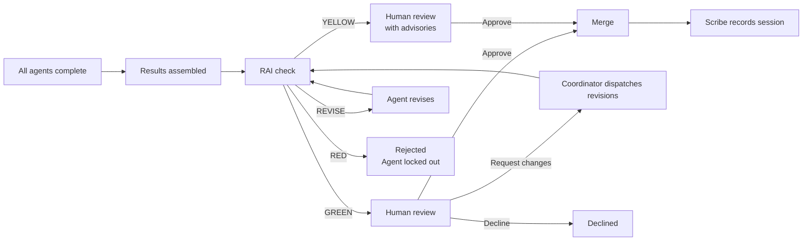

# Reviewing and Merging

When all agents finish their work and the coordinator assembles the combined output, the run enters the **review** stage. This is your gate — nothing merges until you explicitly approve. For coordinator orchestrations, this happens **once** over the combined output of all agents, not once per agent.

## The review pipeline

### RAI verdicts before human review

Before your review step, a **Responsible AI (RAI)** check runs on the assembled output:

| Verdict | Effect |
|---|---|
| **GREEN** | Proceeds to your review — clean bill of health |
| **YELLOW** | Proceeds to your review with advisories. The diff shows the specific concerns so you can decide with full context. |
| **REVISE** | Sent back to the agent for revision. The agent revises and the RAI check runs again. |
| **RED** | Rejected outright. The original agent is locked from further retries on this item. Surfaces in the run detail with the rejection reason. |

::: warning RED is final for the agent
A RED verdict locks the original agent out of retrying that output. The coordinator will dispatch the fix to a different agent or surface the issue for your attention.
:::

## The approval banner

When a run reaches the review stage, a sticky **approval banner** appears at the top of the run detail page:

> ⚠ **This run is awaiting your review.** Review the changes below and approve or decline.

The banner stays visible as you scroll through the diff and event timeline.

## Viewing the diff

The run detail shows the full diff of all changes the agents produced. Each file change shows:

- The file path
- Lines added (green) and lines removed (red)
- The unified diff

YELLOW RAI advisories appear inline next to the relevant sections of the diff.

Take your time. There is no timeout on the review step.

::: tip Check the event timeline
The event timeline gives you the full audit trail — every agent message, tool call, and result. If you want to understand why a change was made, the timeline has the complete context.
:::

## Approving

If the changes look correct:

1. Click **Approve** in the approval banner or at the bottom of the diff.
2. Confirm the action.

Agentweaver runs the merge with conflict detection. If no conflicts are found, the combined worktree output is merged to the originating branch and the run status changes to **Merged**.

::: warning Conflict detection
If the merge surfaces a conflict (the target branch has moved since the run started), Agentweaver shows you the conflict instead of merging silently. Resolve the conflict and re-submit the approval, or use standard git to resolve and merge manually.
:::

## Requesting changes

If the output needs revision:

1. Click **Request changes** in the approval banner.
2. Describe what needs to be fixed.
3. Submit.

The feedback flows to the coordinator, which decomposes it into new subtasks and dispatches them. The run re-enters the agent execution phase. You'll review again when the revisions are ready.

::: tip Be specific
The more specific your feedback ("The error message in `auth.ts` line 42 should describe the specific validation failure, not a generic error"), the more targeted the revision.
:::

## Declining

To discard the changes entirely:

1. Click **Decline** in the approval banner.
2. Confirm.

The run status changes to **Declined**. The worktrees are discarded and the originating branch stays unchanged.

::: warning Declining is final
A declined run cannot be restarted. Submit a new orchestration with a revised task if you want to try again.
:::

## What happens after merge

1. **Changes land on the branch** — the combined diff is merged to the originating branch
2. **Scribe runs** — writes a session summary and captures decisions and memories the agents produced
3. **Team Memory is updated** — new entries appear on the **Team Memory** page for you to review and curate
4. **Run status is Merged** — terminal state, no further changes

The originating branch now contains exactly the changes you approved.

## Review policy

Each project has a **Review Policy** that governs which automated checks run before the human review step:

| Step | What it checks |
|---|---|
| **Rubberduck** | Automated first-pass review — catches obvious issues |
| **RAI** | Responsible AI safety check — GREEN/YELLOW/REVISE/RED verdict |
| **Human review** | Your explicit approve/reject gate — always the final step |

Configure the active steps in [Project Settings → Review policy](./projects#review-policy).

::: tip Human review is always present
The human review step is mandatory and cannot be disabled. The platform enforces it regardless of review policy settings.
:::