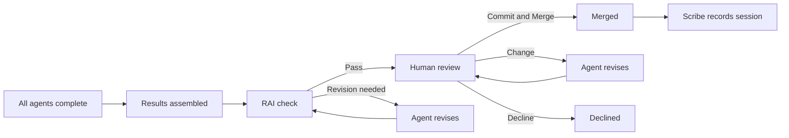

# Reviewing and Merging

When all agents finish their work and the coordinator assembles the combined output, the run enters the **review** stage. This is your gate — nothing merges until you explicitly approve.

## The review pipeline

### Automatic RAI check

Before your review step, a **Responsible AI (RAI)** check runs on the assembled output. If the check flags the output, the agent is automatically sent back for revision — this loopback is visible as a "Revise" edge in the run's workflow pipeline graph. The human review step is only presented when the RAI check passes.

## The file panel

When a run reaches the review stage, the **file panel** on the left side of the run detail page automatically expands to show the review controls.

The panel has two tabs:

- **Changes** — lists every file the agents modified, with added/removed line counts. Click a file to open a diff viewer.
- **Files** — full workspace browser showing all files in the agent's worktree.

Take your time. There is no timeout on the review step.

::: tip Check the event timeline
The event timeline gives you the full audit trail — every agent message, tool call, and result. If you want to understand why a change was made, the timeline has the complete context.
:::

## Approving

If the changes look correct, click **Commit and Merge** in the file panel.

Agentweaver merges the combined worktree output to the originating branch. The run status changes to **Merged**.

::: warning Merge conflicts
If the merge surfaces a conflict (the target branch has moved since the run started), Agentweaver reports the conflict and preserves the worktree for manual resolution.
:::

## Requesting changes

If the output needs revision:

1. Click **Change** in the file panel.
2. Describe what the agent should change in the text field.
3. Click **Send**.

The feedback is delivered to the agent, which revises and re-runs. The run re-enters the agent execution phase and you'll review again when the revisions are ready.

::: tip Be specific
The more specific your feedback ("The error message in `auth.ts` line 42 should describe the specific validation failure, not a generic error"), the more targeted the revision.
:::

## Declining

To discard the changes entirely, click **Decline** in the file panel.

The run status changes to **Declined**. The worktrees are discarded and the originating branch stays unchanged.

::: warning Declining is final
A declined run cannot be restarted. Submit a new orchestration with a revised task if you want to try again.
:::

## What happens after merge

1. **Changes land on the branch** — the combined diff is merged to the originating branch
2. **Scribe runs** — writes a session summary and captures decisions and memories the agents produced
3. **Team Memory is updated** — new entries appear on the **Team Memory** page for you to review and curate
4. **Run status is Merged** — terminal state, no further changes

The originating branch now contains exactly the changes you approved.

## Review policy

Each project has a **Review Policy** that governs which gates run before merge. Policies are file-native YAML in `.agentweaver/review-policies/`, and support three step kinds:

| Step kind | What it does |
|---|---|
| `rai` | Responsible AI content-safety gate — may trigger automatic revision loops. On by default. |
| `human-review` | Your explicit approve / decline / request-changes gate before any irreversible action. On by default. |
| `rubberduck` | An optional request-changes-to-producer review loop that sends work back to the authoring agent for revision. Off by default. |

The shipped **default** policy is `rai` + `human-review`, mirroring the default workflow's baked-in gates. Configure the active policy in [Project Settings → Review policy](./projects#review-policy).

::: tip Human review is always present
The human review step is mandatory and cannot be disabled. The platform enforces it regardless of review policy settings.
:::