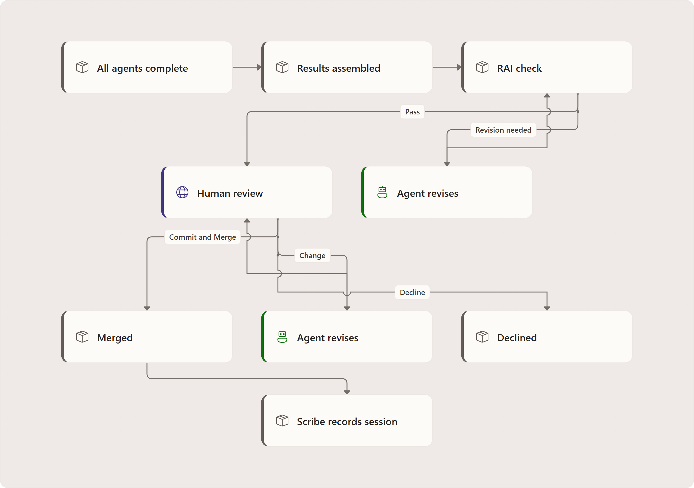

# Reviewing and Merging

When all agents finish their work and the coordinator assembles the combined output, the run enters the **review** stage. This is your gate — nothing merges until you explicitly approve.

## The review pipeline

<!-- Rendered from ../diagrams/src/guide-review-fig1.json by docs/diagram-renderer +
     Playwright (Fluent-styled React Flow), replacing a Mermaid flowchart.
     Edit the JSON, then run `npm run docs:render-diagrams` and commit the
     regenerated PNG + .hash.txt. -->

### Automatic RAI check

Before your review step, a **Responsible AI (RAI)** check runs on the assembled output. If the check flags the output, the agent is automatically sent back for revision — this loopback is visible as a "Revise" edge in the run's workflow pipeline graph. The human review step is only presented when the RAI check passes.

### Build & Test preview

For projects that produce a browser preview, the run tree shows the preview state on the **Build & Test** step:

- **Open preview** opens the preview URL in a new tab.
- **Preview pending approval** means the preview is waiting for a tool-approval decision.
- **Preview unavailable** includes the reason and does not block human review; you can still inspect the diff and approve, request changes, or decline.

The same preview status appears in the human-review file panel so you do not have to search the event timeline for the URL.

For the full contract behind this stage, see [Decoupled live-preview provisioning](../experience/live-preview-provisioning.md).

### Request changes and steering

When review feedback asks for changes, it goes through the coordinator's unified steering path. The timeline shows the feedback source and then the coordinator's decision: steer the existing child in place, dispatch fresh work, proceed, or record an advisory no-op. See [Unified autonomous steering](../experience/unified-steering.md).

## The file panel

When a run reaches the review stage, the **file panel** on the left side of the run detail page automatically expands to show the review controls.

The panel has two tabs:

- **Changes** — lists every file the agents modified, with added/removed line counts. Click a file to open a diff viewer.
- **Files** — full workspace browser showing all files in the agent's worktree.

Take your time. There is no timeout on the review step.

::: tip Check the event timeline
The event timeline gives you the full audit trail — every agent message, tool call, and result. If you want to understand why a change was made, the timeline has the complete context.
:::

## Approving

If the changes look correct, click **Commit and Merge** in the file panel.

Agentweaver merges the combined worktree output to the originating branch. The run status changes to **Merged**.

::: warning Merge conflicts
If the merge surfaces a conflict (the target branch has moved since the run started), Agentweaver reports the conflict and preserves the worktree for manual resolution.
:::

## Requesting changes

If the output needs revision:

1. Click **Change** in the file panel.
2. Describe what the agent should change in the text field.
3. Click **Send**.

The feedback is delivered to the agent, which revises and re-runs. The run re-enters the agent execution phase and you'll review again when the revisions are ready.

::: tip Be specific
The more specific your feedback ("The error message in `auth.ts` line 42 should describe the specific validation failure, not a generic error"), the more targeted the revision.
:::

## Declining

To discard the changes entirely, click **Decline** in the file panel.

The run status changes to **Declined**. The worktrees are discarded and the originating branch stays unchanged.

::: warning Declining is final
A declined run cannot be restarted. Submit a new orchestration with a revised task if you want to try again.
:::

## What happens after merge

1. **Changes land on the branch** — the combined diff is merged to the originating branch
2. **Scribe runs** — writes a session summary and captures decisions and memories the agents produced
3. **Team Memory is updated** — new entries appear on the **Team Memory** page for you to review and curate
4. **Run status is Merged** — terminal state, no further changes

The originating branch now contains exactly the changes you approved.

## Gate nodes

Which gates run before merge is determined by **gate nodes** placed directly in a workflow's OutcomeSpec, not by a project-level setting. A workflow can include any combination of three gate kinds:

| Gate kind | What it does |
|---|---|
| Human approval gate | Requires your explicit approve / decline / request-changes decision before the run can proceed past that point. |
| Automatic gate | Evaluates a condition automatically — for example, that tests pass — and proceeds without human input when the condition is met. |
| Triage gate | Waits for an external event, such as a GitHub webhook or label change, before the run proceeds. |

The default workflow places an automatic RAI gate before the run reaches you, followed by a human approval gate for the review stage described above — that human approval gate is mandatory and cannot be removed from a workflow. Additional gates (automatic or triage) can be composed into custom workflows to fit a team's process.

::: tip Human review is always present
The human approval gate before merge is mandatory. The platform enforces it regardless of how a workflow's other gates are configured.
:::