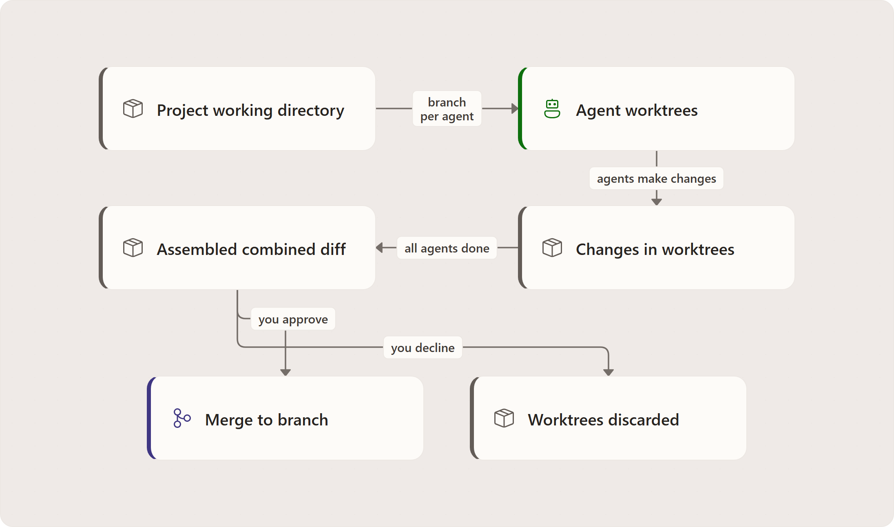

# Submitting and Watching Runs

A **Run** is a unit of work that Agentweaver executes on your behalf. You describe what you want in plain language; the coordinator agent scopes it, confirms it with you, and then drives the team of agents to produce the result — all inside isolated sandboxes.

## Starting a run

### Coordinator orchestration

From inside a project, open the **Board** page and click **Start task** (or use the **Start task** button from the runs list or Flow page).

Enter your task as a natural-language goal in the **Goal** field:

> "Refactor the authentication module to use JWT and add integration tests."

Click **Start task**. The coordinator orchestration begins and you're taken to the topology view.


::: tip Be specific about outcomes
Describe what success looks like, not just what to do. The coordinator uses your description to draft an OutcomeSpec — the more concrete your goal, the sharper the spec.
:::

#### Workflow selection

When you click **Start**, the coordinator automatically selects the best-fit workflow for your goal using an LLM pass over your team's available workflows, their descriptions, and team roles. The selection and its rationale are shown in the coordinator conversation.

To override: open the **Workflow** dropdown in the **Start task** dialog and choose a specific workflow. The dropdown shows only workflows with a manual trigger; it is hidden when only one workflow is available. Leave it on **Auto** to let the coordinator choose.

You can also override mid-conversation by typing `use {workflow-id}` before confirming the OutcomeSpec.

### Preview your work

Runnable outputs are most useful when reviewers can open them live. Software delivery and bug-fix workflows include a platform `build_test` gate that runs after RAI and before human review. It builds, tests, starts web/service artifacts when applicable, verifies the actual bound port, and registers a sandbox preview with `start_preview(port=PORT)`.

For a custom workflow without that gate, ask the coordinator to have an agent build and start the app in its sandbox. The agent can call `start_preview(port=PORT)`. On non-Kubernetes backends, it provides local run instructions instead.

The supervised preview process accepts either a worktree-relative working directory or the canonical absolute path of the worktree (or one of its subdirectories). Paths outside the run worktree, traversal escapes, and symlink or junction escapes remain blocked by the sandbox policy.

## The OutcomeSpec confirmation

Before any agent work starts, the coordinator:

1. Reads the team's existing memories and decisions
2. Selects the best-fit workflow for your task
3. Drafts an **OutcomeSpec** — a short, structured statement of:
   - **Goal** — what you're asking for
   - **Desired outcome** — what success looks like
   - **Scope** — what is and isn't in scope
   - **Assumptions** — what the coordinator is assuming
4. Presents the spec for your review (and may ask targeted clarifying questions)
5. Waits for your confirmation

You review the OutcomeSpec in the conversation panel. If it looks right, confirm. If you need to adjust scope or correct an assumption, say so in the chat — the coordinator revises and re-presents.

::: warning No work dispatched until you confirm
The coordinator will not start any agent work until you explicitly confirm the OutcomeSpec. This gate is enforced by the platform.
:::

## The WorkPlan and topology view

Once you confirm the spec, the coordinator:

1. Decomposes the OutcomeSpec into a **WorkPlan** — a dependency graph of subtasks
2. Assigns each subtask to the best-fit agent and selects a model — an explicit run `modelId` (or the project's GitHub Copilot default) pins every subtask; otherwise each subtask uses its role's default model
3. Dispatches independent subtasks in parallel; dependent ones run in series

There is a short transition while the WorkPlan and integration branch are being created. During
that transition, the coordinator's ordinary changed-files endpoint returns an empty list, and
the collective assembly-files endpoint also returns an empty list. `GET /api/runs/{id}/work-plan`
returns the typed `404 work_plan_not_found` response until the plan is persisted; this means
"not ready yet" for an existing coordinator run, not that the run itself is missing. Collective
changed files appear through `GET /api/runs/{id}/assembly/files` once assembly has started.

You see the **topology view** — a live graph of the entire orchestration.


The graph shows:

- **Coordinator node** at the center
- **Agent nodes** for each dispatched subtask, labeled with the agent's name and role
- **Edge status** — running, completed, failed, awaiting
- **Coordinator status badge** in the header (Dispatching → Awaiting assembly → Assembling → In review → Complete)

Click any agent node to open its individual **execution view** and watch that agent's work in detail.

## Steering mid-run

While a coordinator orchestration is active, you can intervene from the topology view:

| Action | Effect |
|---|---|
| **Send directive** | Give the coordinator new direction; it relays to affected agents |
| **Redirect child** | Change a running child agent's focus at its next turn boundary |
| **Amend the plan** | Ask the coordinator to update the WorkPlan |
| **Stop run** | Immediately stop the orchestration; takes effect on running agents right away |

::: tip Stop is immediate; redirect is at the next turn
Stopping a run takes effect immediately on all running agents. Redirecting or amending takes effect at the next agent turn boundary — the current turn completes first.
:::

## Watching an execution live

Click any agent node in the topology view to open its **execution view**. This streams every event from that agent's run in real time.


### The workflow pipeline

Each agent run passes through a pipeline shown as a left-to-right node graph. For coordinator child runs (subtasks), the pipeline is:

```
Agent → Assemble-ready
```

RAI, Build & Test, Human Review, Merge, and Scribe run once on the **combined** output of all child agents — not per subtask. In the built-in software workflows, Build & Test runs after RAI and before Human Review.

Loopback edges appear when RAI or a reviewer requests changes and the agent needs to revise.

### Event timeline

The event timeline lists every event the agent emitted:

| Event type | What it shows |
|---|---|
| **Agent message** | The agent's text output — reasoning, summaries, responses |
| **Tool call** | A tool the agent invoked (file read, write, shell command, search, etc.) |
| **Tool result** | The output returned from that tool call |
| **Question** | A clarifying question the agent is asking you |
| **System event** | Pipeline transitions (stage started, stage completed, RAI verdict) |

Events stream live over SSE and are persisted before fan-out. If you open the page after the run completes, all events load from the persisted log.

When you expand a tool call, its arguments are shown as labeled fields. Long values, such as file contents, can be expanded individually without obscuring the other arguments.

### Question gate

When an agent asks a question, the run **pauses** at a question gate until you answer. The question appears in the event timeline with an answer input. Type your answer and submit — the agent continues.

### Tool approval

If the run's sandbox policy requires approval before executing certain tool calls, an **approval banner** appears at the top of the page. Click **Jump to approval** to scroll to the pending tool call, then approve or deny it.

Enable **Auto-approve tools** in the run header to skip per-call approval prompts for the remainder of that run.

Preview exposure approvals also remain visible in the notification bell, a persistent toast, and
the timeline until resolved. Their project-configurable window defaults to 30 minutes. If one
expires, choose **Retry approval** to create a fresh approval attempt while keeping the run and
healthy preview process in place.

Selecting **Review now** from an approval notification opens that exact run. If the notification
does not include a valid run target, Agentweaver explains that the approval cannot be opened
instead of sending you to a different run.

## RAI check

Each agent run passes a **Responsible AI (RAI)** check before its output proceeds. If the check flags the output, the run automatically loops back — the agent revises and the check re-runs. This loopback is visible as a "Revise" edge in the pipeline graph. If the check passes, the run proceeds to the next stage (human review or assembly).

## Run states

| Status | Meaning |
|---|---|
| **Running** | The run is actively executing |
| **Awaiting assembly** | All subtasks have finished; coordinator is collecting results |
| **Assembling** | Coordinator is assembling the combined output |
| **In review** | Awaiting your approval |
| **Completed / Merged** | Merged successfully |
| **No Changes** | The agent finished but made no file changes |
| **Failed** | Unrecoverable error |
| **Declined** | You rejected the changes |
| **Merge Failed** | The merge step failed (e.g., a conflict on the target branch) |

### Agent turn infrastructure failures

The run timeline reports `agent_turn_internal_error` when Agentweaver must supply a
structured fallback: the pod bridge's turn throws without first emitting a structured
`run.failed`, the worker receives an unstructured `run.failed`, or the A2A stream ends
on an unsupported or unset event. This is an execution-infrastructure failure, not a
model request for changes. The fallback is marked `retryable: true` because the
surrounding workflow may retry or redispatch the turn; it does not mean that the
interrupted turn completed successfully.

Agentweaver does not replace more specific outcomes with this fallback:

- a cancellation requested by the caller remains a cancellation;
- an existing typed timeout or failure keeps its own error code and retryability;
- other A2A exceptions become `a2a_transport_failure`, with retryability determined by
  the transport failure;
- a clean A2A stream end without `agent.turn.end` becomes the retryable
  `agent_host_turn_incomplete`.

The terminal may include a bounded diagnostic for troubleshooting. Credentials are
redacted and multiline output is flattened before it reaches the run event. See the
[Operations Guide](./operations#diagnosing-agent-turn-infrastructure-failures) for
operator guidance.

## Runs list

The project page shows all runs in reverse chronological order. Each row shows:

- Run status badge
- Task description
- Start time
- **Topology** button

From the runs list you can also **Abandon** an in-flight run (discards pending changes) or **Delete** a completed run from the history.

## Sandboxed execution

Each agent runs inside a **dedicated git worktree** branched from the project's working directory. Agents cannot reach outside their worktree unless the sandbox policy explicitly allows it. The originating branch is never modified during a run — only after you approve and the merge step completes.



<!-- Rendered from ../diagrams/src/guide-runs-fig1.json by docs/diagram-renderer +
     Playwright (Fluent-styled React Flow), replacing a Mermaid flowchart.
     Edit the JSON, then run `npm run docs:render-diagrams` and commit the
     regenerated PNG + .hash.txt. -->

## See also

- [Workflow selection — Deep Dive](/deep-dive/workflow-selection) — full algorithm, override hierarchy, and trigger filtering
- [Coordinator reference — Workflow selection](/reference/coordinator#workflow-selection-how-the-coordinator-picks-the-process-to-run) — precedence table and API details