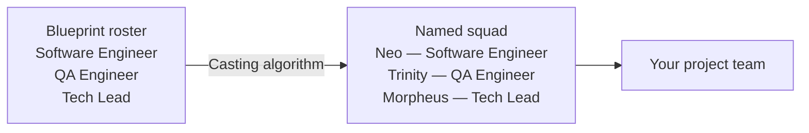

# Agent Teams & Blueprints

Every Agentweaver project has a **Squad** — a group of named specialist agents, each with a role, a charter, and a model tier. Squads are defined by **Blueprints** and brought to life through **casting**. Named agents are drawn from thematic universes — for example, Matrix characters or Star Wars characters — so your team has a consistent, memorable identity across runs.

## What is a Blueprint?

A Blueprint is a reusable, versioned definition of how a team works. It bundles everything a project needs to run:

- **Roster** — role definitions (role name, responsibilities, optional model preference). No concrete persona names — those are assigned at instantiation by the casting algorithm.
- **Workflows** — one or more YAML workflow definitions, with one designated as the default
- **Review policy** — which automated checks gate the team's output
- **Sandbox policy** — what shell commands, network access, and destructive operations agents are permitted to perform

A Blueprint is **universe-agnostic**. It says "we need a Software Engineer role and a QA Engineer role." The casting algorithm then says "let's call them Neo and Trinity."

## The four predefined Blueprints

Agentweaver ships four predefined Blueprints. Pick the one that most closely matches your team's work:

### Software Development

A team for software engineering tasks — coding, testing, debugging, code review, and architecture. Roles cover engineering, quality assurance, and technical direction. The default workflow is `software-delivery` with `bug-fix` and `code-review` also available.

**Best for:** Software engineers and tech leads shipping code changes, features, and refactors.

### Content Authoring

A team for creating and editing written content — documentation, blog posts, READMEs, release notes, marketing copy, and technical articles. Roles cover writing, editing, fact-checking, and review.

**Best for:** Technical writers, DevRel engineers, and content creators.

### Product Management

A team for product work — discovery, spec writing, roadmap planning, stakeholder communication, user research synthesis, and opportunity framing. Roles cover product management, research, and analysis. The default workflow is `pm-discovery`.

**Best for:** Product managers and researchers turning intent into discovery outcomes.

### Product & Software Delivery

A combined team that spans product and engineering — from spec to shipped code. Roles cover the full delivery lifecycle: product, engineering, QA, and coordination. Useful for small, cross-functional teams that do both product and engineering work.

**Best for:** Full-stack teams that own both spec and delivery.

::: tip Fork to customize
Start with the closest predefined Blueprint, then fork it to add a role, swap the default workflow, or tighten the sandbox policy. Forked Blueprints are independent — the original is unchanged.
:::

## How casting works

Casting is the process that turns a Blueprint's abstract **roles** into the named **agents** that populate your project's team.

When you instantiate a Blueprint:

1. The casting algorithm reads the Blueprint's roster of role definitions
2. For each role, it selects a persona name from a thematic universe (e.g., Matrix, Star Wars)
3. The named agents are recorded in the project's team files

The persona names are not stored in the Blueprint — the Blueprint is universe-agnostic. The same Blueprint instantiated into two different projects may produce different named agents.

## Three ways to cast a team

You can cast a team in three ways from the **Team** page or **Casting Wizard**:

| Method | When to use it |
|---|---|
| **From a scenario** | You know the kind of work you'll do (software delivery, content authoring, etc.). Pick a Blueprint and cast. |
| **From a free-text goal** | Describe what your project is trying to achieve. The casting wizard suggests a roster based on the goal. |
| **From project analysis** | The wizard reads your project's existing files and history to suggest the best-fit team composition. |

## The Coordinator

Every project team includes a built-in **Coordinator** agent. The Coordinator is not one of the Blueprint's roster roles — it is always present.

The Coordinator:

- **Scopes** your goal using team memories and decisions, then drafts an OutcomeSpec
- **Confirms** the spec with you before dispatching any work
- **Plans** — decomposes the confirmed spec into a WorkPlan with a dependency graph
- **Dispatches** — assigns subtasks to roster agents, choosing a model per task by complexity; runs independent subtasks in parallel
- **Steers** — monitors each agent via a read-only timeline; relays your direction (stop, redirect, amend)
- **Assembles** — collects each agent's output into one combined result
- **Routes review feedback** — if RAI flags an issue or you request changes, the Coordinator dispatches fixes

::: tip The Coordinator always confirms before dispatching
No agent work starts until you confirm the OutcomeSpec. If the spec doesn't match your intent, give feedback — the Coordinator revises as many times as needed.
:::

## The Team page

Navigate to **Team** from a project to see the squad roster.

Filter tabs: **All**, **Active**, **Retired**. Retired members were cast in a previous configuration.

Click any agent card to open a drawer:

| Tab | What it shows |
|---|---|
| **Overview** | Name, role title, model tier, and current status |
| **Charter** | The agent's responsibilities and behavioral guidelines |
| **Capabilities** | The tools and permissions this agent has |

### Adding and re-roling members

- **Add member** — add a new agent and assign them a role
- **Re-role** — change an existing agent's role (opens the re-role panel; the agent gets a new charter for the new role)

## Team Memory

Agents accumulate **memories** and **decisions** across runs. Navigate to **Team Memory** from a project sidebar.

### The four memory layers

Every agent's context for a run is compiled from four layers, in order of priority:

1. **Active Decisions** (highest priority) — finalized architectural and scope decisions. Hard constraints the team must honor.
2. **Core context** — standing project-level context that applies to every run.
3. **Learnings and patterns** — the top high-importance entries from prior runs. These accumulate over time.
4. **Open session** — the current run's working context.

### Decision types

Agents submit entries to the **Decision Inbox** with one of five types:

| Type | Who can submit | What it captures |
|---|---|---|
| `learning` | Any agent | Something learned from this run |
| `pattern` | Any agent | A recurring approach or anti-pattern |
| `update` | Any agent | An update to prior knowledge |
| `architectural` | Coordinator only | A significant architectural decision |
| `scope` | Coordinator only | A scope constraint or boundary decision |

::: warning Architectural and scope decisions are coordinator-reserved
Non-coordinator agents that attempt to submit `architectural` or `scope` entries will be rejected by the platform. These decision types carry the highest authority and are reserved for the coordinator.
:::

### The Decision Inbox

The **Decisions** tab on the Team Memory page shows:

- **Finalized decisions** — entries that have been accepted into the shared ledger
- **Proposed decisions** (dashed border) — entries that agents submitted during recent runs, pending review

For each proposed entry you can:

- **Merge** — accept as-is and add to the finalized ledger
- **Promote** — promote it (with optional edits) to a decision
- **Reject** — discard the proposal

### Agent Memory

The **Agent Memory** tab shows individual memory entries for each agent — learnings, preferences, and context that carry forward to future runs. Each entry has:

- An **importance** level (high / medium / low) — the agent uses this to prioritize what to surface
- A **type** label
- The **content**

You can create entries manually and update existing ones from this tab.

### Scribe

After each completed orchestration, a **Scribe** agent runs automatically. The Scribe:

- Merges pending Decision Inbox entries into the shared ledger
- Writes a session log summarizing what happened
- Updates the cross-agent history
- Archives large history files that have grown past a threshold

You don't need to trigger the Scribe manually — it runs as part of the post-merge pipeline.

## Team state is file-native

All team state — the roster, charters, decisions, and memory — is stored as human-readable files in the project's working directory (`.agentweaver/` and `.squad/`). You can read, edit, and version-control these files directly. Nothing is hidden in an opaque managed store.

## Saving a team as a Blueprint

Once you have a team you're happy with, you can save it as a reusable Blueprint. From the Team page, click **Save as Blueprint** (or generate one from a description). The Blueprint bundles:

- The current roster (as role definitions — persona names are stripped)
- The project's active workflows (with the default designated)
- The project's review policy
- The project's sandbox policy

The saved Blueprint appears in the Blueprint catalog and can be instantiated into any new project.