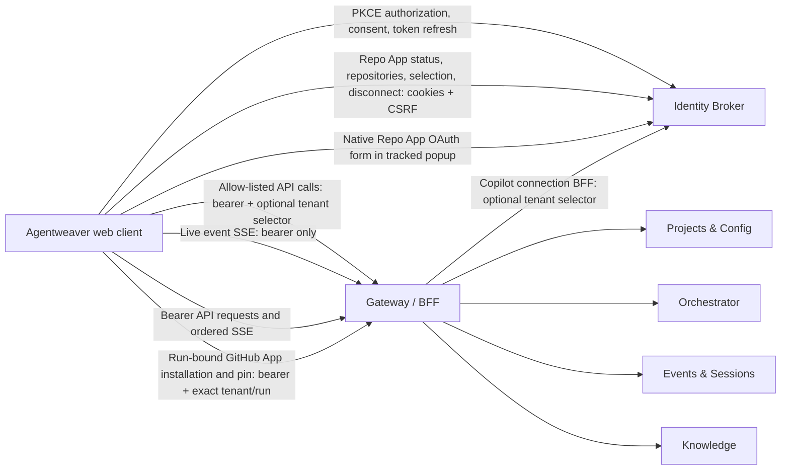

# v1 web client

The v1 web client is a React application over the Identity Broker and the
versioned Gateway/BFF. The browser performs OAuth authorization and consent
with PKCE through the Broker, keeps access and refresh tokens in memory, and
sends product API and event-stream requests to the Gateway. The GitHub Repo App
account lifecycle uses cookie-authenticated Identity Broker endpoints directly.



The client does not send project, run, or session identity as a substitute for
authorization. The Broker issues tokens for the requested scope, and the
Gateway and owner services validate access on each request. Run-bound pages
require a token for that exact project and run. Structured Gateway error codes
and owner rejection responses remain visible instead of being treated as
success.

Gateway and Broker browser CORS are separate boundaries. Configure
`Gateway:WebOrigin` with the Web application's exact HTTPS origin. Gateway
policies are route-specific and non-credentialed except for the Copilot
connection BFF, which narrowly allows credentials for its callback cookie.
Direct Repo App browser requests use the Broker's independent credentialed
endpoint allowlist; the Gateway origin setting does not configure Broker CORS.

## Routes and behavior

| Route | Behavior |
| --- | --- |
| `/projects` | List projects visible to the signed-in identity and create a project. Creation does not assign an Owner. |
| `/projects/:projectId` | Read project state and open an existing run by its exact ID. |
| `/projects/:projectId/settings` | Read and append a revisioned project-configuration document, connect or disconnect the GitHub Repo App account, browse its repository metadata, connect user-level GitHub Copilot, and view stable owner connection IDs. Owners validate the submitted configuration. |
| `/projects/:projectId/knowledge` | Search paginated Knowledge records for an exact project, run, and agent; correct or archive supported Memory and SessionContext records, inspect and restore revisions, approve eligible Decisions, and import or export exact-scope transfer bundles. The owner remains authoritative for record state and trust. |
| `/projects/:projectId/runs/:runId` | Read run/session snapshots and journal events; view topology, chat, outcomes and approvals, activity, accepted selection, and usage; manage run-bound GitHub App repository setup/pinning; send addressed messages or request supported tree actions. The `view` query selects a run tab (for example, `?view=chat`); unsupported values open Topology. |

The client requests fresh tenant and effective-permission context from
`GET /api/v1/authorization/context`. It does not infer a tenant from project,
run, token, or usage data. A tenant selector is attached only to the allow-listed
Projects/configuration, run Coordination, Knowledge, run Selection/Usage, and
finite journal replay calls that consume it. The live event SSE connection,
GitHub Repo App account calls, PKCE/session calls, and unrelated APIs remain
selector-free. Repo App status, repository discovery, selection, and disconnect
go directly to the Identity Broker with cookie credentials; JSON mutations
first obtain an antiforgery token and send it as `X-CSRF-TOKEN`. Connect and
user authorization uses a native form post with the token field
`__RequestVerificationToken` targeted at the tracked popup, never fetch through
an OAuth redirect. Run-bound GitHub App installation remains a Gateway call
with the exact project, run, and tenant binding. The GitHub Copilot
user-connection BFF is a separate
allow-listed case: its lifecycle calls forward the optional explicit selector
to the Broker, which remains authoritative. Gateway validates the context response against the
authenticated actor, signed project/run binding, and explicitly selected tenant.
Owners revalidate the selector and current authority for every operation;
context is not cached as permission. The client clears it when the bearer
identity or session changes and does not guess among ambiguous memberships.

The shell's Run chat control opens Chat only for the exact project/run binding
held by the current Broker session. Without that binding, the control remains
disabled. Changing a run tab updates `view` while retaining unrelated query
parameters.

The run view polls authoritative owner snapshots and replays all journal pages
before opening the live event stream. It merges replay/live overlap by event ID
and journal position. Pending input, plan, outcome, and approval actions require
the exact request ID and decision version from the current owner snapshot.
Owner acceptance is not represented as delivery, completion, or a state
transition; the refreshed snapshot supplies the resulting state.
Knowledge search exposes owner-reported result pages rather than hiding records
after the first page. The Knowledge page can inspect immutable revision history,
restore a historical revision as a new Active+Pending revision, explicitly
approve an Active Pending or Legacy Decision, and supersede an Active Decision
with another Active Decision from the exact project/agent results. Correction and
archive controls are limited to Memory and SessionContext records supported by
the current owner. Decision approval and supersession use the selected record's
current revision; the owner validates the replacement link and refreshed owner
state remains authoritative. Decision supersession requires a Knowledge owner
that supports the versioned update contract.

Version 1 Knowledge transfer exports only the exact project and agent's Memory
and Decision records with their complete revision chains. Import requires that
same project and agent, rejects collisions rather than merging records, and
creates Active+Pending records; a Decision must be approved separately. Bundles
are limited to 25 records, 500 revisions, and 1 MiB.

Project settings include the GitHub Repo App account control. The Identity
Broker status supplies a stable opaque `connectionId` and revision; the project
configuration selects it with `sourceControl.authMode: "githubApp"` and
`sourceControl.appConnectionId`. Existing configurations without `authMode`
remain legacy secret mode. Provider tokens, numeric installation/repository IDs,
and permission grants remain owner-held. OAuth uses a popup, an antiforgery
cookie and native form post, and the exact host-only transaction cookie. Its
callback is `/settings/source-control?repoApp=connected`; the HTML bootstrap
captures only that exact notification and removes the query before loading
assets. The callback message is accepted only from the tracked popup, same
origin, and current request generation. It never proves connection success:
the opener refreshes status from the Broker, and a standalone callback clearly
reports that connection status is unverified. Leaving project settings or
clearing the browser session closes only that panel's tracked popup and cancels
its pending CSRF request; late responses and callbacks cannot submit or update a
newly opened panel.

Project settings also connect the signed-in user's GitHub Copilot account to
the selected project through the Gateway's user-connection lifecycle BFF. The
popup returns only a bounded, state-matched callback message; callback code and
state are held in memory for that exchange and are not persisted. Configure the
Host `CallbackUri` as the public HTTPS Web origin plus
`/auth/github/copilot-app/callback`. The production ASP.NET Core 10 static-file
host serves that exact callback path with `Cache-Control: no-store`,
`Referrer-Policy: no-referrer`, `X-Content-Type-Options: nosniff`, and
`X-Frame-Options: DENY`; access logging is disabled. The host also serves
runtime configuration from container environment variables without shell
interpolation. The first inline script removes the callback query before
loading any assets. Configure the public ingress to redact callback query
strings from its own access logs as well, since the Web server cannot control
ingress logging. The owner response, not the popup, determines the connection
status.

When the accepted run configuration selects GitHub App mode, and its owner
routes have been admitted and configured, the run Selection view reads safe
repository metadata from the Broker and creates a short-lived selection code
there. Run-bound App installation and repository pin remain Gateway operations
bound to the exact project, run, and tenant; the code is sent only with that
run-bound `/pin` request. The accepted run owner validates the selected
repository and current authority; bodyless legacy secret-mode pinning is
unchanged. User account authorization and repository discovery are direct
Broker browser calls, not MCP tools; run-bound repository operations remain in
the first-party MCP catalog. Status and discovery failures remain unavailable
rather than appearing disconnected or empty, and run-bound setup/pinning stay
disabled until the exact tenant selector is available. Source mappings do not
claim owner or deployment availability.

## Configuration and commands

Configuration is provided through Vite environment variables. Start from
`apps/web/.env.example`:

| Variable | Default | Purpose |
| --- | --- | --- |
| `VITE_GATEWAY_URL` | `/api/v1` | Versioned Gateway base URL. |
| `VITE_IDENTITY_BROKER_URL` | unset | Identity Broker base URL. |
| `VITE_IDENTITY_BROKER_ISSUER` | Full HTTPS Broker URL path | Exact HTTPS issuer identifier expected in Broker authorization callbacks; set it when it differs from the Broker base URL. |
| `VITE_OAUTH_CLIENT_ID` | unset | Registered OAuth client ID. |
| `VITE_OAUTH_REDIRECT_URI` | current origin plus `/auth/callback` | Registered callback URI. |
| `VITE_OAUTH_SCOPES` | unset | Space-separated registered OAuth scopes. |

When an authorization callback includes `iss`, the client accepts it only when
one HTTPS issuer exactly matches `VITE_IDENTITY_BROKER_ISSUER`. The callback
also retains its state, PKCE, popup-source, and callback-origin checks. A
callback without `iss` remains supported for the existing Broker profile. An
invalid popup callback is rejected and closed so the sign-in window can show a
visible error instead of retrying the callback.

Run from the repository root:

```powershell
npm --prefix apps/web ci
npm --prefix apps/web run dev
npm --prefix apps/web run typecheck
npm --prefix apps/web test
npm --prefix apps/web run coverage
npm --prefix apps/web run lint
npm --prefix apps/web run build
```

## Contract limits

The Gateway exposes owner routes for accepting a supplied run-root identity,
proposing typed outcome/workflow/work-plan decisions, asking a coordinator
question, requesting approval, and registering, spawning, or forking child
sessions. These are owner-authoritative state operations; root or spawn
acceptance is not proof that a model run was scheduled or completed. The browser
client currently opens existing run IDs and does not expose root-acceptance,
proposal, or child registration/spawn/fork controls. It can message existing
sessions and request supported detach/archive actions. The Gateway does not
expose journal object-content reads, so the client shows opaque references
without inventing transcript content.

Run-produced-file browsing remains explicitly unavailable in this v1 UI.
P2 #1917 owns the durable run-bound artifact manifest, diff, and object-version
producer needed to browse produced files after workspaces or branches change.
The browser will map that owner contract after admission; it does not proxy a
host filesystem or claim parity from the older monolithic file endpoints.

The accepted selection contains provider candidates and a model-selection
reference, not a provisioned provider pin or runtime SDK model ID. Usage is
returned as run totals without per-event model-binding details. The UI reports
those runtime identities as unavailable rather than inferring them from
configuration or usage. Usage totals distinguish priced and unpriced events
and do not replace missing measurements with zero.

This documentation describes the v1 source client only. It does not establish
that the web image, Gateway, Broker, or owner services have been published or
deployed.
