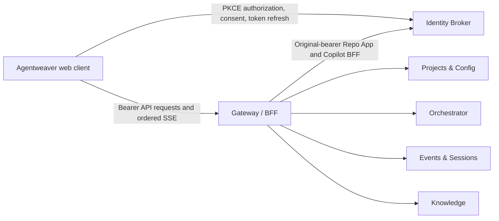

# v1 web client

The v1 web client is a React application over the Identity Broker and the
versioned Gateway/BFF. The browser performs OAuth authorization and consent
with PKCE through the Broker, keeps access and refresh tokens in memory, and
sends API and event-stream requests only to the Gateway.



The client does not send project, run, or session identity as a substitute for
authorization. The Broker issues tokens for the requested scope, and the
Gateway and owner services validate access on each request. Run-bound pages
require a token for that exact project and run. Structured Gateway error codes
and owner rejection responses remain visible instead of being treated as
success.

## Routes and behavior

| Route | Behavior |
| --- | --- |
| `/projects` | List projects visible to the signed-in identity and create a project. Creation does not assign an Owner. |
| `/projects/:projectId` | Read project state and open an existing run by its exact ID. |
| `/projects/:projectId/settings` | Read and append a revisioned project-configuration document, connect the GitHub Repo App, and view its stable Identity connection ID. Owners validate the submitted configuration. |
| `/projects/:projectId/knowledge` | Search paginated Knowledge records for an exact project, run, and agent; proposal decisions and record revisions remain owner-authoritative. |
| `/projects/:projectId/runs/:runId` | Read run/session snapshots and journal events; view topology, chat, outcomes and approvals, activity, accepted selection, and usage; manage run-bound GitHub App repository setup/pinning; send addressed messages or request supported tree actions. The `view` query selects a run tab (for example, `?view=chat`); unsupported values open Topology. |

The shell's Run chat control opens Chat only for the exact project/run binding
held by the current Broker session. Without that binding, the control remains
disabled. Changing a run tab updates `view` while retaining unrelated query
parameters.

The run view polls authoritative owner snapshots and replays all journal pages
before opening the live event stream. It merges replay/live overlap by event ID
and journal position. Pending input, plan, outcome, and approval actions require
the exact request ID and decision version from the current owner snapshot.
Owner acceptance is not represented as delivery, completion, or a state
transition; the refreshed snapshot supplies the resulting state.
Knowledge search exposes owner-reported result pages rather than hiding records
after the first page.

Project settings include the retained GitHub Repo App connection control. The
Identity Broker status supplies a stable opaque `connectionId`; the project
configuration selects it with `sourceControl.authMode: "githubApp"` and
`sourceControl.appConnectionId`. Existing configurations without `authMode`
remain legacy secret mode. Provider tokens, numeric installation/repository IDs,
and permission grants remain owner-held. OAuth uses a popup and the exact
host-only transaction cookie; the callback returns only an allow-listed outcome
to the opener. After consent, the browser starts a fresh PKCE authorization in
that popup rather than following the consent redirect through a cross-origin
fetch.

When the accepted run configuration selects GitHub App mode, and its owner
routes have been admitted and configured, the run Selection view can list safe
repository metadata, begin the run-bound App installation, and pin a selected
repository by sending its opaque short-lived selection code to the existing
run-bound Source Control `/pin` operation. The accepted run owner validates the
selected repository and current authority; bodyless legacy secret-mode pinning
is unchanged. User authorization and repository discovery are Gateway browser
routes, not MCP tools; run-bound repository operations remain in the first-party
MCP catalog. Status and discovery failures remain unavailable rather than
appearing disconnected or empty, and run-bound setup/pinning stay disabled
until the exact tenant selector is available. Source mappings do not claim
owner or deployment availability.

## Configuration and commands

Configuration is provided through Vite environment variables. Start from
`apps/web/.env.example`:

| Variable | Default | Purpose |
| --- | --- | --- |
| `VITE_GATEWAY_URL` | `/api/v1` | Versioned Gateway base URL. |
| `VITE_IDENTITY_BROKER_URL` | unset | Identity Broker base URL. |
| `VITE_OAUTH_CLIENT_ID` | unset | Registered OAuth client ID. |
| `VITE_OAUTH_REDIRECT_URI` | current origin plus `/auth/callback` | Registered callback URI. |
| `VITE_OAUTH_SCOPES` | unset | Space-separated registered OAuth scopes. |

Run from the repository root:

```powershell
npm --prefix apps/web ci
npm --prefix apps/web run dev
npm --prefix apps/web run typecheck
npm --prefix apps/web test
npm --prefix apps/web run coverage
npm --prefix apps/web run lint
npm --prefix apps/web run build
```

## Contract limits

The Gateway exposes owner routes for accepting a supplied run-root identity,
proposing typed outcome/workflow/work-plan decisions, asking a coordinator
question, requesting approval, and registering, spawning, or forking child
sessions. These are owner-authoritative state operations; root or spawn
acceptance is not proof that a model run was scheduled or completed. The browser
client currently opens existing run IDs and does not expose root-acceptance,
proposal, or child registration/spawn/fork controls. It can message existing
sessions and request supported detach/archive actions. The Gateway does not
expose journal object-content reads, so the client shows opaque references
without inventing transcript content.

Run-produced-file browsing remains explicitly unavailable in this v1 UI.
P2 #1917 owns the durable run-bound artifact manifest, diff, and object-version
producer needed to browse produced files after workspaces or branches change.
The browser will map that owner contract after admission; it does not proxy a
host filesystem or claim parity from the older monolithic file endpoints.

The accepted selection contains provider candidates and a model-selection
reference, not a provisioned provider pin or runtime SDK model ID. Usage is
returned as run totals without per-event model-binding details. The UI reports
those runtime identities as unavailable rather than inferring them from
configuration or usage. Usage totals distinguish priced and unpriced events
and do not replace missing measurements with zero.

This documentation describes the v1 source client only. It does not establish
that the web image, Gateway, Broker, or owner services have been published or
deployed.
