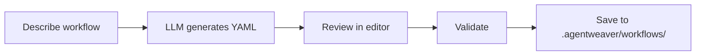

# Workflows

**Workflows** define the scenario. They are YAML-described multi-role pipelines that tell Agentweaver which agents are involved, what each one does, and how work flows between them. The scenario is defined by the workflow, not the platform — this is what makes Agentweaver work for software delivery, content authoring, PM discovery, incident response, and anything else your team needs.

## Built-in workflow library

Agentweaver ships seven built-in workflows:

| Workflow | What it does |
|---|---|
| `software-delivery` | Code changes, new features, refactors, and migrations. Full delivery pipeline from spec to merged code. |
| `bug-fix` | Targeted investigation and fix for a specific bug report or regression. Includes root-cause analysis. |
| `code-review` | Automated review of a diff, branch, or pull request. Produces a structured review with categorized findings. |
| `content-authoring` | Drafting and editing docs, blog posts, READMEs, release notes, and other written content. |
| `pm-discovery` | Product discovery — user research synthesis, spec drafting, requirements analysis, and opportunity framing. |
| `incident-response` | Live incident investigation, mitigation guidance, and postmortem drafting with full run tracing. |
| `agent-evaluation` | Testing and evaluating agent outputs against criteria. Useful for validating agent behavior and quality. |

::: tip Automatic workflow matching
When you submit a task, an LLM pass automatically selects the best-fit workflow from the library. You don't have to pick a workflow manually for most tasks.
:::

## How workflow matching works

When you start an orchestration, Agentweaver reads your task description and runs a matching pass that considers:

1. Keywords and intent in your description
2. The project's configured default workflow (if set)
3. The built-in library's workflow metadata and use-case descriptions

The matched workflow is shown in the run detail. If the auto-match picks the wrong one, you can override it at submission time.

## Workflows in your project

Each project stores its active workflows in `.agentweaver/workflows/` inside the project's working directory. The **Workflows** page in the web UI shows all workflows discovered from that directory, their validation status, and which one is the project default.

### Viewing workflows

From a project, navigate to **Workflows** in the sidebar. Each workflow card shows:

- The workflow name and its source file
- Validation status: **Valid**, **Invalid** (with an error), or **Warning**
- Whether it is the project's **default** workflow

Click a workflow to expand it and see its full YAML definition, a visual graph of the roles and steps, or the raw step-by-step pipeline.

### Setting the default workflow

Click **Set as default** on any valid workflow to make it the project's default. When a submitted task matches no specific workflow — or when auto-matching is overridden — the default is used.

::: tip Clear the default to restore the built-in
Setting the default to "none" (clearing the selection) reverts to the system's built-in default workflow.
:::

### Syncing workflows

If you edit a workflow YAML file on disk or add a new one, click **Sync** on the Workflows page to re-read the `.agentweaver/workflows/` directory and refresh the list. This is an explicit sync — Agentweaver does not watch the filesystem. In multi-replica deployments, the synced files live in the shared project workspace; other API replicas detect the changed workflow file set on their next registry read and refresh their local cache.

## Authoring a workflow

### YAML editor

Click **New workflow** and choose **YAML editor**. A YAML template opens in the editor. Workflows are described as a sequence of steps, each bound to a role (which agent executes it) and a set of inputs and outputs.

### Visual editor

Choose **Visual editor** to build a workflow as a node graph. Drag roles onto the canvas, connect them, and configure each step visually. The editor generates the YAML for you.

### Generate from description

Choose **Generate from description**, type what you want the workflow to do in plain language, and Agentweaver generates an initial YAML draft for you to review and edit. If the project was created from GitHub — or your prompt includes a GitHub repository or issue URL — generation keeps that target repository in the prompt context so the draft acts against the intended repo.

::: warning Workflows affect team composition
A workflow references specific roles by name. If your project's cast doesn't include a role referenced in the workflow, the run will fail validation before it starts. Make sure the workflow's required roles match the agents in your team.
:::

## Workflow lifecycle in a run

When a run executes against a workflow:

1. The workflow is resolved — built-in or project-local
2. The coordinator decomposes the workflow's steps into the WorkPlan
3. Each step is dispatched to the agent whose role matches the step's role binding
4. Steps execute in the order the workflow specifies (parallel where there are no dependencies)
5. Outputs from one step become inputs to the next

The live topology view shows each workflow step as a node, with edges representing the data flow between steps.

## Blueprints bundle workflows

When you save a team as a **Blueprint**, the Blueprint bundles the team's roster, one or more workflows (with a designated default), and the project's review and sandbox policies. Instantiating the Blueprint into a new project automatically materializes the workflow files into the new project's `.agentweaver/workflows/` directory.

→ [Agent Teams & Blueprints](./teams)
