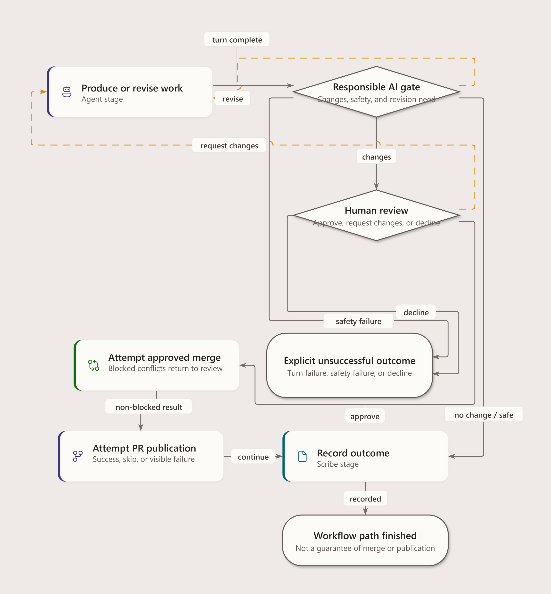

# Workflows

**Workflows** define the scenario. They are YAML-described multi-role pipelines that tell Agentweaver which agents are involved, what each one does, and how work flows between them. The scenario is defined by the workflow, not the platform — this is what makes Agentweaver work for software delivery, content authoring, PM discovery, incident response, and anything else your team needs.

## Built-in workflow library

Agentweaver ships seven built-in workflows:

| Workflow | What it does |
|---|---|
| `software-delivery` | Code changes, new features, refactors, and migrations. Full delivery pipeline from spec to merged code. |
| `bug-fix` | Targeted investigation and fix for a specific bug report or regression. Includes root-cause analysis. |
| `infra-ops` | Infrastructure, CI/CD, monitoring, and alerting work. Includes policy validation, review, and human sign-off. |
| `content-authoring` | Drafting and editing docs, blog posts, READMEs, release notes, and other written content. |
| `pm-discovery` | Product discovery — user research synthesis, spec drafting, requirements analysis, and opportunity framing. |
| `incident-response` | Live incident investigation, mitigation guidance, and postmortem drafting with full run tracing. |
| `agent-evaluation` | Testing and evaluating agent outputs against criteria. Useful for validating agent behavior and quality. |

::: tip Automatic workflow matching
When you submit a task, an LLM pass automatically selects the best-fit workflow from the library. You don't have to pick a workflow manually for most tasks.
:::

## How workflow matching works

When you start an orchestration, Agentweaver reads your task description and runs a matching pass that considers:

1. The semantic intent of your description
2. The project's configured default workflow (if set)
3. The built-in library's workflow metadata and use-case descriptions

After the confirmed outcome is decomposed, Agentweaver validates that code-producing work uses a
workflow with a **Build & Test** stage. If an automatic match such as `pm-discovery` cannot express
that gate, the coordinator re-selects from compatible workflows. If a blueprint's allowed workflow
set contains no compatible automatic workflow, Agentweaver uses the platform `software-delivery`
fallback for that run. This fallback keeps the required build, server health, curl, and browser
preview checks available without changing the project's selectable workflow list. Explicit
overrides remain pinned; when an override lacks Build & Test for code work, the work plan surfaces a
warning instead of silently changing the user's choice.

The matched workflow is shown in the run detail. If the auto-match picks the wrong one, you can
override it at submission time.

## Resume safety and workflow pinning

When a root workflow run starts, Agentweaver stores the resolved executable workflow YAML with a
manifest schema version and a `sha256:` content digest on the run row before execution. Resume and
run graph reconstruction use that pinned definition, so editing, renaming, deleting, or changing the
project default workflow after a run starts does not move a suspended run into today's graph.

The pin covers the executable workflow definition only: workflow id/source/version, normalized YAML,
digest, and pin timestamp. It deliberately does not copy credentials, authorization grants,
capability policies, or approval authority. Those checks still use current state when execution or
resume happens, so revoked repository access, removed model credentials, or stricter safety/tool
policy can still block a pinned run.

If a post-v0.34 run requires a workflow pin but the stored manifest is missing, uses an unsupported
schema version, or fails its content-digest check, resume fails explicitly instead of selecting the
current project default. Legacy in-flight runs created before workflow pinning do not have complete
manifests; they keep the previous compatibility behavior rather than being broken by the upgrade.

## Workflows in your project

The **Workflows** page distinguishes built-in catalog workflows from project-local
definitions in `.agentweaver/workflows/`, with validation status and the project default.
A blueprint's allowed selection set is not the entire global catalog. Built-ins are
read-only; duplicate one into the project to customize it.

### Viewing workflows

From a project, navigate to **Workflows** in the sidebar. Each workflow card shows:

- The workflow name and its source file
- Validation status: **Valid**, **Invalid** (with an error), or **Warning**
- Whether it is the project's **default** workflow

Click a workflow to expand it and see its full YAML definition, a visual graph of the roles and steps, or the raw step-by-step pipeline.

The visual graph and visual editor include a **Topology layout** comparison control.
They default to **Balanced grid (current)**, which keeps card footprints reserved and
routes connectors around occupied cards. Shared corridors use separate lanes. Long
row-wrap connectors use the channel between rows and show in-path direction markers.
**Legacy staircase (comparison)** changes only the visual arrangement, never the workflow
YAML, nodes, or edges.

### Setting the default workflow

Click **Set as default** on any valid workflow to make it the project's default. When a submitted task matches no specific workflow — or when auto-matching is overridden — the default is used.

::: tip Clear the default to restore the built-in
Setting the default to "none" (clearing the selection) reverts to the system's built-in default workflow.
:::

### Syncing workflows

If you edit a workflow YAML file on disk or add a new one, click **Sync** on the Workflows page to re-read the `.agentweaver/workflows/` directory and refresh the list. This is an explicit sync — Agentweaver does not watch the filesystem. In multi-replica deployments, the synced files live in the shared project workspace; other API replicas detect the changed workflow file set on their next registry read and refresh their local cache.

## Authoring a workflow

Clients can discover the exact supported YAML contract from
`GET /api/workflows/grammar`. The versioned machine-readable response lists required and optional
fields, size limits, YAML and API node-type names, which node types are currently runtime-bindable,
allowed gate kinds, edge conditions and transitions, and trigger vocabulary. The same runtime-owned
catalog drives YAML parsing, serialization, binding, and the published OpenAPI response, so a client
does not need hidden workflow grammar knowledge.

Use directed `edges` to express sequence: if step B should run after step A, add an edge from A to B.
The former `serial` node type is no longer supported or advertised because it had no runtime executor;
older YAML that still declares `type: serial` is rejected with guidance to replace it with ordinary
edges.

Every newly generated or saved `check` node must declare an explicit canonical `gate_kind`
(`rai`, `human-review`, or `rubberduck`). Historical persisted workflows whose check ids are `rai`,
`review`, or `rubberduck` still load and execute through the grammar's documented
`compatibility.check_gate_id_fallbacks` boundary. When Agentweaver reserializes one of those legacy
definitions, it writes the inferred `gate_kind` explicitly so the workflow migrates to the current
authoring contract.

### Static parallel branches

Project workflows can execute one static `fan_out` / `fan_in` region. The first release requires at
least two unconditional branches, exactly one `prompt` node per branch, and a single wait-all join.
`peer_review` and `build_test` are rejected inside a static fan because the static dispatcher does
not preserve their specialized semantics. Branch declarations are executed as durable child runs
concurrently; the parent workflow is checkpointed before dispatch and resumes once with the joined
result after every branch settles.

The join is deterministic: results are emitted in the branch order declared by the persisted
workflow, not child completion order. A failed, blocked, cancelled, or RAI-flagged branch fails the
join rather than returning partial success. Editing or deleting the workflow while the parent is
suspended does not change the resumed graph because execution uses the workflow definition pinned
when the run started. The fan also persists the immutable incoming task context and the current
worktree branch/tree at first attachment, so a fan reached after a prompt gives every branch the
predecessor-composed task and exact execution base. Reattachment never re-resolves edited YAML or
replaces that persisted context.

Each branch is durably keyed by the embedded coordinator run and subtask id. Its child run id is
reserved before launch, and recovery adopts an already-created active or terminal run. After a
process restart, an interrupted active branch is relaunched through the existing retry/recovery
fencing under the same Run row and run id; no replacement branch Run is created.

Cancelling the parent durably suppresses the fan continuation before the parent becomes terminal.
Pending branches remain pending, active branch runs receive an attributable `run.cancelled`
terminal event, and neither the fan join nor the parent continuation resumes. Repeated cancellation
requests and restart recovery reapply the same idempotent cancellation boundary so a branch that
crosses the launch race cannot continue detached from its cancelled parent.

`fan_out` / `fan_in` is an execution primitive, not coordinator assembly. It does not create or
update an integration Git branch, merge branch output, open or review a pull request, publish
artifacts, or invoke Scribe. Each branch may still use its ordinary isolated child-run worktree.
While the parent is suspended for branch completion, REST, MCP, and the UI identify the pending
request as `workflow_child_work`; this automated wait cannot be approved through `/review` or
`run_review`.
Nested fans, dynamic branches, quorum/first-success joins, and `coordinator_composed` remain
unsupported.

```yaml
start: parallel-research
nodes:
  - id: parallel-research
    type: fan_out
    label: Parallel research
  - id: api-research
    type: prompt
    label: API research
    agent: researcher
    prompt: Investigate the API behavior and write only reports/api-research.md.
    independent: true
    declared_output_paths:
      - reports/api-research.md
  - id: ui-research
    type: prompt
    label: UI research
    agent: researcher
    prompt: Investigate the UI behavior and write only reports/ui-research.md.
    independent: true
    declared_output_paths:
      - reports/ui-research.md
  - id: join-research
    type: fan_in
    label: Join research
    target: parallel-research
  - id: done
    type: terminal
    label: Done
edges:
  - { from: parallel-research, to: api-research }
  - { from: parallel-research, to: ui-research }
  - { from: api-research, to: join-research }
  - { from: ui-research, to: join-research }
  - { from: join-research, to: done }
```

### YAML editor

Click **New workflow** to open the visual editor with a YAML-backed template. Use **Edit** on an existing project workflow when you prefer to edit its YAML directly.

### Visual editor

Use **Edit visually** to build a workflow as a node graph. Drag roles onto the canvas, connect them, and configure each step visually. The editor generates the YAML for you. The graph adapts to the workflow shape: short and branching workflows use centered left-to-right stages, while long linear workflows use a compact staircase. The Build view keeps the canvas prominent with a bounded inspector: select no graph item to edit the workflow id, name, description, start node, and schedule; select a node or edge to edit its properties. The start node is marked on the canvas.

Click **Add node** to insert a new step, or choose **Add next step** on a node to add a connected prompt step. Each node also has an actions menu for renaming or deleting it. The palette is grouped under **Reviewers & gates**, **Agent steps**, **Actions**, and **Flow control**, and each entry shows an icon and a one-line description. **Build & Test** appears once, as a ready-to-use preset.

The inspector and **YAML** are separate tabs. Changes from either surface share the same YAML draft, so **Undo**, **Redo**, **Revert to last save**, and **Discard changes** apply consistently. Use **Validate** to check that the YAML parses and that all declared gate verdicts have outgoing routes before saving.

The **Actions** group includes **Open pull request**, which creates a pull request on the connected GitHub repository. Generic artifact publication is not a workflow capability: generation and YAML validation reject `publish` with an `unsupported_capability` response rather than substituting an agent prompt. Configure common fields in the node inspector; use the YAML view for pull-request template overrides such as `title`, `body`, `base`, `head`, and `draft`.

The **Schedule trigger** section shows whether the workflow is manual-only or scheduled. Choose **Add schedule trigger** or **Edit schedule trigger** to configure a daily, weekly, or monthly UTC schedule. Schedule changes update the editor's current YAML draft and are persisted with the rest of the workflow when you choose **Save**, so unsaved graph or YAML edits are never overwritten by a separate schedule save.

For existing project workflows, use **Edit** to open the YAML editor or **Edit visually** to open the graph editor. Built-in workflows are read-only; use **Duplicate to project** to create an editable copy and open it in the visual editor.

## Running and scheduling workflows

Each workflow row shows all configured automation triggers, or **Manual only** when none are
configured. Use **Run now** to queue a Ready task bound to that workflow; it is picked up and shown
on the board through the same normal coordinator path as other work.

For project workflows, configure a schedule from the workflow row (**Add schedule** / **Edit
schedule**) or from the visual editor to run the workflow daily, weekly, or monthly at a UTC time.
Choose **Add event** or **Edit event** to also start the same workflow from a curated GitHub webhook
event. Each editor removes only its own trigger, so a weekly schedule and a GitHub event can coexist.
Built-in workflows cannot be scheduled directly; duplicate one into the project first.

Configuring a schedule or event trigger defines what *can* fire; it does not by itself turn
automation on. A Project Owner must also activate automation for the project from the
**Unattended** section of Project Settings (see [Projects](projects.md#unattended)) before any
schedule or event trigger will actually run. Deactivating stops triggers from firing without
deleting the workflow's schedule or event configuration.

A schedule can run for a repository-less project. GitHub event triggers and workflow steps that
perform repository operations are different: they require a GitHub-backed project with verified
repository access and the Repo App installation prerequisite described in Project Settings.

Existing workflow files with one `trigger:` object remain valid and continue to round-trip in that
shape. Workflows with multiple triggers use a `triggers:` list, with at most one schedule and one
event trigger:

```yaml
triggers:
  - type: schedule
    interval: weekly
    day_of_week: monday
    time_of_day: "09:00"
  - type: event
    event_name: github.issues.labeled
    if:
      - has_label: { label: "roadmap-review" }
```

The structured trigger API returns both `triggers` (the complete list) and the legacy `trigger`
field (the first trigger). `PUT .../trigger` creates or replaces the requested trigger type without
removing other types. `DELETE .../trigger?type=schedule` and `?type=event` remove one type;
`DELETE .../trigger` without a type retains its legacy behavior and clears all triggers.

The visual event-trigger editor is intentionally constrained:

- an **event picker** limits you to the supported GitHub event shortlist;
- an **Issue action** picker distinguishes **Any issue action**, **Opened**, **Labeled**, and the
  other GitHub Issues webhook actions, so label-added automation persists
  `github.issues.labeled` instead of an action-hidden `github.issues.opened`;
- the **condition-row builder** only offers predicates valid for the selected event;
- separate condition rows are **ANDed by default**;
- the common “match any of these values” case is represented as an `or:` group behind the scenes;
- advanced nested `or:` / `not:` expressions remain part of the trigger grammar and round-trip through YAML and the structured trigger API even when you author them outside the row builder.

## Triggering workflows from GitHub

Repository events are delivered through the Repo App's App-level webhook. Project Settings does
not expose a payload URL, webhook provisioning action, or webhook secret. Install and grant the
Repo App for the required repository, then use **Settings → Unattended** to see the project's
read-only readiness status. Agentweaver verifies deliveries against the App-level configuration
without disclosing webhook credentials or provider internals.

An event delivery named by GitHub's `X-GitHub-Event` header fires `github.<event>` (for example,
`github.push` or `github.issues`). When the payload has an `action`, it also fires the more specific
`github.<event>.<action>` name, such as `github.issues.opened` or
`github.pull_request.opened`.

The supported event shortlist is:

| GitHub event | Typical use | Supported predicates |
|---|---|---|
| `issues` | Triage or automate issue lifecycle changes | `hasLabel`, `isNotLabeledWith` |
| `issue_comment` | Slash-command style comment entry points | `commentMatches` |
| `pull_request` | PR intake, routing, or policy workflows | `hasLabel`, `isNotLabeledWith`, `baseBranch` |
| `pull_request_review` | Approval / changes-requested flows | `reviewState` |
| `push` | Branch or tag push automation | `ref` |
| `release` | Release-published workflows | none in v1 |
| `discussion` | Discussion-category routing | `category` |

The trigger grammar is curated rather than generic. In the structured trigger API and UI, the
predicate names are `hasLabel`, `isNotLabeledWith`, `baseBranch`, `reviewState`, `ref`,
`category`, and `commentMatches`. In saved YAML, the same predicates serialize in snake_case as
`has_label`, `is_not_labeled_with`, `base_branch`, `review_state`, and `comment_matches`.

An event trigger's `if:` list is an implicit AND. Use `or:` and `not:` wrappers for compound logic:

```yaml
trigger:
  type: event
  event_name: github.pull_request.opened
  if:
    - or:
        - base_branch: { branch: "main" }
        - base_branch: { branch: "release/v1" }
    - not:
        has_label: { label: "blocked" }
```

For comment-driven automation, use a fixed, pre-validated regex pattern:

```yaml
trigger:
  type: event
  event_name: github.issue_comment.created
  if:
    - comment_matches: { pattern: "^/agentweaver:triage$" }
```

`comment_matches` is boolean-only: it decides fire / no-fire, but Agentweaver does not forward the
raw comment body into backlog task text or downstream prompts.

For example, this project workflow starts whenever an issue is opened:

```yaml
id: triage-new-issue
name: Triage newly opened issue
start: triage
nodes:
  - id: triage
    type: prompt
    role: backend-engineer
    prompt: Triage the newly opened GitHub issue.
  - id: done
    type: terminal
edges:
  - from: triage
    to: done
trigger:
  type: event
  event_name: github.issues.opened
```

Event triggers can also add a structured `if:` filter list. A plain array is implicitly ANDed; use
`or:` and `not:` wrappers for compound logic. The v1 predicate vocabulary is intentionally curated:

- `has_label` / `is_not_labeled_with` for `github.issues*` and `github.pull_request*`
- `base_branch` for `github.pull_request*`
- `review_state` for `github.pull_request_review*`
- `ref` (`equals` / `prefix`) for `github.push`
- `category` for `github.discussion*`
- `comment_matches` for `github.issue_comment*`

For example, this workflow fires only when a newly added issue label set includes both `bug` and
`needs triage`:

```yaml
trigger:
  type: event
  event_name: github.issues.labeled
  if:
    - has_label: { label: "bug" }
    - has_label: { label: "needs triage" }
```

`comment_matches` is intentionally boolean-only: it uses the GitHub comment body only to decide
match/no-match. Agentweaver does not extract arguments, persist the raw text, or forward the comment
body into downstream prompts through the trigger path.

### Generate from description

Choose **Generate from description**, type what you want the workflow to do in plain language, and Agentweaver generates an initial YAML draft for you to review and edit. Trigger generation covers recurring schedules and curated GitHub events, including prompts that request both on one workflow; generated automation uses the `triggers:` list while existing singular `trigger:` drafts remain valid.

Generation runs as a durable background job. The UI keeps polling while it is queued or running,
so a substantial workflow is not tied to one long HTTP request. If local polling pauses, the
generation dialog keeps the job and lets you check its status without submitting duplicate work.
Provider timeouts become a stable, retryable failure, and retries reuse one job/artifact rather than
creating duplicate drafts.

The generator is still preview-first. It teaches the model the workflow schema, the supported
trigger shapes, and a few-shot set of natural-language → trigger examples, then validates the draft
with the same loader the runtime uses. If the first draft is malformed, the server allows exactly one
correction pass before failing closed.

Generated workflows may use one prompt-only static `fan_out` / `fan_in` region, but only when every
branch explicitly declares `independent: true`, one or more exact `declared_output_paths`, and an
explicit content-output instruction such as `Write only reports/customer-signals.md`. Every path
named in the prompt must be declared. Until general parallel writing support is available, generated
fan outputs are limited to content artifacts (`.md`, `.markdown`, `.txt`, `.rst`, `.adoc`, `.csv`,
and `.tsv`); source files, hidden paths, package manifests, lockfiles, project/solution files,
migrations, and generated build artifacts are not eligible even when their paths are disjoint.
Agentweaver normalizes path separators and compares scopes case-insensitively with file/directory
prefix checks. Missing, dynamic, broad, shared, or overlapping scopes stay sequential.

The supported starting point is independent research, analysis, and documentation with exact
disjoint output files. When a request explicitly says the tasks run independently and gives at least
two disjoint `write only <path>` content contracts, Agentweaver uses its single correction pass if the
first model draft omits the requested fan. A sequential draft can be promoted without another model
call only when the requested prompt nodes already form one contiguous unconditional chain and declare
exactly those output files; the promoted graph must then pass every branch-level safety check.
Otherwise the correction pass must return a valid fan covering the requested paths. Ambiguous, negated, dependency-bearing,
unknown-scope, overlapping, or code-writing requests remain sequential; Agentweaver does not claim
generic implementation or refactoring is safe to parallelize. If a model returns a structurally valid
but insufficiently proven non-dependent fan, the server deterministically keeps branch declaration
order and returns a sequential draft. A branch that consumes a sibling by node id, label, output path,
basename, findings, or results is rejected for model correction instead of being reordered
speculatively. Malformed fan topology is also rejected rather than guessed. This policy and the
content-only intent exemption apply equally to direct workflow generation and custom workflows
generated while creating a research, discovery, documentation, or other clearly non-software
blueprint.

Review edges are constrained by the runtime binder's transition contract. A software release-readiness
chain can run `RAI → Build & Test → peer review → human review`; approval/pass advances to the next
gate, request-changes/revise returns to an agent step, and decline routes to a terminal. Unsupported
edge conditions are rejected before the draft is saved, with the failing edge and supported outgoing
alternatives returned in `transition_issues`. An unbindable `base_yaml` edit is rejected before any
generation model call.

If the project was created from GitHub — or your prompt includes a GitHub repository or issue URL —
generation keeps that target repository in the prompt context so the draft acts against the intended repo.

The generated workflow is preview-first: Agentweaver opens the YAML draft in the editor and does not write it to `.agentweaver/workflows/` until you save. If validation fails after the server's correction pass, the API returns an error instead of saving a broken workflow.

The built-in **PM Discovery** workflow uses this conservative topology for two ordered independent
branches: customer-signal research writes `customer-signals.md`, technical-feasibility research
writes `technical-feasibility.md`, and both join before synthesis and review.

::: warning Workflows affect team composition
A workflow references specific roles by name. If your project's cast doesn't include a role referenced in the workflow, the run will fail validation before it starts. Make sure the workflow's required roles match the agents in your team.
:::

## Workflow lifecycle in a run

When a run executes against a workflow:

1. The workflow is resolved — built-in or project-local
2. Workflow roles and stages are bound to runtime execution
3. Separately, the coordinator decomposes the outcome into WorkPlan tasks and assigns child agents
4. Child work follows task dependencies and hands off assemble-ready output
5. Collective gates evaluate the assembled output according to the selected workflow

Workflow binding is not a one-step-to-one-child mapping. The run topology shows the
coordinator's task graph; a workflow viewer shows authored stages and their dependencies.

## Blueprints bundle workflows

When you save a team as a **Blueprint**, the Blueprint bundles the team's roster, one or more workflows (with a designated default), and the project's review and sandbox policies. Instantiating the Blueprint into a new project automatically materializes the workflow files into the new project's `.agentweaver/workflows/` directory.

→ [Agent Teams & Blueprints](./teams)

<details id="diagram-context-canonical-workflow-authoring" v-pre>
<summary>Diagram details and constraints</summary>
<table><thead><tr><th>Element</th><th>Contract</th></tr></thead><tbody>
<tr><td>title</td><td>Workflow authoring</td></tr>
<tr><td>takeaway</td><td>Generate a draft. Review it. Save deliberately.</td></tr>
<tr><td>generation-boundary</td><td>1 GENERATE + REVIEW / No workflow file is saved</td></tr>
<tr><td>persistence-boundary</td><td>2 EXPLICIT SAVE / Project workspace + registry</td></tr>
<tr><td>Authorize request</td><td>Authorize request</td></tr>
<tr><td>Authorize request</td><td>Project ownership + AI execution plan</td></tr>
<tr><td>Authorize request</td><td>POST …/workflows/generate</td></tr>
<tr><td>Authorize request</td><td>Description required</td></tr>
<tr><td>Prompt context</td><td>Prompt context</td></tr>
<tr><td>Prompt context</td><td>Roles, schema, examples</td></tr>
<tr><td>Prompt context</td><td>Project model override</td></tr>
<tr><td>Prompt context</td><td>Catalog fallback</td></tr>
<tr><td>Generate candidate</td><td>Generate candidate</td></tr>
<tr><td>Generate candidate</td><td>CopilotWorkflowGenerator</td></tr>
<tr><td>Generate candidate</td><td>Model returns YAML, not a saved file</td></tr>
<tr><td>Generate candidate</td><td>Create or edit</td></tr>
<tr><td>Validate candidate</td><td>Validate candidate</td></tr>
<tr><td>Validate candidate</td><td>WorkflowDefinitionLoader + binder dry-run</td></tr>
<tr><td>Validate candidate</td><td>Structure AND runtime bindability</td></tr>
<tr><td>Validate candidate</td><td>Strip fences; ensure id</td></tr>
<tr><td>One correction</td><td>One correction</td></tr>
<tr><td>One correction</td><td>Failed YAML + error</td></tr>
<tr><td>One correction</td><td>Re-run same checks</td></tr>
<tr><td>One correction</td><td>No third attempt</td></tr>
<tr><td>Explicit error</td><td>Explicit error</td></tr>
<tr><td>Explicit error</td><td>Second invalid result</td></tr>
<tr><td>Explicit error</td><td>400 · not persisted</td></tr>
<tr><td>Review &amp; edit draft</td><td>Review &amp; edit draft</td></tr>
<tr><td>Review &amp; edit draft</td><td>Human edits YAML or the visual graph</td></tr>
<tr><td>Review &amp; edit draft</td><td>Valid draft stays unsaved</td></tr>
<tr><td>Save: validate again</td><td>Save: validate again</td></tr>
<tr><td>Save: validate again</td><td>Parse + structure + route id + binder</td></tr>
<tr><td>Save: validate again</td><td>PUT …/workflows/{workflowId}</td></tr>
<tr><td>Save: validate again</td><td>Ownership required</td></tr>
<tr><td>Reject save</td><td>Reject save</td></tr>
<tr><td>Reject save</td><td>Parse / id / bind error</td></tr>
<tr><td>Reject save</td><td>400 or 422 · no write</td></tr>
<tr><td>Reject save</td><td>Fix the draft</td></tr>
<tr><td>Write project YAML</td><td>Write project YAML</td></tr>
<tr><td>Write project YAML</td><td>Resolve the path inside the workspace</td></tr>
<tr><td>Write project YAML</td><td>.agentweaver/workflows/{id}.yaml</td></tr>
<tr><td>Write project YAML</td><td>Contained-path guard</td></tr>
<tr><td>Write can fail</td><td>Write can fail</td></tr>
<tr><td>Write can fail</td><td>Path guard or file I/O</td></tr>
<tr><td>Write can fail</td><td>400 / 500 · stop here</td></tr>
<tr><td>Write can fail</td><td>No success response</td></tr>
<tr><td>Sync → definition</td><td>Sync → definition</td></tr>
<tr><td>Sync → definition</td><td>Extend allowed set if needed; reload</td></tr>
<tr><td>Sync → definition</td><td>Return saved detail on success</td></tr>
<tr><td>Reload failure</td><td>Reload failure</td></tr>
<tr><td>Reload failure</td><td>Written, not available</td></tr>
<tr><td>Reload failure</td><td>422 / 500 · file may exist</td></tr>
<tr><td>e01</td><td>permitted</td></tr>
<tr><td>e02</td><td>grounds prompt</td></tr>
<tr><td>e03</td><td>candidate YAML</td></tr>
<tr><td>e04</td><td>valid; unsaved</td></tr>
<tr><td>e05</td><td>first invalid</td></tr>
<tr><td>e06</td><td>one repair</td></tr>
<tr><td>e07</td><td>invalid again</td></tr>
<tr><td>e08</td><td>explicit Save</td></tr>
<tr><td>e09</td><td>invalid</td></tr>
<tr><td>e10</td><td>checks pass</td></tr>
<tr><td>e11</td><td>failure</td></tr>
<tr><td>e12</td><td>write succeeded</td></tr>
</tbody></table>
</details>

<!-- flagship-diagrams:start -->
## Visual model

### Default workflow

[](../diagrams/drawio/generated/flagship/canonical-default-workflow.drawio)

[Structured source](../diagrams/src/flagship/canonical-default-workflow.json) · [Editable draw.io](../diagrams/drawio/generated/flagship/canonical-default-workflow.drawio)
<!-- flagship-diagrams:end -->
