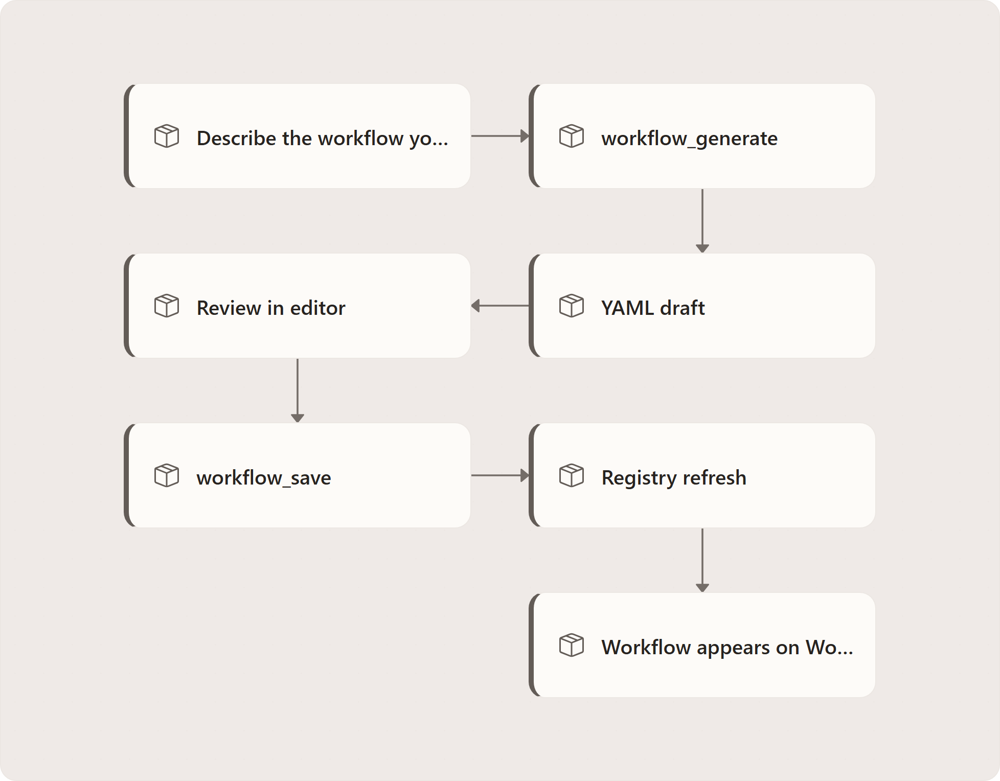

# Workflows

**Workflows** define the scenario. They are YAML-described multi-role pipelines that tell Agentweaver which agents are involved, what each one does, and how work flows between them. The scenario is defined by the workflow, not the platform — this is what makes Agentweaver work for software delivery, content authoring, PM discovery, incident response, and anything else your team needs.

## Built-in workflow library

Agentweaver ships seven built-in workflows:

| Workflow | What it does |
|---|---|
| `software-delivery` | Code changes, new features, refactors, and migrations. Full delivery pipeline from spec to merged code. |
| `bug-fix` | Targeted investigation and fix for a specific bug report or regression. Includes root-cause analysis. |
| `infra-ops` | Infrastructure, CI/CD, monitoring, and alerting work. Includes policy validation, review, and human sign-off. |
| `content-authoring` | Drafting and editing docs, blog posts, READMEs, release notes, and other written content. |
| `pm-discovery` | Product discovery — user research synthesis, spec drafting, requirements analysis, and opportunity framing. |
| `incident-response` | Live incident investigation, mitigation guidance, and postmortem drafting with full run tracing. |
| `agent-evaluation` | Testing and evaluating agent outputs against criteria. Useful for validating agent behavior and quality. |

::: tip Automatic workflow matching
When you submit a task, an LLM pass automatically selects the best-fit workflow from the library. You don't have to pick a workflow manually for most tasks.
:::

## How workflow matching works

When you start an orchestration, Agentweaver reads your task description and runs a matching pass that considers:

1. The semantic intent of your description
2. The project's configured default workflow (if set)
3. The built-in library's workflow metadata and use-case descriptions

After the confirmed outcome is decomposed, Agentweaver validates that code-producing work uses a
workflow with a **Build & Test** stage. If an automatic match such as `pm-discovery` cannot express
that gate, the coordinator re-selects from compatible workflows. Explicit overrides remain pinned;
when an override lacks Build & Test for code work, the work plan surfaces a warning instead of
silently changing the user's choice.

The matched workflow is shown in the run detail. If the auto-match picks the wrong one, you can
override it at submission time.

## Workflows in your project

Each project stores its active workflows in `.agentweaver/workflows/` inside the project's working directory. The **Workflows** page in the web UI shows all workflows discovered from that directory, their validation status, and which one is the project default.


### Viewing workflows

From a project, navigate to **Workflows** in the sidebar. Each workflow card shows:

- The workflow name and its source file
- Validation status: **Valid**, **Invalid** (with an error), or **Warning**
- Whether it is the project's **default** workflow

Click a workflow to expand it and see its full YAML definition, a visual graph of the roles and steps, or the raw step-by-step pipeline.

### Setting the default workflow

Click **Set as default** on any valid workflow to make it the project's default. When a submitted task matches no specific workflow — or when auto-matching is overridden — the default is used.

::: tip Clear the default to restore the built-in
Setting the default to "none" (clearing the selection) reverts to the system's built-in default workflow.
:::

### Syncing workflows

If you edit a workflow YAML file on disk or add a new one, click **Sync** on the Workflows page to re-read the `.agentweaver/workflows/` directory and refresh the list. This is an explicit sync — Agentweaver does not watch the filesystem. In multi-replica deployments, the synced files live in the shared project workspace; other API replicas detect the changed workflow file set on their next registry read and refresh their local cache.

## Authoring a workflow

### YAML editor

Click **New workflow** to open the visual editor with a YAML-backed template. Use **Edit** on an existing project workflow when you prefer to edit its YAML directly.

### Visual editor

Use **Edit visually** to build a workflow as a node graph. Drag roles onto the canvas, connect them, and configure each step visually. The editor generates the YAML for you. The graph adapts to the workflow shape: short and branching workflows use centered left-to-right stages, while long linear workflows use a compact staircase. The Build view keeps the canvas prominent with a bounded inspector: select no graph item to edit the workflow id, name, description, start node, and schedule; select a node or edge to edit its properties. The start node is marked on the canvas.

Click **Add node** to insert a new step, or choose **Add next step** on a node to add a connected prompt step. Each node also has an actions menu for renaming or deleting it. The palette is grouped under **Reviewers & gates**, **Agent steps**, **Actions**, and **Flow control**, and each entry shows an icon and a one-line description. **Build & Test** appears once, as a ready-to-use preset.

The inspector and **YAML** are separate tabs. Changes from either surface share the same YAML draft, so **Undo**, **Redo**, **Revert to last save**, and **Discard changes** apply consistently. Use **Validate** to check that the YAML parses and that all declared gate verdicts have outgoing routes before saving.

The **Actions** group includes **Open pull request**, which creates a pull request on the connected GitHub repository, and **Publish**, an agent-backed step for packaging or delivering approved output without code-merge semantics. Both types round-trip through YAML. Configure common fields in the node inspector; use the YAML view for pull-request template overrides such as `title`, `body`, `base`, `head`, and `draft`.

The **Schedule trigger** section shows whether the workflow is manual-only or scheduled. Choose **Add schedule trigger** or **Edit schedule trigger** to configure a daily, weekly, or monthly UTC schedule. Schedule changes update the editor's current YAML draft and are persisted with the rest of the workflow when you choose **Save**, so unsaved graph or YAML edits are never overwritten by a separate schedule save.

For existing project workflows, use **Edit** to open the YAML editor or **Edit visually** to open the graph editor. Built-in workflows are read-only; use **Duplicate to project** to create an editable copy and open it in the visual editor.

## Running and scheduling workflows

Each workflow row shows all configured automation triggers, or **Manual only** when none are
configured. Use **Run now** to queue a Ready task bound to that workflow; it is picked up and shown
on the board through the same normal coordinator path as other work.

For project workflows, configure a schedule from the workflow row (**Add schedule** / **Edit
schedule**) or from the visual editor to run the workflow daily, weekly, or monthly at a UTC time.
Choose **Add event** or **Edit event** to also start the same workflow from a curated GitHub webhook
event. Each editor removes only its own trigger, so a weekly schedule and a GitHub event can coexist.
Built-in workflows cannot be scheduled directly; duplicate one into the project first.

Configuring a schedule or event trigger defines what *can* fire; it does not by itself turn
automation on. A Project Owner must also activate automation for the project from the
**Unattended** section of Project Settings (see [Projects](projects.md#unattended)) before any
schedule or event trigger will actually run. Deactivating stops triggers from firing without
deleting the workflow's schedule or event configuration.

A schedule can run for a repository-less project. GitHub event triggers and workflow steps that
perform repository operations are different: they require a GitHub-backed project with verified
repository access and the Repo App installation prerequisite described in Project Settings.

Existing workflow files with one `trigger:` object remain valid and continue to round-trip in that
shape. Workflows with multiple triggers use a `triggers:` list, with at most one schedule and one
event trigger:

```yaml
triggers:
  - type: schedule
    interval: weekly
    day_of_week: monday
    time_of_day: "09:00"
  - type: event
    event_name: github.issues.labeled
    if:
      - has_label: { label: "roadmap-review" }
```

The structured trigger API returns both `triggers` (the complete list) and the legacy `trigger`
field (the first trigger). `PUT .../trigger` creates or replaces the requested trigger type without
removing other types. `DELETE .../trigger?type=schedule` and `?type=event` remove one type;
`DELETE .../trigger` without a type retains its legacy behavior and clears all triggers.

The visual event-trigger editor is intentionally constrained:

- an **event picker** limits you to the supported GitHub event shortlist;
- an **Issue action** picker distinguishes **Any issue action**, **Opened**, **Labeled**, and the
  other GitHub Issues webhook actions, so label-added automation persists
  `github.issues.labeled` instead of an action-hidden `github.issues.opened`;
- the **condition-row builder** only offers predicates valid for the selected event;
- separate condition rows are **ANDed by default**;
- the common “match any of these values” case is represented as an `or:` group behind the scenes;
- advanced nested `or:` / `not:` expressions remain part of the trigger grammar and round-trip through YAML and the structured trigger API even when you author them outside the row builder.

## Triggering workflows from GitHub

Repository events are delivered through the Repo App's App-level webhook. Project Settings does
not expose a payload URL, webhook provisioning action, or webhook secret. Install and grant the
Repo App for the required repository, then use **Settings → Unattended** to see the project's
read-only readiness status. Agentweaver verifies deliveries against the App-level configuration
without disclosing webhook credentials or provider internals.

An event delivery named by GitHub's `X-GitHub-Event` header fires `github.<event>` (for example,
`github.push` or `github.issues`). When the payload has an `action`, it also fires the more specific
`github.<event>.<action>` name, such as `github.issues.opened` or
`github.pull_request.opened`.

The supported event shortlist is:

| GitHub event | Typical use | Supported predicates |
|---|---|---|
| `issues` | Triage or automate issue lifecycle changes | `hasLabel`, `isNotLabeledWith` |
| `issue_comment` | Slash-command style comment entry points | `commentMatches` |
| `pull_request` | PR intake, routing, or policy workflows | `hasLabel`, `isNotLabeledWith`, `baseBranch` |
| `pull_request_review` | Approval / changes-requested flows | `reviewState` |
| `push` | Branch or tag push automation | `ref` |
| `release` | Release-published workflows | none in v1 |
| `discussion` | Discussion-category routing | `category` |

The trigger grammar is curated rather than generic. In the structured trigger API and UI, the
predicate names are `hasLabel`, `isNotLabeledWith`, `baseBranch`, `reviewState`, `ref`,
`category`, and `commentMatches`. In saved YAML, the same predicates serialize in snake_case as
`has_label`, `is_not_labeled_with`, `base_branch`, `review_state`, and `comment_matches`.

An event trigger's `if:` list is an implicit AND. Use `or:` and `not:` wrappers for compound logic:

```yaml
trigger:
  type: event
  event_name: github.pull_request.opened
  if:
    - or:
        - base_branch: { branch: "main" }
        - base_branch: { branch: "release/v1" }
    - not:
        has_label: { label: "blocked" }
```

For comment-driven automation, use a fixed, pre-validated regex pattern:

```yaml
trigger:
  type: event
  event_name: github.issue_comment.created
  if:
    - comment_matches: { pattern: "^/agentweaver:triage$" }
```

`comment_matches` is boolean-only: it decides fire / no-fire, but Agentweaver does not forward the
raw comment body into backlog task text or downstream prompts.

For example, this project workflow starts whenever an issue is opened:

```yaml
id: triage-new-issue
name: Triage newly opened issue
start: triage
nodes:
  - id: triage
    type: prompt
    role: backend-engineer
    prompt: Triage the newly opened GitHub issue.
  - id: done
    type: terminal
edges:
  - from: triage
    to: done
trigger:
  type: event
  event_name: github.issues.opened
```

Event triggers can also add a structured `if:` filter list. A plain array is implicitly ANDed; use
`or:` and `not:` wrappers for compound logic. The v1 predicate vocabulary is intentionally curated:

- `has_label` / `is_not_labeled_with` for `github.issues*` and `github.pull_request*`
- `base_branch` for `github.pull_request*`
- `review_state` for `github.pull_request_review*`
- `ref` (`equals` / `prefix`) for `github.push`
- `category` for `github.discussion*`
- `comment_matches` for `github.issue_comment*`

For example, this workflow fires only when a newly added issue label set includes both `bug` and
`needs triage`:

```yaml
trigger:
  type: event
  event_name: github.issues.labeled
  if:
    - has_label: { label: "bug" }
    - has_label: { label: "needs triage" }
```

`comment_matches` is intentionally boolean-only: it uses the GitHub comment body only to decide
match/no-match. Agentweaver does not extract arguments, persist the raw text, or forward the comment
body into downstream prompts through the trigger path.

### Generate from description

Choose **Generate from description**, type what you want the workflow to do in plain language, and Agentweaver generates an initial YAML draft for you to review and edit. Trigger generation covers recurring schedules and curated GitHub events, including prompts that request both on one workflow; generated automation uses the `triggers:` list while existing singular `trigger:` drafts remain valid.

The generator is still preview-first. It teaches the model the workflow schema, the supported
trigger shapes, and a few-shot set of natural-language → trigger examples, then validates the draft
with the same loader the runtime uses. If the first draft is malformed, the server allows exactly one
correction pass before failing closed.

If the project was created from GitHub — or your prompt includes a GitHub repository or issue URL —
generation keeps that target repository in the prompt context so the draft acts against the intended repo.

The generated workflow is preview-first: Agentweaver opens the YAML draft in the editor and does not write it to `.agentweaver/workflows/` until you save. If validation fails after the server's correction pass, the API returns an error instead of saving a broken workflow.



<!-- Rendered from ../diagrams/src/canonical-workflow-authoring.json by docs/diagram-renderer +
     Playwright (Fluent-styled React Flow), replacing a Mermaid flowchart.
     Edit the JSON, then run `npm run docs:render-diagrams` and commit the
     regenerated PNG + .hash.txt. -->

::: warning Workflows affect team composition
A workflow references specific roles by name. If your project's cast doesn't include a role referenced in the workflow, the run will fail validation before it starts. Make sure the workflow's required roles match the agents in your team.
:::

## Workflow lifecycle in a run

When a run executes against a workflow:

1. The workflow is resolved — built-in or project-local
2. The coordinator decomposes the workflow's steps into the WorkPlan
3. Each step is dispatched to the agent whose role matches the step's role binding
4. Steps execute in the order the workflow specifies (parallel where there are no dependencies)
5. Outputs from one step become inputs to the next

The live topology view shows each workflow step as a node, with edges representing the data flow between steps.

## Blueprints bundle workflows

When you save a team as a **Blueprint**, the Blueprint bundles the team's roster, one or more workflows (with a designated default), and the project's review and sandbox policies. Instantiating the Blueprint into a new project automatically materializes the workflow files into the new project's `.agentweaver/workflows/` directory.

→ [Agent Teams & Blueprints](./teams)
