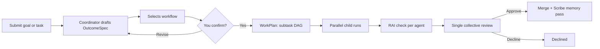

::: warning Alpha software
Agentweaver is **alpha software** under active development. Expect breaking changes, incomplete features, and rough edges. Do not rely on it for production workloads.
:::

## How it works

Submit a goal. The coordinator drafts a plan — you confirm it before any work starts. A squad of specialists works in parallel, each in an isolated sandbox. Review the assembled work once, behind a single gate that includes a Responsible AI check.
