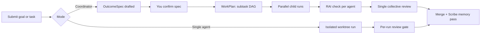

::: warning Alpha software
Agentweaver is **alpha software** under active development. Expect breaking changes, incomplete features, and rough edges. Do not rely on it for production workloads.
:::

## How it works

Agentweaver supports two submission modes. In **single-agent mode**, one named agent works in an isolated workspace — you watch live, review the result, then approve or decline. In **coordinator mode**, you submit a goal: the coordinator drafts a plan, you confirm it before any work starts, and a squad of specialists works in parallel. You review the assembled work once, behind a single gate that includes a Responsible AI check.
