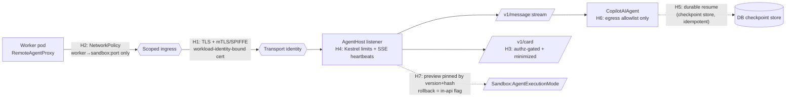

# A2A Transport — Reference

::: warning Preview dependency on the hot path
The A2A transport is built on the `Microsoft.Agents.AI.A2A` and `Microsoft.Agents.AI.Hosting.A2A(.AspNetCore)` package line. **Every published version of that line is `-preview`** (for example `1.9.0-preview.260603.1` through `1.11.1-preview.260625.1`), whereas the workflow runtime it pairs with reached stable `1.9.0`. A2A sits on the agent-execution hot path as the **sole** wire transport, so this preview status is a first-class operational fact, not a footnote.

**Mitigations (all required):** pin one exact known-good build by **version + hash**; gate the whole path behind `Sandbox:AgentExecutionMode`; and treat the **`in-api` mode as the rollback path** — not a second wire protocol. Advance the pin only after validating against the next A2A release, tracking the line to GA.
:::

This reference catalogues the A2A surface Agentweaver uses, the message-mode semantics, the agent card, and the H1–H7 security model. For the design reasoning behind these choices, read the [A2A bridge deep dive](../deep-dive/a2a-bridge.md). For the pod lifecycle, see [Sandbox pods reference](./sandbox-pods.md) and [Sandbox pod execution](../deep-dive/sandbox-pod-execution.md).

## 1. Package surface

| Side | Package | What it provides |
|---|---|---|
| **Host (in-pod)** | `Microsoft.Agents.AI.Hosting.A2A` + `Microsoft.Agents.AI.Hosting.A2A.AspNetCore` | `app.MapA2A(agent, path, agentCard)` — exposes an existing `AIAgent` over A2A as ASP.NET Core endpoints |
| **Client (worker)** | `Microsoft.Agents.AI.A2A` | `A2AAgent : AIAgent` (constructed from an `IA2AClient`) and the extension `IA2AClient.AsAIAgent()` — wraps a remote A2A endpoint as a local `AIAgent` |
| **Underlying SDK** | `A2A` | `A2ACardResolver` / `IA2AClient` — the raw protocol client the wrapper sits on |

The worker never drops to the raw `A2A` client. It consumes the remote endpoint as an `AIAgent` via `A2AAgent` / `AsAIAgent()`, which is why the worker's turn executor is untouched: both the local and remote leaf are the same `AIAgent` abstraction.

### Pinning

Pin a single A2A build aligned with Agentweaver's existing `Microsoft.Agents.AI.*` line (for example the `…-preview.260603.1` stamp shared with the GitHub Copilot agent package), recorded by **exact version and content hash**. Do not float the version. Upgrading the pin is a deliberate, validated step gated by soak on the execution-mode flag.

## 2. Endpoints

`MapA2A(agent, path, agentCard)` publishes a fixed, narrow surface under the configured path:

| Endpoint | Method | Purpose |
|---|---|---|
| `…/v1/message:stream` | `POST` | Streaming agent turn over SSE. The only data-plane endpoint. |
| `…/v1/card` | `GET` | The agent card — capability + security-scheme discovery. **Authz-gated, not anonymous.** |

Messages are keyed by `messageId` and `contextId`. The server maintains a per-`contextId` conversation history, which Agentweaver treats as **ephemeral** (see §4). The surface is intentionally bounded: a fixed streaming endpoint plus a discovery endpoint, narrower than any ad-hoc executor surface.

## 3. The agent card (`/v1/card`)

The agent card advertises the agent's capabilities (streaming, push notifications) and its security schemes (bearer / OAuth2). In Agentweaver it is:

- **Authz-gated.** `GET /v1/card` requires authorization; there is **no anonymous discovery** of the in-pod agent.
- **Minimized.** The card exposes only what the worker needs to bind the transport — no broad capability advertising, no surplus metadata.

The card's bearer/OAuth2 scheme is an **app-layer** auth model. It is useful but, on its own, it does **not** satisfy the transport security requirement (see H1). Agent-card bearer/OAuth2 must be wrapped by transport-layer identity (mTLS/SPIFFE) and per-run validation.

## 4. Message-mode semantics

Agentweaver uses A2A in **message/stream mode only**.

| Concern | A2A capability | Agentweaver's use |
|---|---|---|
| Per-turn streaming | `message:stream` (SSE) | **Used.** One ordered stream per turn carries updates, token deltas, and `RunEvent` `DataPart`s. |
| Task lifecycle | `submitted`/`working`/`input-required`/`completed` + continuation tokens | **Not used.** No A2A task is ever opened — no task-model tax. |
| HITL / `input-required` | task pauses awaiting input | **Not used over the wire.** HITL is a MAF `RequestPort` in the worker graph, not an agent turn. |
| Conversation history | server-side, keyed by `contextId` | **Bypassed.** Ephemeral; dies with the pod. Durable resume is Agentweaver's checkpoint store. |
| Stream replay | none (no Last-Event-ID) | **Not relied on.** A mid-turn drop re-drives the turn from the last checkpoint. |

### What crosses the wire

1. The **turn input**, mapped onto the A2A init/stream message.
2. The agent's **streaming output** — `AgentRunResponseUpdate` chunks and token deltas.
3. The **`RunEvent` side-channel**, encoded as A2A `DataPart`s on `message:stream`, decoded back into `RunEvent`s on the worker.

The `RunEvent` codec is the only Agentweaver-owned shim, and it is transport-independent (any transport would need it). Ordering within a turn is preserved because `message:stream` is a single ordered SSE stream, re-injected on the worker under a monotonic sequence allocator.

### What does **not** cross the wire

- MAF `WorkflowEvent`s (executor-invoked/completed, request-info) — emitted by the worker graph around the leaf.
- HITL `RequestPort` suspend/resume — a worker graph construct.
- Checkpoints / session blobs — persisted out-of-band to the DB-backed checkpoint store.
- Worktree commit and diff — performed on the worker against the shared workspace PVC.

## 5. Security model (H1–H7)

A2A requires an in-pod HTTP listener and an east-west ingress rule onto Kata-isolated pods. The transport ships **only when all of H1–H7 hold**. These are mandatory gates, not recommendations.

| Gate | Requirement |
|---|---|
| **H1 — Transport identity** | TLS **plus** a workload-identity-bound pod server certificate. **mTLS / SPIFFE preferred.** A bearer token is acceptable **only** if it is short-lived, run/audience-scoped, and validated per-run. A naked bearer is rejected. **Agent-card bearer/OAuth2 alone does NOT satisfy H1.** |
| **H2 — Scoped ingress** | A `NetworkPolicy` ingress rule scoped to **worker-pod → sandbox:port only** (expressed for both plain NetworkPolicy and Cilium). Sandbox pods are otherwise ingress deny-all. |
| **H3 — Card authz** | `/v1/card` is authz-gated and minimized. No anonymous discovery. |
| **H4 — Bounded listener** | Explicit Kestrel timeout, request-body, and stream limits, **plus SSE heartbeats** so a request-timeout does not kill the long-lived turn stream. |
| **H5 — Idempotent resume** | Resume via Agentweaver's DB checkpoint with **idempotent, sequence-based re-injection**. On mid-turn drop, **re-drive the turn from the last checkpoint** (A2A `message:stream` has no Last-Event-ID replay). |
| **H6 — No egress broadening** | The sandbox egress allowlist is unchanged: model endpoint, the API broker endpoint, and the run's legitimate git remote(s). Everything else is default-deny. A2A adds **no** egress. |
| **H7 — Pinned preview** | The preview library is pinned by exact **version + hash**, gated behind the execution-mode flag, and tracked to GA. **The rollback is the `in-api` flag** (see §6), and H7 records the residual-risk mitigations rather than relying on a live second transport. |

### Notes on the gates

- **H1 is the one most often misread.** The agent card's bearer/OAuth2 scheme is app-layer and helps, but it does not replace transport-layer workload-identity-bound mTLS. Both are required.
- **H4 exists because of streaming.** A long agent turn is a long SSE stream. Without explicit limits and heartbeats, a default request timeout will sever a healthy turn.
- **H5 is owned by Agentweaver, not A2A.** A2A provides no durable resume; the checkpoint store does. Re-injection must be idempotent so a re-driven turn does not duplicate timeline events.

## 6. The `-preview` caveat, the rollback flag, and degraded mode

This section is the operational contract for running a preview dependency on the hot path.

### The caveat (stated prominently)

Agentweaver runs an **A2A `-preview` library on the agent-execution hot path with no alternate wire transport.** This residual risk is **accepted**, conditioned on the H7 mitigations: exact pinning, the execution-mode flag, and GA tracking. Because of it, `in-api` mode remains the **default** until the pod-per-run path completes soak.

### Rollback is a flag, not a second wire

| `Sandbox:AgentExecutionMode` | Behavior |
|---|---|
| `in-api` *(default)* | Agent turns run **in-process** in the worker exactly as today. This is the instant, fully-tested rollback for any A2A defect or outage. |
| `pod-per-run` | Agent turns are remoted to a sandbox pod over the A2A transport. |

Switching back to `in-api` **requires no second wire transport and no redeploy of a different protocol.** It removes the A2A path entirely. There is no "A2A vs gRPC vs exec-stdio" wire choice on the agent-turn path — A2A is the **sole** transport, and the rollback is the *mode*, not a *protocol*.

### kube-exec-stdio is the degraded-mode fallback only

A `kube-exec-stdio` channel exists for its own per-command purposes and remains available as a **degraded-mode fallback only**. It is **not** a wire transport for agent turns and is **not** the rollback path. The rollback path is `in-api`. Do not configure exec-stdio as a live alternate agent-turn transport.

## 7. Quick configuration reference

| Setting | Values | Meaning |
|---|---|---|
| `Sandbox:AgentExecutionMode` | `in-api` *(default)* / `pod-per-run` | In-process execution vs A2A-remoted pod execution. The `in-api` value is the rollback. |
| `Sandbox:ReleasePodOnSuspend` | `true` *(default)* / `false` | Checkpoint-and-release the pod when the graph suspends on a `RequestPort` or coordinator idle. |

See the [A2A bridge deep dive](../deep-dive/a2a-bridge.md) for how these settings interact with checkpointing and resume, and the [distributed-agents experience doc](../experience/a2a-distributed-agents.md) for what they change operationally.
