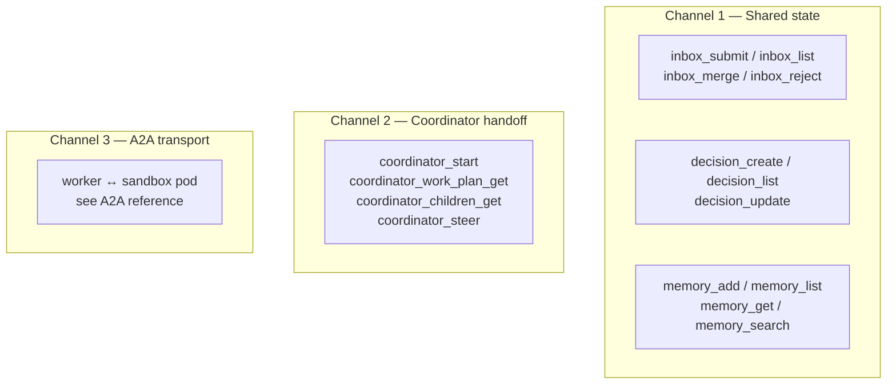

# Agent Communication — Reference

This reference maps each of Agentweaver's three **agent communication channels**
to its concrete surfaces: MCP tools and HTTP API endpoints. For the conceptual
model and the reasoning behind it, read the
[Agent Communication deep dive](../deep-dive/agent-communication.md).

The three channels are:

1. **Indirect / shared-state coordination** — the decisions ledger and
   cross-agent memory (the team's shared brain).
2. **Coordinator-mediated handoffs** — the WorkPlan / subtask DAG and child-run
   dispatch.
3. **Direct transport (A2A)** — the worker↔sandbox-pod execution transport for a
   single agent turn.

> **Precision note.** Channels 1 and 2 are how the *team* coordinates. Channel 3
> is how a *single agent turn* is *executed*. A2A is not a way for two agents to
> chat. Do not map agent-to-agent coordination onto the A2A surfaces.

---

## Channel 1 — Shared-state coordination

Agents coordinate indirectly by reading the project's decisions and memory at
turn start (and mid-run) and by writing proposals back into the decision inbox.
The conceptual model is in the
[Memory & Decisions deep dive](../deep-dive/memory-decisions.md); the full tool
catalog is in the [MCP reference](./mcp.md) and the
[API reference](./api.md). The surfaces below are the ones that constitute
cross-agent communication.

### Decision inbox — propose, list, promote, reject

The inbox is the durable drop-box in front of the canonical ledger. Agents
**submit** proposals here; reviewers and the Scribe **merge** or **reject** them.

| MCP tool | API endpoint | Purpose |
| --- | --- | --- |
| `inbox_submit` | `POST /api/projects/{id}/decisions/inbox` | Submit a decision or learning proposal (slug-keyed, idempotent) |
| `inbox_list` | `GET /api/projects/{id}/decisions/inbox` | List entries (`?agent=`, `?type=`, `?status=`; default `pending`) |
| `inbox_merge` | `POST /api/projects/{id}/decisions/inbox/{entryId}/merge` | Promote a pending entry into a canonical decision |
| (merge alias) | `POST /api/projects/{id}/decisions/inbox/{entryId}/promote` | Alias for merge/promote |
| `inbox_reject` | `POST /api/projects/{id}/decisions/inbox/{entryId}/reject` | Reject a pending entry (retained for audit) |

`inbox_submit` parameters: `project_id`, `agent_name`, `slug` (unique, for
idempotency), `type` (`learning` · `pattern` · `update` · `architectural` ·
`scope` · `process` · `technical`), `title`, `content`, optional `rationale`.
Re-submitting the same `agent_name` + `slug` while still pending updates the
entry in place; a different agent reusing the same slug is de-collided into a new
entry. See the slug de-collision logic in the
[Memory & Decisions deep dive](../deep-dive/memory-decisions.md).

### Decisions ledger — create, list, update

Promoted entries become canonical **decisions**. The coordinator and Scribe paths
may also create decisions directly, and decisions can be superseded or archived.

| MCP tool | API endpoint | Purpose |
| --- | --- | --- |
| `decision_create` | `POST /api/projects/{id}/decisions` | Create a decision directly (coordinator / Scribe path) |
| `decision_list` | `GET /api/projects/{id}/decisions` | List decisions (`?type=`, `?agent=`) |
| (get one) | `GET /api/projects/{id}/decisions/{decisionId}` | Get a single decision |
| `decision_update` | `PUT /api/projects/{id}/decisions/{decisionId}` | Update status/content; set `superseded_by_id` |

`decision_update` accepts `status` (`active` · `superseded` · `archived`), new
`content`, and `superseded_by_id`. Active `architectural` and `scope` decisions
are the highest-priority context injected into every agent — they are the team
boundaries every agent reads. See the [Memory reference](./memory.md) for how
they are compiled into Layer 1 of the prompt.

### Cross-agent memory — record, list, get, search

Memory is reusable context. An agent's own memory is agent-scoped, but
`memory_search` reads **across all agents** on the project, and memory tagged
`cross-team` surfaces in other agents' compiled context. This is the read side of
indirect coordination.

| MCP tool | API endpoint | Purpose |
| --- | --- | --- |
| `memory_add` | `POST /api/projects/{id}/agents/{name}/memory` | Add a memory entry for an agent |
| `memory_list` | `GET /api/projects/{id}/agents/{name}/memory` | List one agent's memories (`?type=`, `?importance=`) |
| `memory_get` | `GET /api/projects/{id}/agents/{name}/memory/{memId}` | Get a single memory entry |
| `memory_search` | `GET /api/projects/{id}/memory` | **Cross-agent** search across the whole project (`?type=`, `?tags=`) |

`memory_add` parameters: `project_id`, `agent_name`, `type` (`learning` ·
`pattern` · `core_context` · `update`), `content`, optional `importance`
(`low` · `medium` · `high`) and comma-separated `tags`. `memory_search`
parameters: `project_id`, optional `type`, optional `tags` (comma-separated, OR
semantics) — and it returns entries from **all** agents.

> **`GET /api/projects/{id}/memory` is the cross-agent search surface.** It is the
> endpoint behind `memory_search` and the one place a caller reads the team's
> accumulated memory without naming a specific agent.

### Curation — the Scribe and export

After a run, the **Scribe** lists pending inbox entries, merges low-risk
`learning` / `pattern` / `update` entries, updates the session, and exports DB
state to files. Architectural and scope entries are left for review. Export and
import bridge the DB to the `.squad/` and `.agentweaver/context/` mirrors:

| API endpoint | Purpose |
| --- | --- |
| `POST /api/projects/{id}/memory/export` | Export DB memory → `.squad/` + `.agentweaver/context/` |
| `POST /api/projects/{id}/memory/import` | Import `.squad/decisions/inbox/*.md` → DB |

The Scribe's role and the four-layer context build are documented in the
[Memory reference](./memory.md).

---

## Channel 2 — Coordinator-mediated handoffs

The coordinator decomposes a goal into a WorkPlan / subtask DAG, dispatches child
runs, observes them, and steers them. Children report results **up** to the
coordinator; they never message each other. These tools are thin proxies over the
Coordinator endpoints — see the [Coordinator reference](./coordinator.md), the
[MCP reference](./mcp.md), and the API table in the [API reference](./api.md).

### Start and intent

| MCP tool | API endpoint | Purpose |
| --- | --- | --- |
| `coordinator_start` | `POST /api/projects/{id}/orchestrations` | Start a coordinator orchestration from a plain-language `goal` |
| `coordinator_outcome_spec_get` | `GET /api/runs/{id}/outcome-spec` | Read the persisted OutcomeSpec (intent contract) |
| `coordinator_outcome_spec_confirm` | `POST /api/runs/{id}/outcome-spec/confirm` | Confirm the spec, resuming past the gate |
| `coordinator_outcome_spec_revise` | `POST /api/runs/{id}/outcome-spec/revise` | Re-draft the spec from `feedback` |

No subagent work is dispatched until the OutcomeSpec is confirmed.

### Plan, children, and dispatch

| MCP tool | API endpoint | Purpose |
| --- | --- | --- |
| `coordinator_work_plan_get` | `GET /api/runs/{id}/work-plan` | The subtask DAG: `subtasks` (with `assignedAgent`, `phase`, `isolation`, `status`, `childRunId`) and `dependencies` edges |
| `coordinator_children_get` | `GET /api/runs/{id}/children` | Dispatched child runs, each with `subtaskId`, `childRunId`, `subtaskStatus`, `assignedAgent`, `childRunStatus`, `worktreeBranch` |
| `orchestration_topology` | `GET /api/runs/{id}/work-plan` + `GET /api/runs/{id}/children` | One-shot `{ coordinatorRunId, workPlan, children }` snapshot |

Each child run carries a `ParentRunId` and a `SubtaskId`. Children stop at the
**assemble-ready** boundary — they do not run review, merge, or Scribe; the
coordinator assembles. The full dispatch and assembly model is in
[Coordinator Internals](../deep-dive/coordinator-internals.md).

### Steering — coordinator-mediated, not peer-to-peer

Steering is how an operator redirects in-flight work. It always goes **through the
coordinator**, which relays to the targeted child — siblings never steer each
other.

| MCP tool | API endpoint | Purpose |
| --- | --- | --- |
| `coordinator_steer` | `POST /api/runs/{id}/steer` | `stop` / `redirect` / `amend` a child; omit `target_child_run_id` to broadcast to all active children |

`coordinator_steer` parameters: `run_id`, `kind` (`stop` · `redirect` ·
`amend`), `instruction`, optional `target_child_run_id`. A `stop` cancels the
targeted turn immediately; `redirect` / `amend` apply at the child's next turn
boundary. Directive progress streams as `coordinator.steering`
(`pending → queued → relayed → applied`).

### Observing the topology

A coordinator run is an ordinary run, so there is no separate streaming tool —
point `run_watch` at the coordinator `run_id`.

| MCP tool | API endpoint | Purpose |
| --- | --- | --- |
| `run_watch` | `GET /api/runs/{id}/stream` | Live stream; carries `coordinator.work_plan`, `coordinator.topology`, `subtask.*`, and `coordinator.steering` events |

The `subtask.*` family (`subtask.dispatched`, `subtask.running`,
`subtask.assemble_ready`, `subtask.completed`, `subtask.failed`) is how results
and status flow **up** to the coordinator view. Child clarifying questions and
tool approvals are re-emitted on this stream and routed back to the originating
child — never sideways. See [Coordinator Internals](../deep-dive/coordinator-internals.md).

---

## Channel 3 — Direct transport (A2A)

A2A (Agent2Agent) is the wire transport that **remotes a single agent turn** from
the **worker** to an **AgentHost** inside a **sandbox pod**. It is execution
transport, not agent-to-agent chat: the orchestration graph stays in the worker,
and A2A carries only the leaf agent turn's output stream across the boundary. On
the worker the leaf is a `RemoteAgentProxy` (an `A2AAgent` over A2A **HTTP+JSON**);
the pod hosts an `A2ATurnBridgeAgent` (`agentweaver-pod`) wrapping its
`CopilotAIAgent`, exposed at `POST /a2a/agent/v1/message:stream` and
`GET /a2a/agent/v1/card`.

A2A has its own dedicated surfaces and is documented separately:

- [A2A bridge deep dive](../deep-dive/a2a-bridge.md) — the conceptual transport
  model (worker tier, sandbox-pod AgentHost, remote agent proxy).
- [A2A reference](../reference/a2a.md) — the concrete transport endpoints and
  wiring.
- [Distributed execution spec §4](../../specs/018-distributed-agent-execution-scaling/spec.md) —
  the rationale for A2A as the sole worker→AgentHost wire transport.

Because A2A operates **below** team coordination, none of the Channel 1 or
Channel 2 surfaces change when a turn runs in a remote pod versus locally. The
shared-state tools and coordinator tools are identical either way.

---

## Channel-to-surface summary

| Concern | Channel | MCP tools | Key endpoints |
| --- | --- | --- | --- |
| Propose / promote boundaries | 1 | `inbox_submit`, `inbox_list`, `inbox_merge`, `inbox_reject` | `/api/projects/{id}/decisions/inbox*` |
| Canonical decisions | 1 | `decision_create`, `decision_list`, `decision_update` | `/api/projects/{id}/decisions*` |
| Cross-agent memory | 1 | `memory_add`, `memory_list`, `memory_get`, `memory_search` | `/api/projects/{id}/agents/{name}/memory*`, `GET /api/projects/{id}/memory` |
| Decompose & dispatch | 2 | `coordinator_start`, `coordinator_work_plan_get`, `coordinator_children_get`, `orchestration_topology` | `/api/projects/{id}/orchestrations`, `/api/runs/{id}/work-plan`, `/api/runs/{id}/children` |
| Steer & observe | 2 | `coordinator_steer`, `run_watch` | `/api/runs/{id}/steer`, `/api/runs/{id}/stream` |
| Execute one agent turn | 3 | see [A2A reference](../reference/a2a.md) | see [A2A reference](../reference/a2a.md) |

## Related reading

- [Agent Communication deep dive](../deep-dive/agent-communication.md) — the
  conceptual model and why indirect coordination beats direct chat.
- [Agent Communication experience](../experience/agent-communication.md) — what
  these surfaces look like to a user.
- [Memory reference](./memory.md) and
  [Memory & Decisions deep dive](../deep-dive/memory-decisions.md).
- [Coordinator reference](./coordinator.md),
  [MCP reference](./mcp.md), and [API reference](./api.md).
- [A2A bridge deep dive](../deep-dive/a2a-bridge.md) and
  [A2A reference](../reference/a2a.md).
