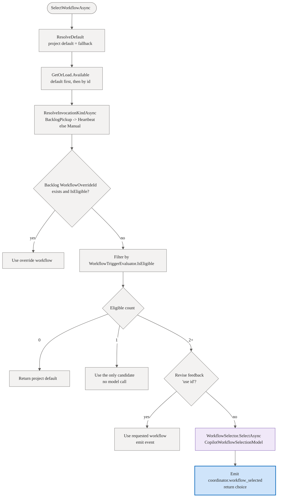

# Coordinator reference

The Coordinator is a built-in agent (codename Squad) that every team gains automatically. It adds a single new capability on top of the existing single-agent platform: an **orchestration layer**. The coordinator turns a user goal into a confirmed, memory-informed **outcome spec** before any work begins.

The coordinator is itself an observable, streamed, human-accountable run (`agent_name: "Coordinator"`, no parent run). It does not perform domain work itself — it only orchestrates and persists artifacts into the existing memory store.

This page documents the Phase 1 outcome-spec flow, the Phase 2 orchestration capabilities (decomposition, child dispatch, observation, topology events, and steering), and the Phase 3 collective assembly terminal-status surfaces (how a coordinator run reports its orchestration status and a human-readable reason on every terminal path).

## What it is (and is not)

The coordinator is orchestration-only. It MUST NOT reimplement any platform capability. The following capabilities stay owned by their existing features; the coordinator reuses them and never duplicates them:

| Capability | Owned by | Coordinator does |
| --- | --- | --- |
| RAI gate | RAI reviewer in the run graph | Reuses it per run; never re-specifies RAI checks |
| Casting / roster / per-role model | Casting service | Selects agent + model per subtask (later phase) |
| Human review / merge | Run graph executors | Reuses them; never runs a parallel review or merge |
| Scribe / session logging | Scribe executor | Reuses it; never re-logs sessions itself |
| Memory and decisions | Memory store | Reads context; persists the outcome spec (and later the work plan); injects active decisions into child workers |

Because of this non-redundancy contract, the coordinator's charter describes only orchestration behavior — read memories and decisions for context, draft and confirm an outcome spec, and (in later phases) decompose, dispatch, observe, and hand off. It does not re-specify RAI, casting, memory governance, sandboxing, review, merge, or scribe. The provider is fixed to GitHub Copilot; only the model id varies within Copilot.

## The Phase 1 outcome-spec flow

A coordinator run drafts a confirmable restatement of the goal and blocks all dispatch until a human confirms it.

1. **Start.** A goal is submitted for a project. The coordinator run begins and emits `coordinator.started` carrying the `goal`. The project's working directory, default branch, and the authenticated caller become the run's repository path, originating branch, and submitting user.
2. **Draft.** The coordinator reads the project's existing memories and decision-inbox entries as grounding context, then drafts an **outcome spec**: a desired outcome, scope, assumptions, and any scoped clarifying questions.
3. **Suspend at the gate.** The outcome spec is persisted with status `awaiting_confirmation`, and the run emits `coordinator.outcome_spec` and suspends at the confirmation gate. No decomposition or child dispatch occurs here — the run blocks until the human confirms or revises.
4. **Confirm or revise.**
   - **Confirm** advances the spec to status `confirmed`, emits `coordinator.outcome_spec.confirmed`, and resumes the run. In Phase 1 the run then terminates (decomposition and dispatch are later phases), followed by `run.completed`.
   - **Revise** re-drafts the spec using human feedback and re-suspends at the gate, emitting a fresh `coordinator.outcome_spec`.

### Outcome spec fields

| Field | Notes |
| --- | --- |
| `goal` | The submitted goal. |
| `desiredOutcome` | The drafted desired outcome. |
| `scope` | Drafted scope. |
| `assumptions` | Drafted assumptions. |
| `clarifyingQuestions` | Optional; omitted when none were drafted. |
| `status` | `drafting`, `awaiting_confirmation`, `confirmed`, or `declined`. |
| `confirmedBy` | Set once confirmed; omitted otherwise. |

## The human confirmation gate

The gate is the safety property of the flow: **no subagent work is dispatched before a human confirms the outcome spec.** A named human stays accountable for the run. The gate is reachable from both mandated clients at parity:

- **Web UI** — the coordinator run page renders the outcome-spec panel with Confirm and Request-changes actions and an explicit "no work is dispatched until you confirm" notice. See the [Web UI reference](./web.md#coordinator-run-and-outcome-spec-gate).
- **MCP server** — the `coordinator_*` tools start, read, confirm, and revise the spec; `run_watch` on the coordinator run id streams the live drafting. See the [MCP server reference](./mcp.md#coordinator).

Both clients are thin: all orchestration logic lives in the API's coordinator service, and clients hold no spec logic.

## Phase 2 orchestration

Confirming the outcome spec carries the coordinator run through Phase 2: **confirm -> select workflow -> decompose -> dispatch -> observe -> steer**. No work begins before confirmation, so the Phase 1 gate stays the single safety property.

### Workflow selection: how the coordinator picks the process to run

Before it decomposes anything, the coordinator decides **which workflow** (which run pipeline) the work should follow. The selection algorithm is `CoordinatorOrchestratorExecutor.SelectWorkflowAsync` (`apps/Agentweaver.Api/Coordinator/CoordinatorOrchestratorExecutor.cs`). It is deterministic-first: hard rules narrow the candidate set, and an LLM is consulted only as a last step when more than one candidate genuinely fits.

The algorithm runs in this order:

1. **Resolve the project default first.** `WorkflowRegistry.ResolveDefault(project)` produces the project's effective default (the project's `DefaultWorkflowId` when valid, else the built-in `default`). It is held as the deterministic fallback this method returns whenever a later step throws or nothing is eligible.
2. **Build the available list.** `WorkflowRegistry.GetOrLoad(project).Available` (validation-passing workflows) is ordered **default first**, then by id (`StringComparer.Ordinal`). The first entry is, by convention, the deterministic fallback for the selector.
3. **Resolve the invocation kind.** `ResolveInvocationKindAsync` maps the run's origin to a `WorkflowInvocationKind`: a run stamped `RunOrigin.BacklogPickup` (the heartbeat picked up a Ready task) becomes `WorkflowInvocationKind.Heartbeat`; every other origin — and any lookup failure — becomes `WorkflowInvocationKind.Manual`.
4. **Honor a backlog task override (if eligible).** If the run's backlog task carries a `WorkflowOverrideId`, that workflow is used **only if** it exists in the available set **and** its trigger is eligible for this invocation (`WorkflowTriggerEvaluator.IsEligible`). An unavailable or trigger-ineligible override is logged and ignored, and selection continues.
5. **Filter by trigger eligibility.** The available list is reduced to workflows whose declared trigger matches the invocation kind via `WorkflowTriggerEvaluator.IsEligible`.
6. **No eligible candidate → project default.** If nothing passes the trigger filter, the project default is returned (never a trigger-mismatched workflow).
7. **Exactly one eligible candidate → use it.** A single eligible workflow is used directly, with no model call and no selection event.
8. **Multiple eligible candidates → resolve the pick.** A `WorkflowSelectionContext` is built (project id, goal, roster role titles, the eligible definitions, and the set of custom/project workflow ids). Then:
   - An explicit human override `use <workflow-id>` in the latest revise feedback wins (`WorkflowSelector.TryParseOverride`); the chosen workflow is returned and a selection event is emitted (`wasAutoSelected: false`).
   - Otherwise the LLM-backed `WorkflowSelector.SelectAsync` picks by process fit; the result (and its rationale) is returned and a selection event is emitted (`wasAutoSelected: true`).

#### Trigger taxonomy (`apps/Agentweaver.Api/Workflows/WorkflowDefinition.cs`)

Every workflow declares exactly one `WorkflowTrigger { Type, Event }`:

| `WorkflowTriggerType` | Meaning | Eligible for |
| --- | --- | --- |
| `Manual` | A person or client explicitly starts the run. | `Manual` invocations only. |
| `Heartbeat` | The coordinator heartbeat picks up Ready work. | `Heartbeat` invocations only. |
| `Event` | The workflow starts on a declared `WorkflowEventType`. The only supported event is `TaskAddedToReady`. | `Heartbeat` invocations (a task entering Ready *is* that event). |

#### Trigger filtering (`apps/Agentweaver.Api/Workflows/WorkflowTriggerEvaluator.cs`)

`WorkflowTriggerEvaluator.IsEligible(trigger, kind)` is the hard boundary applied before any model call:

- `Manual` invocation → only `Manual`-trigger workflows.
- `Heartbeat` invocation → `Heartbeat`-trigger workflows **or** `Event`-trigger workflows whose event is `TaskAddedToReady`.

`WorkflowTriggerEvaluator.Filter` preserves input order, so the default-first ordering survives filtering.

#### Override mechanisms

| Channel | Source | Resolution |
| --- | --- | --- |
| **Backlog task override** | `BacklogTask.WorkflowOverrideId`, set before pickup. | Step 4: used only when the workflow exists and is trigger-eligible. `CoordinatorPickupService` additionally prepends `use <id>` to the goal text so the conversational path also sees it. |
| **Conversational override** | A human message matching `use <workflow-id>` in the revise feedback. | Step 8: `WorkflowSelector.TryParseOverride` matches the pattern; the requested workflow wins if it is among the eligible candidates. |

An override never escapes the candidate safety boundary: it cannot run a workflow the registry cannot resolve or the trigger evaluator rejects.

#### The LLM selector and its fallbacks (`apps/Agentweaver.Api/Coordinator/WorkflowSelector.cs`)

`WorkflowSelector.SelectAsync` is reached only with two or more eligible candidates and no explicit override:

- If `AvailableWorkflows.Count == 1` it returns the default with no model call.
- Otherwise it builds a process-fit prompt and calls `IWorkflowSelectionModel.CompleteAsync`. The production implementation is `CopilotWorkflowSelectionModel`, a Copilot completion wrapper whose failures return `null`.
- The model must reply with JSON `{ "selected": "<id>", "rationale": "<why>" }`. A `null`/unparseable response, an unknown id, or a thrown exception all fall back deterministically to the first candidate (the project default), with a rationale that explains the fallback.

Whenever the multi-candidate path runs, the coordinator emits a `coordinator.workflow_selected` event (`EmitWorkflowSelectedEvent`) carrying `selectedId`, `selectedName`, `rationale`, `wasAutoSelected`, an `overrideHint` (`Reply 'use {other-id}' to change...`), and the list of `available` workflows. If `SelectWorkflowAsync` throws anywhere, it logs a warning and returns the resolved project default so the caller always knows which workflow it is planning against.

The selected workflow is not only recorded for display: it becomes prompt context for decomposition so the resulting subtask graph mirrors the intended process shape. The run workflow factory later resolves the effective workflow again when it builds the executable graph, so a stale planning pick can never become unchecked runtime execution.

### Decomposition and the work plan

After confirmation, the coordinator decomposes the spec into a **work plan**: a set of subtasks plus the dependency edges between them. Each subtask carries an assigned roster agent (selected for role fit), a selected model (chosen for the subtask's complexity within the GitHub Copilot provider), a `phase`, an `isolation`, and a status. The plan is persisted to the memory store and emitted as `coordinator.work_plan`. Subagents read the confirmed spec and plan from the memory store; the coordinator does not introduce a parallel store. Read it over HTTP with `GET /api/runs/{id}/work-plan` or over MCP with `coordinator_work_plan_get`.

When no catalog/roster role adequately covers a subtask's function, the decomposition MAY mint a **bespoke role**: a descriptive id plus a short **inline charter** (2–4 sentences defining the agent's persona, expertise, and approach). Bespoke roles are a last resort — the decomposition prompt prefers exact catalog/roster ids and only sets a subtask's `charter` field when the role is bespoke. A subtask's inline charter is persisted on the subtask and flows to the dispatched child run's `AgentCharter`, overriding file-based charter resolution so the coordinator can stand up a domain-specific persona without a catalog role.

The `isolation` field (`worktree` | `shared`) is an **advisory hint only** with no runtime enforcement — every child run executes against a single shared worktree. Each subtask must therefore declare its output filename(s) in its scope so the assembly conflict check can serialize colliding writers.

### Child dispatch: parallel and serial

The coordinator dispatches subtasks as first-class **child runs** parented by the coordinator run, reusing the existing single-agent run machinery (per-child RAI, sandboxing, and step streaming) rather than new run primitives. Dispatch is dependency-ordered:

- Subtasks with no unmet dependencies dispatch together and run **in parallel**.
- A subtask with a dependency does not start until every prerequisite reaches `assemble_ready`/`completed`, so dependent work runs **serially** behind it.
- A failed or RAI-flagged predecessor does not satisfy a dependency, so its dependents stay blocked.

Each child worker is dispatched with its charter (catalog or bespoke inline charter) plus the project's active **architectural/scope decisions** — compiled by `MemoryContextCompiler.CompileDecisionsAsync` and injected as the `## Boundaries and Decisions` block. Children deliberately do **not** receive the full four-layer memory stack (core context, learnings, session), which duplicated the charter and carried artifact-write instructions that broke inside a child worktree; only the non-negotiable decisions reach them, ensuring scope constraints bind the agents doing the actual work. See the [Memory reference](./memory.md#coordinator-child-workers--decisions-only).

A subtask's status advances `pending -> dispatched -> running -> {assemble_ready | rai_flagged | completed | failed}`, surfaced as `subtask.*` events. The dispatched child runs (paired with subtask status) are available from `GET /api/runs/{id}/children` or the `coordinator_children_get` MCP tool.

### Observation and topology events

The coordinator observes each child through its read-only run timeline and projects two views onto its own run stream:

- `subtask.*` events — the granular per-subtask lifecycle (`subtaskId`, `childRunId`, `assignedAgent`, `selectedModelId`, `status`).
- `coordinator.topology` events — the orchestration graph. A `version: 1` snapshot (`seq: 0`) carries every node (one coordinator node plus one per subtask) and the dependency edges; deltas (`seq > 0`) carry only the changed node(s). Edge direction is always dependency to dependent, and edges never change after the snapshot.

Because these events ride the coordinator run's ordinary event stream, the live graph is fully reconstructable from a single stream. Over MCP, point `run_watch` at the coordinator run id; there is no separate streaming tool. `orchestration_topology` (or the work-plan plus children endpoints) gives a one-shot snapshot when a point-in-time view is enough.

### Steering verbs

A user steers the coordinator while subagents run, and the coordinator relays the direction to the targeted child run(s) via `POST /api/runs/{id}/steer` or the `coordinator_steer` MCP tool. The verbs carry the following semantics:

| Verb | Effect | Timing |
| --- | --- | --- |
| `stop` | Cancels the targeted child run's in-flight turn. | Immediate. |
| `redirect` | Relays new direction the subagent applies as a revised task turn. | At the subagent's next turn boundary; no restart. |
| `amend` | Relays an adjustment the subagent folds into its next turn. | At the subagent's next turn boundary; no restart. |

An in-flight agent turn cannot be interrupted mid-turn under the run model, so only `stop` reaches a subagent during a turn. A `redirect` or `amend` is queued and applied when the child's current turn completes (or when it next suspends at a gate), without restarting the run. Omitting the target broadcasts to every active child. Directives progress through `coordinator.steering` events (`pending -> queued -> relayed -> applied`).

**Pause is not supported in Phase 2.** No hold-before-next-turn primitive exists in the run model; the steering surface is `stop`, `redirect`, and `amend` only. Pause is deferred to a later phase.

### Asking the human: ask_question

Agents do not silently guess when they hit a material decision or an action that needs permission. They call the `ask_question(question)` tool, which suspends the agent and bubbles the question to a human (see [events.md](events.md#ask_question-bubbling) for the event/endpoint mechanics).

- **During decomposition**, the coordinator itself calls `ask_question` to clarify ambiguous scope or plan details with the user before finalizing the work plan, then proceeds once it has the answer.
- **For running children**, the coordinator's child watcher re-projects each child's `agent.question_asked` onto the coordinator stream as `coordinator.child_question`, and each child's `tool.approval_required` as `coordinator.child_approval_required`, attributing both to the originating `childRunId` and `subtaskId`. The accountable human answers the question against the child run (`POST /api/runs/{childRunId}/questions/{requestId}/answer`) and grants/denies the gated action via the child run's tool-approval endpoints. Re-projection runs alongside the terminal-event mapping and does not change it.

### Per-run options: Autopilot and auto-approve-tools

Two per-run boolean options, both default OFF, can be set at launch (`autopilot` and `autoApproveTools` on `POST /api/projects/{id}/orchestrations`) and toggled live (`POST /api/runs/{id}/autopilot` and `POST /api/runs/{id}/auto-approve`, body `{ "enabled": bool }`). Both are held in an in-memory per-run options store and **cascade to every child** the coordinator dispatches (the child inherits the coordinator's flags at dispatch). They are distinct opt-ins and do not imply one another.

- **Autopilot** auto-answers CLARIFYING QUESTIONS ONLY. When ON, a `coordinator.child_question` (or a question asked directly on the coordinator run) is answered by the coordinator model from the outcome spec + subtask context, and the answer is resolved on the question gate (`IQuestionGate.Answer(childRunId, requestId, answer)`). Each auto-answer is logged as `coordinator.autopilot_answered { runId, childRunId?, requestId, question, answer }`, and the normal `agent.question_answered` resolution still surfaces on the child stream, so the timeline shows every auto-answer. Autopilot NEVER auto-grants tool approvals or permissions; those still go to the human.
- **auto-approve-tools** auto-grants allow-with-approval tool requests (for example `web_fetch`) at the human-in-the-loop gate, logging each as `tool.auto_approved { requestId, toolName, url? }`. It NEVER overrides a policy deny: dangerous tools are rejected upstream by sandbox governance before the approval gate is reached, so the auto-grant only short-circuits the HITL wait for tools that are already allowed-with-approval.

## Phase 3 collective assembly and terminal status

After every child subtask finishes, the coordinator runs ONE collective assembly: it builds a single integration branch (all eligible child branches merged in dependency order off the originating branch), runs ONE collective RAI pass over the aggregate diff, and arms ONE human review gate (`POST /api/runs/{coordinatorRunId}/assembly/review`). On approve it merges, runs the collective scribe, and completes; on request_changes it re-dispatches the inferred children; on decline, conflict, or RAI block it parks terminal. The full event sequence is documented in the [events reference](./events.md).

A coordinator run stays `in_progress` for the whole dispatch-plus-assembly window (its stream stays open), so the bare `RunStatus` is not enough for a UI to describe where the orchestration is. Two surfaces fix this:

- **`coordinator_status`** — the current `WorkPlan.Status` (`dispatching`, `awaiting_assembly`, `assembling`, `in_review`, `complete`, `assembly_blocked`, `assembly_failed`, `assembly_declined`) is added to each coordinator run on `GET /api/projects/{id}/runs` and `GET /api/runs/{id}`. It is `null` for normal runs. The UI renders this (for example "Awaiting assembly", "In review") instead of the bare `status`.
- **Terminal status with a reason** — every terminal assembly path moves the coordinator run to a terminal `RunStatus` AND records a human-readable `result` (the reason): `assembly_blocked: <reason>` (Failed), `assembly_merge_failed: <reason>` (MergeFailed), `assembly_declined` (Declined), `assembly_error: <message>` (Failed, unexpected fault in the assembly background task), or `assembly_complete` (Completed). The work plan moves to a matching terminal `WorkPlanStatus` so the topology coordinator node reflects it. The same `result` is exposed as `statusReason` on `GET /api/runs/{coordinatorRunId}/work-plan`. A user is never left with a bare "Failed" and no next action.

## Surviving a process restart

A coordinator run stays `InProgress` across the dispatch-plus-assembly window, which is driven by in-memory background loops (D3 — service-driven, not a MAF graph). The orchestration nevertheless survives an API process restart, because all of its state is persisted in the relational store (`WorkPlan.Status` / `AssemblyStage` / `IntegrationBranch`, `Subtask` rows, and child `Run` rows) — the loops are just drivers that can be reconstructed from that projection.

On startup, after the generic restart sweep has failed any stranded child runs, `CoordinatorRunService.RecoverInterruptedRunsAsync` reconstructs each interrupted coordinator run by routing on its persisted work-plan status:

| Work-plan status | Recovery action |
| --- | --- |
| _(no work plan)_ | Resume the checkpointed MAF spec workflow from its checkpoint so the user can still confirm/revise. |
| `planned`, `dispatching` | Reset in-flight subtasks (`dispatched`/`running`) back to `pending` and re-arm the dispatch engine — re-launching fresh child runs for them. Terminal subtasks (`assemble_ready`/`completed`/`failed`/`rai_flagged`) and their child branches are preserved. |
| `awaiting_assembly` | Re-arm the collective-assembly engine; the DB CAS (`TryStartAssemblyAsync`) claims it exactly once. |
| `assembling`, `in_review` | Reset the plan to `awaiting_assembly` and re-run the (idempotent) assembly core — it rebuilds the integration branch and re-arms the in-memory human-review gate, the only way to restore the gate the `/assembly/review` endpoint completes against. |
| `complete` / `assembly_*` | Settle the run row to its matching terminal `RunStatus` (a crash between the plan write and the run finalize). |

The recreated run emits [`coordinator.recovered`](./events.md#coordinatorrecovered) and the re-armed engine re-emits its topology / assembly snapshots, so the live view renders immediately on reconnect. Every engine entry point is idempotent (in-memory guard + DB CAS), so re-arming is safe.

## Related references

- [API reference — Coordinator endpoints](./api.md#coordinator-endpoints)
- [API reference — The orchestration lifecycle](./api.md#the-orchestration-lifecycle)
- [Events reference — `coordinator.*` and `subtask.*` events](./events.md)
- [MCP server reference — Coordinator tools](./mcp.md#coordinator)
- [Web UI reference — Coordinator orchestration and topology view](./web.md#coordinator-orchestration-and-topology-view)
- [Web UI reference — Coordinator run and outcome-spec gate](./web.md#coordinator-run-and-outcome-spec-gate)
