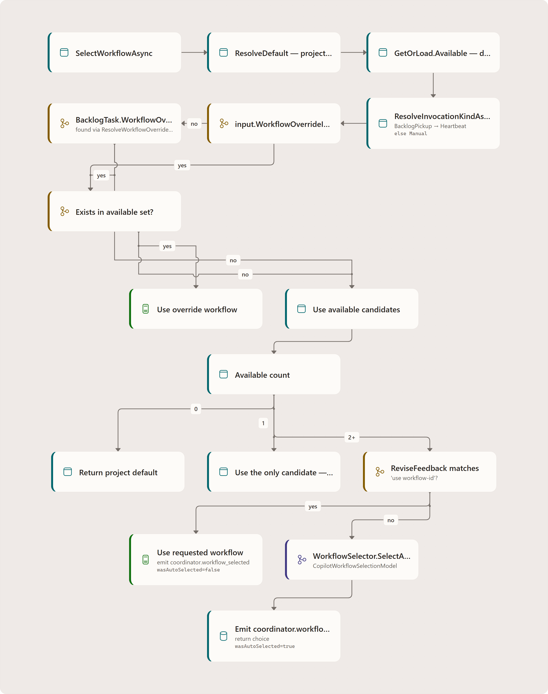

# Coordinator reference

See [Observation, automation, shared review and recoverable orchestration](../diagrams/resilient-assembly-review-fig1.png) for the shared visual model.

See [Roster guard and direct versus defineOutcome launch](../diagrams/canonical-coordinator-journey.png) for the shared visual model.

The Coordinator is a built-in agent (codename Squad) that every team gains automatically. It adds a single new capability on top of the existing single-agent platform: an **orchestration layer**. The coordinator turns a user goal into a confirmed, memory-informed **outcome spec** when outcome-definition mode is selected; Direct plans from the prompt.

The coordinator is itself an observable, streamed, human-accountable run (`agent_name: "Coordinator"`, no parent run). It does not perform domain work itself — it only orchestrates and persists artifacts into the existing memory store.

This page documents the Phase 1 outcome-spec flow, the Phase 2 orchestration capabilities (decomposition, child dispatch, observation, topology events, and steering), and the Phase 3 collective assembly terminal-status surfaces (how a coordinator run reports its orchestration status and a human-readable reason on every terminal path).

## Start contract and team requirement

`POST /api/projects/{id}/orchestrations` starts a coordinator run only after the project has a dispatchable cast team. The HTTP endpoint maps the guard into two explicit client contracts (`apps/Agentweaver.Api/Endpoints/ProjectEndpoints.cs:429`, `:486`):

| Status | Body | Meaning |
| --- | --- | --- |
| `409 Conflict` | `{ "error": "no_team", "message": "This project has no team. Cast a team before starting an orchestration." }` | No active, dispatchable team member exists. |
| `422 Unprocessable Entity` | `{ "error": "invalid_team", "message": "The project team roster could not be read. Fix the team before starting an orchestration." }` | The roster could not be parsed/read. |

The guard reads the same `.squad` team source the dispatcher uses: `EnsureDispatchableTeam` calls `SquadReader.ReadTeam`, requires at least one member that is `Active`, has a non-null role, and passes the built-in-agent deny list (`apps/Agentweaver.Api/Coordinator/CoordinatorRosterGuard.cs:30`, `:37`, `:54`; `apps/Agentweaver.Api/Coordinator/CoordinatorOrchestratorExecutor.cs:687`, `:750`). Platform-owned Scribe, Ralph, RAI, and Build & Test roles do not count as worker capacity.

## What it is (and is not)

The coordinator is orchestration-only. It MUST NOT reimplement any platform capability. The following capabilities stay owned by their existing features; the coordinator reuses them and never duplicates them:

| Capability | Owned by | Coordinator does |
| --- | --- | --- |
| RAI gate | RAI reviewer in the run graph | Reuses it per run; never re-specifies RAI checks |
| Casting / roster / per-role model | Casting service | Selects agent + model per subtask (later phase) |
| Human review / merge | Run graph executors | Reuses them; never runs a parallel review or merge |
| Scribe / session logging | Scribe executor | Reuses it; never re-logs sessions itself |
| Memory and decisions | Memory store | Reads context; persists the outcome spec (and later the work plan); injects active decisions into child workers |

Because of this non-redundancy contract, the coordinator's charter describes only orchestration behavior — read memories and decisions for context, draft and confirm an outcome spec, and then decompose, dispatch, observe, and hand off. It does not re-specify RAI, casting, memory governance, sandboxing, review, merge, or scribe. A deployment-wide BYOK provider is used when active. Otherwise, the coordinator uses GitHub Copilot.

## Launch modes and outcome definition

Coordinator launch has three relevant cases:

| Launch | Behavior |
|---|---|
| `defineOutcome`, Autopilot off | Draft/persist a spec, then wait for confirmation or revision. |
| `defineOutcome`, launch Autopilot on | Draft, then confirm unattended through the normal seam on behalf of the accountable user. |
| `direct` | Persist a confirmed prompt-backed spec and plan directly, without a model-drafted outcome or confirmation RequestPort. |

Confirmation advances into selection, decomposition, dispatch, steering and collective assembly; it is not orchestration completion. Direct mode and Autopilot do not remove workflow review/merge requirements or grant arbitrary tool permissions.

### Outcome spec fields

| Field | Notes |
| --- | --- |
| `goal` | The submitted goal. |
| `desiredOutcome` | The drafted desired outcome. |
| `scope` | Drafted scope. |
| `assumptions` | Drafted assumptions. |
| `clarifyingQuestions` | Optional; omitted when none were drafted. |
| `status` | `drafting`, `awaiting_confirmation`, `confirmed`, or `declined`. |
| `confirmedBy` | Set once confirmed; omitted otherwise. |

## The human confirmation gate

Interactive defineOutcome pauses for the named accountable human. Direct skips that drafted-outcome gate; launch Autopilot confirms unattended on behalf of the accountable user. UI and MCP expose the same confirmation/revision seam.

- **Web UI** — the coordinator run page renders the outcome-spec panel with Confirm and Request-changes actions and an explicit "no work is dispatched until you confirm" notice. See the [Web UI reference](./web.md#coordinator-run-and-outcome-spec-gate).
- **MCP server** — the `coordinator_*` tools start, read, confirm, and revise the spec; `run_watch` on the coordinator run id streams the live drafting. See the [MCP server reference](./mcp.md#coordinator).

Both clients are thin: all orchestration logic lives in the API's coordinator service, and clients hold no spec logic.

Web client edge states are intentionally visible. Before the coordinator has persisted the draft, `GET /api/runs/{id}/outcome-spec` may return a transient `404`; `OutcomeSpecPanel` keeps rendering a **Drafting** state and polls every 2 seconds until the draft arrives, unless the run reaches a terminal failure first (`apps/web/src/components/OutcomeSpecPanel.tsx:160`, `:233`, `:328`, `:401`). Confirm is guarded with an in-flight ref plus disabled actions and a **Confirming...** label; it retries only the short `409 no_pending_gate` gate-arming race and otherwise surfaces 409/non-active errors after refreshing the spec (`OutcomeSpecPanel.tsx:237`, `:338`, `:345`, `:360`, `:578`).

## Phase 2 orchestration

Coordinator launch has three relevant cases:

| Launch | Behavior |
|---|---|
| `defineOutcome`, Autopilot off | Draft/persist a spec, then wait for confirmation or revision. |
| `defineOutcome`, launch Autopilot on | Draft, then confirm unattended through the normal seam on behalf of the accountable user. |
| `direct` | Persist a confirmed prompt-backed spec and plan directly, without a model-drafted outcome or confirmation RequestPort. |

Confirmation advances into selection, decomposition, dispatch, steering and collective assembly; it is not orchestration completion. Direct mode and Autopilot do not remove workflow review/merge requirements or grant arbitrary tool permissions.

### Workflow selection

Workflow selection is trigger-agnostic. Resolve the project default as outer exception fallback, then load all valid workflows, ordered with that default first and then by ID. Honor a resolvable explicit request override, otherwise the backlog override; an unavailable explicit ID is logged and selection continues. Honor conversational `use <workflow-id>` feedback against the complete available set.

Zero/one candidate avoids model selection. With multiple candidates, use process-fit selection and persist/emit its rationale. After decomposition, validate compatibility: explicitly selected code-producing workflows without Build & Test are honored with a warning; automatic selections are reselected or replaced by a suitable platform fallback.

The model gets one attempt and one retry. Unusable/ambiguous output falls back to an available default/standard, then a non-code-review candidate, then the first candidate. An outer exception retains the resolved project default.

Automation uses Schedule and Event triggers, not Manual/Heartbeat eligibility. `triggers` is an ordered array; `trigger` is its first-entry compatibility alias. Automation admits backlog work independently of process selection.

<!-- Canonical editable source: ../diagrams/src/canonical-workflow-selection.drawio; maintained by the shared owner. -->

### Decomposition and the work plan

After confirmation, the coordinator decomposes the spec into a **work plan**: a set of subtasks plus the dependency edges between them. Each subtask carries an assigned roster agent (selected for role fit), a selected model (within the GitHub Copilot provider), a `phase`, an `isolation`, and a status. The plan is persisted to the memory store and emitted as `coordinator.work_plan`. Subagents read the confirmed spec and plan from the memory store; the coordinator does not introduce a parallel store. Read it over HTTP with `GET /api/runs/{id}/work-plan` or over MCP with `coordinator_work_plan_get`.

**Model selection precedence (per subtask).** A non-empty **run model pin** — the run's explicit `modelId` on `POST /api/projects/{id}/orchestrations`, or (when no explicit id is passed) the project's GitHub Copilot default — is selected for **every** subtask regardless of complexity; otherwise the subtask uses its assigned role's default model, then a catalog role default, then the configured Copilot default. The configured Copilot default is `CoordinatorModelDefaults.DefaultCopilotModel = "claude-sonnet-4.6"` (`apps/Agentweaver.Api/Coordinator/CoordinatorModelDefaults.cs`), overridable via the `Providers:GitHubCopilot:Model` config key. The stale hardcoded `gpt-4o` last-resort fallback was removed; the constant is the single source of truth for the last-resort default. The same precedence is preserved when a reviewer rejection rotates a subtask to a different eligible author (the pin wins over the rotated author's role default).

::: warning Behavior change
A non-empty run model pin now pins **all** subtasks (previously only high-complexity subtasks adopted the run's explicit model). Two consequences follow: (a) a well-formed but nonexistent pinned model id now affects **every** subtask (not just high-complexity ones); and (b) setting a project GitHub Copilot default disables per-role model differentiation for that project's runs — leave both the explicit `modelId` and the project default unset if you want subtasks to use their individual role-default models.
:::

#### Run model pin: UI behaviour

In **Project Settings → Default run model**, the field is free-text. Leaving it **empty** means "Auto (coordinator picks)" — the coordinator selects a model per task using per-role defaults; subtasks may use different models. Entering a model id pins every subtask in every run for this project to that single model.

#### Model catalog (current)

Model ids are free-text passthrough to the GitHub Copilot CLI. They are validated only by a permissive prefix regex (`^(gpt|claude|o)...`) — there is no hardcoded allowlist, so new models become available as GitHub Copilot publishes them without a server update. The currently documented catalog:

| Family | Model ids |
|---|---|
| OpenAI GPT | `gpt-5.6-sol`, `gpt-5.6-terra`, `gpt-5.6-luna`, `gpt-5.5`, `gpt-5.4`, `gpt-5.3-codex`, `gpt-5.4-mini`, `gpt-5-mini` |
| Claude | `claude-opus-4.8`, `claude-opus-4.7`, `claude-opus-4.6`, `claude-sonnet-5`, `claude-sonnet-4.6`, `claude-sonnet-4.5`, `claude-haiku-4.5` |

A well-formed but unavailable id at runtime causes a classified provider error (`AgentProviderException`, kind `UnavailableModel`). The coordinator's last-resort default is `claude-sonnet-4.6`.

The `WorkPlan` row also carries **`CoordinatorPodId`**, the distributed lease owner for
`dispatching`. When a pod starts or re-arms dispatch, it atomically stamps this field and refreshes
`UpdatedAt`; other replicas skip the plan while that claim is fresh and only try to steal it after
`Coordinator:PodLeaseStaleTtlSeconds` (default **120 s**). While a pod owns a dispatch loop it renews
the lease every `Coordinator:PodLeaseHeartbeatSeconds` (default **30 s**) from an independent timer, so
a long child turn cannot let the lease age into staleness and let a peer start a second loop. This
prevents multiple replicas from re-arming the same dispatch loop at once. See
[coordinator internals](../deep-dive/coordinator-internals.md) for the heartbeat, fencing, and the
per-project integration-branch build lock.

When no catalog/roster role adequately covers a subtask's function, the decomposition MAY mint a **bespoke role**: a descriptive id plus a short **inline charter** (2–4 sentences defining the agent's persona, expertise, and approach). Bespoke roles are a last resort — the decomposition prompt prefers exact catalog/roster ids and only sets a subtask's `charter` field when the role is bespoke. A subtask's inline charter is persisted on the subtask and flows to the dispatched child run's `AgentCharter`, overriding file-based charter resolution so the coordinator can stand up a domain-specific persona without a catalog role.

The `isolation` field (`worktree` | `shared`) is retained as an advisory planning
hint; it does not select the runtime topology. Every child run executes in its
own AgentHost sandbox on a pod-local checkout of that child run's branch. The
platform publishes captured changes to `agentweaver/{childRunId}` and merges
them into the coordinator integration branch. Dependent children start from
that integration branch, so they see completed prerequisite changes without
sharing a writable directory or running git commands. File-scope declarations
still let planning and assembly detect likely collisions before branch merge.

### Child dispatch: parallel and serial

The coordinator dispatches subtasks as first-class **child runs** parented by the coordinator run, reusing the existing single-agent run machinery (sandboxing and step streaming) rather than new run primitives. Dispatch is dependency-ordered:

- Subtasks with no unmet dependencies dispatch together and run **in parallel**.
- A subtask with a dependency does not start until every prerequisite reaches `assemble_ready`/`completed`, so dependent work runs **serially** behind it.
- A failed, blocked, or RAI-flagged predecessor does not satisfy a dependency, so its dependents stay blocked.

Child workers receive charters plus active, approved architectural/scope decisions from `CompileDecisionsAsync`. Stored context is emitted as an `agentweaver.untrusted-context.v1` JSON envelope under `## Untrusted Project Context Data`, never trusted instructions. This path excludes the full memory/session stack.

A subtask's status advances `pending -> dispatched -> running -> {assemble_ready | rai_flagged | completed | failed}`, surfaced as `subtask.*` events. The dispatcher can also mark a pending dependent `blocked` when an upstream prerequisite stalls and therefore never satisfies its dependency. The dispatched child runs (paired with subtask status) are available from `GET /api/runs/{id}/children` or the `coordinator_children_get` MCP tool.

#### Subtask status enum

The persisted subtask status values are:

| Status | Meaning | Satisfies dependencies? | Terminal? |
| --- | --- | --- | --- |
| `pending` | Planned and waiting for its dependencies and conflict checks. | No | No |
| `dispatched` | Child run was created and handed off. | No | No |
| `running` | Child run is actively executing. | No | No |
| `pending_capacity` | **Legacy / historical.** Kubernetes now owns pod admission and scheduling, so new runs never enter this status (issue #217). A pre-upgrade subtask stranded here is recovered to `pending` and re-attempted. | No | No |
| `assemble_ready` | Child finished with mergeable changes ready for collective assembly. | Yes | Yes |
| `completed` | Child finished with no further mergeable changes required. | Yes | Yes |
| `rai_flagged` | Child hit a responsible-AI block. | No | Yes |
| `failed` | Child ran but ended unsuccessfully. | No | Yes |
| `blocked` | The subtask never ran because an upstream dependency stalled, so the coordinator terminalized it as ineligible. | No | Yes |

A stall is **not** immediately terminal. When a child stalls, the coordinator redispatches the subtask on a fresh child/pod up to `CoordinatorSteeringService.MaxRecoveryAttempts` (**3**) times — emitting `coordinator.subtask_redispatched` and incrementing the monotonic `RecoveryAttempts` each time — before the stall becomes a terminal `failed` and its dependents cascade to `blocked` (`apps/Agentweaver.Api/Coordinator/CoordinatorDispatchService.cs:399`, `:1235`). See the coordinator deep-dive [stall redispatch before dead-end](/deep-dive/coordinator-internals#stall-redispatch-before-dead-end).

### Observation and topology events

The coordinator observes each child through its read-only run timeline and projects two views onto its own run stream:

- `subtask.*` events — the granular per-subtask lifecycle (`subtaskId`, `childRunId`, `assignedAgent`, `selectedModelId`, `status`).
- `coordinator.topology` events — the orchestration graph. A `version: 1` snapshot (`seq: 0`) carries every node (one coordinator node plus one per subtask) and the dependency edges; deltas (`seq > 0`) carry only the changed node(s). Edge direction is always dependency to dependent, and edges never change after the snapshot.

  Each node carries an `executionPodName` field:
  - **Coordinator node** — the Kubernetes pod name of the API process, or `null` outside Kubernetes.
  - **Subtask node** — the pod name of the child run's bound AgentHost pod (from `IPodNameRegistry` keyed by `childRunId`), or `null` when the subtask has not been dispatched or the pod has not been bound yet.

  A `null` `executionPodName` means no execution pod is assigned to that node. The UI shows a pod chip only when the value is non-null; it does not fall back to the API pod name for child or intermediate nodes.

Because these events ride the coordinator run's ordinary event stream, the live graph is fully reconstructable from a single stream. Over MCP, point `run_watch` at the coordinator run id; there is no separate streaming tool. `orchestration_topology` (or the work-plan plus children endpoints) gives a one-shot snapshot when a point-in-time view is enough.

### Steering verbs

A user steers the coordinator while subagents run or while the coordinator is parked at collective human review. `GET /api/runs/{id}` exposes `coordinator_steerable: true` for coordinator runs in `in_progress` or `awaiting_review`, and the web client uses that field to keep the coordinator message composer enabled during review (`apps/Agentweaver.Api/Contracts/Dtos.cs:178`, `apps/Agentweaver.Api/Coordinator/CoordinatorSteeringService.cs:348`, `apps/web/src/api/types.ts:81`). The coordinator relays direction to targeted child run(s) via `POST /api/runs/{id}/steer` or the `coordinator_steer` MCP tool. The verbs carry the following semantics:

| Verb | Effect | Timing |
| --- | --- | --- |
| `send` | Delivers an informational message or note to the coordinator without changing the chosen direction. | Queued and delivered at the next safe boundary; if collective assembly is blocked, it wakes the coordinator and retries assembly with the new context. |
| `stop` | Cancels the targeted child run's in-flight turn. | Immediate. |
| `redirect` | Relays new direction the subagent applies as a revised task turn. | At the subagent's next turn boundary; no restart. |
| `amend` | Relays an adjustment the subagent folds into its next turn. | At the subagent's next turn boundary; no restart. |

An in-flight agent turn cannot be interrupted mid-turn under the run model, so only `stop` reaches a subagent during a turn. `send`, `redirect`, and `amend` are queued and applied when the child's current turn completes (or when it next suspends at a gate), without restarting the run. The queue is DB-backed and replica-safe: a queued directive transitions `queued -> relayed` under a compare-and-swap so a mid-run message is delivered exactly once even across API replicas. `stop` bypasses the queue entirely — it is the only hard interrupt. Omitting the target broadcasts to every active child. Directives progress through `coordinator.steering` events (`pending -> queued -> relayed -> applied`, plus `deferred` at the review gate).

**At the assembly human-review gate (#226).** When the coordinator is parked at collective review (`awaiting_review`, `coordinator_steerable: true`), a `redirect`/`amend`/`send` is delivered to the parked assembly loop rather than the child-turn queue (previously it was accepted as `queued` and then silently dropped). `redirect`/`amend` are translated into a request-changes review decision — the same path as `POST /assembly/review {request_changes}` — re-dispatching the implicated subtasks (`#223` scoping) with an unconditional steering-budget reset and settling `relayed`; `send` posts an advisory note without changing the gate and settles `applied`. By default the change re-engages all contributors; set `targetChildRunId` to narrow to that subtask and its co-touching subtasks. If the gate is armed on another replica the decision is durably deferred for the owner's poller, the directive settles `deferred`, and `POST /steer` returns `202 Accepted` instead of `201 Created`. See [resilient assembly review](./resilient-assembly-review.md#operator-steering-at-the-review-gate-226).

**Pause is not supported.** No hold-before-next-turn primitive exists in the run model; the steering surface is `send`, `stop`, `redirect`, and `amend` only. Pause is deferred to a later phase.

### Asking the human: ask_question

Agents do not silently guess when they hit a material decision or an action that needs permission. They call the `ask_question(question)` tool, which suspends the agent and bubbles the question to a human (see [events.md](events.md#ask-question-bubbling) for the event/endpoint mechanics).

- **During decomposition**, the coordinator itself calls `ask_question` to clarify ambiguous scope or plan details with the user before finalizing the work plan, then proceeds once it has the answer.
- **For running children**, the coordinator's child watcher re-projects each child's `agent.question_asked` onto the coordinator stream as `coordinator.child_question`, and each child's `tool.approval_required` as `coordinator.child_approval_required`, attributing both to the originating `childRunId` and `subtaskId`. The accountable human answers the question against the child run (`POST /api/runs/{childRunId}/questions/{requestId}/answer`) and grants/denies the gated action via the child run's tool-approval endpoints. Re-projection runs alongside the terminal-event mapping and does not change it.

### Per-run options: Autopilot and auto-approve-tools

Two per-run boolean options, both default OFF, can be set at launch (`autopilot` and `auto_approve_tools` on `POST /api/projects/{id}/orchestrations`, `run_task`, or `coordinator_start`) and toggled live (`POST /api/runs/{id}/autopilot` and `POST /api/runs/{id}/auto-approve`, body `{ "enabled": bool }`). The immutable launch policy is persisted and audited as `run.approval_policy_selected`; runtime values cascade to every child at dispatch. Retries reuse the launch policy even after runtime cleanup. Heartbeat runs initialize the same type from `pickup_autopilot` and `pickup_auto_approve_tools`, but those project settings are not consulted for direct starts or re-read for retries. Each heartbeat claim reads the current persisted settings and writes them to the reserved run inside the same database transaction. A stale project object, another API replica, or an update between two claims therefore cannot silently substitute defaults: each won claim keeps the exact true/false pair and project-row update timestamp it observed.

- **Autopilot** does two things, both of which are on or off together:
  1. **Auto-answers clarifying questions.** A `coordinator.child_question` (or a question asked directly on the coordinator run) is answered by the coordinator model from the outcome spec + subtask context, and the answer is resolved on the question gate (`IQuestionGate.Answer(childRunId, requestId, answer)`). Each auto-answer is logged as `coordinator.autopilot_answered { runId, childRunId?, requestId, question, answer }`, and the normal `agent.question_answered` resolution still surfaces on the child stream, so the timeline shows every auto-answer.
  2. **Auto-confirms the outcome spec.** When a run starts with autopilot=true in `defineOutcome` mode, `StartCoordinatorRunAsync` schedules a bounded `ScheduleUnattendedConfirm` loop that waits for the spec to reach `awaiting_confirmation` and then confirms it unattended, with no human gate. For an **interactive** `POST /api/projects/{id}/orchestrations` launch the confirmation is attributed to the submitting user (`confirmedBy` = the authenticated caller); for a **backlog pickup** run it is attributed to the accountable human captured on the backlog item. When autopilot=false, the run pauses at `awaiting_confirmation` and a human must confirm (or revise) via the UI before any work begins. `direct`-mode runs have no confirmation gate at all, so autopilot schedules no confirm loop for them.

  Autopilot NEVER auto-grants tool approvals or permissions; those still go to the human. The `PickupAutopilot` project flag defaults to `true`, so existing projects retain the prior auto-confirm behavior unless the setting is turned off.
- **auto-approve-tools** auto-grants only repository-defined safe tools (currently `web_fetch` and preview publication through `start_preview`) at the human-in-the-loop gate. `start_preview` emits `tool.auto_approved` with the immutable policy snapshot ID plus sanitized target/port metadata and creates no approval card, notification, or waiter. It still performs port, process-liveness, sandbox ownership, and publication validation normally. The flag never covers arbitrary shell execution, destructive or privileged actions, secret-bearing operations, or unrelated network tools. Existing scoped approval policy can still permit a separately eligible action through its normal gate; the per-run flag does not broaden that policy.

## Phase 3 collective assembly and terminal status

After every child subtask finishes, the coordinator runs ONE collective assembly: it builds a single integration branch (all eligible child branches merged in dependency order off the originating branch), then runs the selected workflow's assembly gates in happy-path traversal order. For software workflows that path places RAI before Build & Test and human review. The RAI reviewer returns a machine-readable `VERDICT: <GREEN|YELLOW|REVISE|RED>` sentinel as the last line of its response — only that line is parsed as the decision (prose is never scanned), and an unparseable verdict fails safe to a blocking `RED` after exactly one bounded re-ask (reason `unparseable_after_reask`), so a benign review can no longer be false-escalated by a legend echo (`apps/Agentweaver.Api/Coordinator/CollectiveAssemblyPipeline.cs:88`, `packages/Agentweaver.AgentRuntime/Workflow/RaiTurnExecutor.cs:183`). When the integration has changes, the RAI and Rubberduck reviewers read the actual assembled files through one shared detached worktree checked out at the integration tip (reusing the Build/Test worktree name), not just the aggregate diff text (`apps/Agentweaver.Api/Coordinator/CoordinatorAssemblyService.cs:785`, `apps/Agentweaver.Api/Coordinator/CollectiveAssemblyPipeline.cs:298`). Build & Test is an automated platform gate over a detached integration-branch worktree; in `Sandbox:AgentExecutionMode=pod-per-run`, it binds a dedicated AgentHost sandbox pod to the coordinator run id and configures that pod to use the detached worktree as its working directory before running the turn (`apps/Agentweaver.Api/Coordinator/CollectiveAssemblyPipeline.cs:155`, `apps/Agentweaver.Api/Sandbox/KubernetesSandboxExecutor.cs:300`). After Build & Test returns approved or request-changes, the deterministic `PreviewStep` starts the app, observes the actual port, and emits `sandbox.preview_ready`, `sandbox.preview_failed`, or `sandbox.preview_skipped_not_applicable`; preview failure never changes the verdict or blocks human review (`apps/Agentweaver.Api/Coordinator/Preview/PreviewStep.cs:70`, `apps/Agentweaver.Api/Coordinator/CoordinatorAssemblyService.cs:753`). Human review is the only gate that accepts `POST /api/runs/{coordinatorRunId}/assembly/review`. On approve it merges, runs the collective scribe, and completes. Request-changes feedback from human review, RAI, Rubberduck, Build & Test, agents, the coordinator, or a workflow step now flows through unified steering: `coordinator.steering_received` records the source and `coordinator.steering_decision` records whether the coordinator chose in-place steering, fresh dispatch, proceed/terminal, or advisory no-op before any effect executes (`apps/Agentweaver.Api/Coordinator/CoordinatorAssemblyService.cs:1680`, `apps/Agentweaver.Api/Coordinator/CoordinatorSteeringDecider.cs:201`). The separate Assembly Gate route was removed in favor of this coordinator-owned steering path. Sandbox infrastructure failures are classified separately as `build_test_infra_*`: retryable cases park as `assembly_blocked`, and non-retryable configuration errors fail assembly. Their event payloads include `detail`, `exceptionMessage`, `innerExceptionMessage`, `innerExceptionType`, and `infrastructureReason`, so `/api/runs/{id}/events` shows the underlying AgentHost launch or transport failure instead of only the generic reason (`apps/Agentweaver.Api/Coordinator/CoordinatorAssemblyService.cs:1590`, `:1604`). The review POST is replica-safe: a non-owner API replica can persist a deferred decision while the work plan is durably `in_review`, and the owner pipeline consumes it at most once. See [Decoupled live-preview provisioning](./live-preview-provisioning.md), [Unified steering](./unified-steering.md), and the [events reference](./events.md).

When assembly stops with `coordinator.assembly_blocked`, the payload always includes `workPlanId` and `reason`. For the `ineligible_subtasks` path it also includes:

- `ineligibleSubtaskIds` — the blocking subtask ids, preserved as the stable compact list for clients.
- `ineligibleSubtasks` — enriched rows with `id`, `title`, `status`, `agent`, and `recoveryGuidance` so the UI can explain which subtasks blocked collective assembly and why.

This is the no-partial-assembly gate: if any subtask is still ineligible, including `blocked`, the coordinator stops before collective review or merge.

For retryable Build & Test infrastructure blocks, `coordinator.assembly_blocked` is a recoverable stream event,
not a terminal stream event. Subscribers remain attached so they can see the subsequent re-arm/recovery path.
`coordinator.assembly_failed` is terminal, but the durable stream drains all persisted replay rows before
ending the SSE subscription, so diagnostics emitted around terminalization are still visible
(`apps/Agentweaver.Api/Infrastructure/SqliteRunEventStream.cs:153`, `apps/Agentweaver.Api/Infrastructure/EfRunEventStream.cs:111`).

A coordinator run stays `in_progress` for the whole dispatch-plus-assembly window (its stream stays open), so the bare `RunStatus` is not enough for a UI to describe where the orchestration is. Two surfaces fix this:

- **`coordinator_status`** — the current `WorkPlan.Status` (`dispatching`, `awaiting_assembly`, `assembling`, `in_review`, `complete`, `assembly_blocked`, `assembly_failed`, `assembly_declined`) is added to each coordinator run on `GET /api/projects/{id}/runs` and `GET /api/runs/{id}`. It is `null` for normal runs. The UI renders this (for example "Awaiting assembly", "In review") instead of the bare `status`.
- **`coordinator_steerable`** — `true` on `GET /api/runs/{id}` for coordinator runs whose parent run status can still accept operator messages: `in_progress` and `awaiting_review`. This keeps steering and free-form coordinator messaging available while the assembly human-review gate is open.
- **Terminal status with a reason** — every terminal assembly path moves the coordinator run to a terminal `RunStatus` AND records a human-readable `result` (the reason): `assembly_blocked: <reason>` (Failed), `assembly_merge_failed: <reason>` (MergeFailed), `assembly_declined` (Declined), `assembly_error: <message>` (Failed, unexpected fault in the assembly background task), or `assembly_complete` (Completed). The work plan moves to a matching terminal `WorkPlanStatus` so the topology coordinator node reflects it. The same `result` is exposed as `statusReason` on `GET /api/runs/{coordinatorRunId}/work-plan`. A user is never left with a bare "Failed" and no next action.

## Surviving a process restart

A coordinator run stays `InProgress` across the dispatch-plus-assembly window, which is driven by in-memory background loops (D3 — service-driven, not a MAF graph). The orchestration nevertheless survives a process restart on any replica, because all of its state is persisted in the relational store (`WorkPlan.Status` / `AssemblyStage` / `IntegrationBranch`, `Subtask` rows, and child `Run` rows) — the loops are just drivers that can be reconstructed from that projection.

On startup, after the generic restart sweep has failed any stranded child runs, `CoordinatorRunService.RecoverInterruptedRunsAsync` reconstructs each interrupted coordinator run by routing on its persisted work-plan status:

| Work-plan status | Recovery action |
| --- | --- |
| _(no work plan)_ | Resume the checkpointed MAF spec workflow from its checkpoint so the user can still confirm/revise. |
| `planned`, `dispatching` | Reset in-flight subtasks (`dispatched`/`running`) back to `pending` and re-arm the dispatch engine — re-launching fresh child runs for them. Terminal subtasks (`assemble_ready`/`completed`/`failed`/`rai_flagged`) and their child branches are preserved. |
| `awaiting_assembly` | Re-arm the collective-assembly engine; the DB CAS (`TryStartAssemblyAsync`) claims it exactly once. |
| `assembling`, `in_review` | Reset the plan to `awaiting_assembly` and re-run the (idempotent) assembly core — it rebuilds the integration branch and re-arms the human-review gate. Review decisions submitted to a different replica during the review window are held as deferred decisions and consumed by the owner pipeline after the gate is armed. |
| `complete` / `assembly_*` | Settle the run row to its matching terminal `RunStatus` (a crash between the plan write and the run finalize). |

The recreated run emits [`coordinator.recovered`](./events.md#coordinator-recovered) and the re-armed engine re-emits its topology / assembly snapshots, so the live view renders immediately on reconnect. Every engine entry point is idempotent (in-memory guard + DB CAS), so re-arming is safe.

## Related references

- [Workflow selection — Deep Dive](/deep-dive/workflow-selection) — concept, end-to-end algorithm, and shared workflow-selection diagram for the full selection + override hierarchy
- [API reference — Coordinator endpoints](./api.md#coordinator-endpoints)
- [API reference — The orchestration lifecycle](./api.md#the-orchestration-lifecycle)
- [Events reference — `coordinator.*` and `subtask.*` events](./events.md)
- [MCP server reference — Coordinator tools](./mcp.md#coordinator)
- [Web UI reference — Coordinator orchestration and topology view](./web.md#coordinator-orchestration-and-unified-graph-view)
- [Web UI reference — Coordinator run and outcome-spec gate](./web.md#coordinator-run-and-outcome-spec-gate)
- [Project generation model settings](./project-generation-model-settings.md)

## Launch versus heartbeat-pickup defaults

Omitted API/MCP launch options default to false. Persisted project pickup defaults are separate: `pickup_autopilot=true`, `pickup_auto_approve_tools=true`, `max_ready_per_heartbeat=3`. Each claim snapshots the current values. The Coordinator heartbeat defaults enabled at 10 seconds, independently of approval/provisioning wait heartbeats.

<!-- diagram-context:canonical-coordinator-journey:start -->

Diagram details and constraints

<table><thead><tr><th>Element</th><th>Contract</th></tr></thead><tbody>
<tr><td>title</td><td>One goal, one collective review</td></tr>
<tr><td>subtitle</td><td>Confirm intent, dispatch bounded work, then integrate and review the whole result.</td></tr>
<tr><td>group-title0</td><td>Plan and execute</td></tr>
<tr><td>group-title1</td><td>Integrate, review, finish</td></tr>
<tr><td>Confirm intent</td><td>Confirm intent</td></tr>
<tr><td>Confirm intent</td><td>Draft the OutcomeSpec</td></tr>
<tr><td>Confirm intent</td><td>human confirmation</td></tr>
<tr><td>Plan the work</td><td>Plan the work</td></tr>
<tr><td>Plan the work</td><td>Persist a WorkPlan DAG</td></tr>
<tr><td>Plan the work</td><td>subtasks + dependencies</td></tr>
<tr><td>Dispatch children</td><td>Dispatch children</td></tr>
<tr><td>Dispatch children</td><td>Run the eligible frontier</td></tr>
<tr><td>Dispatch children</td><td>per-child worktrees</td></tr>
<tr><td>Merge + Scribe</td><td>Merge + Scribe</td></tr>
<tr><td>Merge + Scribe</td><td>Approved integration path</td></tr>
<tr><td>Merge + Scribe</td><td>MergeWorktree → Scribe</td></tr>
<tr><td>Collective review</td><td>Collective review</td></tr>
<tr><td>Collective review</td><td>One human decision</td></tr>
<tr><td>Collective review</td><td>approve / revise / decline</td></tr>
<tr><td>Integrate + gates</td><td>Integrate + gates</td></tr>
<tr><td>Integrate + gates</td><td>Assemble child branches</td></tr>
<tr><td>Integrate + gates</td><td>configured checks / review</td></tr>
<tr><td>e1</td><td>confirm</td></tr>
<tr><td>e2</td><td>dispatch</td></tr>
<tr><td>e3</td><td>settled work</td></tr>
<tr><td>e4</td><td>request review</td></tr>
<tr><td>e5</td><td>approve</td></tr>
<tr><td>assurance-title</td><td>DO NOT CONFUSE ASSEMBLY WITH PUBLICATION</td></tr>
<tr><td>assurance-line1</td><td>The collective workflow reaches MergeWorktree and Scribe; this graphic does not promise PR creation.</td></tr>
<tr><td>assurance-line2</td><td>A blocked assembly can be recovered. Review approval does not itself mark the run complete.</td></tr>
<tr><td>Confirm intent</td><td>Input</td></tr>
<tr><td>Confirm intent</td><td>Human goal</td></tr>
<tr><td>Confirm intent</td><td>Artifact</td></tr>
<tr><td>Confirm intent</td><td>OutcomeSpec</td></tr>
<tr><td>Confirm intent</td><td>Gate</td></tr>
<tr><td>Confirm intent</td><td>Confirm or revise</td></tr>
<tr><td>Confirm intent</td><td>Scope</td></tr>
<tr><td>Confirm intent</td><td>Explicit assumptions</td></tr>
<tr><td>Plan the work</td><td>Select</td></tr>
<tr><td>Plan the work</td><td>Workflow choice</td></tr>
<tr><td>Plan the work</td><td>WorkPlan DAG</td></tr>
<tr><td>Plan the work</td><td>Owners</td></tr>
<tr><td>Plan the work</td><td>Named subtasks</td></tr>
<tr><td>Plan the work</td><td>Store</td></tr>
<tr><td>Plan the work</td><td>Persist dependencies</td></tr>
<tr><td>Dispatch children</td><td>Ready</td></tr>
<tr><td>Dispatch children</td><td>Satisfied dependencies</td></tr>
<tr><td>Dispatch children</td><td>Files</td></tr>
<tr><td>Dispatch children</td><td>Child-owned worktree</td></tr>
<tr><td>Dispatch children</td><td>Observe</td></tr>
<tr><td>Dispatch children</td><td>Child status / results</td></tr>
<tr><td>Dispatch children</td><td>Failure</td></tr>
<tr><td>Dispatch children</td><td>Blocks dependents</td></tr>
<tr><td>Merge + Scribe</td><td>Merge</td></tr>
<tr><td>Merge + Scribe</td><td>Reviewed integration</td></tr>
<tr><td>Merge + Scribe</td><td>Then</td></tr>
<tr><td>Merge + Scribe</td><td>Collective Scribe</td></tr>
<tr><td>Merge + Scribe</td><td>Record</td></tr>
<tr><td>Merge + Scribe</td><td>Promote decisions</td></tr>
<tr><td>Merge + Scribe</td><td>Decline</td></tr>
<tr><td>Merge + Scribe</td><td>Skips Scribe</td></tr>
<tr><td>Collective review</td><td>Approve</td></tr>
<tr><td>Collective review</td><td>Proceed to merge</td></tr>
<tr><td>Collective review</td><td>Revise</td></tr>
<tr><td>Collective review</td><td>Steer / redispatch</td></tr>
<tr><td>Collective review</td><td>No Scribe path</td></tr>
<tr><td>Collective review</td><td>Blocked</td></tr>
<tr><td>Collective review</td><td>Recoverable state</td></tr>
<tr><td>Integrate + gates</td><td>Child branches</td></tr>
<tr><td>Integrate + gates</td><td>Target</td></tr>
<tr><td>Integrate + gates</td><td>Integration branch</td></tr>
<tr><td>Integrate + gates</td><td>Gates</td></tr>
<tr><td>Integrate + gates</td><td>Selected checks</td></tr>
<tr><td>Integrate + gates</td><td>Output</td></tr>
<tr><td>intent</td><td>Scope and assumptions are explicit; Revision reopens the intent gate</td></tr>
<tr><td>plan</td><td>Outcome-complete decomposition; Bounded work with named owners</td></tr>
<tr><td>dispatch</td><td>Observe child status and results; Failure / RAI blocks dependents</td></tr>
<tr><td>finish</td><td>Decline skips Scribe; No automatic PR claim here</td></tr>
<tr><td>review</td><td>Changes can redispatch work; Blocked is recoverable, not terminal</td></tr>
<tr><td>integrate</td><td>Collective—not per-child delivery; Merge failure may still run Scribe</td></tr>
<tr><td>notes</td><td>DO NOT CONFUSE ASSEMBLY WITH PUBLICATION; The collective workflow reaches MergeWorktree and Scribe; this graphic does not promise PR creation.; A blocked assembly can be recovered. Review approval does not itself mark the run complete.</td></tr>
<tr><td>groups</td><td>Plan and execute; Integrate, review, finish</td></tr>
</tbody></table>

<!-- diagram-context:canonical-coordinator-journey:end -->

<!-- diagram-context:canonical-workflow-selection:start -->

Diagram details and constraints

<table><thead><tr><th>Element</th><th>Contract</th></tr></thead><tbody>
<tr><td>title</td><td>Workflow selection</td></tr>
<tr><td>subtitle</td><td>Trigger-agnostic • explicit choices precede singleton</td></tr>
<tr><td>returns-heading</td><td>SOURCE / RETURN</td></tr>
<tr><td>outcomes-heading</td><td>OUTCOMES</td></tr>
<tr><td>footer</td><td>Post-decomposition Build &amp; Test compatibility is a separate check (executor:407–494).</td></tr>
<tr><td>Load candidates</td><td>Load candidates</td></tr>
<tr><td>Load candidates</td><td>Project default ordered first</td></tr>
<tr><td>Load candidates</td><td>registry.Available</td></tr>
<tr><td>Explicit override?</td><td>Explicit override?</td></tr>
<tr><td>Explicit override?</td><td>Dialog value, else backlog pin</td></tr>
<tr><td>Explicit override?</td><td>must be available</td></tr>
<tr><td>Conversational choice?</td><td>Conversational choice?</td></tr>
<tr><td>Conversational choice?</td><td>Revision feedback: use {id}</td></tr>
<tr><td>Candidate count</td><td>Candidate count</td></tr>
<tr><td>Candidate count</td><td>Only automatic selection</td></tr>
<tr><td>Candidate count</td><td>0 / 1 / multiple</td></tr>
<tr><td>Ask selection model</td><td>Ask selection model</td></tr>
<tr><td>Ask selection model</td><td>Goal + roles + process fit</td></tr>
<tr><td>Ask selection model</td><td>maximum 2 attempts</td></tr>
<tr><td>Usable candidate?</td><td>Usable candidate?</td></tr>
<tr><td>Usable candidate?</td><td>Parse / normalize / prose match</td></tr>
<tr><td>Usable candidate?</td><td>reject unknown choices</td></tr>
<tr><td>Selected workflow</td><td>Selected workflow</td></tr>
<tr><td>Selected workflow</td><td>Emit selection + rationale</td></tr>
<tr><td>Selected workflow</td><td>workflow_selected</td></tr>
<tr><td>Explicit choice</td><td>Explicit choice</td></tr>
<tr><td>Explicit choice</td><td>Emit selection</td></tr>
<tr><td>Explicit choice</td><td>not auto-selected</td></tr>
<tr><td>Silent choice</td><td>Silent choice</td></tr>
<tr><td>Silent choice</td><td>One: candidate</td></tr>
<tr><td>Silent choice</td><td>Zero: project default</td></tr>
<tr><td>Model fallback</td><td>Model fallback</td></tr>
<tr><td>Model fallback</td><td>default / standard then non-code-review</td></tr>
<tr><td>Model fallback</td><td>else first candidate</td></tr>
<tr><td>Outer fallback</td><td>Outer fallback</td></tr>
<tr><td>Outer fallback</td><td>Project default</td></tr>
<tr><td>Outer fallback</td><td>when catch permits</td></tr>
<tr><td>edge-02-label</td><td>available</td></tr>
<tr><td>edge-03-label</td><td>absent / invalid</td></tr>
<tr><td>edge-06-label</td><td>0 or 1</td></tr>
<tr><td>edge-07-label</td><td>2+</td></tr>
<tr><td>edge-08-label</td><td>response</td></tr>
<tr><td>edge-09-label</td><td>exception</td></tr>
<tr><td>edge-10-label</td><td>accepted</td></tr>
<tr><td>edge-11-label</td><td>retry once</td></tr>
<tr><td>edge-12-label</td><td>2 unusable</td></tr>
<tr><td>edge-13-label</td><td>emit choice</td></tr>
<tr><td>edge-14-label</td><td>outer catch</td></tr>
<tr><td>fallback</td><td>default / standard</td></tr>
</tbody></table>

<!-- diagram-context:canonical-workflow-selection:end -->

<!-- diagram-context:resilient-assembly-review-fig1:start -->

Diagram details and constraints

<table><thead><tr><th>Element</th><th>Contract</th></tr></thead><tbody>
<tr><td>title</td><td>Rejected work keeps useful context</td></tr>
<tr><td>takeaway</td><td>A steering decision chooses the effect; rejection does not always rotate the author.</td></tr>
<tr><td>group-title-0</td><td>FEEDBACK AND SCOPE</td></tr>
<tr><td>group-title-1</td><td>BOUNDED DIRECTION</td></tr>
<tr><td>group-title-2</td><td>AUTHOR CONTINUITY AND HUMAN ESCALATION</td></tr>
<tr><td>Gate request-changes</td><td>Gate request-changes</td></tr>
<tr><td>Gate request-changes</td><td>Structured target-file hints</td></tr>
<tr><td>Gate request-changes</td><td>not prose-inferred blame</td></tr>
<tr><td>Implicated + dependent</td><td>Implicated + dependent</td></tr>
<tr><td>Implicated + dependent</td><td>Rebuild closure without blame</td></tr>
<tr><td>Implicated + dependent</td><td>structured TARGET_FILES</td></tr>
<tr><td>Signal + decision</td><td>Signal + decision</td></tr>
<tr><td>Signal + decision</td><td>Persist explicit direction</td></tr>
<tr><td>Signal + decision</td><td>accumulated context</td></tr>
<tr><td>In-place revision</td><td>In-place revision</td></tr>
<tr><td>In-place revision</td><td>Same author and session</td></tr>
<tr><td>In-place revision</td><td>no reset-to-pending</td></tr>
<tr><td>Fresh dispatch</td><td>Fresh dispatch</td></tr>
<tr><td>Fresh dispatch</td><td>Scoped author selection</td></tr>
<tr><td>Fresh dispatch</td><td>handoff with context</td></tr>
<tr><td>No alternate author</td><td>No alternate author</td></tr>
<tr><td>No alternate author</td><td>Context permits same author</td></tr>
<tr><td>No alternate author</td><td>bounded conscious fallback</td></tr>
<tr><td>Human escalation</td><td>Human escalation</td></tr>
<tr><td>Human escalation</td><td>No context or budget left</td></tr>
<tr><td>Human escalation</td><td>durable review request</td></tr>
<tr><td>Human decision</td><td>Human decision</td></tr>
<tr><td>Human decision</td><td>Approve, change or decline</td></tr>
<tr><td>Human decision</td><td>no wall-clock timeout</td></tr>
<tr><td>Fresh autonomous budget</td><td>Fresh autonomous budget</td></tr>
<tr><td>Fresh autonomous budget</td><td>Only human changes reset it</td></tr>
<tr><td>Fresh autonomous budget</td><td>no human-round-trip cap</td></tr>
<tr><td>e0</td><td>scope</td></tr>
<tr><td>e1</td><td>signal</td></tr>
<tr><td>e2</td><td>resume</td></tr>
<tr><td>e3</td><td>fresh</td></tr>
<tr><td>e4</td><td>no alt</td></tr>
<tr><td>e5</td><td>context</td></tr>
<tr><td>e6</td><td>no context</td></tr>
<tr><td>e7</td><td>Proceed</td></tr>
<tr><td>e8</td><td>await</td></tr>
<tr><td>e9</td><td>changes</td></tr>
<tr><td>e10</td><td>retry</td></tr>
<tr><td>groups</td><td>FEEDBACK AND SCOPE; BOUNDED DIRECTION; AUTHOR CONTINUITY AND HUMAN ESCALATION</td></tr>
</tbody></table>

<!-- diagram-context:resilient-assembly-review-fig1:end -->
