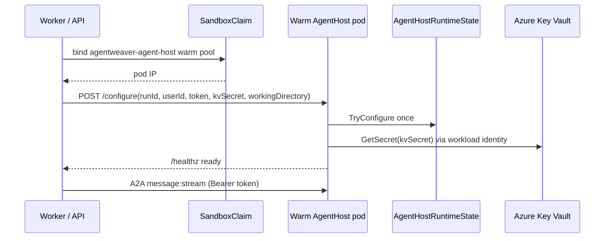
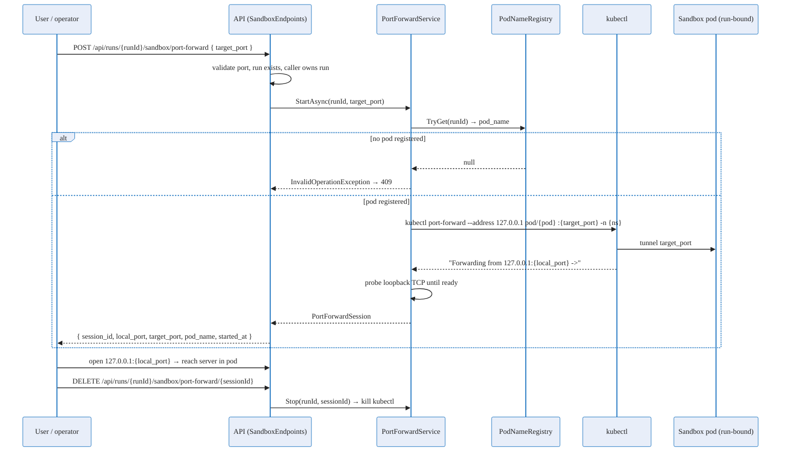

# Sandbox pods reference

Exhaustive reference for **pod-per-run** sandbox execution: configuration flags, pod identity and quota,
run-scoped GitHub token injection, pod naming, and the security properties of the model. For the
reasoning behind these mechanics, see the
[Sandbox pod execution deep dive](../deep-dive/sandbox-pod-execution.md); for the operator/user view, see
the [Sandbox pod execution experience](../experience/sandbox-pod-execution.md).

This page documents the sandbox-pod *execution* surface (where the agent turn runs). The broader sandbox
isolation model — filesystem containment, governance, executor selection, and claim lifecycle — is the
[Sandbox deep dive](../deep-dive/sandbox.md), and operator install/config is
[Sandbox setup](./sandbox-setup.md).

## Configuration flags

| Flag | Values | Default | Effect |
|---|---|---|---|
| `Sandbox:AgentExecutionMode` | `in-api`, `pod-per-run` | `in-api` | `in-api` runs the agent turn in-process in the API/worker (today's behavior, the **rollback path**). `pod-per-run` relocates each run's agent turn into its own Kata-isolated sandbox pod via the A2A bridge. |
| `Sandbox:ReleasePodOnSuspend` | `true`, `false` | `true` | When `pod-per-run` is active and the workflow graph suspends on an external gate (a HITL/review `RequestPort`, or the coordinator idling while it awaits child runs), `true` checkpoints the run and **releases** the pod back to the warm pool. `false` keeps the pod warm across the suspension for low-latency resume or debugging, at the cost of held capacity. |
| `AgentHost:KeyVaultUri` | URI | *(unset)* | Enables runtime Key Vault user-token fetch in warm AgentHost pods. The executor still injects this static value through the claim env because the pod needs the vault URI before `/configure` arrives. |

### Flag semantics

- **`pod-per-run` is the only value that activates the bridge.** Any other value (the `in-api` default)
  keeps execution in-process. There is no separate "pod-per-turn" mode — granularity within
  `pod-per-run` is the hybrid model (warm across consecutive turns, release on suspend), governed by
  `Sandbox:ReleasePodOnSuspend`, not by a distinct execution-mode value.
- **`ReleasePodOnSuspend` only matters under `pod-per-run`.** It is a tuning sub-flag; it never changes
  the execution-mode value. The release is internal behavior of `pod-per-run`.
- **Rollback is a flag flip, not a redeploy.** Setting `Sandbox:AgentExecutionMode=in-api` restores
  in-process execution immediately. This is the documented mitigation for any instability in the
  `-preview` A2A transport — there is no alternate wire transport to deploy. See the
  [A2A reference](./a2a.md) for the transport's preview status and pinning.

> AgentHost user-token delivery is selected by `AgentHost:KeyVaultUri` in AKS. Legacy file/CSI settings exist only for compatibility; the warm-pool path uses runtime Key Vault fetch after `/configure`.

## Pod identity and quota

A pod-per-run sandbox is the same Kata-isolated pod shape the sandbox subsystem already uses, claimed
from a warm pool, but now hosting the full agent (worker agents **and** the coordinator's own agent
turns) rather than only ad-hoc shell commands.

| Property | Value / behavior |
|---|---|
| Runtime class | `kata-vm-isolation` — a VM boundary around the container, so each run's secret and execution live inside a per-run microVM and are destroyed with it. |
| Identity | Dedicated sandbox service account; **workload identity** (federated OIDC) is the preferred path for the model credential, projecting **only** the narrowly-scoped workload-identity token volume — not the full Kubernetes API service-account token. |
| Cluster API access | None. The pod does not automatically receive Kubernetes API credentials; the sandbox stays tokenless for the cluster API even when workload identity is enabled for the model endpoint. |
| Provisioning | Claimed from a **warm pool** via a `SandboxClaim`; the executor waits until the claim is bound to a concrete pod. Generic command sandboxes use `agentweaver-sandbox` (`replicas: 3`). AgentHost uses the shared `agentweaver-agent-host` pool (`replicas: 2`), then receives per-run context through `POST /configure` before `/healthz` is expected to become ready. |
| AgentHost readiness gate | Warm AgentHost pods start in standby. After binding, the executor calls `POST /configure` with run/user/token/KV secret context plus `workingDirectory`, then polls `GET {scheme}://{podIP}:8088/healthz` (bounded `Sandbox:Kubernetes:AgentHostReadyTimeoutSeconds`, default `90`s; `…ReadyPollIntervalMs`, default `1000`) before the first A2A turn. `/configure` is excluded from readiness and returns `409` if called again. The `a2a-sandbox-pod` HttpClient additionally retries connection-refused only. |
| A2A turn authentication | Run launch generates a 256-bit random turn bearer token, sends it to the claimed warm pod in `POST /configure`, and registers it in `IAgentHostTurnTokenRegistry`. `RemoteAgentProxy` sends `Authorization: Bearer {token}` on `message:stream`; each pod accepts only its configured run token. |
| Per-pod resources | Sized for a real agent runtime (a live session + model I/O), not a `sleep infinity` placeholder — materially larger CPU/memory requests than the shell-only baseline. Exact numbers are a capacity decision. |
| Quota | Namespace `ResourceQuota` caps pod count, CPU/memory requests, and sandbox-claim count. Heavier per-pod requests plus multiple web/worker replicas require these caps to be **raised deliberately** via a reviewed manifest change, never a live patch. |
| Lifetime | Bounded by the run and the claim TTL. Under the hybrid model, a pod is released on suspend and a fresh pod is re-claimed on resume; pods never persist past the run. |
| Egress | Default-deny NetworkPolicy with a narrow allowlist (see [Security properties](#security-properties)). |
| Storage | Mounts the **shared workspace volume** (the worktree path) so worktree commit/diff stays on the worker side; the pod is otherwise stateless beyond the live turn. |

## Run-scoped GitHub token delivery

A pod-per-run sandbox acts **as the run's signed-in user** and needs a GitHub credential to clone/push the worktree and call GitHub API tools. In AKS, user tokens are stored in Azure Key Vault and fetched by the configured AgentHost pod at run launch; they are not mounted via per-run CSI.

### Sourcing

- Each authenticated user's GitHub token is stored in Key Vault as `ghtok-user--{base32(userId)}`.
- The executor resolves the run's submitting user and corresponding Key Vault secret name before configuring the pod. If the user cannot be resolved or has no usable token, the launch fails before the first turn rather than falling back to another scope.
- Installation scope remains for background/system work with no caller; user runs use the owning user's scope.

### Delivery to the executing pod

1. The shared AgentHost warm pool (`agentweaver-agent-host`, `replicas: 2`) keeps pods in standby with no `RunId`.
2. The `SandboxClaim` binds one warm pod. Static config such as `AgentHost__KeyVaultUri` is already present because the pod needs the vault URI before configuration.
3. `KubernetesSandboxExecutor` calls `POST /configure` with `runId`, `userId`, `turnBearerToken`, `kvUserSecretName`, and `workingDirectory`.
4. `AgentHostRuntimeState.TryConfigure(...)` stores those values once.
5. `KeyVaultUserTokenProvider` uses `SecretClient` + `DefaultAzureCredential` to fetch only `kvUserSecretName`; `KeyVaultGitHubTokenStore` serves the deserialized token to the runtime and caches it in memory for the pod lifetime.

No per-run `SecretProviderClass`, cloned `SandboxTemplate`, CSI user-token volume, or per-run warm pool is created. The JSON secret value matches the old file-mounted format, so downstream consumers still see the same token-store contract.

### `/configure` request body

`POST /configure` is the one-time warm-pool configuration call from `KubernetesSandboxExecutor` to the bound AgentHost pod.

| Field | Required | Meaning |
|---|---|---|
| `runId` | Yes | The Agentweaver run this pod executes. Missing or blank values return `400`. |
| `userId` | No | Submitting user id for run-scoped GitHub token lookup. |
| `turnBearerToken` | No | Per-run bearer token required by `POST /a2a/agent/v1/message:stream`. |
| `kvUserSecretName` | No | Key Vault secret name for the submitting user's GitHub token. |
| `gitHubAccessToken` | No | API-pre-resolved GitHub access token; when present, the pod skips the Key Vault fetch. |
| `workingDirectory` | No | The run's `WorktreePath` (for example `/workspace/{worktree}`), used as the AgentHost `SetupAsync` working directory and file-tool root. |

`IRunSubmittingUserResolver.GetWorkingDirectoryAsync(runId)` resolves `workingDirectory` from the run row and strips coordinator suffixes such as `-coordinator-decompose`, so sibling child stages share the parent's worktree. If the resolver fails or no worktree exists yet, the executor omits the field and AgentHost falls back to `AgentHost__WorkingDirectory`.

### Lifetime and cleanup

- **Key Vault is the source of truth.** OAuth callbacks and refreshes write the per-user Key Vault secret.
- **Pod cache is in-memory.** The configured token is cached only for that pod lifetime and disappears when the pod is released.
- **No SPC cleanup.** The reaper no longer deletes per-run SPCs or per-run templates/warm pools for AgentHost because they are no longer created.

### Security trade-off

The previous CSI design isolated user tokens at the infrastructure layer: the pod filesystem contained only one projected file. The warm-pool design uses application-layer isolation: the pod identity can reach Key Vault, but AgentHost fetches only the secret name delivered in the one-time `/configure` call. NetworkPolicy protects `/configure`, one-time configuration prevents retargeting, and `message:stream` still requires the per-run bearer token.

## A2A turn bearer token

The A2A turn endpoint has a separate per-run bearer token from the GitHub user token above:

1. `KubernetesSandboxExecutor` creates 32 random bytes (`256` bits) at AgentHost run launch.
2. The token is sent to the claimed warm pod in `POST /configure` and stored in `AgentHostRuntimeState`.
3. The same token is stored in `IAgentHostTurnTokenRegistry` for the owning run.
4. `RemoteAgentProxy` reads the registry and sends `Authorization: Bearer {token}` on all calls to `POST /a2a/agent/v1/message:stream`.
5. `AgentHost` rejects turn requests whose header does not exactly match its own `AgentHostOptions.TurnBearerToken`.

This is application-layer auth on top of the A2A NetworkPolicy/mTLS boundary. The important blast-radius property is that a stolen token from one run cannot be reused against another run's pod.

## Pod naming and the executing-pod surface

A run's executing pod name is tracked so the UI can show *where* a run is running.

- **`PodNameRegistry`** is an in-memory map from **run id → bound pod name**. It is populated by the
  Kubernetes sandbox executor once a `SandboxClaim` reports its `Ready` condition `True`, and the entry is
  removed when the claim is deleted (e.g. on run cleanup or release).
- The registry is consumed in two places:
  - the **system runtime endpoint** (`GET /api/system/runtime`) returns `{ kubernetes, podName }`,
    where `podName` is the API/host pod name when running inside Kubernetes — the global fallback; and
  - the **run graph endpoint** (`GET /api/runs/{id}/graph`) populates an **`executionPodName`** field on
    each node from the registry, so a per-run/per-node pod name overrides the global fallback as the
    pod-per-run rollout begins carrying the correct per-pod value automatically.
- The frontend resolves `node.executionPodName ?? globalPodName` and renders it as a small pod pill
  (the "executing pod name" surfaced on agent boxes). The pill renders **only on Kubernetes** — when not
  running in-cluster (`kubernetes: false`) or when the pod name is null, nothing is shown, so local/dev
  runs stay clean. See the [experience doc](../experience/sandbox-pod-execution.md#what-the-pod-pill-is)
  for the rendered behavior.

| Field | Source | Meaning |
|---|---|---|
| `kubernetes` | `GET /api/system/runtime` | Whether the backend is running inside Kubernetes; gates whether any pod pill is shown. |
| `podName` (global) | `GET /api/system/runtime` | The host/API pod name — the fallback pill when no per-node value exists. |
| `executionPodName` (per node) | `GET /api/runs/{id}/graph`, topology deltas, `subtask.*` events | The bound sandbox pod name for that run/node, from `PodNameRegistry`; overrides the global fallback. |

> The same `PodNameRegistry` also lets preview/port-forward tooling locate a run's pod. That preview
> path is documented in the [Sandbox deep dive](../deep-dive/sandbox.md#why-run-ids-map-to-pod-names) and,
> for its API surface, in [Sandbox preview port-forward](#sandbox-preview-port-forward-feature-017) below.

## Sandbox preview port-forward (Feature 017)

> **Dedicated pages:** this feature now has its own [Reference](./sandbox-browser-preview.md),
> [User Guide](../experience/sandbox-browser-preview.md), and
> [Deep Dive](../deep-dive/sandbox-browser-preview.md). The summary below stays here for context within the
> sandbox-pods surface.

A **preview port-forward** exposes a port of a run's sandbox pod back through the API, so an operator can
reach a server the agent started **inside** the pod (a dev server, a built app, a debug endpoint) as a
live preview scoped to that one run's pod. `PortForwardService` shells out to
`kubectl port-forward --address 127.0.0.1 pod/{podName} :{targetPort} -n {namespace}` (it does **not** use
the Kubernetes API), parses the `Forwarding from 127.0.0.1:<port> ->` line to learn the local port, and
probes loopback TCP until ready. The pod is the same one `KubernetesSandboxExecutor` provisions through
the [agent-sandbox controller](../deep-dive/sandbox.md#the-agent-sandbox-controller-and-where-mxc-fits) —
the preview tunnels into *that* pod, not an MXC local sandbox.

This surface is **Kubernetes-only**: it tunnels through the [Kubernetes claim backend](./sandbox-setup.md#kubernetes-in-cluster)'s
pod, located by run id via the [`PodNameRegistry`](#pod-naming-and-the-executing-pod-surface). On local/dev
backends (no claim pod) there is nothing to forward, and the start call fails with a conflict — *"the run
must be `in_progress` with an active Kubernetes sandbox"*. Every call also verifies the run exists and the
caller owns it (`403`/`404` otherwise).

### Endpoints

| Method & path | Body | Returns | Effect |
|---|---|---|---|
| `POST /api/runs/{runId}/sandbox/port-forward` | `{ "target_port": <1..65535> }` | `PortForwardSessionDto` | Starts a `kubectl port-forward` from the run's pod's `target_port` to a loopback port on the API, and returns the new session. `429` when a session cap is hit; `409` when the run has no active sandbox pod. |
| `GET /api/runs/{runId}/sandbox/port-forward` | — | `PortForwardSessionDto[]` | Lists the active preview sessions for the run. |
| `DELETE /api/runs/{runId}/sandbox/port-forward/{sessionId}` | — | `{ session_id, stopped: true }` | Stops the identified session and tears down its tunnel. |

### `PortForwardSessionDto`

| Field | Meaning |
|---|---|
| `session_id` | Identifier for this preview session; used as `{sessionId}` to stop it via `DELETE`. |
| `local_port` | The loopback port **on the API host** that `kubectl` bound; what the API forwards from. The backend returns this port, **not** a public URL. |
| `target_port` | The port **inside** the sandbox pod that is being forwarded. |
| `pod_name` | The bound sandbox pod the tunnel targets (from `PodNameRegistry`). |
| `started_at` | When the session started. |
| `preview_url` / `previewUrl` | **Web-only, optional.** The frontend reads these to render an embedded iframe, but the backend does **not** currently populate them; the UI explicitly says so when no proxied URL is returned. |

### Behavior

- **Per-port, explicit.** A session forwards one `target_port`; opening another preview is a second
  `POST`. Sessions are listed and stopped individually.
- **Scoped to the run's pod.** A session can only reach *that* run's sandbox pod — the run id resolves to a
  single bound pod, so a preview never crosses into another run's pod.
- **Inbound only, no egress widening.** The tunnel is an inbound path the operator opens to the pod; it
  does **not** alter the pod's default-deny egress allowlist (see [Security properties](#security-properties)).
- **Capped per run and globally.** Default **3** concurrent sessions per run
  (`Sandbox:PortForward:MaxConcurrentSessionsPerRun`, fallback `:MaxPerRun`) and **20** globally
  (`Sandbox:PortForward:MaxConcurrentSessionsGlobal`, fallback `:MaxGlobal`); exceeding either raises
  `PortForwardLimitExceededException` → `429`.
- **In-memory, no TTL.** Sessions live only in `PortForwardService`'s in-process maps (`_sessions` /
  `_sessionsByRun`); there is no expiry timer. They end only on explicit `DELETE`, run end (via
  `RunWatchLoopService`, which also unregisters the pod), the `kubectl` process exiting on its own, or
  `Dispose()` at shutdown.
- **Bounded by the pod.** A session is only valid while the run's pod is bound; releasing or replacing the
  pod (suspend/resume, run end) ends forwarding, and a new preview must be started against the re-claimed
  pod.

## Security properties

| Property | Pod-per-run guarantee |
|---|---|
| Execution isolation | Each run's agent turn, tools, shell, and file ops run in the run's **own Kata-isolated pod** (`kata-vm-isolation`), not a shared process. |
| Control-plane isolation | The orchestration graph, HITL decisions, and run record stay in the **worker**; a compromised pod cannot alter *what happens next*. |
| Credential blast radius | The pod holds **only a short-lived, run-scoped credential** — never a broker key, never refresh material, never another run's or user's scope. There is **no `CapabilityTokenService`** and no central token broker. |
| A2A turn auth | `message:stream` requires `Authorization: Bearer {per-run token}`. The token is delivered only to the claimed AgentHost pod via `/configure` and removed from the registry when the pod is released. |
| GitHub token exposure | **Fetched from Key Vault only for the configured run owner and cached in memory for the pod lifetime; no CSI user-token file or shared workspace copy exists. |
| Egress | **Default-deny** with a narrow allowlist: model endpoint, the API/worker bridge endpoint, and the run's legitimate git remote(s). The **database is not reachable** from sandbox pods — all run-state I/O flows through the worker. |
| At rest / past run | Token material does not persist past the pod lifetime; no per-run Secret/SPC is created, and the bearer token is no longer written to `SandboxClaim.spec.env` in etcd. |
| Reversibility | The whole mode is gated by `Sandbox:AgentExecutionMode`; flipping to `in-api` restores in-process execution with no redeploy. |

## Related reference

- [Sandbox setup](./sandbox-setup.md) — operator install/config of the sandbox backends.
- [API reference](./api.md) — the endpoints surfaced above.
- [A2A reference](./a2a.md) — the `-preview` transport (experimental) that carries agent turns.
- [Sandbox pod execution deep dive](../deep-dive/sandbox-pod-execution.md) — the reasoning.
- [Sandbox pod execution experience](../experience/sandbox-pod-execution.md) — the user/operator view.
- [Sandbox browser preview](../reference/sandbox-browser-preview.md) — preview routes (start/keepalive/stop)
  that expose a pod-internal server over a public HTTPS reverse proxy.
