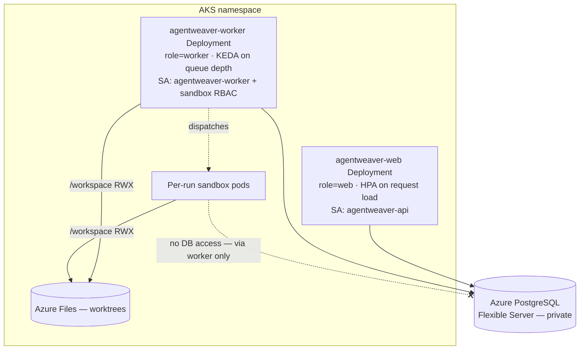

# Scaling Data Layer — Reference

This reference is the exhaustive companion to the [Distributed execution & scaling deep dive](../deep-dive/distributed-execution-scaling.md). It documents the data and topology layer of horizontal scaling: the SQLite ↔ Azure Database for PostgreSQL Flexible Server **provider switch**, the store inventory and how the raw stores unify into one context, the leasing schema, the run-event stream, the web/worker deployment topology, provisioning and connectivity, and the configuration flags that gate each phase.

The database target is **Azure Database for PostgreSQL Flexible Server** — the current, locked direction. The data layer is **provider-aware** (`Database:Provider`): `postgres`/`postgresql` routes durable state through the EF Core `MemoryDbContext` and EF-backed stores; the default `sqlite` keeps the legacy single-writer SQLite stores. Sections below note where a capability is implemented versus a documented design target.

## 1. Store inventory

The original shape was two physical SQLite databases under the data directory: one holding the operational control plane reached through hand-written SQL, and one holding the memory/orchestration plane reached through the EF Core context. Under Postgres both are unified behind **one** EF `MemoryDbContext` and **one** database; the SQLite providers retain the original split.

### 1a. Operational stores (raw SQLite → EF, now provider-aware)

These six stores began as hand-written SQL against the operational database. They now have **provider-aware** equivalents: under `Database:Provider=postgres` they are served by EF-backed stores over `MemoryDbContext` (`EfRunStore`, `EfRunRevisionStore`, `EfWorkflowRunStore`, `EfBacklogTaskStore`, `EfCastProposalStore`); under the default `sqlite` the legacy `Sqlite*` stores remain. The SQLite-specific idioms below describe the original raw form and how each maps onto Postgres/EF.

| Store | Tables | Data held |
| --- | --- | --- |
| Run store | `runs` (+ `run_revisions`) | Run records: status, worktree, tree hash, diff, review dwell timings, origin, parent/subtask linkage, archive state. Uses CAS-style `UPDATE ... WHERE status=...`. |
| Run-revision store | `run_revisions` | Append-only reviewer/revision comments, enforced append-only by a database trigger. |
| Project store | `projects` | Projects: origin, working dir, default branch, model defaults, state, pickup config, workflow/review-policy/sandbox profile, blueprint provenance, allowed workflow ids (JSON). |
| Backlog-task store | `backlog_tasks` | Kanban backlog/ready/claimed tasks, order key, claim→run binding, **partial unique indexes**, transactional claim CAS. |
| Workflow-run store | `workflow_runs` | Coordinator/workflow run grouping plus the shared orchestration worktree path. |
| Cast-proposal store | `cast_proposals` | Cast proposals with expiry, written via SQLite `INSERT OR REPLACE` upsert. |

The operational database also owns schema bootstrap via a hand-rolled idempotent migration list (`ALTER TABLE ... ADD COLUMN` plus a duplicate-column catch). This mechanism is SQLite-specific and is replaced by EF migrations.

### 1b. EF Core entities (already provider-switchable)

These already flow through the `Database:Provider` switch and carry generated EF migrations. They are **not** the blocker — Postgres for this set is a config flip plus a Postgres migration set.

| Entity | Data held |
| --- | --- |
| `Decision` | Promoted decisions and supersede chain. |
| `DecisionInboxEntry` | Decision inbox, unique `(ProjectId, Slug)`. |
| `AgentMemory` | Per-agent memory by type. |
| `SessionContext` | Session summaries, unique `(ProjectId, SessionId)`. |
| `RunEventRecord` | Durable run-event log, unique `(RunId, Sequence)` — also accessed via raw SQL (see §4). |
| `OutcomeSpec` | Coordinator outcome spec. |
| `WorkPlan` | Coordinator work plan; status/stage CAS target — extended for leasing (§3). |
| `Subtask` | Child subtasks; status pending→dispatched→running, child run id — extended for leasing (§3). |
| `SubtaskDependency` | Subtask DAG edges. |
| `SteeringDirective` | Queued/applied steering directives. |
| `McpRefreshToken` / `McpRevokedJti` / `McpClientRegistration` | MCP OAuth state with their respective unique keys. |

### 1c. Not a database (no migration)

Sandbox policy, workflows, and review policies are **file-based** under each project's `.agentweaver/` directory; the `projects` table only names a preset. They need no Postgres work, but they do raise a separate multi-replica concern (workspace files belong on a shared/RWX volume), which the topology section addresses.

## 2. The six operational stores in one EF context

Under Postgres the operational stores are served behind the EF Core `MemoryDbContext` rather than the hand-written ADO.NET path, giving **one provider switch, one connection story, one migration mechanism, one database**. `MemoryDbContext` maps the migrated entities (`RunRecord`→`runs`, `RunRevisionRecord`→`run_revisions`, `ProjectRecord`→`projects`, `BacklogTaskRecord`→`backlog_tasks`, `WorkflowRunRecord`→`workflow_runs`, `CastProposalRecord`→`cast_proposals`) with explicit snake_case column names, and `model.Ignore<>()`s all six on non-Npgsql providers so the SQLite migration snapshot is unaffected. The rationale:

1. **One provider switch.** The EF context already routes sqlite/sqlserver/postgres. The raw operational path has no provider abstraction; keeping it as raw Npgsql would mean maintaining two dialects by hand indefinitely.
2. **One migration mechanism.** The bespoke `ALTER TABLE` bootstrap is replaced by EF migrations the team already operates for the memory database.
3. **CAS already lives in EF.** The coordinator assembly store already proves that a guarded `ExecuteUpdateAsync(... .Where(Status == X))` delivers exactly-once CAS. Porting the `runs` and `backlog_tasks` claims to the same idiom is consistent, not novel.
4. **Cross-store transactions stay trivial.** The backlog claim spans `backlog_tasks` + `runs` in one transaction today. With both tables in one context and one database, it stays a single transaction; splitting them across two databases would require a distributed/two-phase hack.

It is acceptable to ship Postgres for the EF set first (a config flip), then port the raw stores entity-by-entity into the same context. But the **end state is one database, one EF context** — never two Postgres databases. A partial port that leaves one database on Postgres and one still on SQLite breaks the cross-store backlog-claim transaction, so port atomically or keep both in the same Postgres database throughout.

### SQLite idioms and their Postgres mapping

Postgres is strictly typed and MVCC-based, so several SQLite idioms do not translate directly:

| SQLite idiom | Postgres / EF handling |
| --- | --- |
| Implicit autoincrement rowid | EF `int` key → `integer GENERATED BY DEFAULT AS IDENTITY`. App-generated string/GUID PKs stay `text`. |
| `INSERT OR REPLACE` (upsert) | `INSERT ... ON CONFLICT (id) DO UPDATE`. Semantics differ — `OR REPLACE` deletes+reinserts (fires cascades, resets defaults) whereas `ON CONFLICT DO UPDATE` updates in place. Audit FK/trigger side-effects before swapping. |
| `INSERT OR IGNORE` | `INSERT ... ON CONFLICT (RunId, Sequence) DO NOTHING`. |
| Dynamic typing (TEXT holds dates/bools/JSON) | Choose real column types (below). |
| Datetime stored as TEXT | `timestamptz`. The EF entities already use `DateTimeOffset`, which maps natively; backfill must parse the prior text format. |
| Boolean stored as INTEGER `0/1` | `boolean`; backfill `0/1 → false/true`. |
| JSON stored as TEXT | `jsonb` for queryable columns; `text` is fine for opaque blobs. |
| Partial unique indexes | Supported natively (`CREATE UNIQUE INDEX ... WHERE ...`; EF `HasIndex().IsUnique().HasFilter(...)`). These port cleanly. |
| Append-only via `RAISE(ABORT)` trigger | Postgres `BEFORE UPDATE/DELETE ... RAISE EXCEPTION` trigger (or `REVOKE UPDATE,DELETE`). Not expressible in the EF model — add as raw SQL in the migration. |
| `PRAGMA journal_mode=WAL`, `busy_timeout`, `foreign_keys=ON`, shared-cache | All vanish. Postgres is WAL-native and MVCC; FKs are always enforced; use `lock_timeout`/`statement_timeout` if needed. |
| `ALTER TABLE ADD COLUMN` idempotent bootstrap | Replaced by EF migrations applied at deploy time (§5). |

## 3. Leasing schema additions

These columns make a row safely claimable by exactly one of N replicas. They are implemented today on the **`runs`** row (the `RunRecord` entity), which is what `PostgresRunLeaseStore` claims/renews/releases. Extending the same columns to `WorkPlans` and `Subtasks` for coordinator-level leasing is a **documented design target, not yet implemented**. The lease *lifecycle* (renew cadence, expiry sweep, hand-off) is the worker tier's (`RunWatchLoopService`, `LeaseTtl` = 5 min, renew at half-TTL); the storage is defined here. See the deep dive's [durable run leasing](../deep-dive/distributed-execution-scaling.md#durable-run-leasing) for the conceptual model.

### 3a. Lease / ownership columns

| Column | Type | Purpose |
| --- | --- | --- |
| `owner_id` | `text NULL` | The replica/worker currently holding the item (e.g. pod name/GUID). `NULL` = free. |
| `lease_expires_at` | `timestamptz NULL` | Lease deadline; an expired lease is reclaimable by any replica even if `owner_id` is set (crash recovery). |
| `heartbeat_at` | `timestamptz NULL` | Last liveness stamp from the owner; drives cross-replica stall detection. |
| `fencing_token` | `bigint NOT NULL DEFAULT 0` | Monotonic token bumped on every acquisition. Workers present it on writes; a stale token is rejected, preventing a zombie owner from clobbering a re-leased item. |
| `attempt` | `int NOT NULL DEFAULT 0` | Acquisition/execution attempt counter; bounds retries. |

### 3b. Idempotency for child dispatch *(design target — not yet implemented)*

Child-run dispatch should be exactly-once per `(coordinator, subtask, attempt)` so a re-leased coordinator does not double-spawn children. The intended design is a dispatch-idempotency table keyed on `(coordinator_run_id, subtask_id, attempt)` recording the resulting `child_run_id`, inserted in the **same transaction** that flips the subtask to `dispatched`; a duplicate insert (`ON CONFLICT DO NOTHING`) means "already dispatched — reuse the existing child." This table and its guard do **not** exist in the schema yet.

### 3c. Guarded CAS — implemented for runs/assembly/backlog; subtask dispatch outstanding

Three places already do DB-level CAS correctly:

- **Run lease CAS** — `PostgresRunLeaseStore` issues `UPDATE runs SET owner_id=@me, lease_expires_at=@deadline, fencing_token=fencing_token+1, attempt=attempt+1 WHERE run_id=@id AND (owner_id IS NULL OR lease_expires_at < now())`; the single winner sees `rows > 0`.
- **Assembly CAS** — `UPDATE WorkPlans SET Status=Assembling WHERE Id=@id AND Status=AwaitingAssembly`.
- **Backlog claim CAS** — `UPDATE backlog_tasks SET state='claimed' ... WHERE state='ready' AND run_id IS NULL`.

The known gap is **subtask dispatch**, which is still a read-modify-write with no owner or state guard — two replicas observing the same `pending` subtask could both dispatch (the double-dispatch bug). The **not-yet-implemented** fix converts it to a guarded update that asserts expected state **and** ownership/fencing in one statement:

```
UPDATE Subtasks
   SET Status='dispatched', ChildRunId=@child, owner_id=@me,
       fencing_token=fencing_token+1, lease_expires_at=@deadline, UpdatedAt=now()
 WHERE Id=@id AND Status='pending'
   AND (owner_id IS NULL OR lease_expires_at < now());
```

Only the replica that gets `rows == 1` would spawn the child (and write the `dispatch_idempotency` row in the same transaction). Until that conversion lands, every blind subtask-status writer remains a double-dispatch hazard under multiple replicas and must be audited before scaling workers past one.

## 4. Run-event stream

### What exists today

The run-event stream is durable write-through plus in-process fan-out. The Postgres implementation is `EfRunEventStream` (registered as `IRunEventStream` when `Database:Provider=postgres`; the SQLite path uses `SqliteRunEventStream`). Each `AppendAsync`:

1. **Durable write-through** — inserts the event into the `RunEvents` table inside a **serializable** transaction that computes `MAX(Sequence)+1` for the run, before acknowledging. The unique `(RunId, Sequence)` index is the safety net; on a concurrent-append conflict (`DbUpdateException`) the transaction rolls back and retries, up to three attempts.
2. **In-process channel** — pushes the stamped event into a bounded (`capacity 1000`) process-local `Channel<RunEvent>`. `SubscribeAsync` first replays durable rows after the caller's cursor from the database, then tails this channel.

Both the channel and the SSE history are **per-process**, so at more than one replica a client connected to one pod does not receive live pushes for events produced on another — it sees them only by replaying from the durable log on (re)subscribe. Durability is unaffected (the log is shared); **live cross-replica delivery is the gap.**

### Mechanism: notify + catch-up poll *(design target — not yet implemented)*

The intended Postgres design keeps durability identical and adds cross-replica delivery. **None of the following is implemented in `EfRunEventStream` yet** — it is the documented next step:

1. **Durable write-through (unchanged).** Synchronous insert into the event log before ack.
2. **Live push via `LISTEN/NOTIFY`.** On each durable insert the producer would also issue `NOTIFY run_events, '<runId>:<sequence>'`. Each replica holds a `LISTEN run_events` connection; on a notify it wakes the relevant local subscribers, which then read the new rows from Postgres. The notification carries only the cursor, never the payload (payloads can exceed the NOTIFY size limit).
3. **Catch-up poll backstop.** Every subscriber also runs a low-frequency poll (`SELECT ... WHERE RunId=@id AND Sequence > @cursor ORDER BY Sequence`). Because reads are cursor-based and the `(RunId, Sequence)` index is unique, catch-up is idempotent and gapless; a missed or undelivered notify can never strand a client, only delay it.
4. **Same-replica fast path.** The per-process channel (which already exists) stays as a latency optimization for a client connected to the worker producing the events.

`LISTEN/NOTIFY` requires **session-mode** connections — it does not pass through transaction-pooled PgBouncer. This must be reconciled with the pooling choice (§5): the wrong pooling mode silently disables live delivery, and the catch-up poll masks it as merely "slow," making the misconfiguration hard to detect.

### Sequence allocation under concurrency

`EfRunEventStream` implements the **serializable `MAX(Sequence)+1` with a unique-index retry loop** described above. The unique `(RunId, Sequence)` index is the durable safety net. If the worker tier guarantees exactly one writer per run via leasing, contention exists only across the rare re-lease boundary, which keeps the retry cheap. A per-run advisory lock or a dedicated per-run sequence are alternatives if contention ever warrants them.

## 5. Deployment topology — web vs worker

Both tiers run from the **same image**, differentiated by the role flag `App:Role` (env `App__Role`, values `web` vs `worker`; resolved by `AppRole` and branched on in `Program.cs`). No second image is built or pushed.

### Web tier

- Serves HTTP/auth/UI/MCP ingress and the SSE relay; keeps the gateway ingress rules and OAuth/secret config as today.
- Does **not** claim runs or run the orchestration graph; orchestration endpoints enqueue work for workers.
- Stateless once SQLite is gone → safe to scale `2..N`. Autoscales on request load (HPA on CPU and/or a request-rate metric).

### Worker tier

- **Claims runs via leasing** (§3), runs the orchestration loop in-process, and dispatches per-run sandbox pods.
- Needs the sandbox RBAC and workload identity; the web tier may drop sandbox RBAC for least privilege. This implies splitting the service account: keep the existing API SA for web and add a dedicated worker SA with its own federated credential bound to the sandbox role.
- Autoscales on **run/queue depth**, not CPU. The preferred mechanism is a KEDA PostgreSQL scaler querying unleased/queued run depth (roughly `SELECT count(*) FROM runs WHERE state='queued' AND lease IS NULL`), with scale-to-min (never zero — workers must keep leasing and draining). If KEDA is unavailable, fall back to an HPA on a "queued runs" custom metric exported via the existing OTEL/Prometheus path.

### Disruption and graceful drain

Each tier gets a PodDisruptionBudget mirroring the existing `minAvailable: 1` pattern; workers prefer `maxUnavailable: 1` so leases drain one pod at a time. On SIGTERM a worker stops claiming new runs, **releases held leases** (or lets them expire so another worker re-claims), and finishes or checkpoints in-flight orchestration before exit. This needs a `preStop` hook / `terminationGracePeriodSeconds` tuned above the lease TTL.

### Volumes

The single-writer ReadWriteOnce `/data` Azure Disk exists **only** because of SQLite. Once Postgres is the store, drop that PVC and its mounts, remove the data-path/HOME env, and flip the deployment from `Recreate` to `RollingUpdate` with `replicas > 1`. The `/workspace` ReadWriteMany Azure Files PVC **stays** — it is multi-attach-safe and still shares git worktrees with sandbox pods, so it does not block horizontal scale. The SQLite backup CronJob is superseded by Flexible Server's managed backups.



A hard topology rule: **sandbox pods talk to the worker tier, never directly to Postgres.** All run-state reads and writes flow through the worker's leasing/orchestration path. Postgres stays reachable only from web and worker pods, keeping the database blast radius tiny and avoiding handing DB credentials to internet-egressing, Kata-isolated agent pods.

## 6. Provisioning & connectivity (Azure PostgreSQL Flexible Server)

The DB-side connection details are summarized here; the full platform runbook lives alongside the [AKS deployment guide](../guide/deployment-aks.md) and [infrastructure deep dive](../deep-dive/infra-deployment.md).

- **Connectivity — private access via VNet integration (recommended).** Inject the Flexible Server into a dedicated delegated subnet in the AKS VNet and reach it over a private IP with the `privatelink.postgres.database.azure.com` Private DNS zone linked to the VNet. This matches the cluster's "no public app surface" posture. A Private Endpoint is an acceptable alternative when VNet injection is blocked by subnet topology; public access plus firewall allowlists is not recommended for production.
- **Auth — passwordless Entra via workload identity (recommended).** The cluster already runs Azure Workload Identity end to end. The app exchanges its federated service-account token for an Entra access token (audience `https://ossrdbms-aad.database.windows.net`) and presents it as the Postgres password at connect time, so no DB password ever lives in Key Vault or a pod env var. App-side this needs a token-credential provider wired to the existing workload-identity env, and an Npgsql token-refresh hook. A Key Vault password via CSI is the documented fallback but reintroduces rotation burden.
- **High availability.** Zone-redundant HA (primary + standby in different zones) on a General Purpose (or higher) tier, paired with zone-redundant backups and a 7–35 day point-in-time-restore retention window.
- **Pooling.** Front Postgres with PgBouncer or use Npgsql pooling for N replicas — but reconcile with §4: `LISTEN/NOTIFY` needs session-mode (not transaction-pooled) connections.
- **Migrations at deploy time.** Apply EF migrations from an init container/migration job rather than `EnsureCreated`, so schema is versioned and replica startup is race-free. Generate a **separate Postgres migrations set** (the existing snapshots encode SQLite affinity and must not be run against Postgres) and select it by provider at runtime. With multiple replicas the init container runs per-pod; rely on EF's migration-history table for idempotency.

## 7. Configuration flags that gate the phases

Each phase is reversible via a flag defaulting to today's behavior:

| Flag | Values (default) | Gates |
| --- | --- | --- |
| `Sandbox:AgentExecutionMode` | `in-api` *(default)* / `pod-per-run` | P1 — `pod-per-run` activates agent execution in sandbox pods over the bridge; `in-api` is the instant rollback to in-process execution. |
| `Sandbox:ReleasePodOnSuspend` | `true` *(default)* / `false` | P1 tuning — release the pod when the graph suspends on a HITL gate or the coordinator idles; `false` keeps the pod warm for low-latency resume/debug. |
| `Database:Provider` | `sqlite` *(default)* / `postgres` | P2 — selects the EF provider. Flip to `postgres` to cut over; flip back to `sqlite` to roll back. |
| `ConnectionStrings:MemoryDb` / `Database:ConnectionString` | connection string | P2 — the Postgres connection (carries no secret under passwordless Entra auth). |
| `App:Role` | `web` *(default)* / `worker` | P3 — selects the deployment role from the shared image (env `App__Role`; unset = `web`). |

## 8. Rollout sequencing

The phases map onto a flag-reversible AKS rollout. Each step lands as reviewed YAML and `scripts/aks` edits applied through the existing render-and-apply pipeline — never an ad-hoc live patch. Cross-reference the [scaling deep dive's phased rollout](../deep-dive/distributed-execution-scaling.md#the-phased-rollout).

1. **Provision Postgres** (no app cutover) — VNet subnet delegation, Flexible Server with zone-redundant HA, Private DNS zone link, Entra admin + UAMI DB role. App still on SQLite. *Rollback: none needed.*
2. **Identity wiring** — add the worker SA federated credential (and a sandbox-runner SA if pods authenticate to the model with a projected token) and the DB role grant. *Rollback: drop the federated credentials.*
3. **Provider switch behind the flag** — ship the EF Postgres provider behind `Database:Provider`, run migrations against Postgres on a single replica first, backfill if required. *Rollback: flip the provider flag to `sqlite`.*
4. **Drop `/data` PVC, enable RollingUpdate** — once Postgres reads/writes are verified, remove the data PVC and mounts, set `strategy: RollingUpdate`, `replicas: 2`. *Rollback: re-add the PVC + Recreate + `provider=sqlite` (back up first — this step is data-loss-aware).*
5. **Web/worker split** — add the web and worker deployments (role flag), worker PDB, split SAs/RBAC. *Rollback: scale workers to 0; web falls back to the in-process path behind the role flag.*
6. **Autoscaling** — add the web HPA and the worker KEDA ScaledObject (or HPA fallback). *Rollback: delete them; fixed replicas remain.*

The data backfill is greenfield by default: operational state (in-flight runs, event logs, backlog) is largely ephemeral, so a clean cutover is the recommended path. If history must be preserved, treat backfill as an explicit task with the type coercions from §2 (TEXT datetimes → `timestamptz`, INTEGER booleans → `boolean`, TEXT JSON → `jsonb`/`text`), re-created partial indexes, and the re-created append-only trigger on `run_revisions`.

## Related reading

- [Distributed execution & scaling deep dive](../deep-dive/distributed-execution-scaling.md) — the concept-first scaling story.
- [Scaling operations](../experience/scaling-operations.md) — the operator's view.
- [Data & persistence deep dive](../deep-dive/data-persistence.md) — the durable domain model.
- [Infrastructure & deployment deep dive](../deep-dive/infra-deployment.md), [AKS architecture](../architecture-aks.md), and the [AKS deployment guide](../guide/deployment-aks.md).
- [Sandbox pod execution](../deep-dive/sandbox-pod-execution.md) and the [A2A bridge](../deep-dive/a2a-bridge.md) — where and how agent execution runs in pods.
