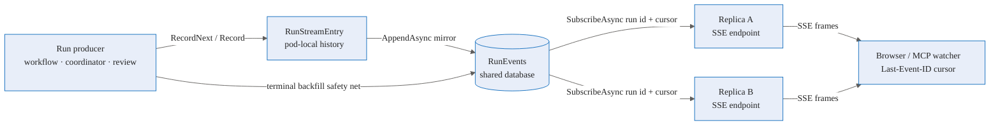

# Run Event Stream (`IRunEventStream`)

> Feature: `016-run-event-stream` · updated for cross-replica streaming

Agentweaver treats a run's event stream as a durable, ordered log first and a live SSE feed second. The current implementation mirrors every `RunStreamEntry` append into the shared `RunEvents` table, and the EF/Postgres stream reads from that table by cursor so any replica can stream any run. The pod-local `RunStreamStore` remains a same-replica compatibility and low-latency path; it is no longer the only place an SSE client can see a run's live history. Source: `apps/Agentweaver.Api/Infrastructure/RunStreamStore.cs:98`, `apps/Agentweaver.Api/Infrastructure/RunStreamStore.cs:115`, `apps/Agentweaver.Api/Infrastructure/EfRunEventStream.cs:15`, `apps/Agentweaver.Api/Infrastructure/EfRunEventStream.cs:77`, `apps/Agentweaver.Api/Endpoints/RunEndpoints.cs:416`.

For the scaling story, see [Distributed execution & scaling](./deep-dive/distributed-execution-scaling.md#run-event-fan-out-under-multiple-replicas). For the event taxonomy, see [Events reference](./reference/events.md).

## Architecture — shared store, cursor stream

The horizontal-scale invariant is simple: **the database log is the source of truth, and the cursor is the replay boundary**. `EfRunEventStream.AppendAsync` writes through before acknowledging (`WriteThroughAsync`), and `SubscribeAsync` repeatedly loads rows whose sequence is greater than the caller's last seen cursor, yielding them in sequence order until a terminal event appears. Source: `apps/Agentweaver.Api/Infrastructure/EfRunEventStream.cs:63`, `apps/Agentweaver.Api/Infrastructure/EfRunEventStream.cs:71`, `apps/Agentweaver.Api/Infrastructure/EfRunEventStream.cs:77`, `apps/Agentweaver.Api/Infrastructure/EfRunEventStream.cs:84`, `apps/Agentweaver.Api/Infrastructure/EfRunEventStream.cs:180`.

## What changed from the old in-memory-only stream

| Concern | Current behavior | Source |
|---|---|---|
| Event production | `RunStreamEntry.RecordNext` and `Record` add to local history, wake local waiters, and synchronously mirror the same event into `IRunEventStream`. | `RunStreamStore.cs:87`, `RunStreamStore.cs:98`, `RunStreamStore.cs:106`, `RunStreamStore.cs:115`, `RunStreamStore.cs:164` |
| Cross-replica reads | `EfRunEventStream.SubscribeAsync` polls the shared `RunEvents` table every `250 ms` when no new rows were emitted, so a subscriber on a different replica catches up without sticky sessions. | `EfRunEventStream.cs:33`, `EfRunEventStream.cs:77`, `EfRunEventStream.cs:96`, `EfRunEventStream.cs:180` |
| Sequence safety | Caller-assigned sequences are idempotent if already present; auto-assigned sequences are computed in a serializable transaction with retry on `DbUpdateException`. | `EfRunEventStream.cs:118`, `EfRunEventStream.cs:128`, `EfRunEventStream.cs:131`, `EfRunEventStream.cs:141`, `EfRunEventStream.cs:163` |
| Terminal safety net | Terminal persistence re-appends the full in-memory history through `IRunEventStream`; duplicate `(RunId, Sequence)` rows are skipped, so missed mirrors are reconciled without duplication. | `RunWorkflowFactory.cs:287`, `RunWorkflowFactory.cs:296`, `RunWorkflowFactory.cs:298`, `RunWorkflowFactory.cs:301` |
| SSE fallback | If the current replica has no local stream entry, `/api/runs/{id}/stream` subscribes to `IRunEventStream` from the `Last-Event-ID` cursor and writes those events as SSE frames. | `RunEndpoints.cs:416`, `RunEndpoints.cs:423`, `RunEndpoints.cs:429`, `RunEndpoints.cs:431`, `RunEndpoints.cs:443` |

`EfRunEventStreamTests` proves the cross-replica behavior by creating two stream instances over the same database: one appends events and the other receives them through `SubscribeAsync`. The tests also prove that `RunStreamStore.RecordNext` mirrors into the shared stream. Source: `tests/Agentweaver.Tests/EfRunEventStreamTests.cs:27`, `tests/Agentweaver.Tests/EfRunEventStreamTests.cs:30`, `tests/Agentweaver.Tests/EfRunEventStreamTests.cs:37`, `tests/Agentweaver.Tests/EfRunEventStreamTests.cs:42`, `tests/Agentweaver.Tests/EfRunEventStreamTests.cs:50`, `tests/Agentweaver.Tests/EfRunEventStreamTests.cs:56`, `tests/Agentweaver.Tests/EfRunEventStreamTests.cs:63`.

## SSE wire protocol

The `/api/runs/{id}/stream` endpoint still emits the same Server-Sent Event shape: an `id` line with the run-event sequence, an `event` line with the event type, and a JSON `data` line, followed by a `done` frame when the server closes the stream. Source: `apps/Agentweaver.Api/Endpoints/RunEndpoints.cs:315`, `apps/Agentweaver.Api/Endpoints/RunEndpoints.cs:448`, `apps/Agentweaver.Api/Endpoints/RunEndpoints.cs:468`, `apps/Agentweaver.Api/Endpoints/RunEndpoints.cs:489`.

Reconnects use the browser's `Last-Event-ID` header as the `fromSequence` cursor. The endpoint parses that header on the replay path and on the local path, so refreshes resume from the last emitted sequence instead of starting over. Source: `apps/Agentweaver.Api/Endpoints/RunEndpoints.cs:423`, `apps/Agentweaver.Api/Endpoints/RunEndpoints.cs:424`, `apps/Agentweaver.Api/Endpoints/RunEndpoints.cs:429`, `apps/Agentweaver.Api/Endpoints/RunEndpoints.cs:452`, `apps/Agentweaver.Api/Endpoints/RunEndpoints.cs:453`.

## Read-through coordinator gates

Browser refreshes around coordinator gates no longer surface transient `404` or `409` responses just because the spec or plan row is being created. `GET /api/runs/{id}/outcome-spec` waits up to three seconds for the persisted `OutcomeSpec`, and `GET /api/runs/{coordinatorRunId}/work-plan` waits up to five seconds for the persisted work plan before returning not found. Confirming an already-confirmed outcome spec also attempts to return the confirmed spec instead of a conflict. Source: `apps/Agentweaver.Api/Endpoints/CoordinatorEndpoints.cs:53`, `apps/Agentweaver.Api/Endpoints/CoordinatorEndpoints.cs:88`, `apps/Agentweaver.Api/Endpoints/CoordinatorEndpoints.cs:90`, `apps/Agentweaver.Api/Endpoints/CoordinatorEndpoints.cs:167`, `apps/Agentweaver.Api/Endpoints/CoordinatorEndpoints.cs:571`, `apps/Agentweaver.Api/Endpoints/CoordinatorEndpoints.cs:574`, `apps/Agentweaver.Api/Endpoints/CoordinatorEndpoints.cs:580`, `apps/Agentweaver.Api/Endpoints/CoordinatorEndpoints.cs:591`, `apps/Agentweaver.Api/Endpoints/CoordinatorEndpoints.cs:594`, `apps/Agentweaver.Api/Endpoints/CoordinatorEndpoints.cs:600`.

## Source

| Concern | File |
|---|---|
| Local stream entry and mirror to shared stream | `apps/Agentweaver.Api/Infrastructure/RunStreamStore.cs` |
| EF/Postgres shared event stream and cursor polling | `apps/Agentweaver.Api/Infrastructure/EfRunEventStream.cs` |
| SSE endpoint, `Last-Event-ID`, replay fallback | `apps/Agentweaver.Api/Endpoints/RunEndpoints.cs` |
| Coordinator outcome/work-plan read-through waits | `apps/Agentweaver.Api/Endpoints/CoordinatorEndpoints.cs` |
| Terminal backfill and recording writer integration | `apps/Agentweaver.Api/Runs/RunWorkflowFactory.cs` |
| Cross-instance tests | `tests/Agentweaver.Tests/EfRunEventStreamTests.cs` |

## See also

- [Distributed execution & scaling](./deep-dive/distributed-execution-scaling.md#run-event-fan-out-under-multiple-replicas) — why the shared event store is required for multi-replica deployments.
- [Events & observability](./deep-dive/events-observability.md) — event taxonomy and observability model.
- [Token usage monitoring](./experience/token-usage-monitoring.md) — one UI surface that consumes the same live stream and usage projections.
