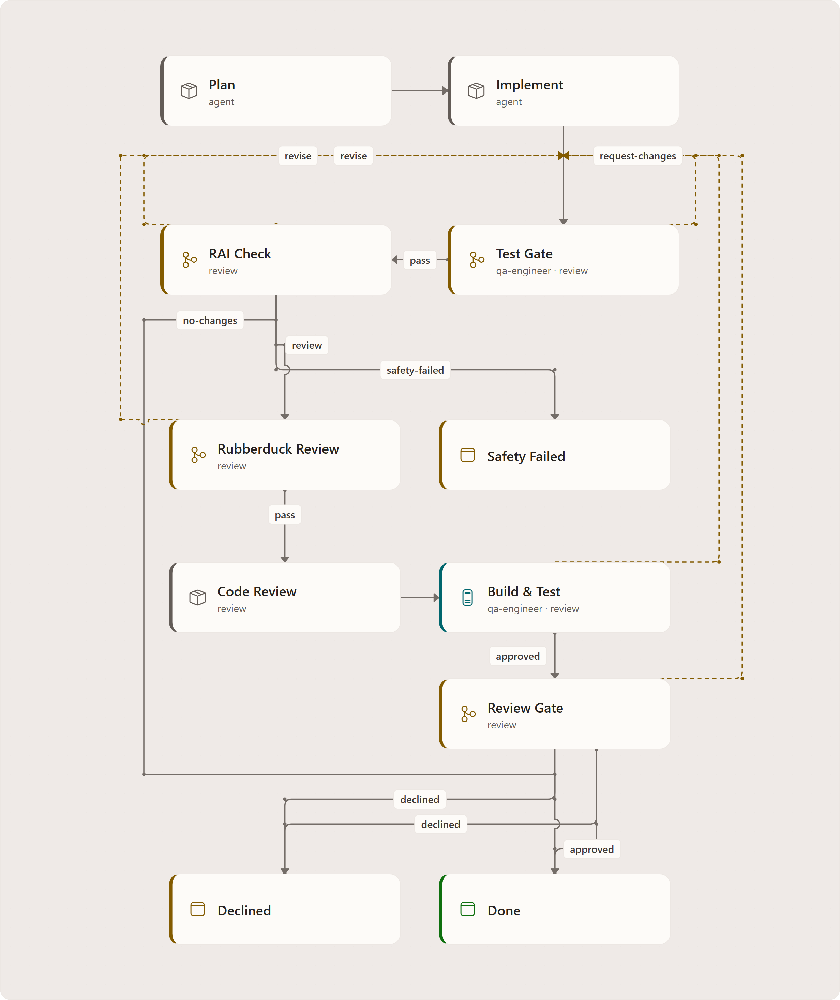
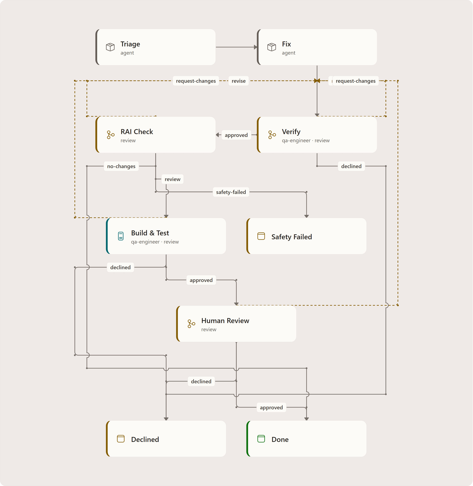
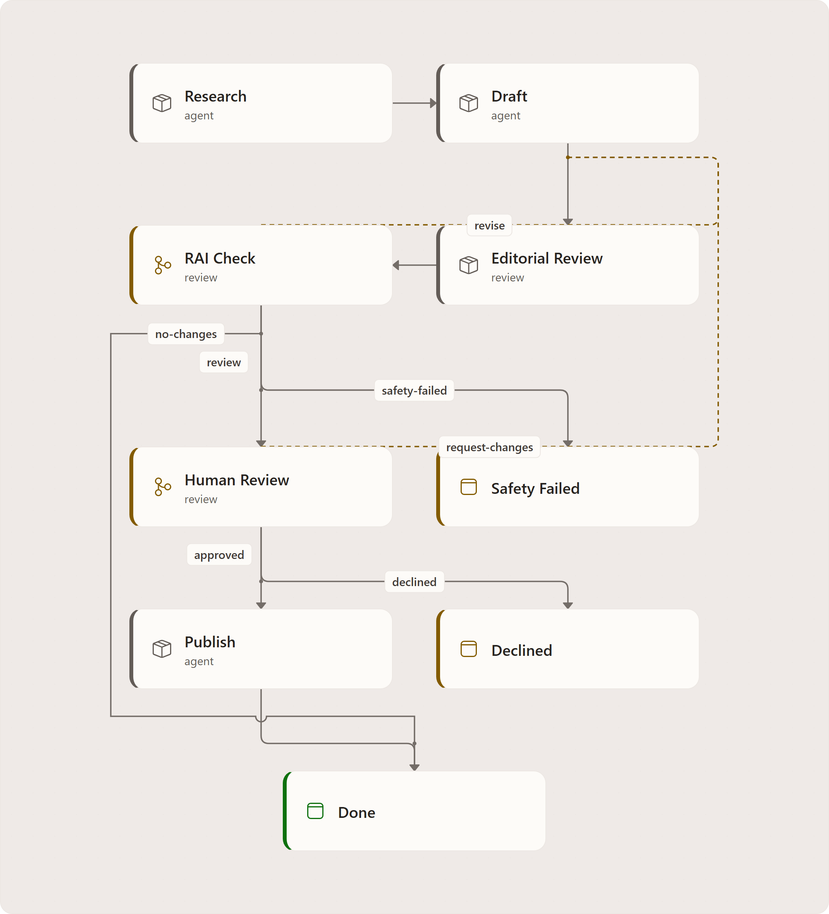
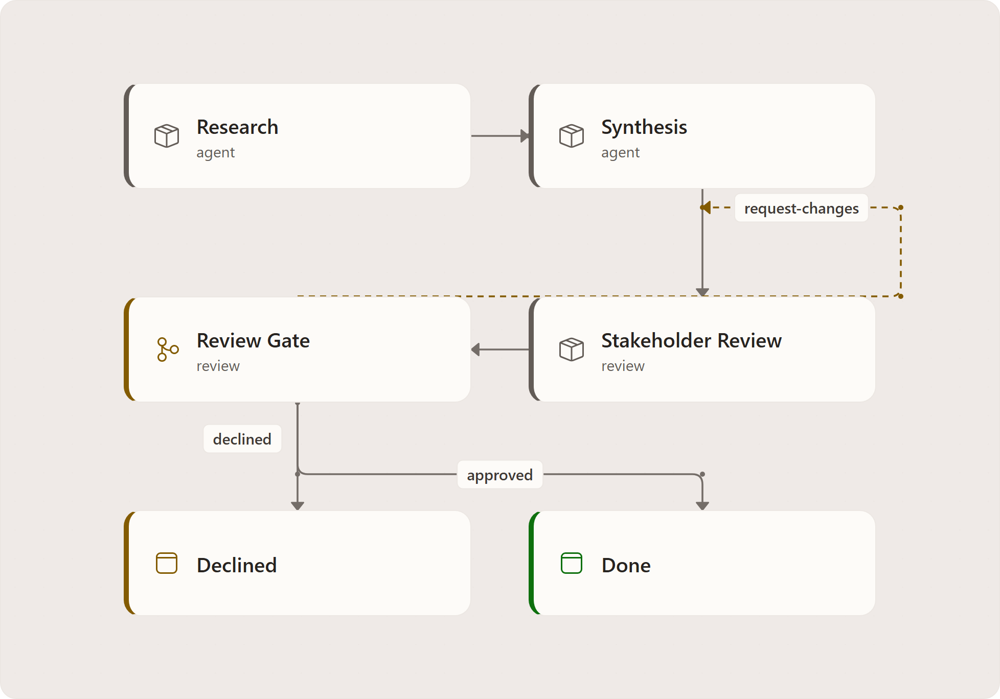
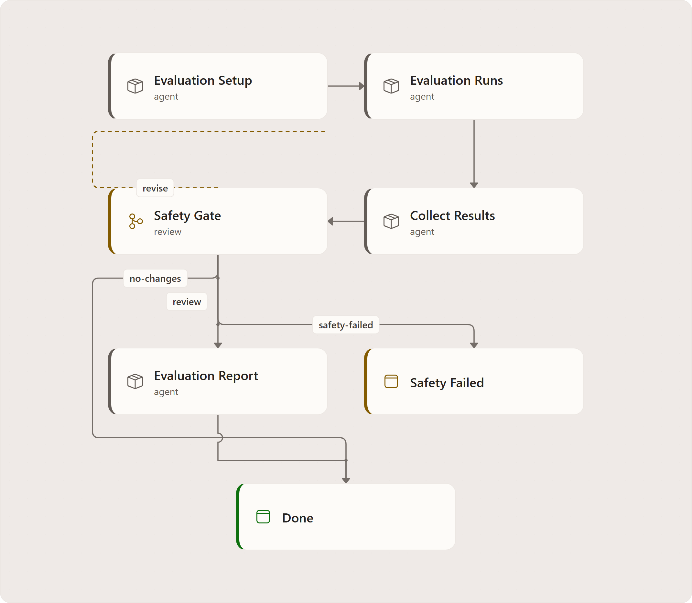
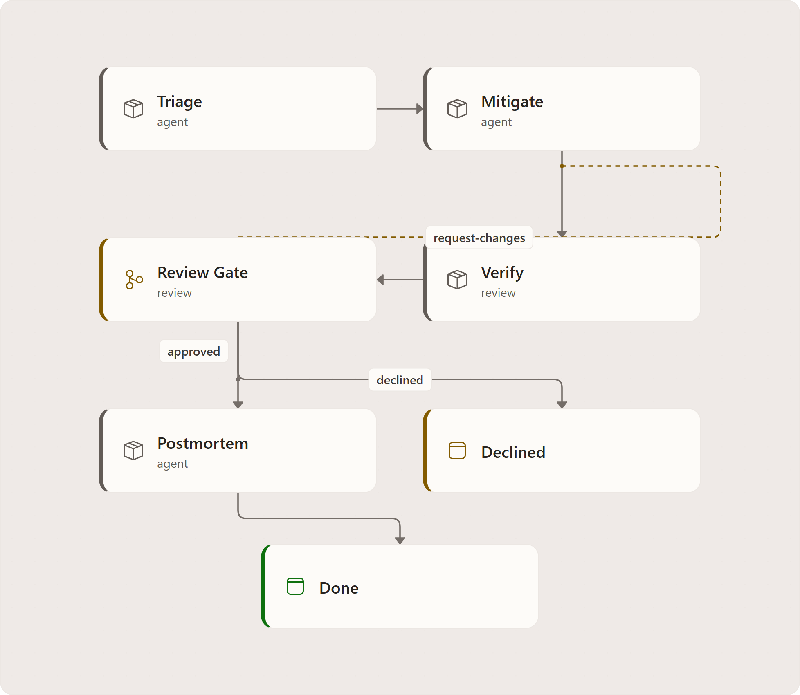
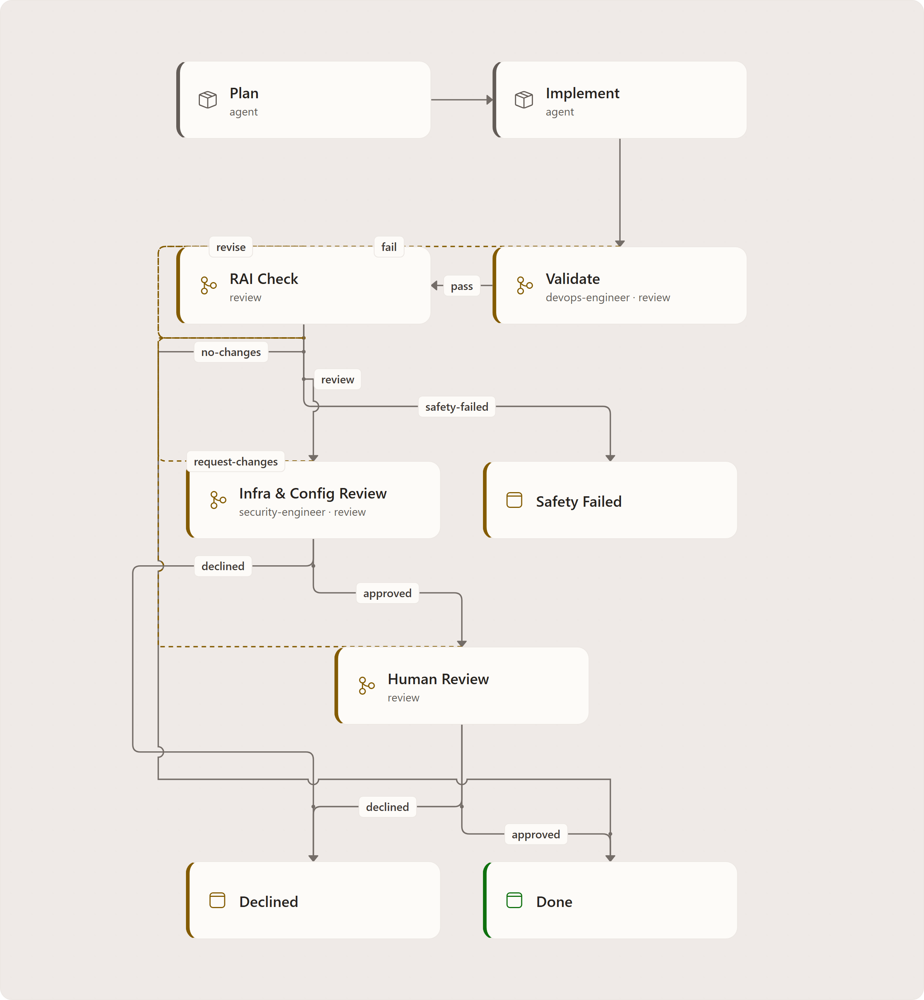

# Workflow Library

Agentweaver ships seven reusable workflow definitions in
`packages/Agentweaver.Squad/Catalog/Resources/workflows/`. A blueprint declares a
`workflows` set; the coordinator selects for process fit, with explicit overrides.
`WorkflowRegistry` also loads the built-in default and project-authored definitions.

## Workflow index

| ID | Purpose | Important gates |
| --- | --- | --- |
| `software-delivery` | Plan and implement software | QA test, RAI, rubberduck, Build/Test, human review |
| `bug-fix` | Triage and fix a defect | QA verification, RAI, Build/Test, human review |
| `content-authoring` | Research, draft, edit and publish text | RAI, human review |
| `pm-discovery` | Research and synthesize a product proposal | Human review |
| `agent-evaluation` | Run and report an agent evaluation | RAI safety |
| `incident-response` | Investigate, mitigate and document an incident | Human review |
| `infra-ops` | Plan and review infrastructure changes | Validation, RAI, infrastructure review, human review |

These are authored workflow graphs, not deployment topologies. Prompt steps and
verdict-producing gates are distinct. The catalog no longer contains a standalone
`code-review` identity; review remains a capability inside workflows.

The YAML definitions do not author Merge, PR publication or Scribe nodes. Collective
assembly owns integration, selected review gates, merge and final recording. The
inspected collective path does **not** establish automatic PR publication. The separate
built-in default explicitly contains a publish/reuse-PR action; that action is not proof
that commits were pushed or publication succeeded.

`CatalogWorkflowBindingTests` checks catalog gates and a bindability subset. Its
bindability theory omits agent-evaluation; that is a test-coverage distinction, not
evidence of unsupported fan-out nodes. The current evaluation graph uses prompt steps.

## `software-delivery`

Plan and implement, pass QA and RAI, receive rubberduck feedback and a code-review
prompt, then pass Build/Test and human review. Revision branches return to implementation;
decline and safety failure have explicit terminals.

## `bug-fix`

Triage and fix, then QA peer verification, RAI, Build/Test and human review.
The lighter intake does not remove safety or build gates.

## `content-authoring`

Research, draft and edit are prompt steps. RAI precedes human review; approval proceeds
to a **publish prompt**, not a merge executor. No-change and failure branches remain visible.

## `pm-discovery`

Research, synthesis and stakeholder review are prompts, followed by a distinct human
gate. Requested changes return to synthesis; approved work reaches the authored Done terminal.

## `agent-evaluation`

Evaluation setup, runs and collection are **sequential prompt nodes**, not
`fan_out`/`fan_in`. The safety gate can request revision, stop unsafe work, finish
without changes, or allow the report prompt.

## `incident-response`

Triage, mitigation and verification are prompts. Human approval leads to the postmortem
prompt; requested changes return to mitigation and decline terminates without a postmortem.

## `infra-ops`

Plan and implement, then DevOps peer validation (`pass`/`fail`), RAI, infrastructure
peer review and human review (`approved`/`request-changes`/`declined`).

## Blueprint workflow mappings

| Blueprint | Declared workflow set, in source order |
| --- | --- |
| Software Development | `software-delivery`, `bug-fix` |
| Product Management | `pm-discovery`, `content-authoring` |
| Content Authoring | `content-authoring` |
| Product & Software Delivery | `pm-discovery`, `software-delivery`, `bug-fix` |
| AI Agent Engineering | `agent-evaluation`, `software-delivery`, `bug-fix` |

These arrays come from the five embedded blueprint JSON files. Source order is not a
guarantee that automatic selection always chooses the first entry. Incident response
and infrastructure operations remain catalog workflows without a dedicated blueprint
in that embedded set.

The built-in `default` supplies Agent -> RAI -> human Review -> Merge -> publish/reuse PR
-> Scribe, with explicit no-change, revision, blocked and failure branches. See
[workflow binding](workflow-binder.md) and [selection](workflow-selection.md).

<!-- Canonical sources: diagrams/src/workflow-*.drawio for the seven images above.
     Export exact names with draw.io Desktop 31.4.5; per-name pitch/pass evidence is
     in diagrams/reviews/. The YAML catalog is the semantic authority. -->

<!-- diagram-context:workflow-agent-evaluation:start -->

Diagram details and constraints

<table><thead><tr><th>Element</th><th>Contract</th></tr></thead><tbody>
<tr><td>title</td><td>Agent Evaluation workflow</td></tr>
<tr><td>subtitle</td><td>Authored graph • all YAML branches retained</td></tr>
<tr><td>returns-heading</td><td>SOURCE / RETURN</td></tr>
<tr><td>outcomes-heading</td><td>OUTCOMES</td></tr>
<tr><td>footer</td><td>Evaluation Runs and Collect Results are prompt steps, not fan-out / fan-in.</td></tr>
<tr><td>Evaluation Setup</td><td>Evaluation Setup</td></tr>
<tr><td>Evaluation Setup</td><td>Agent task</td></tr>
<tr><td>Evaluation Setup</td><td>agent</td></tr>
<tr><td>Evaluation Runs</td><td>Evaluation Runs</td></tr>
<tr><td>Collect Results</td><td>Collect Results</td></tr>
<tr><td>Safety Gate</td><td>Safety Gate</td></tr>
<tr><td>Safety Gate</td><td>Verdict routing</td></tr>
<tr><td>Safety Gate</td><td>rai</td></tr>
<tr><td>Evaluation Report</td><td>Evaluation Report</td></tr>
<tr><td>Safety Failed</td><td>Safety Failed</td></tr>
<tr><td>Safety Failed</td><td>Workflow endpoint</td></tr>
<tr><td>Done</td><td>Done</td></tr>
<tr><td>edge-04-label</td><td>revise</td></tr>
<tr><td>edge-05-label</td><td>safety- failed</td></tr>
<tr><td>edge-06-label</td><td>no- changes</td></tr>
<tr><td>edge-07-label</td><td>review</td></tr>
<tr><td>sequential-prompts-title</td><td>Sequential evaluation</td></tr>
<tr><td>sequential-prompts-sub</td><td>Setup, runs and collection are prompt tasks. No parallel split or join is declared.</td></tr>
<tr><td>sequential-prompts-meta</td><td>agent_evaluation.yaml · nodes</td></tr>
</tbody></table>

<!-- diagram-context:workflow-agent-evaluation:end -->

<!-- diagram-context:workflow-bug-fix:start -->

Diagram details and constraints

<table><thead><tr><th>Element</th><th>Contract</th></tr></thead><tbody>
<tr><td>title</td><td>Bug Fix workflow</td></tr>
<tr><td>subtitle</td><td>Authored graph • all YAML branches retained</td></tr>
<tr><td>returns-heading</td><td>SOURCE / RETURN</td></tr>
<tr><td>outcomes-heading</td><td>OUTCOMES</td></tr>
<tr><td>footer</td><td>Solid: advance / outcome Dashed marigold: revision / return</td></tr>
<tr><td>Triage</td><td>Triage</td></tr>
<tr><td>Triage</td><td>Agent task</td></tr>
<tr><td>Triage</td><td>agent</td></tr>
<tr><td>Fix</td><td>Fix</td></tr>
<tr><td>Verify</td><td>Verify</td></tr>
<tr><td>Verify</td><td>Independent peer review</td></tr>
<tr><td>Verify</td><td>qa-engineer</td></tr>
<tr><td>RAI Check</td><td>RAI Check</td></tr>
<tr><td>RAI Check</td><td>Verdict routing</td></tr>
<tr><td>RAI Check</td><td>rai</td></tr>
<tr><td>Build &amp; Test</td><td>Build &amp; Test</td></tr>
<tr><td>Build &amp; Test</td><td>Build and test verification</td></tr>
<tr><td>Human Review</td><td>Human Review</td></tr>
<tr><td>Human Review</td><td>human-review</td></tr>
<tr><td>Safety Failed</td><td>Safety Failed</td></tr>
<tr><td>Safety Failed</td><td>Workflow endpoint</td></tr>
<tr><td>Declined</td><td>Declined</td></tr>
<tr><td>Done</td><td>Done</td></tr>
<tr><td>edge-03-label</td><td>approved</td></tr>
<tr><td>edge-04-label</td><td>request-changes</td></tr>
<tr><td>edge-05-label</td><td>declined</td></tr>
<tr><td>edge-06-label</td><td>revise</td></tr>
<tr><td>edge-07-label</td><td>safety- failed</td></tr>
<tr><td>edge-08-label</td><td>no- changes</td></tr>
<tr><td>edge-09-label</td><td>review</td></tr>
</tbody></table>

<!-- diagram-context:workflow-bug-fix:end -->

<!-- diagram-context:workflow-content-authoring:start -->

Diagram details and constraints

<table><thead><tr><th>Element</th><th>Contract</th></tr></thead><tbody>
<tr><td>title</td><td>Content Authoring workflow</td></tr>
<tr><td>subtitle</td><td>Authored graph • all YAML branches retained</td></tr>
<tr><td>returns-heading</td><td>SOURCE / RETURN</td></tr>
<tr><td>outcomes-heading</td><td>OUTCOMES</td></tr>
<tr><td>footer</td><td>Solid: advance / outcome Dashed marigold: revision / return</td></tr>
<tr><td>Research</td><td>Research</td></tr>
<tr><td>Research</td><td>Agent task</td></tr>
<tr><td>Research</td><td>agent</td></tr>
<tr><td>Draft</td><td>Draft</td></tr>
<tr><td>Editorial Review</td><td>Editorial Review</td></tr>
<tr><td>Editorial Review</td><td>review</td></tr>
<tr><td>RAI Check</td><td>RAI Check</td></tr>
<tr><td>RAI Check</td><td>Verdict routing</td></tr>
<tr><td>RAI Check</td><td>rai</td></tr>
<tr><td>Human Review</td><td>Human Review</td></tr>
<tr><td>Human Review</td><td>human-review</td></tr>
<tr><td>Publish</td><td>Publish</td></tr>
<tr><td>Safety Failed</td><td>Safety Failed</td></tr>
<tr><td>Safety Failed</td><td>Workflow endpoint</td></tr>
<tr><td>Declined</td><td>Declined</td></tr>
<tr><td>Done</td><td>Done</td></tr>
<tr><td>edge-04-label</td><td>revise</td></tr>
<tr><td>edge-05-label</td><td>safety- failed</td></tr>
<tr><td>edge-06-label</td><td>no- changes</td></tr>
<tr><td>edge-08-label</td><td>approved</td></tr>
<tr><td>edge-09-label</td><td>request-changes</td></tr>
<tr><td>edge-10-label</td><td>declined</td></tr>
</tbody></table>

<!-- diagram-context:workflow-content-authoring:end -->

<!-- diagram-context:workflow-incident-response:start -->

Diagram details and constraints

<table><thead><tr><th>Element</th><th>Contract</th></tr></thead><tbody>
<tr><td>title</td><td>Incident Response workflow</td></tr>
<tr><td>subtitle</td><td>Authored graph • all YAML branches retained</td></tr>
<tr><td>returns-heading</td><td>SOURCE / RETURN</td></tr>
<tr><td>outcomes-heading</td><td>OUTCOMES</td></tr>
<tr><td>footer</td><td>Solid: advance / outcome Dashed marigold: revision / return</td></tr>
<tr><td>Triage</td><td>Triage</td></tr>
<tr><td>Triage</td><td>Agent task</td></tr>
<tr><td>Triage</td><td>agent</td></tr>
<tr><td>Mitigate</td><td>Mitigate</td></tr>
<tr><td>Verify</td><td>Verify</td></tr>
<tr><td>Verify</td><td>review</td></tr>
<tr><td>Review Gate</td><td>Review Gate</td></tr>
<tr><td>Review Gate</td><td>Verdict routing</td></tr>
<tr><td>Review Gate</td><td>human-review</td></tr>
<tr><td>Postmortem</td><td>Postmortem</td></tr>
<tr><td>Declined</td><td>Declined</td></tr>
<tr><td>Declined</td><td>Workflow endpoint</td></tr>
<tr><td>Done</td><td>Done</td></tr>
<tr><td>edge-04-label</td><td>approved</td></tr>
<tr><td>edge-05-label</td><td>request-changes</td></tr>
<tr><td>edge-06-label</td><td>declined</td></tr>
<tr><td>Verify</td><td>Verify is a prompt</td></tr>
<tr><td>Verify</td><td>The review role prepares evidence. Review Gate owns the approval, revision and decline routes.</td></tr>
<tr><td>Verify</td><td>incident_response.yaml · nodes</td></tr>
</tbody></table>

<!-- diagram-context:workflow-incident-response:end -->

<!-- diagram-context:workflow-infra-ops:start -->

Diagram details and constraints

<table><thead><tr><th>Element</th><th>Contract</th></tr></thead><tbody>
<tr><td>title</td><td>Infrastructure &amp; Operations workflow</td></tr>
<tr><td>subtitle</td><td>Authored graph • all YAML branches retained</td></tr>
<tr><td>returns-heading</td><td>SOURCE / RETURN</td></tr>
<tr><td>outcomes-heading</td><td>OUTCOMES</td></tr>
<tr><td>footer</td><td>Solid: advance / outcome Dashed marigold: revision / return</td></tr>
<tr><td>Plan</td><td>Plan</td></tr>
<tr><td>Plan</td><td>Agent task</td></tr>
<tr><td>Plan</td><td>agent</td></tr>
<tr><td>Implement</td><td>Implement</td></tr>
<tr><td>Validate</td><td>Validate</td></tr>
<tr><td>Validate</td><td>Independent peer review</td></tr>
<tr><td>Validate</td><td>devops-engineer</td></tr>
<tr><td>RAI Check</td><td>RAI Check</td></tr>
<tr><td>RAI Check</td><td>Verdict routing</td></tr>
<tr><td>RAI Check</td><td>rai</td></tr>
<tr><td>Infra &amp; Config Review</td><td>Infra &amp; Config Review</td></tr>
<tr><td>Infra &amp; Config Review</td><td>security-engineer</td></tr>
<tr><td>Human Review</td><td>Human Review</td></tr>
<tr><td>Human Review</td><td>human-review</td></tr>
<tr><td>Safety Failed</td><td>Safety Failed</td></tr>
<tr><td>Safety Failed</td><td>Workflow endpoint</td></tr>
<tr><td>Declined</td><td>Declined</td></tr>
<tr><td>Done</td><td>Done</td></tr>
<tr><td>edge-03-label</td><td>pass</td></tr>
<tr><td>edge-04-label</td><td>fail</td></tr>
<tr><td>edge-05-label</td><td>revise</td></tr>
<tr><td>edge-06-label</td><td>safety- failed</td></tr>
<tr><td>edge-07-label</td><td>no- changes</td></tr>
<tr><td>edge-08-label</td><td>review</td></tr>
<tr><td>edge-09-label</td><td>approved</td></tr>
<tr><td>edge-10-label</td><td>request-changes</td></tr>
<tr><td>edge-11-label</td><td>declined</td></tr>
</tbody></table>

<!-- diagram-context:workflow-infra-ops:end -->

<!-- diagram-context:workflow-pm-discovery:start -->

Diagram details and constraints

<table><thead><tr><th>Element</th><th>Contract</th></tr></thead><tbody>
<tr><td>title</td><td>Product discovery workflow</td></tr>
<tr><td>subtitle</td><td>Authored graph • all YAML branches retained</td></tr>
<tr><td>returns-heading</td><td>SOURCE / RETURN</td></tr>
<tr><td>outcomes-heading</td><td>OUTCOMES</td></tr>
<tr><td>footer</td><td>Solid: advance / outcome Dashed marigold: revision / return</td></tr>
<tr><td>Research</td><td>Research</td></tr>
<tr><td>Research</td><td>Agent task</td></tr>
<tr><td>Research</td><td>agent</td></tr>
<tr><td>Synthesis</td><td>Synthesis</td></tr>
<tr><td>Stakeholder Review</td><td>Stakeholder Review</td></tr>
<tr><td>Stakeholder Review</td><td>review</td></tr>
<tr><td>Review Gate</td><td>Review Gate</td></tr>
<tr><td>Review Gate</td><td>Verdict routing</td></tr>
<tr><td>Review Gate</td><td>human-review</td></tr>
<tr><td>Declined</td><td>Declined</td></tr>
<tr><td>Declined</td><td>Workflow endpoint</td></tr>
<tr><td>Done</td><td>Done</td></tr>
<tr><td>edge-04-label</td><td>approved</td></tr>
<tr><td>edge-05-label</td><td>request-changes</td></tr>
<tr><td>edge-06-label</td><td>declined</td></tr>
<tr><td>discovery-output-title</td><td>Discovery output</td></tr>
<tr><td>discovery-output-sub</td><td>Research, requirements and feature definition produce documents and specs, not deployable code.</td></tr>
<tr><td>discovery-output-meta</td><td>pm_discovery.yaml · description</td></tr>
<tr><td>stakeholder-contract-title</td><td>Prepare, then decide</td></tr>
<tr><td>stakeholder-contract-sub</td><td>Stakeholder Review prepares synthesis for approval. Only Review Gate emits verdicts.</td></tr>
<tr><td>stakeholder-contract-meta</td><td>review prompt · human-review gate</td></tr>
</tbody></table>

<!-- diagram-context:workflow-pm-discovery:end -->

<!-- diagram-context:workflow-software-delivery:start -->

Diagram details and constraints

<table><thead><tr><th>Element</th><th>Contract</th></tr></thead><tbody>
<tr><td>title</td><td>Software Delivery workflow</td></tr>
<tr><td>subtitle</td><td>Authored graph • all YAML branches retained</td></tr>
<tr><td>returns-heading</td><td>SOURCE / RETURN</td></tr>
<tr><td>outcomes-heading</td><td>OUTCOMES</td></tr>
<tr><td>footer</td><td>Solid: advance / outcome Dashed marigold: revision / return</td></tr>
<tr><td>Plan</td><td>Plan</td></tr>
<tr><td>Plan</td><td>Agent task</td></tr>
<tr><td>Plan</td><td>agent</td></tr>
<tr><td>Implement</td><td>Implement</td></tr>
<tr><td>Test Gate</td><td>Test Gate</td></tr>
<tr><td>Test Gate</td><td>Independent peer review</td></tr>
<tr><td>Test Gate</td><td>qa-engineer</td></tr>
<tr><td>RAI Check</td><td>RAI Check</td></tr>
<tr><td>RAI Check</td><td>Verdict routing</td></tr>
<tr><td>RAI Check</td><td>rai</td></tr>
<tr><td>Rubberduck Review</td><td>Rubberduck Review</td></tr>
<tr><td>Rubberduck Review</td><td>rubberduck</td></tr>
<tr><td>Code Review</td><td>Code Review</td></tr>
<tr><td>Code Review</td><td>review</td></tr>
<tr><td>Build &amp; Test</td><td>Build &amp; Test</td></tr>
<tr><td>Build &amp; Test</td><td>Build and test verification</td></tr>
<tr><td>Review Gate</td><td>Review Gate</td></tr>
<tr><td>Review Gate</td><td>human-review</td></tr>
<tr><td>Safety Failed</td><td>Safety Failed</td></tr>
<tr><td>Safety Failed</td><td>Workflow endpoint</td></tr>
<tr><td>Declined</td><td>Declined</td></tr>
<tr><td>Done</td><td>Done</td></tr>
<tr><td>edge-03-label</td><td>pass</td></tr>
<tr><td>edge-04-label</td><td>fail</td></tr>
<tr><td>edge-05-label</td><td>revise</td></tr>
<tr><td>edge-06-label</td><td>safety- failed</td></tr>
<tr><td>edge-07-label</td><td>no- changes</td></tr>
<tr><td>edge-12-label</td><td>approved</td></tr>
<tr><td>edge-13-label</td><td>request-changes</td></tr>
<tr><td>edge-14-label</td><td>declined</td></tr>
</tbody></table>

<!-- diagram-context:workflow-software-delivery:end -->
