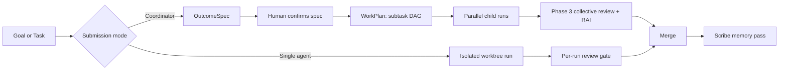

# Agentweaver — Multi-Agent Orchestration System

## 1. Overview

Agentweaver is a general-purpose multi-agent orchestration platform. It runs AI agents on any knowledge-work task inside sandboxed git worktrees, streams every step live, and requires human review before anything commits. The scenario is defined by the workflow, not the platform: software delivery, content authoring, PM discovery, incident response, agent evaluation, and more. Teams submit a task or a goal, choose or generate a workflow that fits the scenario, watch named specialist agents work in isolation, review the result, and approve the outcome.

Agentweaver supports two submission modes:

- **Single-agent run.** Submit a task. One named agent works in an isolated workspace. You stream every step live, review the result, then approve, decline, or request changes before the commit.
- **Coordinator orchestration (multi-agent).** Submit a goal. A coordinator drafts an OutcomeSpec (Outcome Specification: goal, desired outcome, scope, and assumptions). You confirm the spec before any work starts. The coordinator decomposes the spec into a WorkPlan (subtasks arranged in a dependency graph), dispatches parallel child runs, and shows a live topology graph of every agent and its status. You steer mid-run. After all agents finish, you review the assembled work once, behind a single human gate that includes a Responsible AI (RAI) pass. After the merge, a Scribe agent records what the team learned.

### Problem Statement / Motivation

Before Agentweaver, teams that wanted to orchestrate AI agents across knowledge-work scenarios had to assemble fragmented tooling: running individual agents per task, coordinating multiple agents by hand, and choosing between full automation (no oversight) or full manual control (no scale). There was no governed, scenario-flexible path from intent to reviewed outcome across a team of AI specialists.

Now, teams submit a goal to Agentweaver, choose or generate a workflow that fits the scenario, and get a confirmed plan, parallel specialist agents working in isolation, live streaming of every step, and a single human review gate before anything is committed — with full memory and decision tracing across every run.

## 2. Goals / Non-Goals

### Functional Goals

- Run single AI agents on any knowledge-work task in isolated git worktrees with live streaming.
- Coordinate multiple agents from one goal through a confirmed plan and parallel execution.
- Support multiple delivery scenarios through a YAML-defined workflow system.
- Enforce human-in-the-loop (HITL) review at meaningful boundaries before any merge.
- Persist memory and decisions across runs so agents build on prior work.
- Govern every tool and shell action through a deny-by-default sandbox.
- Expose the full feature set programmatically through a Model Context Protocol (MCP) server.
- Provide a web interface for capture, monitoring, review, and configuration.

### Non-Functional Goals

- Keep team state, memory, and decisions file-native, repo-resident, and inspectable.
- Persist every streaming event before fan-out so runs are auditable and resumable.
- Fail closed: when a policy decision is ambiguous, deny the action.
- Support self-hosted deployment with no platform-level cloud dependency.

### Non-Goals

- Agentweaver does not aim to be a general-purpose agent framework you embed as a library (see Proposal Option C for the future path).
- Agentweaver does not support arbitrary LLM providers. It supports exactly two: GitHub Copilot and Microsoft Foundry.
- Agentweaver does not replace your git host, code review platform, or CI system.
- Agentweaver does not claim a hardened security boundary. The sandbox is defense-in-depth, not a guarantee.

## 3. Narrative / Personas

| Persona | Required permissions | User Journey and Success Criteria |
|---|---|---|
| Software Engineer | Repository **Write** | Submits any task (code, research, content), watches runs live, reviews results, approves or requests changes. Success: ships a reviewed outcome faster than doing it manually, while keeping oversight of every step. |
| Tech Lead / Engineering Manager | Repository **Admin** | Sets up projects, configures teams through casting, sets sandbox policy, manages the backlog, reviews decisions. Success: the team runs predictably under governance the lead controls. |
| Product Manager | Repository **Write** (or **Read** for monitoring) | Submits pm-discovery workflows, captures backlog tasks, monitors the board, reads orchestration outcomes, reviews decisions. Success: turns intent into discovery outcomes and gains visibility into what agents are doing and why, without needing agent internals. |
| Content Creator / Technical Writer | Repository **Write** | Submits content-authoring workflows, watches drafts take shape, reviews drafted content, approves publish. Success: produces reviewed content at scale with a human gate before anything ships. |
| Incident Commander / DevOps | Repository **Write** | Submits incident-response workflows, steers agents mid-incident, reviews postmortems. Success: drives a governed response and captures a reviewed postmortem with full tracing. |
| Platform / DevOps Engineer | Repository **Admin** plus deployment access | Configures deployments, manages LLM provider credentials, sets sandbox profiles, monitors diagnostics and heartbeat. Success: the platform stays reliable and observable. |
| AI / MCP Client | API key or GitHub OAuth (org-scoped) | An automated system (another AI agent, a CI pipeline, or an MCP-capable tool) drives the full lifecycle through the MCP server. Success: completes capture-to-outcome programmatically with the same governance as the UI. |

## 4. Customers and Business Impact

Agentweaver targets any team that uses AI agents for knowledge work and wants to scale that use without losing oversight: engineering, product, content and DevRel, and operations or SRE teams. The primary customers sit inside the Microsoft and GitHub ecosystem, since the platform supports GitHub Copilot and Microsoft Foundry as its two providers.

The business impact is a governed, scenario-flexible path from intent to reviewed outcome across a team of AI specialists. Teams gain parallel throughput from multiple agents, a single review gate instead of many, and a durable record of decisions and learnings. Leads gain predictable governance over what agents may touch. Platform owners gain observability and a self-hosted footprint with no platform-level cloud dependency.

<!-- TODO: Add real adoption, throughput, and cost-impact data from pilot deployments -->

## 5. Existing Solutions or Expectations

Teams today assemble agent-based workflows from separate parts for any scenario, not just coding: individual agents (for example, GitHub Copilot Coding Agent for software delivery, or other task-specific agents), manual review, and ad-hoc scripts to coordinate multiple agents. Open-source frameworks such as LangGraph, AutoGen, and CrewAI provide orchestration primitives but leave the full-stack experience, HITL governance, scenario workflows, and persistent team memory to the developer. Managed runtimes such as Google Gemini Enterprise Agent Platform and AWS Bedrock Multi-Agent provide hosted execution but keep state opaque and offer HITL through workflow patterns rather than a mandatory confirmation gate.

The industry now expects a baseline (the table-stakes set in the Compete section): named specialist agents, a durable resumable run model, first-class HITL, two-tier memory, tools on open standards, parallel execution with coordinator routing, and observability. Agentweaver meets that bar and adds file-native inspectable state, a typed decision ledger, a mandatory OutcomeSpec gate, and a single collective review.

## 6. What will the announcement look like?

**Agentweaver: run a team of AI agents for any scenario you can describe.**

Today you can submit a goal to Agentweaver and watch a team of named AI specialists deliver it for whatever your team needs: software delivery, content authoring, PM discovery, incident response, agent evaluation, and more, with a human in control at every gate that matters.

Pick a scenario through a workflow, then pick a mode. Hand one agent a task and watch it work in an isolated workspace, then review the result and approve it. Or hand the coordinator a goal: it drafts a plan, you confirm it before any work starts, and then a squad of specialists works in parallel, each in its own sandbox. You see a live graph of every agent. You steer mid-run. When the team finishes, you review the assembled work once, behind a single gate that includes a Responsible AI check.

Everything is inspectable. Your team roster, the decisions the agents make, and the memory they build all live as human-readable files in your repository. Nothing is hidden in an opaque managed store. Every step streams live and is recorded before it fans out, so you get a full audit trail.

Agentweaver is self-hosted. It runs with GitHub Copilot or Microsoft Foundry. Drive it from the web UI or from any MCP-compatible client.

<!-- TODO: Add launch date, availability, and pricing once decided -->

## 7. Proposal

Agentweaver could ship in three shapes.

### Option A: Standalone platform (current approach)

A self-hosted platform with its own web UI, MCP server, and opinionated scenario workflows.

- **Pros:** Full control over HITL gates, sandbox, and governance. Coherent out-of-box experience.
- **Cons:** Adoption requires deployment and configuration. No zero-setup path.

### Option B: SDK only

Publish the orchestration primitives as a library that developers embed in their own apps.

- **Pros:** Maximum flexibility.
- **Cons:** No out-of-box experience. Governance enforcement becomes the developer's problem.

### Option C: Platform plus SDK (recommended for future)

Start with Option A to prove the full-stack story, then extract primitives into SDK packages as adoption grows.

- **Pros:** Best of both. HITL and governance are established before delegation.
- **Cons:** More surface area to maintain.

**Recommendation:** Ship Option A now. Move to Option C as adoption grows, so the governance model is proven before primitives are delegated to embedders.

## 8. User Experience

This section describes what you can do. It does not describe how the system is built.

### Submit and monitor a single-agent run

You submit a task with a title and description. One named agent claims it and works in an isolated workspace. What it produces depends on the workflow. You watch every step stream live: the agent's messages, its tool calls and results, the questions it asks, and its self-reported intent and outcome. When it finishes, you review the result and choose to approve, decline, or request changes. On approval, the work is committed.

### Run a coordinator orchestration

You submit a goal. The coordinator drafts an OutcomeSpec stating the goal, the desired outcome, the scope, and its assumptions. You confirm or edit the spec before any work begins. The coordinator then decomposes the spec into a WorkPlan: subtasks arranged in a dependency graph. Child agents run in parallel, each isolated. You watch a live topology graph showing every agent and its status. While the run is active you can steer: send a directive, redirect a child run, amend the plan, or stop the run. When every agent finishes, you review the assembled work once, behind a single human gate that includes an RAI pass. After the merge, the Scribe records what the team learned.

### Handle failures and problems

Not every run ends in a clean diff. When a single-agent run errors, the agent crashes, or a provider is unavailable, the run moves to the Problems column with the failure reason surfaced, rather than silently disappearing. When a child run fails mid-orchestration, the subtask state machine routes it through recovery guidance and redispatch. If approving a merge surfaces a conflict, you see the conflict and resolve it instead of the system merging silently.

### Manage the board and backlog

You capture tasks with a title and description into the Backlog. You rank them and drag tasks between Backlog and Ready. The coordinator owns the rest of the board. The board has six columns: Backlog, Ready, Problems, Human Review, Active, and Done. You can also decompose a specification file into tasks automatically, and import Markdown files from the workspace as backlog tasks. A periodic heartbeat promotes Ready tasks and starts coordinator runs for them, up to a configurable limit.

### Cast and manage a squad

Each project has a Squad: named specialist agents drawn from a thematic universe (for example, Matrix or Star Wars), each with a charter that defines its role, responsibilities, and model tier. You cast a team in one of three ways: from a scenario, from a free-text goal, or from project analysis. Team state lives as human-readable files in the project, so you can read and edit it directly. You can also save a team as a reusable Blueprint that bundles a roster, workflows, a review policy, and a sandbox profile, and you can generate a blueprint from a description.

### Work with memory and decisions

Agents build on prior work through four memory layers compiled into each agent's context: active architectural and scope Decisions (hard constraints), core context memories, the top high-importance learnings and patterns, and the open session. Agents submit entries to a Decision Inbox, typed as learning, pattern, update, architectural, or scope. The coordinator or Scribe reviews pending entries and merges them into a shared decisions ledger. You browse Decisions and Agent Memory in the UI.

### Author and select workflows

Workflows are multi-role pipelines defined in YAML. Agentweaver ships a built-in library: software-delivery, bug-fix, code-review, content-authoring, pm-discovery, incident-response, and agent-evaluation. When you submit a task, an LLM pass matches it to the best-fit workflow. You can also author a workflow in a YAML, visual, or graph editor, or generate one from a description.

### Drive Agentweaver programmatically

Any MCP-compatible client can drive the full lifecycle through the MCP server: projects, runs, the coordinator, the backlog and board, workflows, blueprints, team casting, the catalog, memory and decisions, GitHub auth, sandbox policy, diagnostics, and workspace browsing. Clients authenticate with an API key or GitHub OAuth.

### Configure the sandbox and review policy

You set the sandbox profile per project. The sandbox is deny-by-default and fail-closed, with a tool-name policy layer and a path-containment layer. You configure tool approval scopes (once, run, always, or per tool) and shell approval for destructive commands. Autopilot can auto-answer clarifying questions, and auto-approve-tools can auto-grant allow-with-approval tools.

### Monitor health and inspect runs

You run global and per-project diagnostics that report pass, warn, or fail. You watch the Overview screen for fleet metrics and the Flow screen for live agent activity. You browse the project repository and worktrees read-only. Runs can expose ports from the sandbox to the host for inspection.

## 9. Definition of Success

### Expected Impact

| Outcome | Measure | Target |
|---|---|---|
| Faster reviewed delivery | Time from task submission to merged, reviewed change | *Estimated; needs validation.* <!-- TODO: Add baseline and target from pilot --> |
| Parallel throughput | Concurrent child runs completed per orchestration | <!-- TODO: Add real data from pilot deployments --> |
| Reduced review burden | Human review gates per orchestration | One collective gate per orchestration instead of one per agent |
| Governed actions | Share of tool and shell actions passing through policy | 100% (deny-by-default, fail-closed) |
| Knowledge retention | Decisions and learnings captured per completed run | <!-- TODO: Add real data once Scribe output is measured --> |
| Auditability | Share of streamed events persisted before fan-out | 100% |

## 10. Requirements

### Functional Requirements

| # | Requirement | Priority |
|---|---|---|
| FR-1 | You can create a project that maps to a git repository, with a default branch, LLM provider settings, and a sandbox profile. | P0 |
| FR-2 | You can submit a single-agent run that works in an isolated workspace. | P0 |
| FR-3 | The system streams every run step live, including messages, tool calls, results, questions, and intent/outcome. | P0 |
| FR-4 | Streaming supports resume with Last-Event-ID after a disconnect. | P1 |
| FR-5 | You can review a completed run's diff and approve, decline, or request changes before merge. | P0 |
| FR-6 | The system models a stable WorkflowRun job envelope, with Runs for executions, revisions, and retries. | P0 |
| FR-7 | You can submit a goal to the coordinator and receive a drafted OutcomeSpec. | P0 |
| FR-8 | You must confirm the OutcomeSpec before any orchestration work begins. | P0 |
| FR-9 | The coordinator decomposes a confirmed spec into a WorkPlan with a subtask dependency graph. | P0 |
| FR-10 | Child runs execute in parallel, each in its own isolated worktree. | P0 |
| FR-11 | A live topology graph shows every agent and its status during an orchestration. | P1 |
| FR-12 | You can steer an active orchestration: send a directive, redirect a child run, amend the plan, or stop the run. | P0 |
| FR-13 | After all child runs finish, the system runs a single Phase 3 collective assembly review behind one human gate. | P0 |
| FR-14 | A Responsible AI step produces a verdict on completed work and routes it: GREEN proceeds to the human gate, YELLOW proceeds with recorded advisories, REVISE returns the work to the agent for revision, and RED rejects it. | P0 |
| FR-15 | A RED RAI verdict triggers rejection and locks out the original agent. | P0 |
| FR-16 | The board provides six columns: Backlog, Ready, Problems, Human Review, Active, and Done. | P0 |
| FR-17 | Only Backlog and Ready are human-draggable; the coordinator owns all other column movement. | P0 |
| FR-18 | You can capture backlog tasks with a title and description and rank them. | P0 |
| FR-19 | A heartbeat promotes Ready tasks and starts coordinator runs, up to a configurable limit (default 3, max 20). | P0 |
| FR-20 | You can decompose a specification file into backlog tasks automatically. | P1 |
| FR-21 | The sandbox is deny-by-default and fail-closed, with a tool-name policy layer and a path-containment layer. | P0 |
| FR-22 | Filesystem isolation rejects path escapes, including symlinks and junctions. | P0 |
| FR-23 | Shell execution requires isolation or explicit approval. | P0 |
| FR-24 | The system supports sandbox isolation backends for Windows (mxc), bwrap/WSL, and Linux native. | P1 |
| FR-25 | Tool approval supports scopes: once, run, always, and per tool. | P0 |
| FR-26 | A question gate pauses the run for human input when an agent asks a question. | P0 |
| FR-27 | Autopilot auto-answers clarifying questions only; auto-approve-tools auto-grants allow-with-approval tools. | P1 |
| FR-28 | Each project has a Squad of named specialist agents, each with a charter defining role, responsibilities, and model tier. | P0 |
| FR-29 | You can cast a team three ways: scenario-based, free-text goal, or project analysis. | P1 |
| FR-30 | Team state is stored as human-readable files in the project. | P0 |
| FR-31 | Four memory layers are compiled into each agent's context: active Decisions, core context, top learnings/patterns, and open session. | P0 |
| FR-32 | Agents submit typed entries to a Decision Inbox (learning, pattern, update, architectural, scope). | P0 |
| FR-33 | Architectural and scope decision types are coordinator-reserved. | P0 |
| FR-34 | The coordinator or Scribe merges pending inbox entries into a shared decisions ledger. | P0 |
| FR-35 | A Scribe runs after each completed orchestration to merge the inbox, write logs, update cross-agent history, and archive large history files. | P1 |
| FR-36 | Workflows are YAML-defined multi-role pipelines, with a built-in library of seven workflows covering software delivery, bug fixing, code review, content authoring, PM discovery, incident response, and agent evaluation. | P0 |
| FR-37 | An LLM pass selects the best-fit workflow for a submitted task. | P1 |
| FR-38 | You can author workflows in YAML, visual, and graph editors, and generate a workflow from a description. | P2 |
| FR-39 | You can save a team as a reusable Blueprint and generate a blueprint from a description. | P2 |
| FR-40 | The system supports exactly two LLM providers: GitHub Copilot (GitHub OAuth device flow) and Microsoft Foundry (Azure OpenAI). | P0 |
| FR-41 | An MCP server exposes the full feature set as MCP tools, authenticated by API key or GitHub OAuth. | P0 |
| FR-42 | The web UI provides Overview, Project Gallery, Project Dashboard, Board, Flow, Orchestrations, Workspace, Team/Casting, Memories, Workflows, Diagnostics, Heartbeat, and Settings screens. | P0 |
| FR-43 | The `run.outcome` event carries an `achieved` boolean and a `reason`. | P1 |
| FR-44 | Global and per-project diagnostics report pass, warn, or fail. | P1 |
| FR-45 | Runs can expose ports from the sandbox to the host for inspection. | P2 |
| FR-46 | The workspace browser provides read-only browsing of the repository and worktrees, and imports Markdown files as backlog tasks. | P2 |
| FR-47 | Authentication uses GitHub device-flow OAuth, with optional GitHub org restriction. | P1 |
| FR-48 | On approval, the merge runs with conflict detection and surfaces conflicts to the reviewer instead of merging silently. | P0 |
| FR-49 | The platform supports any knowledge-work scenario through the workflow system; the scenario is defined by the workflow, not the platform. | P0 |

### Test Requirements

| # | Test | Priority |
|---|---|---|
| TR-1 | Verify a single-agent run executes inside an isolated worktree and cannot write outside it. | P0 |
| TR-2 | Verify path-escape attempts via symlinks and junctions are rejected. | P0 |
| TR-3 | Verify shell execution is blocked without isolation or explicit approval. | P0 |
| TR-4 | Verify the OutcomeSpec gate blocks all orchestration work until human confirmation. | P0 |
| TR-5 | Verify the coordinator produces a WorkPlan with a valid dependency graph from a confirmed spec. | P0 |
| TR-6 | Verify parallel child runs are isolated from each other. | P0 |
| TR-7 | Verify steering actions (directive, redirect, amend, stop) take effect on an active orchestration. | P0 |
| TR-8 | Verify the Phase 3 collective review presents one gate for all assembled work. | P0 |
| TR-9 | Verify a RED RAI verdict rejects the work and locks out the original agent. | P0 |
| TR-10 | Verify a RED/REVISE/YELLOW/GREEN verdict each routes to the correct outcome. | P0 |
| TR-11 | Verify only Backlog and Ready columns accept human drag operations. | P0 |
| TR-12 | Verify the heartbeat promotes at most `MaxReadyPerHeartbeat` tasks and claims atomically. | P0 |
| TR-13 | Verify tool approval scopes (once, run, always, tool) are honored. | P0 |
| TR-14 | Verify the question gate pauses the run until a human answers. | P0 |
| TR-15 | Verify the four memory layers appear in a compiled agent context in the correct precedence. | P1 |
| TR-16 | Verify architectural and scope inbox entries cannot be submitted by non-coordinator agents. | P0 |
| TR-17 | Verify the Scribe merges the inbox and writes logs after a completed orchestration. | P1 |
| TR-18 | Verify streaming resumes correctly using Last-Event-ID. | P1 |
| TR-19 | Verify every streamed event is persisted before fan-out. | P0 |
| TR-20 | Verify the MCP server enforces API-key and GitHub OAuth authentication. | P0 |
| TR-21 | Verify only GitHub Copilot and Microsoft Foundry providers are accepted. | P1 |
| TR-22 | Verify merge conflict detection on approval. | P0 |
| TR-23 | Verify diagnostics report pass, warn, and fail for known healthy and unhealthy states. | P1 |

## 11. Dependencies and Risks

| Item | Type | Description | Mitigation |
|---|---|---|---|
| GitHub Copilot | Dependency | One of two supported LLM providers; requires a GitHub Copilot token via OAuth device flow. | Support Microsoft Foundry as an alternative provider. |
| Microsoft Foundry (Azure OpenAI) | Dependency | The second supported provider; requires a Foundry endpoint. | Support GitHub Copilot as an alternative provider. |
| Git host and git tooling | Dependency | Runs operate in isolated git worktrees for any task type, not only code; merges use git with conflict detection. | Standard git rollback; each run uses a branch. |
| MCP-compatible clients | Dependency | Programmatic access depends on the MCP standard. | Maintain the web UI as a first-class alternative. |
| Sandbox isolation backends | Dependency | Isolation relies on mxc (Windows), bwrap/WSL, or Linux native. | Fail closed when isolation is unavailable. |
| Sandbox is defense-in-depth, not a hardened boundary | Risk | The sandbox reduces risk but is not a guaranteed security boundary; no Windows network allowlist yet. | Deny-by-default, fail-closed, human approval for shell; document the limitation. |
| Provider availability and rate limits | Risk | Agent work stalls if a provider is unavailable or throttled. | Diagnostics surface provider health; <!-- TODO: define retry/backoff policy --> |
| LLM output quality | Risk | Agents may produce incorrect or unsafe code. | RAI stage, human review gate, full audit trail. |
| Adoption friction | Risk | Self-hosted deployment and configuration raise the barrier to entry. | Blueprints and casting reduce setup; future SDK path (Option C). |
| Child run failure mid-orchestration | Risk | A failed subtask can stall an orchestration. | Subtask state machine handles failed → recovery guidance → redispatch. |
| Scenario coverage | Risk | Teams expect built-in workflows for their domain, but the library is limited to the seven current built-ins. | Workflow generation creates new scenarios from a description, though it adds setup friction. |

## 12. Anticipated Questions & Objections

| Question | Answer |
|---|---|
| Why not just use LangGraph, AutoGen, or CrewAI? | Those frameworks provide orchestration primitives. Agentweaver provides the full-stack, scenario-flexible story: HITL governance at every meaningful gate, a sandbox, persistent memory and decisions, a workflow system, and a web UI plus MCP server. It also carries Squad lineage and integrates with the GitHub Copilot ecosystem. |
| Why only two LLM providers? | This is deliberate. GitHub Copilot and Microsoft Foundry cover the Microsoft and GitHub ecosystem. Adding more providers is a scope decision not yet taken. |
| How is this different from GitHub Copilot Coding Agent? | Agentweaver is multi-agent with a coordinator, explicit review gates, persistent memory and decisions, and a scenario workflow system. It orchestrates a team, not a single agent. |
| Is the sandbox secure? | It is deny-by-default and fail-closed, with tool-name policy and path containment. It is acknowledged defense-in-depth, not a hardened boundary. There is no Windows network allowlist yet. |
| What happens if a child run fails mid-orchestration? | The subtask state machine handles the failure: failed → recovery guidance → redispatch. |
| How do agents learn from previous runs? | Through the Decision Inbox, AgentMemory, and SessionContext, with a Scribe pass after each run that merges decisions and updates cross-agent history. |
| Does it work offline or on-premises? | It is self-hosted with no platform-level cloud dependency. It requires a GitHub Copilot token or a Foundry endpoint to reach a model provider. |
| How do I roll back a bad merge? | Through standard git. Each run uses a branch, and the merge runs with conflict detection. |
| What about regulatory or compliance requirements for AI-generated code? | The RAI stage, the human review gate, and a full audit trail (every event persisted before fan-out) support compliance review. <!-- TODO: confirm specific compliance certifications --> |
| Can the MCP server be used by any AI agent, not just Copilot? | Yes. It uses bearer-token auth with GitHub OAuth, so any MCP-compatible client can drive the full lifecycle. |
| Who can move tasks on the board? | You can drag tasks only between Backlog and Ready. The coordinator owns all other column movement. |
| Can I reuse a team setup across projects? | Yes. Save a Squad as a Blueprint that bundles a roster, workflows, a review policy, and a sandbox profile, or generate one from a description. |

## 13. Compete

Agentweaver sits among open-source agent teams, managed agent runtimes, and orchestration frameworks. Unlike most competitors that focus specifically on code agents, Agentweaver's scenario-agnostic approach is a differentiator: it supports any knowledge-work scenario through its workflow system, where the scenario is defined by the workflow rather than the platform. The table-stakes set the industry expects: named specialist agents with role and charter; a durable, resumable run and task model with a clear state machine; first-class HITL at meaningful boundaries; two-tier memory (session plus curated cross-session); skills and tools on open standards such as MCP; parallel execution with coordinator routing; and observability and audit.

Agentweaver's differentiators against that bar:

- File-native, repo-resident, inspectable team, memory, and decisions, versus opaque managed state.
- A Decision Inbox and decision ledger as an explicit, typed governance primitive.
- A mandatory OutcomeSpec confirmation gate before any work begins.
- A single collective review gate after all parallel agents complete, not N separate reviews.
- Squad lineage plus the Microsoft Agent Framework and GitHub Copilot ecosystem.
- RAI as a first-class workflow stage, not a post-hoc filter.

### bradygaster/squad (direct inspiration)

A human-directed AI dev team built on GitHub Copilot CLI, with file-native state in `.squad/`. Its core concepts are Casting (a thematic named team), Routing (coordinator to parallel agents), Decisions (a `decisions.md` ledger), Scribe (a session logger), Ralph (a watch-mode autonomous issue pickup with four-tier escalation), Ceremonies, and a per-agent `history.md` for compounding knowledge. It is alpha-stage and follows a build-on-top model rather than being a standalone platform. Agentweaver carries this lineage forward into a full platform with a sandbox, a typed decision inbox, RAI, a workflow system, a web UI, and an MCP server. Link: https://github.com/bradygaster/squad

### Google Agent Executor + Agent Substrate + Gemini Enterprise Agent Platform

Google has shipped a layered agent infrastructure stack relevant to this PRD:

**Agent Executor** is Google's distributed agent runtime, announced in 2026. It is harness-agnostic: you bring your own agent framework or use a vendor-provided one. It runs the entire agentic stack (MCPs, skills, sub-agents) on your own data plane with custom isolation boundaries and workload policy enforcement. It is designed for enterprise sovereignty: no vendor lock-in, full data residency control, and self-managed compute. Link: https://cloud.google.com/blog/products/ai-machine-learning/agent-executor-googles-distributed-agent-runtime

**Agent Substrate** is a new open-source Kubernetes abstraction layer, also announced in 2026, designed for millions of simultaneous agents at sub-second tool-call latency. Standard Kubernetes handles thousands of long-running services; Agent Substrate handles the chatter of hundreds of millions of sub-second tool calls that would otherwise overwhelm a standard control plane. It pairs the secure runtime and snapshotting capabilities of GKE Agent Sandbox with a minimal control plane, enabling real-time scheduling of agents onto and off ready compute capacity. GKE Agent Sandbox itself is now generally available, provisioning roughly 300 sandboxes per second per cluster at sub-second startup latency. Links: https://cloud.google.com/blog/products/containers-kubernetes/bringing-you-agent-sandbox-on-gke-and-agent-substrate · https://github.com/agent-substrate/substrate

**Gemini Enterprise Agent Platform** (formerly Vertex AI Agent Engine) is a fully managed, serverless, stateful runtime. It provides a Memory Bank (LLM-consolidated, cross-session), an Agent Gateway (MCP-governed), Agent Identity (mTLS plus DPoP), and an Agent Registry. Its Govern pillar is an enterprise security layer that no open-source framework matches. HITL is delivered through workflow patterns rather than a programmatic interrupt. Link: https://docs.cloud.google.com/gemini-enterprise-agent-platform/overview

Agentweaver differs from this stack by being self-hosted without requiring Kubernetes or GKE, keeping state file-native and inspectable rather than in a managed store, enforcing a mandatory OutcomeSpec confirmation gate before any work begins, and targeting teams that need governed, scenario-flexible agent orchestration rather than general enterprise agent infrastructure.

### OpenClaw.ai

A self-hosted, multi-channel agent gateway covering 20+ messaging channels, licensed MIT. Its primitives are a Gateway, Channels, Agents, Skills (the SKILL.md / agentskills.io standard), and file-native memory. It is an executor that other orchestrators (such as Paperclip) coordinate. Its Skill Workshop has an agent propose a skill and a human approve it before write. Agentweaver overlaps on file-native memory and human-approval gates but targets governed knowledge work across scenarios rather than multi-channel messaging. Link: https://openclaw.ai

### Nous Hermes Agent + Kanban

A self-improving, terminal-native agent that creates reusable skills from experience, licensed MIT. It uses a durable SQLite Kanban (triage → todo → ready → running → blocked → done → archived), named profiles, comments as an inter-agent protocol, and crash-reclaim. Its memory is a bounded frozen text store plus an unlimited searchable session database. It is the closest peer to Agentweaver's durable multi-agent plus persistent-memory model. Agentweaver differs through its mandatory OutcomeSpec gate, its single collective review, RAI as a workflow stage, and its file-native decision ledger. Link: https://hermes-agent.nousresearch.com

### Paperclip.ing

An agent orchestration layer framed around org charts, budgets, goals, governance, and accountability, licensed MIT. It orchestrates external agents through adapters rather than being a runtime itself. It provides board approval gates, budgets (soft warn at 80%, hard stop at 100%), heartbeats, and multi-company isolation. It is the closest peer to Agentweaver's governance and accountability framing. Agentweaver differs by being a runtime, not only an orchestration layer, and by running agents directly in sandboxed worktrees. Link: https://paperclip.ing

### Industry standards bar

| Framework | Position | What it sets as the bar |
|---|---|---|
| LangGraph | Graph / state-machine runtime | True durable execution, any-line `interrupt()`, time-travel, checkpointing. |
| AutoGen (Microsoft) | Actor-model framework (.NET + Python) | UserProxyAgent HITL, multiple team topologies. |
| CrewAI | Role-based crews, YAML-first | Richest built-in memory, a Flows layer, hierarchical process. |
| OpenAI Agents SDK | Minimal primitives | MCP-native, tool-approval HITL, sessions with compaction. |
| AWS Bedrock Multi-Agent | Fully managed supervisor/collaborator | No-code, plan-and-dispatch, deep AWS integration. |

Agentweaver does not aim to beat these frameworks on raw orchestration primitives. It packages a governed, full-stack, scenario-flexible experience around comparable primitives, with HITL and inspectable state as the defining traits.

## 14. Open Questions

- What are the validated baseline and target metrics for time-to-merge, parallel throughput, and knowledge retention? <!-- TODO: collect from pilot deployments -->
- Will Agentweaver add a Windows network allowlist to strengthen the sandbox boundary?
- Will the provider set expand beyond GitHub Copilot and Microsoft Foundry, and under what criteria?
- What is the retry and backoff policy when a provider is unavailable or throttled?
- Which compliance certifications, if any, will Agentweaver pursue for AI-generated code?
- When does the platform move from Option A to the Platform-plus-SDK shape in Option C, and which primitives ship first?
- What is the launch date, availability model, and pricing?
- How are budgets and cost controls handled per run and per orchestration, if at all?
- What is the exact routing for YELLOW and REVISE RAI verdicts, and how does a YELLOW advisory surface to the reviewer at the human gate?
- What are the accessibility requirements for the live topology graph and the drag-and-drop board (keyboard operation, screen-reader support, color independence for status and RAI verdicts)?
